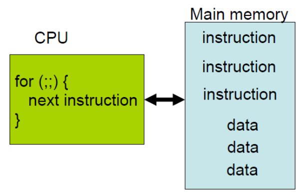

虽然大学学过微机原理, 但是基本还给老师了. 一直想找机会重学汇编, 因为我一直羡慕别人每次在讨论一段
C 代码的时候, 会说, 这段代码生成的代码不如那段, 此外, 也经常听到高手写 C 的时候, 脑海里已经会自动
出现对应的 汇编代码. 这种境界一直是我所追求的, 借孟宁老师的课我重温汇编的想法得以付诸实践.

闲话少说, 直接上代码.

##测试前

###平台

$uname -a

    Linux 3.13.0-43-generic #72-Ubuntu SMP Mon Dec 8 19:35:06 UTC 2014 x86_64 x86_64 x86_64 GNU/Linux

$ gcc --version

gcc (Ubuntu 4.8.4-2ubuntu1~14.04) 4.8.4

###计算机工作原理

理想的计算机模型计算和存储分离, 即经典的冯诺依曼结构. 其核心简单描述为计算单元(如CPU)从存储单元取数据并顺序执行.
老师讲义的一个图非常贴切



进一步描述为, 我们编写程序存储在存储单元, CPU 从存储单元取指令并执行该指令. 由于存储的发展远远跟不上 CPU 的发展,
出于成本的考虑, 才出现了 HDD, SSD, memory, register 都是为了尽量跟上 CPU 的节奏. 这里有一组数据供参考

* L1 cache reference                    0.5 ns
* L2 cache reference                    7 ns
* Branch mispredict                     5 ns
* Main memory reference                 100 ns
* SSD 访问延迟                          1 000 000 ~ 2 000 000 ns
* Read 1 MB sequentially from network   10 000 000 ns
* 从 sata 磁盘顺序读取 1MB 数据         20 000 000 ns

体会以下

当然你也许还听过哈佛结构, 它们的对比在知乎上有一个很好的[帖子](https://www.zhihu.com/question/22406681)

##测试目的

解决一直困惑我的几个问题:

1. 传值和传引用到底有什么区别?
2. 编译优化到底能优化到什么程度? 以函数嵌套为例, 是否可以将多个函数内联来减少跳转
3. c++11 的 右值引用 与 move 到底有什么梗?
4. c++ 的 class 与 多态到底对性能开销有多大?(以后测试)

我一直以来认为高级语言都是汇编的语法糖, 这几个问题的深入理解, 通过汇编是可以直击本质. 到底行不行,
看下面的代码示例.

###测试传值与传引用

```
    //test2.c
    #include <stdio.h>

    void pass_ref(int *i) {
        *i = 4;
    }

    void pass_value(int i) {
        i = 4;
    }

    int main(int argc, char* argv) {
        int val = 0;
        int ref = 0;
        pass_value(val);
        pass_ref(&ref);
        printf("val=%d, ref=%d\n", val, ref);
    }
```

$ gcc -S -O test2.s test2.c

生成的汇编代码

```
    pass_ref:
        //enter 指令
    	pushq	%rbp
    	movq	%rsp, %rbp

    	movq	%rdi, -8(%rbp)   //rbp-8 = rdi 地址(rdi 保存了 ref 的地址)
    	movq	-8(%rbp), %rax   //rax = rdi 地址(rdi 保存了 ref 的地址)
    	movl	$4, (%rax)       //修改 rax 存储的值为 4

    	popq	%rbp             //rbp 恢复至 pass_ref 函数之前
    	ret                      //函数返回
    pass_value:
        //enter 指令
    	pushq	%rbp            //基地址入栈
    	movq	%rsp, %rbp      //重置栈基地址

    	movl	%edi, -20(%rbp) //rbp-20 = edi存储的内容 (edi 保存了 val 的值0) 为什么是 20?
    	movl	$4, -4(%rbp)    //rbp-4 = 4

    	popq	%rbp            //rbp 恢复至 pass value 函数之前
    	ret                     //函数返回
    .LC0:
    	.string	"val=%d, ref=%d\n"
    	.text
    	.globl	main
    	.type	main, @function
    main:
        //enter
    	pushq	%rbp
    	movq	%rsp, %rbp


    	subq	$32, %rsp        //为什么减32. di,si 需要 16 字节.
    	movl	%edi, -20(%rbp)  //edi 需要 4 字节, rdi 需要 4 字节
    	movq	%rsi, -32(%rbp)  //rsi 需要 4 字节. esi 需要 4 字节

    	movl	$0, -4(%rbp)     //val = 0 到 rbp - 4, int 4 字节
    	movl	$0, -8(%rbp)     //ref = 0 到 rbp - 8, 两个变量压栈

        //传值
    	movl	-4(%rbp), %eax   //保存 val 对应的 0 到 eax(ax 低32位)  --- 关键
    	movl	%eax, %edi       //edi 保存 val 变量的值 0
    	call	pass_value

        //传引用
    	leaq	-8(%rbp), %rax   //保持 ref 的地址到 rax(ax 高32位)     --- 关键
    	movq	%rax, %rdi       //rdi 保持  ref 变量值 0 对应的地址
    	call	pass_ref

        //printf 函数
    	movl	-8(%rbp), %edx   //edx 保存了 ref 的地址
    	movl	-4(%rbp), %eax   //eax 保存了 val 的地址
    	movl	%eax, %esi       //esi 保持了 val 地址
    	movl	$.LC0, %edi
    	movl	$0, %eax
    	call	printf

        //栈恢复到调用 main 之前, leave
    	leave
    	ret                      //main 函数执行完成
```

###总结

核心代码

```
    pass_ref
    	movq	%rdi, -8(%rbp)   //保存 rdi 地址, 由于 rdi 保存了 ref 的地址
    	movq	-8(%rbp), %rax   //rax 保存了 ref 的地址
    	movl	$4, (%rax)       //修改 rax 存储的值为 4

    pass_value
    	movl	%edi, -20(%rbp) //保存 edi 地址(由于 edi 保存了 val 的地址.) 为什么是 20?
    	movl	$4, -4(%rbp)    //4 压栈
    main
        //传值
    	movl	-4(%rbp), %eax   //保存 val 对应的 0 到 eax(ax 低32位)  --- 关键
    	movl	%eax, %edi       //edi 保存 val 变量的值 0
    	call	pass_value

        //传引用
    	leaq	-8(%rbp), %rax   //保持 ref 的地址到 rax(ax 高32位)     --- 关键
    	movq	%rax, %rdi       //rdi 保持  ref 变量值 0 对应的地址
    	call	pass_ref
```

$ gcc -o test2 test2.c

$ ./test2

    val=0, ref=4

###测试函数嵌套

```
    int deep3(int i) {
        return 1;
    }

    int deep2(int i) {
        return deep3(i);
    }

    int deep1(int i) {
        return deep2(1);
    }

    int main(int argc, char *argv) {
        int ret = deep(1);
    }
```

$ gcc -S -o test1.s test1.c

```
    deep3:
        //enter
    	pushq	%rbp
    	movq	%rsp, %rbp

        //入参
    	movl	%edi, -4(%rbp)
        //返回值
    	movl	$1, %eax

    	popq	%rbp
    	ret
    deep2:
        //enter
    	pushq	%rbp
    	movq	%rsp, %rbp

        //call deep3
    	subq	$8, %rsp
        //入参
    	movl	%edi, -4(%rbp)
        //返回值
    	movl	-4(%rbp), %eax
    	movl	%eax, %edi
    	call	deep3
    	leave

    	ret
    deep1:
        //enter
    	pushq	%rbp
    	movq	%rsp, %rbp

        //call deep2
    	subq	$8, %rsp
        //入参
    	movl	%edi, -4(%rbp)
    	movl	$1, %edi
    	call	deep2
    	leave

    	ret
    main:
    	pushq	%rbp
    	movq	%rsp, %rbp

    	subq	$32, %rsp
    	movl	%edi, -20(%rbp)
    	movq	%rsi, -32(%rbp)

        //call deep
        //入参
    	movl	$1, %edi
        //返回
    	movl	$0, %eax
    	call	deep
    	movl	%eax, -4(%rbp)
    	leave

    	ret
```

$ gcc -O1 -S -o test1.s test1.c

```
    deep3:
    	movl	$1, %eax
    	ret
    deep2:
    	movl	$1, %eax
    	ret
    deep1:
    	movl	$1, %eax
    	ret
    main:
    	subq	$8, %rsp

    	movl	$1, %edi
    	movl	$0, %eax
    	call	deep

    	addq	$8, %rsp

    	ret
```

$ gcc -O2 -S -o test1.s test1.c

```
deep3:
	movl	$1, %eax
	ret
deep2:
	movl	$1, %eax
	ret
deep1:
	movl	$1, %eax
	ret
main:
	movl	$1, %edi
	xorl	%eax, %eax
	jmp	deep
```

从上可以看出不同优化的结果. 主要区别在 main

###测试 C++ move

####直接赋值

```
    //move1.cpp
    int main() {
        int i = 1;
        int r = i*42;
    }
```

$ g++ -std=c++11 -o move1.s move1.cpp

```
    main:
        pushq	%rbp
        movq	%rsp, %rbp

        movl	$1, -8(%rbp)
        movl	-8(%rbp), %eax

        imull	$42, %eax, %eax

        movl	%eax, -4(%rbp)

        movl	$0, %eax

        popq	%rbp
        ret
```

####左值引用

```
    //move3.cpp
    int main() {
        int i = 1;
        int *r = &i;
    }
```
$ g++ -std=c++11 -S -o move3.s move3.cpp

```
    main:
    	pushq	%rbp
    	movq	%rsp, %rbp

    	movl	$1, -12(%rbp)
    	leaq	-12(%rbp), %rax

    	movq	%rax, -8(%rbp)

    	movl	$0, %eax

    	popq	%rbp
    	ret
```


####右值引用

```
    //move.cpp
    int main() {
        int i = 1;
        int &&r = i*42;
    }
```

$ g++ -std=c++11 -o move.s move.cpp


```
main:
	pushq	%rbp
	movq	%rsp, %rbp

    //i = 1
	movl	$1, -12(%rbp)
	movl	-12(%rbp), %eax

    //i * 42
	imull	$42, %eax, %eax

    //rax = i * 42 右值引用
	movl	%eax, -16(%rbp)
	leaq	-16(%rbp), %rax

	movq	%rax, -8(%rbp)
	movl	$0, %eax
	popq	%rbp
	ret
```

####move 函数

将一个左值转为右值引用

```
    //move2.cpp
    #include <utility>

    int main() {
        int r = 1;
        int &&rr = std::move(r);
    }
```

$ g++ -std=c++11 -o move2.s move2.cpp

```
    _ZSt4moveIRiEONSt16remove_referenceIT_E4typeEOS2_:
    	pushq	%rbp
    	movq	%rsp, %rbp

    	movq	%rdi, -8(%rbp)
    	movq	-8(%rbp), %rax

    	popq	%rbp
    	ret
    main:
    	pushq	%rbp
    	movq	%rsp, %rbp

    	subq	$16, %rsp

    	movl	$1, -12(%rbp)
    	leaq	-12(%rbp), %rax
    	movq	%rax, %rdi
    	call	_ZSt4moveIRiEONSt16remove_referenceIT_E4typeEOS2_
    	movq	%rax, -8(%rbp)

    	movl	$0, %eax
    	leave
    	ret
```

当然, 如果希望查看实际的堆栈信息, 可以通过 gdb 调试, 或 objdump -S
[编译生成的二进制文件] 来查看具体堆栈信息.

欢迎拍砖.

##参考

http://highscalability.com/blog/2009/2/18/numbers-everyone-should-know.html
