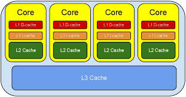
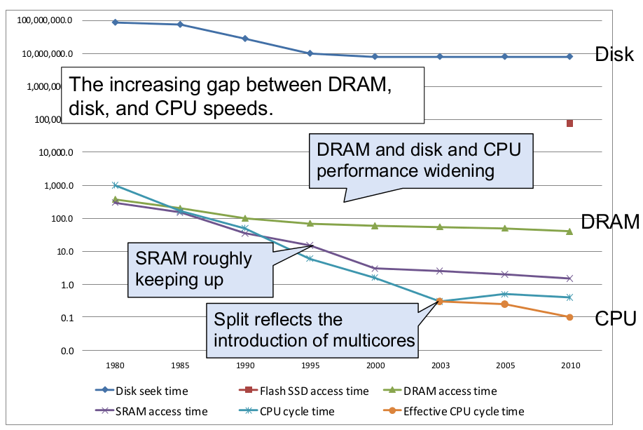
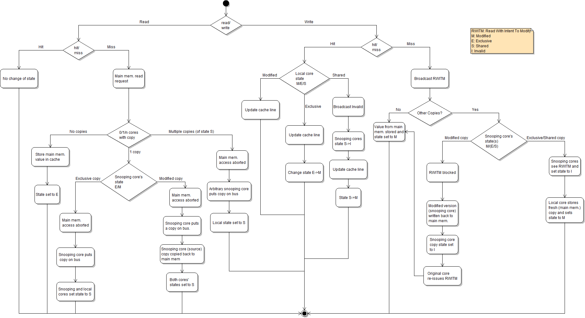
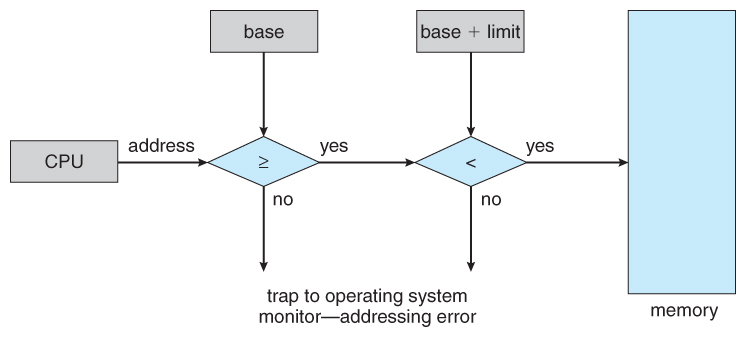
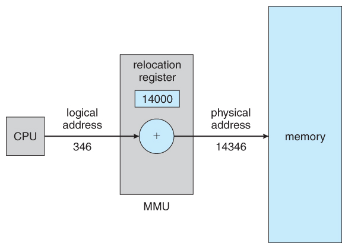

众所周知, CPU 是计算机的大脑, 它负责执行程序的指令; 内存负责存数据, 包括程序自身数据.
同样大家都知道, 内存比 CPU 慢很多. 其实在 30 年前, CPU 的频率和内存总线的频率在同一个级别,
访问内存只比访问 CPU 寄存器慢一点儿. 由于内存的发展都到技术及成本的限制, 现在获取内存中
的一条数据大概需要 200 多个 CPU 周期(CPU cycles), 而 CPU 寄存器一般情况下 1 个 CPU 周期就够了.

###CPU 缓存

随着多核的发展, CPU Cache分成了三个级别: L1, L2, L3. 级别越小越接近 CPU, 所以速度也更快, 同时
也代表着容量越小. L1 是最接近CPU的, 它容量最小, 例如 32K, 速度最快, 每个核上都有一个 L1 Cache
(准确地说每个核上有两个L1 Cache, 一个存数据 L1d Cache, 一个存指令 L1i Cache). L2 Cache 更大一些,
例如 256K, 速度要慢一些, 一般情况下每个核上都有一个独立的 L2 Cache; L3 Cache是三级缓存中最大的
一级, 例如 12MB, 同时也是最慢的一级, 在同一个 CPU 插槽之间的核共享一个 L3 Cache.



Intel 的缓存微架构是 嵌套的 - 所有一级缓存里的数据必须同时存在二级和三级缓存里. 倒过来, 如果某个
元素在三级缓存里被淘汰, 那它也会立刻被从二级和一级缓存里移走.(需要注意的是 AMD 缓存微架构的设计是非嵌套的)

第三级缓存, 通常也被称为 LLC, 由于 LLC 较大, CPU 访问内存的时候如果把整个 LLC 的内容都搜索一遍
效率会很低. 为了避免这个问题, LLC 通常被分成不同的组, 每一组都对应者内存空间的一个固定的子集.
每个组包含若干缓存线. 例如, Intel Haswell 系列中的 Core i7-3720QM 处理器拥有 8192 = 2^13 个组,
每个组有 12 条 64 = 2^6 字节的缓存线, 共同组成 8192 x 12 x 64 = 6 MB 的高速缓存. CPU 如果要检查
一个给定的物理地址是否在三级缓存里, 会先计算出组, 然后只检查组内的缓存线. 结果就是, 某个物理地址
的缓存未命中, 会导致同一个组的为数不多的缓存线中的一条被淘汰.

cache 是有多个 cacheline 的, 每个 cacheline 又有自己的 way，静态变量在自己的 cacheline 的 way 里, 跟局部变量互不干扰.
cache 的替换是以 cacheline 为单位的.

一个 cache 有多个 set, 每个 set 有自己的 way(也就是cache line), 但每个 line 对应的物理地址应该是连续的, 这就是空间局部性,
所以静态变量和局部变量一般不会在同一个 line 里. 比如一个函数体只要局部变量不超过 64 字节，那么函数执行几乎没开销, 如果访
问静态变量, 那么至少要访问两个 line, 甚至有可能是不同的 set.

从CPU到寄存器   大约需要的CPU周期   大约需要的时间(单位ns)

    1 cycle
    L1 Cache    ~3-4 cycles         ~0.5-1 ns
    L2 Cache    ~10-20 cycles       ~3-7 ns
    L3 Cache    ~40-45 cycles       ~15 ns
    跨槽传输                        ~20 ns
        内存    ~120-240 cycles     ~60-120ns



就像数据库cache一样, 获取数据时首先会在最快的cache中找数据, 如果没有命中(Cache miss) 则往下一级找,
直到三层Cache都找不到,那只要向内存要数据了.  一次次地未命中,代表取数据消耗的时间越长.


$ lscpu

    Architecture:          x86_64
    CPU op-mode(s):        32-bit, 64-bit
    Byte Order:            Little Endian
    CPU(s):                4
    On-line CPU(s) list:   0-3
    Thread(s) per core:    2
    Core(s) per socket:    2
    Socket(s):             1
    NUMA node(s):          1
    Vendor ID:             GenuineIntel
    CPU family:            6
    Model:                 37
    Stepping:              2
    CPU MHz:               1199.000
    BogoMIPS:              4787.81
    Virtualisation:        VT-x
    L1d cache:             32K
    L1i cache:             32K
    L2 cache:              256K
    L3 cache:              3072K
    NUMA node0 CPU(s):     0-3

##缓存行(Cache line)

为了高效地存取缓存, 不是简单随意地将单条数据写入缓存的. 缓存是由缓存行组成的,
典型的一行是 64 字节.

    $cat /sys/devices/system/cpu/cpu0/cache/index0/coherency_line_size
    64

CPU存取缓存都是按行为最小单位操作的. 在这儿我将不提及缓存的 associativity 问题,
将问题简化一些. 一个Java long型占8字节, 所以从一条缓存行上你可以获取到 8 个 long
型变量. 所以如果你访问一个long型数组, 当有一个 long 被加载到 cache 中, 你将无消耗
地加载了另外 7 个.  所以你可以非常快地遍历数组.

实验及分析


```java

public class L1CacheMiss {

    private static final int RUNS = 10;

    private static final int DIMENSION_1 = 1024 * 1024;

    private static final int DIMENSION_2 = 62;

    private static long[][] longs;

    static public void cacheFriendly(long longs[][]) {
        System.out.println("starting.");

        final long start = System.nanoTime();
        long sum = 0L;
        for (int i = 0; i < DIMENSION_1; i++) {
            for (int j = 0; j < DIMENSION_2; j++) {
                sum += longs[i][j];
            }
        }
        System.out.println("cacheFriendly duration = " + (System.nanoTime() - start)/1000000);
    }

    static public void cacheunFriendly(long longs[][]) {
        System.out.println("starting.");

        final long start = System.nanoTime();
        long sum = 0L;
        for (int r = 0; r < RUNS; r++) {
           for (int j = 0; j < DIMENSION_2; j++) {
               for (int i = 0; i < DIMENSION_1; i++) {
                   sum += longs[i][j];
               }
           }
        }
        System.out.println("cacheunFriendly duration = " + (System.nanoTime() - start)/1000000);
    }

    public static void main(String[] args) throws Exception {

        Thread.sleep(10000);
        longs = new long[DIMENSION_1][];
        for (int i = 0; i < DIMENSION_1; i++) {
            longs[i] = new long[DIMENSION_2];
            for (int j = 0; j < DIMENSION_2; j++) {
                longs[i][j] = 0L;
            }

        }

        L1CacheMiss.cacheFriendly(longs);
        L1CacheMiss.cacheunFriendly(longs);

    }
}
```

$ javac L1CacheMiss.java

$ java L1CacheMiss

    starting.
    cacheFriendly duration = 114
    starting.
    cacheunFriendly duration = 19753

注释掉 cacheunFriendly() 重新编译运行

$ perf stat -e L1-dcache-load-misses java L1CacheMiss

注释掉 cacheFriendly() 重新编译运行

$ perf stat -e L1-dcache-load-misses java L1CacheMiss


以上我只是示例了在 L1 Cache 满了之后才会发生的 cache miss. 其实 cache
miss 的原因有下面三种:

1. 第一次访问数据, 在 cache 中根本不存在这条数据, 所以 cache miss, 可以通过 prefetch 解决.

2. cache冲突, 需要通过补齐来解决.

3. 就是我示例的这种, cache 满, 一般情况下我们需要减少操作的数据大小, 尽量按数据的物理顺序访问数据.

###MESI协议及RFO请求

我们已经知道, 典型的 CPU 微架构有 3 级缓存, 每个核都有自己私有的 L1, L2 缓存.  那么多线程编程时,
另外一个核的线程想要访问当前核内L1, L2 缓存行的数据, 该怎么办呢?

有人说可以通过第 2 个核直接访问第 1 个核的缓存行. 这是可行的, 但这种方法不够快. 跨核访问需要
通过 Memory Controller.

典型的情况是第 2 个核经常访问第 1 个核的这条数据, 那么每次都有跨核的消耗.  更糟的情况是, 有可能
第 2 个核与第 1 个核不在一个插槽内. 况且 Memory Controller 的总线带宽是有限的, 扛不住这么多数据
传输. 所以, CPU 设计者们更偏向于另一种办法: 如果第2个核需要这份数据, 由第 1 个核直接把数据内容发
过去, 数据只需要传一次.

那么什么时候会发生缓存行的传输呢? 答案很简单: 当一个核需要读取另外一个核的脏缓存行时发生.
但是前者怎么判断后者的缓存行已经被弄脏(写)了呢?

下面将详细地解答以上问题.  首先我们需要谈到一个协议-MESI协议([链接][1]).  现在主流的处理器都是用它来
保证缓存的一致性和内存的一致性.  M,E,S和I代表使用 MESI 协议时缓存行所处的四个状态:

* M(修改, Modified): 本地处理器已经修改缓存行, 即是脏行, 它的内容与内存中的内容不一样. 并且此 cache 只有本地一个拷贝(专有).
* E(专有, Exclusive): 缓存行内容和内存中的一样, 而且其它处理器都没有这行数据
* S(共享, Shared): 缓存行内容和内存中的一样, 有可能其它处理器也存在此缓存行的拷贝
* I(无效, Invalid): 缓存行失效, 不能使用

缓存行的四种状态转换

1. 初始: 一开始时, 缓存行没有加载任何数据, 所以它处于 I 状态.
2. 本地写(Local Write) : 如果本地处理器写数据至处于 I 状态的缓存行, 则缓存行的状态变成M.
3. 本地读(Local Read) : 如果本地处理器读取处于 I 状态的缓存行, 很明显此缓存没有数据给它. 此时分两种情况:

   (1)其它处理器的缓存里也没有此行数据, 则从内存加载数据到此缓存行后, 再将它设成 E 状态, 表示只有我一家有这条数据, 其它处理器都没有
   (2)其它处理器的缓存有此行数据, 则将此缓存行的状态设为 S 状态.

P.S.如果处于 M 状态的缓存行, 再由本地处理器写入/读出, 状态是不会改变的.

4. 远程读(Remote Read) : 假设我们有两个处理器 c1 和 c2. 如果 c2 需要读另外一个处理器 c1 的缓存行内容,
c1 需要把它缓存行的内容通过内存控制器(Memory Controller)发送给 c2, c2 接到后将相应的缓存行状态设为 S.
在设置之前, 内存也得从总线上得到这份数据并保存.

5. 远程写(Remote Write) 其实确切地说不是远程写, 而是 c2 得到 c1 的数据后, 不是为了读, 而是为了写.
也算是本地写, 只是 c1 也拥有这份数据的拷贝, 这该怎么办呢?

c2 将发出一个RFO(Request For Owner)请求, 它需要拥有这行数据的权限, 其它处理器的相应缓存行设为 I,
除了它自已, 谁不能动这行数据.  这保证了数据的一致性, 同时处理 RFO 请求以及设置 I 的过程将给写操作
带来很大的性能消耗.

以上只是列举了一些状态转换, 为下文做铺垫. 如果全部描述,需要非常大量的文字, 大家参考附录的图

##伪共享

我们从上节知道, 写操作的代价很高, 特别当需要发送 RFO 消息时. 我们编写程序时, 什么时候会发生 RFO 请求呢?

有以下两种:

1. 线程的工作从一个处理器移到另一个处理器, 它操作的所有缓存行都需要移到新的处理器上. 此后如果再写缓存行,
则此缓存行在不同核上有多个拷贝, 需要发送RFO请求了.

2. 两个不同的处理器确实都需要操作相同的缓存行

我们已经知道, 在 Java 程序中, 数组的成员在缓存中也是连续的. 其实从 Java 对象的相邻成员变量也会加载到同一缓存行中.
如果多个线程操作不同的成员变量, 但是相同的缓存行, 伪共享(False Sharing)问题就发生了.


下面引用 Disruptor 项目 Lead 的博文中的示例图和实验例子


一个运行在处理器 core 1 上的线程想要更新变量 X 的值, 同时另外一个运行在处理器 core 2 上的线程想要更新变量 Y 的值.
但是, 这两个频繁改动的变量都处于同一条缓存行. 两个线程就会轮番发送 RFO 消息, 占得此缓存行的拥有权. 当 core 1 取得
了拥有权开始更新 X, 则 core 2 对应的缓存行需要设为 I 状态. 当 core 2 取得了拥有权开始更新 Y, 则 core 1 对应的缓存
行需要设为 I 状态(失效态).  轮番夺取拥有权不但带来大量的 RFO 消息, 而且如果某个线程需要读此行数据时, L1 和 L2 缓存
上都是失效数据, 只有 L3 缓存上是同步好的数据. 我们知道, 读 L3 的数据非常影响性能. 更坏的情况是跨槽读取, L3 都要
miss, 只能从内存上加载.

表面上 X 和 Y 都是被独立线程操作的, 而且两操作之间也没有任何关系.只不过它们共享了一个缓存行, 但所有竞争冲突都是来源于共享.

实验及分析

引用Martin的例子, 稍做修改,代码如下:


``` java FalseSharing.java
public final class FalseSharing implements Runnable {
    public static int NUM_THREADS = 2; // change
    public final static long ITERATIONS = 500L * 1000L * 1000L;
    private final int arrayIndex;
    private static VolatileLong[] longs;

    public FalseSharing(final int arrayIndex) {
        this.arrayIndex = arrayIndex;
    }

    public static void main(final String[] args) throws Exception {
        Thread.sleep(10000);
        System.out.println("starting....");
        if (args.length == 1) {
            NUM_THREADS = Integer.parseInt(args[0]);
        }

        longs = new VolatileLong[NUM_THREADS];
        for (int i = 0; i < longs.length; i++) {
            longs[i] = new VolatileLong();
        }
        final long start = System.nanoTime();
        runTest();
        System.out.println("duration = " + (System.nanoTime() - start));
    }

    private static void runTest() throws InterruptedException {
        Thread[] threads = new Thread[NUM_THREADS];
        for (int i = 0; i < threads.length; i++) {
            threads[i] = new Thread(new FalseSharing(i));
        }
        for (Thread t : threads) {
            t.start();
        }
        for (Thread t : threads) {
            t.join();
        }
    }

    public void run() {
        long i = ITERATIONS + 1;
        while (0 != --i) {
            longs[arrayIndex].value = i;
        }
    }

    public final static class VolatileLong {
        public volatile long value = 0L;
        public long p1, p2, p3, p4, p5, p6; // Comment
    }
}
```

代码的逻辑是默认 4 个线程修改一数组不同元素的内容. 元素的类型是 VolatileLong, 只有一个长整型成员 value 和 6 个没用到的长整型成员.
value 设为 volatile 是为了让 value 的修改所有线程都可见.

在进行测试之前先补充一些 jvm 的知识

对于HotSpot JVM, 所有对象都有两个字长的对象头. 第一个字是由 24 位哈希码和 8 位标志位(如锁的状态或作为锁对象)
组成的 Mark Word. 第二个字是对象所属类的引用. 如果是数组对象还需要一个额外的字来存储数组的长度. 每个对象的
起始地址都对齐于 8 字节以提高性能. 因此当封装对象的时候为了高效率, 对象字段声明的顺序会被重排序成下列基于字
节大小的顺序:

    doubles (8) 和 longs (8)
    ints (4) 和 floats (4)
    shorts (2) 和 chars (2)
    booleans (1) 和 bytes (1)
    references (4/8)
    <子类字段重复上述顺序>

了解这些之后就可以在任意字段间用 7 个 long 来填充缓存行. 在 Disruptor 里我们对 RingBuffer 的 cursor 和
BatchEventProcessor 的序列进行了缓存行填充.


$ javac FalseSharing.java

$ java FalseSharing

    starting....
    duration = 9877

将 Comment 的行注释

$ javac FalseSharing.java

$ java FalseSharing

    starting....
    duration = 8462

我们用伪共享(False Sharing)的理论来分析一下.  后面的那个程序 longs 数组的 4 个元素, 由于 VolatileLong 只有 1 个长整型成员,
所以整个数组都将被加载至同一缓存行, 但有 4 个线程同时操作这条缓存行, 于是伪共享就悄悄地发生了. 读者可以测试一下2,4,8, 16个线
程分别操作时分别是什么效果, 什么样的趋势.

那么怎么避免伪共享呢? 我们未注释的代码就告诉了我们方法.  我们知道一条缓存行有64字节, 而 Java 程序的对象头固定占 8 字节(32位
系统)或12字节(64位系统默认开启压缩, 不开压缩为16字节), 详情见 链接.  我们只需要填 6 个无用的长整型补上 6*8= 48 字节, 让不同
的 VolatileLong 对象处于不同的缓存行, 就可以避免伪共享了(64位系统超过缓存行的64字节也无所谓,只要保证不同线程不要操作同一缓存
行就可以). 这个办法叫做补齐(Padding).

如何从系统层面观察到这种优化是切实有效的呢? 很可惜, 由于很多计算机的微架构不同, 我们没有工具来直接探测伪共享事件(包括Intel
Vtune和Valgrind).  所有的工具都是从侧面来发现的, 下面通过Linux利器[OProfile][2]来证明一下.  上面的程序的数组只是占 64 * 4 = 256
字节, 而且在连续的物理空间, 照理来说数据会在L1缓存上就命中, 肯定不会传入到L2缓存中, 只有在伪共享发生时才会出现. 于是, 我们
可以通过观察L2缓存的IN事件就可以证明了,步骤如下:

    # 设置捕捉L2缓存IN事件
    $ sudo  opcontrol --setup --event=L2_LINES_IN:100000
    # 清空工作区
    $ sudo opcontrol --reset
    # 开始捕捉
    $ sudo opcontrol --start
    # 运行程序
    $ java FalseSharing
    # 程序跑完后, dump捕捉到的数据
    $ sudo opcontrol --dump
    # 停止捕捉
    $ sudo opcontrol -h
    # 报告结果
    $ opreport -l `which java`

比较一下两个版本的结果, 慢的版本:

$ opreport -l `which java`

快的版本:

$ opreport -l `which java`


##总结

伪共享在多核编程中很容易发生, 而且比较隐蔽. 例如, 在 JDK 的 LinkedBlockingQueue 中, 存在指向队列头的引用 head 和指向队列尾的
引用 last. 而这种队列经常在异步编程中使有, 这两个引用的值经常的被不同的线程修改, 但它们却很可能在同一个缓存行, 于是就产生了
伪共享. 线程越多, 核越多,对性能产生的负面效果就越大.  某些 Java 编译器会将没有使用到的补齐数据, 即示例代码中的 6 个长整型在
编译时优化掉, 可以在程序中加入一些代码防止被编译优化.

    public static long preventFromOptimization(VolatileLong v) {
        return v.p1 + v.p2 + v.p3 + v.p4 + v.p5 + v.p6;
    }

另外, 由于 Java 的 GC 问题. 数据在内存和对应的 CPU 缓存行的位置有可能发生变化, 所以在使用 pad 的时候应该注意 GC 的影响.


[1]: https://en.wikipedia.org/wiki/MESI_protocol
[2]: http://oprofile.sourceforge.net/


``` cache.c
#include <stdio.h>
#include <stdlib.h>
#include <time.h>

#define LENGTH ((64) * (1024) * (1024))

int main(int argc, char *argv[]) {
    clock_t t;

    int *arr = (int*)malloc(LENGTH * sizeof(int));
    int inter = atoi(argv[1]);

    t = clock();
    for (int i = 0; i < LENGTH; i += inter) {
        arr[i] *= 3;
    }
    t = clock() - t;
    double time_taken = ((double)t) / CLOCKS_PER_SEC;
    int times  = LENGTH / inter;
    printf("inter %d, %f\n", inter,  time_taken * inter);
    return 0;
}
```


##附录




###Memory Management

In multi-tasking environment, CPU is shared among multiple processes and CPU scheduling
takes care of assigning CPU to each ready process.  In-order to realize multi-tasking
multiple processes should be kept in memory or memory should be shared between multiple
processes. This sharing of memory is taken care by memory management techniques. These
techniques are usually implemented in hardware.

###Main Memory

Main memory is divided into two parts

* One for OS
* Other for multiple processes

User processes should be restricted from accessing OS memory area and also other user processes

This protection is provided by the hardware in the form of base and limit register. (8.1,pno.316)

Base register holds starting physical address and limit register holds the size of the process.

Both registers are loaded by OS by using privileged instructions.




###Address Binding

Address in user program is different from physical address.

Needs address binding.

Compiler usually bind symbolic address in an executable to relocatable address.

Loader in turn bind relocatable address to absolute physical address.

Binding can be done at:

* Compile time – generates absolute code
* Load time – compiler generates relocatable code. Binding is delayed until load time
* Execution time – binding is delayed until run time. That is process is brought into the memory at execution time.

###Logical versus Physical Address Space

CPU generates logical address

Address seen by memory is Physical address

Logical Address Space : it is set of all logical addresses generated by a program

Physical Address Space: It is a set of physical addresses corresponding to logical addresses.

Memory Management Unit: Runtime mapping from logical to physical address is done by MMU (hardware) 


Simple MMU scheme

Using base register (a.k.a Relocation Register)

User program deals with logical address

MMU converts logical address to physical address

Physical address is used to access main or physical memory



###Dynamic Loading

Do not load entire program into memory before execution

It limits the size of program to the size of physical memory

Since programs divided into modules or routines Dynamically load a routine when it called.

Advantage: Unused routine is never loaded

###Static Linking and Dynamic Linking

**Static Linking**

Shared libraries are linked statically and are combined into the binary program image before execution

**Dynamic Linking**

Linking shared libraries is postponed until execution time

###Memory Allocation

Memory can be allocated in two ways

* Contiguous Memory Allocation

A process resides in a single contiguous section of memory

* Fixed sized partition

Multi-programming is bounded to number of partitions Internal Fragmentation

* Variable sized partition

OS maintains a table to keep track of which memory is available and which is occupied

External Fragmentation

Non- Contiguous Memory Allocation

Process is not stored in contiguous memory segments

###Paging

It’s a memory management scheme that allows memory allocation to be non-contiguous

Paging avoids external fragmentation and need of compaction

Traditional systems provide hardware support for paging

Modern systems implement paging by closely integrating hardware and OS (in 64-microprocessors)

###Basic method of Paging

Logical memory is divided into fixed-sized blocks called pages

Physical memory is divided into fixed-sized blocks called frames

Backing store (disk) is also divide into fixed sized blocks called memory frames

CPU generates logical address which is divided into two parts: page number and page offset

Page size is defined by hardware and usually is power of 2 varying between 512 bytes to 16MB page size.

Page size is growing over time as processes, data sets and main memory have become large

Internal fragmentation may exist

###Page Table

It is used to map a virtual page to physical frame

Page table contains information for this mapping

For each page number there is a corresponding frame number stored in page table.

Page table is implemented in hardware.


###Page table – hardware implementation

####Method 1

Page table as a set of dedicated set of registers

These registers are made up of high speed logic to make paging address translation efficient

CPU dispatcher reloads these registers just as it reloads other registers

This method is okay if page table is small but for large processes this method is not feasible

####Method 2

Store page table in main memory

Page Table Base Register (PTBR) is used to point to page table in memory

But with this method, accessing memory require two memory access.

One for page table and another for actual access

Very slow

Need another technique

####Translation Lookaside Buffer (TLB)

Since the page tables vary in size.

Require Larger page table for larger size processes

Its not possible to store it in registers.

Need to store it in main memory

Every virtual memory reference causes two physical memory access

* Fetch page table entry
* Fetch data

Slows down the system

To overcome this problem special cache memory can be used to store page table entries

TLB


Structure of page table

Hierarchical Paging

Here Logical address is divided into three parts:

* Page number 1 (p1)
* Page number 2 (p2)
* Page offset 8.14 and 8.15 figures pno. 338 

[两级页表](TwoLevelPageTable.jpg)
[地址转换](AddressTranslation.jpg)

###Virtual Memory

Demand paging

* Do not require all pages of a process in memory
* Bring in pages as required

Page fault

* Required page is not in memory Operating
* System must swap in required page
* May need to swap out a page to make space
* Select page to throw out based on recent history

###Thrashing

Too many processes in too little memory

Operating System spends all its time swapping

Little or no real work is done

Disk light is on all the time


###Solutions

Good page replacement algorithms

Reduce number of processes running

Fit more memory

###Advantage

We do not need all of a process in memory for it to run

We can swap in pages as required

So - we can now run processes that are bigger than total memory available!

Main memory is called real memory

User/programmer sees much bigger memory - virtual memory

参考
[Memory Hierarchical](http://slideplayer.com/slide/4145290/#)

http://coderplay.iteye.com/blog/1486649
http://coderplay.iteye.com/blog/1485760
