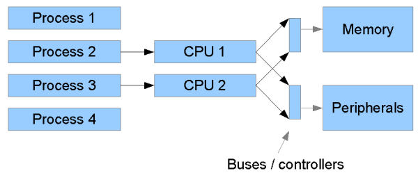
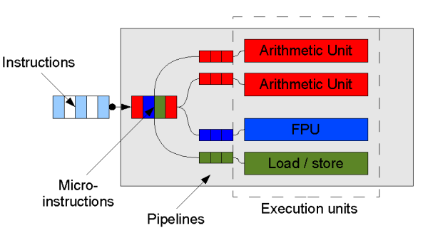

##Thread 

在 Java 中，“线程”指两件不同的事情

* java.lang.Thread类的一个实例
* 线程的执行。 

    使用 java.lang.Thread 类或者 java.lang.Runnable 接口编写代码来定义、实例化和启动新线程。
    一个 Thread 类实例只是一个对象，像 Java 中的任何其他对象一样，具有变量和方法，生死于堆上。
    Java中，每个线程都有一个调用栈，即使不在程序中创建任何新的线程，线程也在后台运行着。
    一个 Java 应用总是从 main()方法开始运行，mian()方法运行在一个线程内，它被称为主线程。(非常关键)
    一旦创建一个新的线程，就产生一个新的调用栈。
    线程总体分两类：用户线程和守候线程。
    当所有用户线程执行完毕的时候，JVM自动关闭。但是守候线程却不独立于JVM，守候线程一般是由操作系统或者用户自己创建的。
    线程睡眠到期自动苏醒，并返回到可运行状态，不是运行状态。

*　Thread 和 Runnable 的区别是 前者需要继承来实现, 而后者不需要, 由于 java不支持多继承, 所以,如果需要继承其他类, 用 Runnable

####sleep jion yield 区别

* sleep : 交出指定时间的 CPU，让CPU去执行其他的任务, 不会释放锁, 必须捕获InterruptedException异常或者将该异常向上层抛出,当线程睡眠时间满后，不一定会立即得到执行，因为此时可能CPU正在执行其他的任务。所以说调用sleep方法相当于让线程进入阻塞状态。
* yield : 不会释放锁, 不能控制具体的交出CPU的时间, 只能让拥有相同优先级的线程有获取CPU执行时间的机会

* wait方法会让线程进入阻塞状态，并且会释放线程占有的锁，并交出CPU执行权限。
###核心概念
* 上下文切换
* 

###CyclicBarrier CountDownLatch Semaphore Exchange

CountDownLatch 和 CyclicBarrier 都能够实现线程之间的等待，只不过它们侧重点不同：

* CountDownLatch一般用于某个线程A等待若干个其他线程执行完任务之后，它才执行；
* CyclicBarrier一般用于一组线程互相等待至某个状态，然后这一组线程再同时执行；

另外，CountDownLatch是不能够重用的，而CyclicBarrier是可以重用的。

Semaphore 其实和锁有点类似，它一般用于控制对某组资源的访问权限。

###Callable Future FutrueTask 

一般情况下是配合 ExecutorService 来使用的

Future 作为 ExecutorService.submit()
FutrueTask 既可以作为Runnable被线程执行，又可以作为Future得到Callable的返回值。

##synchronization and concurrency

The words synchronization and concurrency are overlapping and sometimes synonymous terms. The word synchronization generally means sharing data between multiple processors or threads, while concurrency refers to a measure of– or the art of improving– how effectively an application allows multiple jobs required by that application (e.g. serving web page requests from a web server) to run simultaneously.

In the past, synchronization and concurrency have been key concerns especially for server applications– such as web servers– that must deal with a continual stream of simultaneous requests. But increasingly, they are key issues for mundane client applications and more and more programmers will have to come to terms with them over the coming years. This is a result of the multicore era that we are now in: there is a trend for all computers– including humble desktops and games consoles–to be multiprocessor machines. Whereas in the past increased computing power came each year in the form of increased clock speeds (albeit with other architectural improvements), from now on such increases are likely to come in the form of increased multiprocessor capability. Programmers who don't get to grips with multiprocessor programming won't be able to take advantage of the increased capability of new machines!

Now the good news: Java is generally a good choice of language for multiprocessor applications, both because of in-built concepts fundamental to the language and because of a relatively rich concurrency library provided from Java version 5 onwards. On the following pages, we examine various issues of concurrent programming in Java. First, a look at some general issues about concurrent programming, and the situation pre-Java 5 which recent versions of the platform have improved on:  

##Synchronization, concurrency and multitasking: why is it difficult?

Essentially, multi-processor systems are difficult to program because:

* they involve multiple processes competing for shared resources;
* these resources perform differently. (For example, a hard disk is much slower to access than RAM.) 

A highly concurrent application needs to make sure that each process is `in the right place at the 
right time` to take advantage of what resources are available at any given moment. 

A typical situation is illustrated in Figure 1. The architectural details have been heavily simplified
in this diagram, but it shows four processes "running" on a machine with two CPUs. Since there are only 
two CPUs, only two processes can actually be running simultaneously at any one time; the operating system 
must periodically allocate CPU time to different processes– or "swap them in and out" of the CPUs– so 
that over time all four make progress. 

    
    <small> concurrent </small>

Additionally– and usually more significantly– each running process, via the CPU, may access main memory, 
shared between the two CPUs, and other shared peripherals such as hard disks. These "external" resources 
are much slower to access than registers and cached instructions "internal" to the CPU. Additionally, 
only one value can physically be written to a memory address at once, and only one part of a hard disk 
can physically be accessed at once. These factors pose two main problems: 

* How to avoid "wasting" CPUs when they need to wait for a response from one of the slower resources (such as memory or hard disk); 
* What to do when two CPUs access want to access a shared resource simultaneously. 

The ideal solution to the first problem is that while one process is waiting on a slow resource, it is 
"swapped out" of the CPU and another process that requires the CPU runs in the meantime. Moving towards 
this ideal generally falls under the heading of concurrency. In the second case, what physically happens 
(e.g. which processor "gets in there first" when the two CPUs simultaneously want to write different 
values to a memory location) is determined by the hardware and can be unpredictable. So when data is 
being shared in this way, we need to take special steps in software to manage simultaneous access and 
give predictable results. This second issue is generally the realm of synchronization.

###Concurrency on a single-processor machine

Concurrency is still often an issue on a single-processor machine because processes are usually swapped in and out of the available processor under interrupt. One process cannot necessarily predict when another one is going to "step in" and potentially change some data that it was in the middle of accessing. And the issue of not "wasting" the CPU still remains: if process 1 is waiting for data from the hard disk, and thus cannot usefully use the CPU, it would be useful to let process 2 use the CPU in the meantime.

###Processor architecture in more detail

On the previous page, we saw a very broad illustration of a number of processes competing for a smaller 
number of CPUs, which in turn competed for memory and other resources. There are actually a few more 
details of memory and processor architecture which are worth understanding if we are to fully understand 
certain synchronization and concurrency issues in Java (and other languages). The following diagram shows 
a theoretical processor in a bit more detail:

A stream of machine code instructions is fetched from memory (usually via a cache) and on many processors 
decoded into a series of micro-instructions. (These stages are generally pipelined: fetching of one 
instruction happens while the next is being decoded, and indeed on some processors such as the latest 
Pentiums, instruction processing is split in this way into quite a large number of parallel stages.) 
These micro-instructions are a sub-level of machine code, which decompose complex instructions into their 
component parts. For example, the following instruction meaning "add to the value in the memory location 
pointed to by R0 the value in R1": 

    ADD [R0], R1

might be decomposed into the following sequence of micro-instructions:

    LDR A, [R0] // Load the value in memory location R0
    ADD A, R1   // Add R1 to the value
    STR A, [R0] // Store the result back in memory

(In other cases, such as a simple add, a machine code instruction may correspond to exactly one micro-
instruction.)

The resulting stream of micro-instructions is then sent off to the corresponding components of the CPU– 
generally termed execution units– such as the arithmetic unit to handle addition, and a load/store unit 
to interface with memory. The functionality of many modern processors is split up in this way. What the 
exact repertoire of execution units is depends on the specific processor. But on most processors, 
including modern Intel processors, the upshot is that, with judicious ordering of instructions, the 
processor can actually execute several at once. So even a humble single-processor machine may actually 
doing concurrent processing at some level[1]. (On some processors, as in our example here, there is more 
than one arithmetic unit since integer arithmetic instructions such as add and subtract are very common 
and often occur in sequence.) 

Now, for this concurrent execution of instructions to work effectively, we need to try and make sure that 
in the stream of (micro-)instructions, we don't "hog" a particular execution unit. Consider, for example, 
if we have a bunch of floating point operations followed by a bunch of integer operations. There is a 
risk that the integer operations will sit at the back of the queue waiting for the floating point 
operations complete, and in the meantime our processor has two integer arithmetic units sitting twiddling 
their thumbs. An alternative is to interleave the floating point and integer instructions, so that 
floating point and integer instructions can be executed in parallel. (Of course, if the integer 
instructions rely on the result of the floating point ones, this optimisation may not be possible.) 

Modern compilers and indeed modern processors work to try and order instructions for optimal performance. 
What this means is that things don't always happen when you think they will. We may perceive of 
"incrementing a variable" as a simple load-add-store sequence. But in reality, a variable may be fetched 
early or stored late in the sequence of instructions in order to improve the chances of different 
execution units working in parallel. 

Notes:
[1]: Another possibility which we don't illustrate here is that some processors can actually execute in parallel instructions from different threads, e.g. thread 1 executes an add while thread 2 executes a load from memory. Intel have branded this Hyper-Threading in their recent processors (although the basic idea is not new and appears to date back to at least as early as the 70s). 

##synchronized keyword

The Java synchronized keyword is an essential tool in concurrent programming in Java. Its overall purpose 
is to only allow one thread at a time into a particular section of code thus allowing us to protect, for 
example, variables or data from being corrupted by simultaneous modifications from different threads. 
This article looks at how to use synchronized in Java to produce correctly functioning multithreaded 
programs. Other articles in this section look at other Java 5 concurrency facilities which have in fact 
superseded synchronized for certain tasks.
Using a synchronized block

At its simplest level, a block of code that is marked as synchronized in Java tells the JVM: "only let 
one thread in here at a time".

Imagine, for example, that we have a counter that needs to be incremented at random points in time by 
different threads. Ordinarily, there would be a risk that two threads could simultaneously try and update 
the counter at the same time, and in so doing currpt the value of the counter (or at least, miss an 
increment, because one thread reads the present value unaware that another thread is just about to write 
a new, incremented value). But by wrapping the update code in a synchronized block, we avoid this risk: 

    public class Counter {
      private int count = 0;
      public void increment() {
        synchronized (this) {
          count++;
        }
      }
      public int getCount() {
        synchronized (this) {
          return count;
        }
      }
    }

That's the simple overview of the most common use of synchronized. However, it's worth understanding a 
little about what actually happens "under the hood" because there's actually a bit more to synchronized 
than that. 

Every Java object created, including every Class loaded, has an associated lock or monitor. Putting code 
inside a synchronized block makes the compiler append instructions to acquire the lock on the specified 
object before executing the code, and release it afterwards (either because the code finishes normally or 
abnormally). Between acquiring the lock and releasing it, a thread is said to "own" the lock. At the 
point of Thread A wanting to acquire the lock, if Thread B already owns the it, then Thread A must wait 
for Thread B to release it.

Thus in the example above, simultaneous calls to increment() and getCount() will always behave as 
expected; a read could not "step in" while another thread was in the middle of incrementing. 

Synchronization and data visibility

Synchronizing also performs another important– and often overlooked– function. Unless told otherwise— 
using a synchronized block or via the Java volatile keyword&mdash, threads may work on locally cached 
copies of variables such as count, updating the "main" copy when it suits them. For the reasons discussed 
in our overview of processor architecture, they may also re-order reads and writes, meaning that updating 
a variable may not mean that it is updated when otherwise expected. However, on entry to and exit from 
blocks synchronizeded on a particular object, the entering/exiting thread also effectively synchronizes 
copies of all variables with main memory[1]. 

[1]. We'll discuss in a moment what that actually means, but fundamentally, locally cached copes if 
variables must be 'flushed' to main memory on exit, and accesses to variables accessed inside the 
synchronized block cannot be re-ordered to occur outisde the synchronized block. 

##What does variable "synchronization with main memory" mean?

For the sake of keeping descriptions short, I'm going to refer a few times to "synchronizing" cached 
copies of variables with "main memory". Firstly, by "main memory" we mean 'the Java heap, as seen by the 
JVM'. We don't mean– and don't need to refer to– anything more technical, such as physical RAM as opposed 
to a CPU cache. We make a distinction between this main memory and other places where we can put values, 
notably 

(a) processor registers, in native code produced by a JIT compiler; 
(b) the set of 'local variable space' that is allocated to every method call; 
(c) other areas of working memory, not part of the Java heap, that may be allocated locally to a particular thread or thread stack. 

Now, we've just said that under normal circumstances, the JVM can do a couple of interesting things with 
variables. Chapter 17 of the Java Language Specification states these and related conditions in more 
formal terms, albeit(although) in a profoundly(deeply) incomprehensible way. I'll try and summarise them informally here:

    The JVM is generally free to work on a local copy of a variable. For example, a JIT compiler could create code that loads the value of a Java variable into a register and then works on that register. If this happens, other threads will never see the updated value in the register unless we tell the JVM that they need to.

    A JIT compiler (or, for that matter, the bytecode compiler) is generally free to re-order bytecodes or instructions for optimisation purposes, provided that the overall logic of the program is not affected. So, for example, it could delay writing the value from a register back to the "main" copy of a variable belonging to a Java object. 

The JVM specification effectively says that entering and exiting synchronized blocks and methods has to 
be a "safe barrier" to these operations. If we read and write to variables inside synchronized blocks 
from different threads, we do always expect Thread 1 to see the value set by Thread 2; just seeing a 
locally cached copy in a register isn't correct. So on entry to and exit from a synchronized block, the 
relevant reads/writes to main memory have to take place, and they have to take place in the correct 
sequence. We can't re-order the write to take place after we exit the synchronized block, and we can't 
re-order the read to take place before we enter. In other words, the JVM is not allowed to do this: 

    LOAD R0, [address of some Java variable]   ; Cache a copy of the variable
    enter-synchronization
    ADD R0, #1                                 ; Do something with the (cached copy) of the variable

or this:

    enter-synchronized-block
    LOAD R0, [address of some Java variable]      ; Cache a copy of the variable
    MUL R0, #2                                    ; Do something with it
    leave-synchronized-block
    STORE R0, [address of variable]               ; Write the new value back to the variable

It's possible to say all this in a very obtuse(stupid) way (as I say, see Chapter 17 of the language 
spec). But at the end of the day it's kind of common sense: if the whole point of synchronization is to 
make sure all threads see the updated "master" copy of variables, it's no use updating them after you've 
left the synchronized block.

In some of the descriptions that follow, we'll refer to "synchronizing cached variables with main memory" 
and sometimes refer to this as being the source of an overhead. But in fact, some of the overhead is more 
subtle than this as we've just seen, and comes from the synchronization "barrier" preventing optimisation 
(code re-ordering). The notion of "synchronization with main memory" is kept essentially to keep our 
descriptions shorter, but it's important to have seen what's really going on.

Looking at these details also shows us why without them, we may think that removing synchronization in 
some cases will work when it's actually incorrect. A common, but incorrect, "optimisation" is to 
synchronize when writing to a variable but not on the read. But this is incorrect because without 
synchronization: 

(a) the reading thread is not guaranteed to update its working copy of the variable with that in main memory, so may never actually read an updated value of the variable; 
(b) even if it does read from main memory, there is nothing to stop it reading while the write method is still in the middle of executing, before it has flushed the value back to main memory.

##The volatile keyword in Java

It's probably fair to say that on the whole, the volatile keyword in Java is poorly documented, poorly 
understood, and rarely used. To make matters worse, its formal definition actually changed as of Java 5. 
On this and the following pages, we will cut through this mess and look at what the Java volatile keyword 
does and when it is used. We will also compare it to other mechanisms available in Java which perform 
similar functions but under subtly different other circumstances. 

###What is the Java volatile keyword?

Essentially, volatile is used to indicate that a variable's value will be modified by different threads.

Declaring a volatile Java variable means: 

* The value of this variable will never be cached thread-locally: all reads and writes will go straight to "main memory"; 

*　Access to the variable acts as though it is enclosed in a synchronized block, synchronized on itself. 

We say "acts as though" in the second point, because to the programmer at least (and probably in most JVM 
implementations) there is no actual lock object involved. Here is how synchronized and volatile compare: 

###Difference between synchronized and volatile

| Characteristic     |   Synchronized   |       Volatile     |
|  Type of variable  |	Object	     | Object or primitive
|    Null allowed?   |       No         |        Yes
|     Can block?     |      Yes         |        No
|All cached variables synchronized on access?  | Yes  | From Java 5 onwards
|When synchronization happens | When you explicitly enter/exit a synchronized block | Whenever a volatile variable is accessed.
|Can be used to combined several operations into an atomic operation? | Yes | Pre-Java 5, no. Atomic get-set of volatiles possible in Java 5.

In other words, the main differences between synchronized and volatile are:

* a primitive variable may be declared volatile (whereas you can't synchronize on a primitive with synchronized);
* an access to a volatile variable never has the potential to block: we're only ever doing a simple read or write, so unlike a synchronized block we will never hold on to any lock;
* because accessing a volatile variable never holds a lock, it is not suitable for cases where we want to read-update-write as an atomic operation (unless we're prepared to "miss an update");
* a volatile variable that is an object reference may be null (because you're effectively synchronizing on the reference, not the actual object). 

Attempting to synchronize on a null object will throw a NullPointerException.

###Volatile variables in Java 5

We mentioned that in Java 5, the meaning of volatile has been tightened up. We'll come back to this issue in a moment. First, we'll look at a typical example of using volatile. Later, we'll look at topics such as: 

##ThreadLocal

###ThreadLocal的定义和用途的概述（我的理解）：

它是一个线程级别变量，在并发模式下是绝对安全的变量，也是线程封闭的一种标准用法（除了局部变量外），即使你将它定义为static，它也是线程安全的。

###ThreadLocal能做什么呢？

这个一句话不好说，我们不如来看看实际项目中遇到的一些困解：当你在项目中根据一些参数调用进入一些方法，然后方法再调用方法，进而跨对象调用方法，很多层次，这些方法可能都会用到一些相似的参数，例如，A中需要参数a、b、c，A调用B后，B中需要b、c参数，而B调用C方法需要a、b参数，此时不得不将所有的参数全部传递给B，以此类推，若有很多方法的调用，此时的参数就会越来越繁杂，另外，当程序需要增加参数的时候，此时需要对相关的方法逐个增加参数，是的，很麻烦，相信你也遇到过，这也是在C语言面向对象过来的一些常见处理手段，不过我们简单的处理方法是将它包装成对象传递进去，通过增加对象的属性就可以解决这个问题，不过对象通常是有意义的，所以有些时候简单的对象包装增加一些扩展不相关的属性会使得我们class的定义变得十分的奇怪，所以在这些情况下我们在架构这类复杂的程序的时候，我们通过使用一些类似于Scope的作用域的类来处理，名称和使用起来都会比较通用，类似web应用中会有context、session、request、page等级别的scope，而ThreadLocal也可以解决这类问题，只是他并不是很适合解决这类问题，它面对这些问题通常是初期并没有按照scope以及对象的方式传递，认为不会增加参数，当增加参数时，发现要改很多地方的地方，为了不破坏代码的结构，也有可能参数已经太多，已经使得方法的代码可读性降低，增加ThreadLocal来处理，例如，一个方法调用另一个方法时传入了8个参数，通过逐层调用到第N个方法，传入了其中一个参数，此时最后一个方法需要增加一个参数，第一个方法变成9个参数是自然的，但是这个时候，相关的方法都会受到牵连，使得代码变得臃肿不堪。

上面提及到了ThreadLocal一种亡羊补牢的用途，不过也不是特别推荐使用的方式，它还有一些类似的方式用来使用，就是在框架级别有很多动态调用，调用过程中需要满足一些协议，虽然协议我们会尽量的通用，而很多扩展的参数在定义协议时是不容易考虑完全的以及版本也是随时在升级的，但是在框架扩展时也需要满足接口的通用性和向下兼容，而一些扩展的内容我们就需要ThreadLocal来做方便简单的支持。

###如何使用ThreadLocal？

在系统中任意一个适合的位置定义个ThreadLocal变量，可以定义为public static类型（直接new出来一个ThreadLocal对象），要向里面放入数据就使用set(Object)，要获取数据就用get()操作，删除元素就用remove()，其余的方法是非public的方法，不推荐使用。

	public class ThreadLocalTest2 {
	
		public final static ThreadLocal <String>TEST_THREAD_NAME_LOCAL = new ThreadLocal<String>();

		public final static ThreadLocal <String>TEST_THREAD_VALUE_LOCAL = new ThreadLocal<String>();
	
		public static void main(String[]args) {
			for(int i = 0 ; i < 100 ; i++) {
				final String name = "线程-【" + i + "】";
				final String value =  String.valueOf(i);
				new Thread() {
					public void run() {
						try {
							TEST_THREAD_NAME_LOCAL.set(name);
							TEST_THREAD_VALUE_LOCAL.set(value);
							callA();
						}finally {
							TEST_THREAD_NAME_LOCAL.remove();
							TEST_THREAD_VALUE_LOCAL.remove();
						}
					}
				}.start();
			}
		}
	
		public static void callA() {
			callB();
		}
	
		public static void callB() {
			new ThreadLocalTest2().callC();
		}
	
		public void callC() {
			callD();
		}
	
		public void callD() {
			System.out.println(TEST_THREAD_NAME_LOCAL.get() + "\t=\t" + TEST_THREAD_VALUE_LOCAL.get());
		}
	}

相信看到这里，很多程序员都对ThreadLocal的原理深有兴趣，看看它是如何做到的，尽然参数不传递，又可以像局部变量一样使用它，的确是蛮神奇的，其实看看就知道是一种设置方式，看到名称应该是是和Thread相关，那么废话少说，去看看它的源码吧。

源码总结：ThreadLocal 中有一个ThreadLocalMap类，每个Thread对象都会有自己的ThreadLocalMap对象，Thread本身不能调用ThreadLocalMap对象的get set remove方法。只能通过ThreadLocal 这个对象去调用。那么ThreadLocal 是怎么调用的呢？通过获取当前线程，然后进而得到当前线程的ThreadLocalMap对象，然后调用Map的get set remove 方法。既然是Map，那么map的key是什么呢？map的key是ThreadLocal 这个对象。 ok 。实现了数据只能是线程的局部变量要求。
 
 
Thread里面有个属性是一个类似于HashMap一样的东西，只是它的名字叫ThreadLocalMap，这个属性是default类型的，因此同一个package下面所有的类都可以引用到，因为是Thread的局部变量，所以每个线程都有一个自己单独的Map，相互之间是不冲突的，所以即使将ThreadLocal定义为static线程之间也不会冲突。

2、ThreadLocal和Thread是在同一个package下面，可以引用到这个类，可以对他做操作，此时ThreadLocal每定义一个，用this作为Key，你传入的值作为value，而this就是你定义的ThreadLocal，所以不同的ThreadLocal变量，都使用set，相互之间的数据不会冲突，因为他们的Key是不同的，当然同一个ThreadLocal做两次set操作后，会以最后一次为准。

3、综上所述，在线程之间并行，ThreadLocal可以像局部变量一样使用，且线程安全，且不同的ThreadLocal变量之间的数据毫无冲突。

###ThreadLocal 的坑?

1. 不能放置全局变量，只能放置线程私有的对象

换个思路和说法：“根本没有必要这样做”，因为全局静态变量本身都可以直接或间接引用到，为啥要用ThreadLocal呢，或者说ThreadLocal本身一般就定义为全局静态类型，才方便大家使用线程私有参数，且很关键的是这样使用线程是安全。

大家从前面应该可以看出来，这个ThreadLocal相关的对象是被绑定到一个Map中的，而这个Map是Thread线程的中的一个属性，那么就有一个问题是，如果你不自己remove的话或者说如果你自己的程序中不知道什么时候去remove的话，那么线程不注销，这些被set进去的数据也不会被注销。

反过来说，写代码中除非你清晰的认识到这个对象应该在哪里set，哪里remove，如果是模糊的，很可能你的代码中不会走remove的位置去，或导致一些逻辑问题，另外，如果不remove的话，就要等线程注销，我们在很多应用服务器中，线程是被复用的，因为在内核分配线程还是有开销的，因此在这些应用中线程很难会被注销掉，那么向ThreadLocal写入的数据自然很不容易被注销掉，这些可能在我们使用某些开源框架的时候无意中被隐藏用到，都有可能会导致问题，最后发现OOM得时候数据竟然来自ThreadLocalMap中，还不知道这些数据是从哪里设置进去的，所以你应当注意这个坑，可能不止一个人掉进这个坑里去过。

###不使用的set进去的对象，不用时remove掉，一定是这样么？

总体上确实是这样的，细化的时候会分一些场景，如果每次set进去的数据不大，且没有set类似集合类这样的数据进去（且集合类不断叠加），问题不太大。因为set进去的值每次会被替换掉。但不知绝对的，举个例子，SimpleDateFormat的format()方法其实是非线程安全的，如果将它定义为静态属性，则可能会出现偶然性的不可预测问题，但如果每个使用到它的地方都去new一个SimpleDateFormat的话，它是具有一定的编译成本的，在压测的时候可以发现CPU的开销会有明显提高。这个时候会尝试在ThreadLocal里面来做，没有就set，有就直接用，利用线程池对线程的复用来保存。虽然会创建很多个SimpleDateFormat对象，且在线程未注销前不会注销，但可以算下WEB线程数，和对象空间其实并不大。

http://blog.csdn.net/xieyuooo/article/details/8599266
