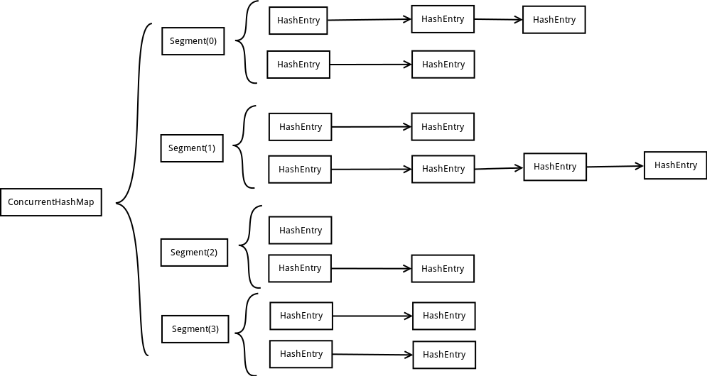

##线程不安全的HashMap

因为多线程环境下，使用Hashmap进行put操作会引起死循环，导致CPU利用率接近100%，所以在并发情况下不能使用HashMap。

##效率低下的HashTable容器

HashTable容器使用 synchronized 来保证线程安全，但在线程竞争激烈的情况下 HashTable 的效率非常低下。因为当一个
线程访问 HashTable 的同步方法时，其他线程访问 HashTable 的同步方法时，可能会进入阻塞或轮询状态。如线程1使用 put
进行添加元素，线程 2 不但不能使用 put 方法添加元素，并且也不能使用 get 方法来获取元素，所以竞争越激烈效率越低。

##ConcurrentHashMap

###锁分段技术

ConcurrentHashMap为了提高本身的并发能力，在内部采用了一个叫做Segment的结构，一个Segment其实就是一个类
Hash Table 的结构，Segment 内部维护了一个链表数组，我们用下面这一幅图来看下 ConcurrentHashMap 的内部结构：



从上面的结构我们可以了解到，ConcurrentHashMap 定位一个元素的过程需要进行两次 Hash 操作，第一次 Hash 定位到 Segment，
第二次 Hash 定位到元素所在的链表的头部，因此，这一种结构的带来的副作用是 Hash 的过程要比普通的 HashMap 要长，但是带来的
好处是写操作的时候可以只对元素所在的 Segment 进行加锁即可，不会影响到其他的 Segment，这样，在最理想的情况下，
ConcurrentHashMap 可以最高同时支持 Segment 数量大小的写操作（刚好这些写操作都非常平均地分布在所有的 Segment上），
所以，通过这一种结构，ConcurrentHashMap 的并发能力可以大大的提高。

有些方法需要跨段，比如 size() 和 containsValue()，它们可能需要锁定整个表而而不仅仅是某个段，这需要按顺序锁定所有段，
操作完毕后，又按顺序释放所有段的锁。这里“按顺序”是很重要的，否则极有可能出现死锁，在ConcurrentHashMap内部，段数组是
final的，并且其成员变量实际上也是 final 的，但是，仅仅是将数组声明为 final 的并不保证数组成员也是 final 的，这需要
实现上的保证。这可以确保不会出现死锁，因为获得锁的顺序是固定的。


###Segment

###HashEntry

###初始化

CurrentHashMap 的初始化一共有三个参数，一个 initialCapacity，表示初始的容量，一个 loadFactor，表示负载参数，
最后一个是 concurrentLevel，代表 ConcurrentHashMap 内部的 Segment 的数量，ConcurrentLevel 一经指定，不可改变，
后续如果 ConcurrentHashMap 的元素数量增加导致 ConrruentHashMap 需要扩容，ConcurrentHashMap 不会增加 Segment
的数量，而只会增加 Segment 中链表数组的容量大小，这样的好处是扩容过程不需要对整个 ConcurrentHashMap 做 rehash，
而只需要对 Segment 里面的元素做一次 rehash 就可以了。

整个ConcurrentHashMap的初始化方法还是非常简单的，先是根据 concurrentLevel 来 new 出 Segment，这里 Segment 
的数量是不大于 concurrentLevel 的最大的2的指数，就是说 Segment 的数量永远是2的指数个，这样的好处是方便采用移位操作来
进行 hash，加快 hash 的过程。接下来就是根据 intialCapacity 确定 Segment 的容量的大小，每一个 Segment 的容量大小也是2的
指数，同样使为了加快 hash 的过程。

这边需要特别注意一下两个变量，分别是 segmentShift 和 segmentMask，这两个变量在后面将会起到很大的作用，假设构造函数确定了
Segment 的数量是2的n次方，那么 segmentShift 就等于32减去n，而 segmentMask 就等于2的n次方减一。

ConcurrentHashMap会首先使用Wang/Jenkins hash的变种算法对元素的hashCode进行一次再哈希。再哈希，其目的是为了
减少哈希冲突，使元素能够均匀的分布在不同的Segment上，从而提高容器的存取效率。

###不变(Immutable)和易变(Volatile)

ConcurrentHashMap完全允许多个读操作并发进行，读操作并不需要加锁。如果使用传统的技术，如 HashMap 中的实现，如果允
许可以在hash链的中间添加或删除元素，读操作不加锁将得到不一致的数据。ConcurrentHashMap 实现技术是保证 HashEntry 几乎
是不可变的。HashEntry 代表每个 hash 链中的一个节点，其结构如下所示:

```java
    static final class HashEntry<K,V> {  
        final K key;  
        final int hash;  
        volatile V value;  
        final HashEntry<K,V> next;  
    }  
```

###Hash 方法

为了加快定位段以及段中hash槽的速度，每个段hash槽的的个数都是2^n，这使得通过位运算就可以定位段和段中
 hash 槽的位置。当并发级别为默认值16时，也就是段的个数，hash 值的高4位决定分配在哪个段中。但是我们也
不要忘记《算法导论》给我们的教训：hash 槽的的个数不应该是2^n，这可能导致hash槽分配不均，这需要对 hash
值重新再 hash 一次。

```java

    private static int hash(int h) {  
        // Spread bits to regularize both segment and index locations,  
        // using variant of single-word Wang/Jenkins hash.  
        h += (h <<  15) ^ 0xffffcd7d;  
        h ^= (h >>> 10);  
        h += (h <<   3);  
        h ^= (h >>>  6);  
        h += (h <<   2) + (h << 14);  
        return h ^ (h >>> 16);  
    }  
```

这是定位段的方法：

```java

    final Segment<K,V> segmentFor(int hash) {  
        return segments[(hash >>> segmentShift) & segmentMask];  
    }  
```

###数据结构


关于 Hash 表的基础数据结构，这里不想做过多的探讨。Hash 表的一个很重要方面就是如何解决 hash 冲突，
ConcurrentHashMap 和 HashMap 使用相同的方式，都是将 hash 值相同的节点放在一个hash链中。与 
HashMap 不同的是，ConcurrentHashMap使用多个子 Hash 表，也就是段(Segment)。下面是
ConcurrentHashMap的数据成员：

```java

    public class ConcurrentHashMap<K, V> extends AbstractMap<K, V>  
            implements ConcurrentMap<K, V>, Serializable {  
        /** 
         * Mask value for indexing into segments. The upper bits of a 
         * key's hash code are used to choose the segment. 
         */  
        final int segmentMask;  
      
        /** 
         * Shift value for indexing within segments. 
         */  
        final int segmentShift;  
      
        /** 
         * The segments, each of which is a specialized hash table 
         */  
        final Segment<K,V>[] segments;  
    }  

```

所有的成员都是 final 的，其中 segmentMask 和 segmentShift 主要是为了定位段，参见上面的 segmentFor 方法。

每个Segment相当于一个子Hash表，它的数据成员如下：

```java
    static final class Segment<K,V> extends ReentrantLock implements Serializable {  
    private static final long serialVersionUID = 2249069246763182397L;  
            /** 
             * The number of elements in this segment's region. 
             */  
            transient volatile int count;  
      
            /** 
             * Number of updates that alter the size of the table. This is 
             * used during bulk-read methods to make sure they see a 
             * consistent snapshot: If modCounts change during a traversal 
             * of segments computing size or checking containsValue, then 
             * we might have an inconsistent view of state so (usually) 
             * must retry. 
             */  
            transient int modCount;  
      
            /** 
             * The table is rehashed when its size exceeds this threshold. 
             * (The value of this field is always <tt>(int)(capacity * 
             * loadFactor)</tt>.) 
             */  
            transient int threshold;  
      
            /** 
             * The per-segment table. 
             */  
            transient volatile HashEntry<K,V>[] table;  
      
            /** 
             * The load factor for the hash table.  Even though this value 
             * is same for all segments, it is replicated to avoid needing 
             * links to outer object. 
             * @serial 
             */  
            final float loadFactor;  
    }  
```

* count : 统计该段数据的个数，它是 volatile，它用来协调修改和读取操作，以保证读取操作能够读取到
几乎最新的修改。协调方式是这样的，每次修改操作做了结构上的改变，如增加/删除节点(修改节点的值不算结
构上的改变)，都要写 count 值，每次读取操作开始都要读取 count 的值。这利用了Java 5中对 volatile
语义的增强，对同一个 volatile 变量的写和读存在 happens-before 关系。
* modCount : 统计段结构改变的次数，主要是为了检测对多个段进行遍历过程中某个段是否发生改变，在讲述跨段
操作时会还会详述。
* threashold : 表示需要进行 rehash 的界限值。
* table : 数组存储段中节点，每个数组元素是个hash链，用HashEntry表示。table 也是volatile，这使得
能够读取到最新的 table 值而不需要同步。
* loadFactor : 负载因子。

在定位元素的代码里我们可以发现定位HashEntry和定位Segment的哈希算法虽然一样，都与数组的长度减去一相与，但是相与
的值不一样，定位Segment使用的是元素的hashcode通过再哈希后得到的值的高位，而定位HashEntry直接使用的是再哈希后
的值。其目的是避免两次哈希后的值一样，导致元素虽然在Segment里散列开了，但是却没有在HashEntry里散列开。


###get 操作

```
    V get(Object key, int hash) {  
        if (count != 0) { // read-volatile  
            HashEntry<K,V> e = getFirst(hash);  
            while (e != null) {  
                if (e.hash == hash && key.equals(e.key)) {  
                    V v = e.value;  
                    if (v != null)  
                        return v;  
                    return readValueUnderLock(e); // recheck  
                }  
                e = e.next;  
            }  
        }  
        return null;  
    }  
```

get 操作不需要锁。第一步是访问 count 变量，这是一个 volatile 变量，由于所有的修改操作在进行结构修改
时都会在最后一步写 count 变量，通过这种机制保证 get 操作能够得到几乎最新的结构更新。对于非结构更新，
也就是结点值的改变，由于 HashEntry 的 value 变量是 volatile 的，也能保证读取到最新的值。接下来就
是对 hash 链进行遍历找到要获取的结点，如果没有找到，直接访回 null。对 hash 链进行遍历不需要加锁的原因
在于链指针 next 是 final 的。但是头指针却不是 final 的，这是通过 getFirst(hash) 方法返回，也就是
存在 table 数组中的值。这使得getFirst(hash)可能返回过时的头结点，例如，当执行get方法时，刚执行完
getFirst(hash)之后，另一个线程执行了删除操作并更新头结点，这就导致get方法中返回的头结点不是最新的。
这是可以允许，通过对count变量的协调机制，get 能读取到几乎最新的数据，虽然可能不是最新的。要得到最新的
数据，只有采用完全的同步。

get 操作的高效之处在于整个 get 过程不需要加锁，除非读到的值是空的才会加锁重读，我们知道 HashTable 容器的
get 方法是需要加锁的，那么ConcurrentHashMap的 get 操作是如何做到不加锁的呢？原因是它的 get 方法里将要使
用的共享变量都定义成 volatile，如用于统计当前 Segement 大小的 count 字段和用于存储值的 HashEntry 的 value。
定义成 volatile 的变量，能够在线程之间保持可见性，能够被多线程同时读，并且保证不会读到过期的值，但是只能被单
线程写（有一种情况可以被多线程写，就是写入的值不依赖于原值），在 get 操作里只需要读不需要写共享变量 count
和 value，所以可以不用加锁。之所以不会读到过期的值，是根据 java 内存模型的 happen before 原则，对 volatile
字段的写入操作先于读操作，即使两个线程同时修改和获取 volatile 变量，get 操作也能拿到最新的值，这是用 volatile
替换锁的经典应用场景。


但是get能够看到调用get方法之前所有已经完成的put（因为如果发生结构性改变它会写count），虽然可能看不到正在
进行的put操作（还没有写count）。这是一个很小的时间窗口，这不可避免，因为get没有同步。这并不是说get不安全，
即使get操作时，其它线程在put，get也能看到一致的hash链（与HashMap相比较）。在HashMap中，假设put方法是同
步的，get没有同步，get有可能看到实际上从不存在hash链。

####比较数学的理解:

当一个线程I对 count 的读时，它读到的值必定是另一个线程，假设是线程II，最近对 count 的写。这个两个操作存在 
happens-before 关系，即线程II 对 count 的写 happens-before 线程I 对 count 的读，记作：

    II：W(count) < I：R(count)

单线程的happens-before规则，又有

    II：W(modCount) < II：W(count)//见源码
    I：R(count) < I：R(modCount)  //见源码

根据传递规则有，

    II：W(modCount) < I：R(modCount)，

这就是说线程I 至少能够读取到线程II 写 count 之前的 modCount 值。


####实例

get方法总是返回最近put过的数据，这句话说得很别扭，却是很重要的。假设其它线程先后调用了
put("a", 1)，put("a", 2)，put("a", 3)，这里能够使用“先后”，是因为put方法是同步的，
put方法是排序的，每一个时刻只能够发生一个put方法。接着一个线程调用 get("a")方法，并且
另一个线程正在调用 put("a", 4) 方法，那么 get("a") 会返回3或者4，完全取决于("a")访问
结点的值（读value)和 put("a", 4) 写结点的值(写value)哪个先发生（读 volatile 变量和写
volatile 总有个先后顺序，读写普通变量就不一定了，它们可能同时发生），这时 put 不会发生结构
性更新。如果在调用 get("a")时，另一个线程正在调用 remove("a")，get方法要么返回 3，要么返回
null，这取决于 get 方法中 getFirst(hash) 返回的到底是 remove("a") 之前还是之后的头
结点，而绝不会返回1, 2或任何其它的值。 

关键是 voliate 的特性:
* 它在读一个 voliate 变量 a 的时候, 确保读到的是对 a 最近的修改
* 对 a 读或写操作,能够保证a 之前的代码一定执行与 a 之后的代码(而 JVM 对与非 voliate 变量执行顺序不定)

每次对 a 的修改,保证 a 之前的操作完成, 而每次对 a 的读都会读 a 最近的修改, 那么对 a 之前的修改
一定已经发生, 这样就保证了get 方法是最近的一次 put 方法. 


最后，如果找到了所求的结点，判断它的值如果非空就直接返回，否则在有锁的状态下再读一次。这似乎有些费解，
理论上结点的值不可能为空，这是因为 put 的时候就进行了判断，如果为空就要抛 NullPointerException。
空值的唯一源头就是 HashEntry 中的默认值，因为 HashEntry 中的 value 不是 final 的，非同步读取有
可能读取到空值。仔细看下 put 操作的语句：

    tab[index] = new HashEntry<K,V>(key, hash, first, value)，

在这条语句中，HashEntry 构造函数中对 value 的赋值以及对 tab[index] 的赋值可能被重新排序，这就可能
导致结点的值为空。这种情况应当很罕见，一旦发生这种情况，ConcurrentHashMap 采取的方式是在持有锁的情况
下再读一遍，这能够保证读到最新的值，并且一定不会为空值。

```java

    V readValueUnderLock(HashEntry<K,V> e) {  
        lock();  
        try {  
            return e.value;  
        } finally {  
            unlock();  
        }  
    }  
```

另一个操作是containsKey，这个实现就要简单得多了，因为它不需要读取值：

```java

    boolean containsKey(Object key, int hash) {  
        if (count != 0) { // read-volatile  
            HashEntry<K,V> e = getFirst(hash);  
            while (e != null) {  
                if (e.hash == hash && key.equals(e.key))  
                    return true;  
                e = e.next;  
            }  
        }  
        return false;  
    }  
```

###put操作

```java

    V put(K key, int hash, V value, boolean onlyIfAbsent) {  
        lock();  
        try {  
            int c = count;  
            if (c++ > threshold) // ensure capacity  
                rehash();  
            HashEntry<K,V>[] tab = table;  
            int index = hash & (tab.length - 1);  
            HashEntry<K,V> first = tab[index];  
            HashEntry<K,V> e = first;  
            while (e != null && (e.hash != hash || !key.equals(e.key)))  
                e = e.next;  
      
            V oldValue;  
            if (e != null) {  
                oldValue = e.value;  
                if (!onlyIfAbsent)  
                    e.value = value;  
            }  
            else {  
                oldValue = null;  
                ++modCount;  
                tab[index] = new HashEntry<K,V>(key, hash, first, value);  
                count = c; // write-volatile  
            }  
            return oldValue;  
        } finally {  
            unlock();  
        }  
    }  
```

该方法也是在持有段锁的情况下执行的，首先判断是否需要 rehash，需要就先 rehash。接着是找是否存在同样
一个 key 的结点，如果存在就直接替换这个结点的值。否则创建一个新的结点并添加到 hash 链的头部，这时一定
要修改 modCount 和 count 的值，同样修改 count 的值一定要放在最后一步。put方法调用了 rehash 方法，
reash方法实现得也很精巧，主要利用了table的大小为2^n，这里就不介绍了。

修改操作还有putAll和replace。putAll就是多次调用put方法，没什么好说的。replace甚至不用做结构上的更改，
实现要比put和delete要简单得多，理解了put和delete，理解replace就不在话下了，这里也不介绍了。

###remove操作

```java

    public V remove(Object key) {  
         hash = hash(key.hashCode());  
         return segmentFor(hash).remove(key, hash, null);  
    }  
```

整个操作是先定位到段，然后委托给段的remove操作。当多个删除操作并发进行时，只要它们所在的段不相同，它们就可以
同时进行。下面是Segment的remove方法实现：

```java

    V remove(Object key, int hash, Object value) {  
        lock();  
        try {  
            int c = count - 1;  
            HashEntry<K,V>[] tab = table;  
            int index = hash & (tab.length - 1);  
            HashEntry<K,V> first = tab[index];  
            HashEntry<K,V> e = first;  
            while (e != null && (e.hash != hash || !key.equals(e.key)))  
                e = e.next;  
      
            V oldValue = null;  
            if (e != null) {  
                V v = e.value;  
                if (value == null || value.equals(v)) {  
                    oldValue = v;  
                    // All entries following removed node can stay  
                    // in list, but all preceding ones need to be  
                    // cloned.  
                    ++modCount;  
                    HashEntry<K,V> newFirst = e.next;  
                    for (HashEntry<K,V> p = first; p != e; p = p.next)  
                        newFirst = new HashEntry<K,V>(p.key, p.hash,  
                                                      newFirst, p.value);  
                    tab[index] = newFirst;  
                    count = c; // write-volatile  
                }  
            }  
            return oldValue;  
        } finally {  
            unlock();  
        }  
    }  
```

整个操作是在持有段锁的情况下执行的，空白行之前的行主要是定位到要删除的节点e。接下来，如果不存在这个
节点就直接返回null，否则就要将e前面的结点复制一遍，尾结点指向e的下一个结点。e后面的结点不需要复制，
它们可以重用。

整个remove实现并不复杂，但是需要注意如下几点:

第一，当要删除的结点存在时，删除的最后一步操作要将count的值减一。这必须是最后一步操作，否则读取操作
可能看不到之前对段所做的结构性修改。

第二，remove执行的开始就将table赋给一个局部变量tab，这是因为table是volatile变量，读写volatile
变量的开销很大。编译器也不能对volatile变量的读写做任何优化，直接多次访问非volatile实例变量没有多大影响，编译器会做相应优化。

###size操作

```java

    public int size() {  
        final Segment<K,V>[] segments = this.segments;  
        long sum = 0;  
        long check = 0;  
        int[] mc = new int[segments.length];  
        // Try a few times to get accurate count. On failure due to  
        // continuous async changes in table, resort to locking.  
        for (int k = 0; k < RETRIES_BEFORE_LOCK; ++k) {  
            check = 0;  
            sum = 0;  
            int mcsum = 0;  
            for (int i = 0; i < segments.length; ++i) {  
                sum += segments[i].count;  
                mcsum += mc[i] = segments[i].modCount;  
            }  
            if (mcsum != 0) {  
                for (int i = 0; i < segments.length; ++i) {  
                    check += segments[i].count;  
                    if (mc[i] != segments[i].modCount) {  
                        check = -1; // force retry  
                        break;  
                    }  
                }  
            }  
            if (check == sum)  
                break;  
        }  
        if (check != sum) { // Resort to locking all segments  
            sum = 0;  
            for (int i = 0; i < segments.length; ++i)  
                segments[i].lock();  
            for (int i = 0; i < segments.length; ++i)  
                sum += segments[i].count;  
            for (int i = 0; i < segments.length; ++i)  
                segments[i].unlock();  
        }  
        if (sum > Integer.MAX_VALUE)  
            return Integer.MAX_VALUE;  
        else  
            return (int)sum;  
    }  
```

size 方法主要思路是先在没有锁的情况下对所有段大小求和，如果不能成功（这是因为遍历过程中
可能有其它线程正在对已经遍历过的段进行结构性更新），最多执行 RETRIES_BEFORE_LOCK次，
如果还不成功就在持有所有段锁的情况下再对所有段大小求和。在没有锁的情况下主要是利用
Segment 中的 modCount 进行检测，在遍历过程中保存每个 Segment 的 modCount，遍历完成
之后再检测每个 Segment 的 modCount 有没有改变，如果有改变表示有其它线程正在对 Segment
进行结构性并发更新，需要重新计算。

其实这种方式是存在问题的，在第一个内层for循环中，在这两条语句

    sum += segments[i].count; 
    mcsum += mc[i] = segments[i].modCount;

之间，其它线程可能正在对 Segment 进行结构性的修改，导致 segments[i].count 和 
segments[i].modCount 读取的数据并不一致。这可能使size()方法返回任何时候都不曾存在的大小，
很奇怪 javadoc 居然没有明确标出这一点，可能是因为这个时间窗口太小了吧。size()的实现还有一点
需要注意，必须要先 segments[i].count，才能 segments[i].modCount，这是因为
segment[i].count 是对 volatile 变量的访问，接下来 segments[i].modCount 才能得到几乎最
新的值（前面我已经说了为什么只是“几乎”了）。这点在 containsValue 方法中得到了淋漓尽致的展现：

```java

    public boolean containsValue(Object value) {  
        if (value == null)  
            throw new NullPointerException();  
      
        // See explanation of modCount use above  
      
        final Segment<K,V>[] segments = this.segments;  
        int[] mc = new int[segments.length];  
      
        // Try a few times without locking  
        for (int k = 0; k < RETRIES_BEFORE_LOCK; ++k) {  
            int sum = 0;  
            int mcsum = 0;  
            for (int i = 0; i < segments.length; ++i) {  
                int c = segments[i].count;  
                mcsum += mc[i] = segments[i].modCount;  
                if (segments[i].containsValue(value))  
                    return true;  
            }  
            boolean cleanSweep = true;  
            if (mcsum != 0) {  
                for (int i = 0; i < segments.length; ++i) {  
                    int c = segments[i].count;  
                    if (mc[i] != segments[i].modCount) {  
                        cleanSweep = false;  
                        break;  
                    }  
                }  
            }  
            if (cleanSweep)  
                return false;  
        }  
        // Resort to locking all segments  
        for (int i = 0; i < segments.length; ++i)  
            segments[i].lock();  
        boolean found = false;  
        try {  
            for (int i = 0; i < segments.length; ++i) {  
                if (segments[i].containsValue(value)) {  
                    found = true;  
                    break;  
                }  
            }  
        } finally {  
            for (int i = 0; i < segments.length; ++i)  
                segments[i].unlock();  
        }  
        return found;  
    }  
```

同样注意内层的第一个 for 循环，里面有语句 int c = segments[i].count; 
但是 c 却从来没有被使用过，即使如此，编译器也不能做优化将这条语句去掉，因为存在对
volatile 变量 count 的读取，这条语句存在的唯一目的就是保证 segments[i].modCount
读取到几乎最新的值。关于 containsValue 方法的其它部分就不分析了，它和 size 方法差不多。

还有一个isEmpty()方法，其实现比size()方法还要简单，也不介绍了.

###迭代器
  
最后简单地介绍下迭代方法，如keySet(), values(), entrySet()方法，这些方法都返回相应的
迭代器，所有迭代器都继承于Hash_Iterator类里实现了主要的方法。其结构是：

```java

    abstract class Hash_Iterator{  
        int nextSegmentIndex;  
        int nextTableIndex;  
        HashEntry<K,V>[] currentTable;  
        HashEntry<K, V> nextEntry;  
        HashEntry<K, V> lastReturned;  
    }  
```

nextSegmentIndex : 段的索引
nextTableIndex : nextSegmentIndex对应段中中hash链的索引，
currentTable : nextSegmentIndex对应段的table。

调用 next 方法时主要是调用了 advance 方法：

```java

    final void advance() {  
        if (nextEntry != null && (nextEntry = nextEntry.next) != null)  
            return;  
      
        while (nextTableIndex >= 0) {  
            if ( (nextEntry = currentTable[nextTableIndex--]) != null)  
                return;  
        }  
      
        while (nextSegmentIndex >= 0) {  
            Segment<K,V> seg = segments[nextSegmentIndex--];  
            if (seg.count != 0) {  
                currentTable = seg.table;  
                for (int j = currentTable.length - 1; j >= 0; --j) {  
                    if ( (nextEntry = currentTable[j]) != null) {  
                        nextTableIndex = j - 1;  
                        return;  
                    }  
                }  
            }  
        }  
    }  
```

不想再多介绍了，唯一需要注意的是跳到下一个段时，一定要先读取下一个段的count变量。 

这种迭代方式的主要效果是不会抛出ConcurrentModificationException。一旦获取到下一个段的
table，也就意味着这个段的头结点在迭代过程中就确定了，在迭代过程中就不能反映对这个段节点并发
的删除和添加，对于节点的更新是能够反映的，因为节点的值是一个 volatile 变量。

##参考

http://www.iteye.com/topic/344876