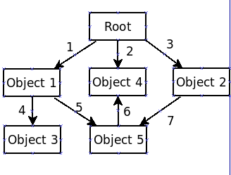

##对象在哪里开辟空间
##对象的生命周期

##Java对象及其引用

初学Java，总是会自觉或不自觉地把 Java 和 C++ 相比较。在学习 Java 类与对象章节的时候，发现教科书和许多参考书把对象
和对象的引用混为一谈。可是，如果分不清对象与对象引用， 那实在没法很好地理解下面的面向对象技术。把自己的一点认识写
下来，或许能让初学Java的朋友们少走一点弯路。

为便于说明，我们先定义一个简单的类：

```
    class Vehicle {
        int passengers;
        int fuelcap;
        int mpg;
    }
```

有了这个模板，就可以用它来创建对象：

```
    Vehicle veh1 = new Vehicle();
```

通常把这条语句的动作称之为创建一个对象，其实，它包含了四个动作。

1 右边的 "new Vehicle"，是以 Vehicle 类为模板，在堆空间里创建一个 Vehicle 类对象（也简称为Vehicle对象）。
2 末尾的()意味着，在对象创建后，立即调用Vehicle类的构造函数，对刚生成的对象进行初始化。构造函数是肯定有的。
如果你没写，Java会给你补上一个默认的构造函数。
3 左边的 "Vehicle veh 1" 创建了一个 Vehicle 类引用变量。所谓 Vehicle 类引用，就是以后可以用来指向 Vehicle 对象的对象引用。
4 "=" 操作符使对象引用指向刚创建的那个 Vehicle 对象。

我们可以把这条语句拆成两部分：

```
    Vehicle veh1;
    veh1 = new Vehicle();
```

效果是一样的。这样写，就比较清楚了，有两个实体：一是对象引用变量，一是对象本身。

在堆空间里创建的实体，与在数据段以及栈空间里创建的实体不同。尽管它们也是确确实实存在的实体，但是，我们看不见，
也摸不着。不仅如此，我们仔细研究一下第二句，找找刚创建的对象叫什么名字？有人说，它叫 "Vehicle"。不对，"Vehicle"是类
（对象的创建模板）的名字。

一个Vehicle类可以据此创建出无数个对象，这些对象不可能全叫 "Vehicle"。

对象连名都没有，没法直接访问它。我们只能通过对象引用来间接访问对象。

为了形象地说明对象、引用及它们之间的关系，可以做一个或许不很妥当的比喻。对象好比是一只很大的气球，大到我们抓不住它。
引用变量是一根绳， 可以用来系汽球。

如果只执行了第一条语句，还没执行第二条，此时创建的引用变量 veh1 还没指向任何一个对象，它的值是 null。引用变量可以指向
某个对象，或者为null。

它是一根绳，一根还没有系上任何一个汽球的绳。执行了第二句后，一只新汽球做出来了，并被系在 veh1 这根绳上。我们抓住这根绳，
就等于抓住了那只汽球。

再来一句：

```
    Vehicle veh2;
```

就又做了一根绳，还没系上汽球。如果再加一句：

```
    veh2 = veh1;
```

系上了。这里，发生了复制行为。但是，要说明的是，对象本身并没有被复制，被复制的只是对象引用。结果是，veh2 也指向了 veh1
所指向的对象。两根绳系的是同一只汽球。

如果用下句再创建一个对象：

```
    veh2 = new Vehicle();
```

则引用变量 veh2 改指向第二个对象。

从以上叙述再推演下去，我们可以获得以下结论：

1 一个对象引用可以指向 0 个或 1 个对象（一根绳子可以不系汽球，也可以系一个汽球）；
2 一个对象可以有N个引用指向它（可以有N条绳子系住一个汽球）。

如果再来下面语句：

```
    veh1 = veh2;
```

按上面的推断，veh1也指向了第二个对象。这个没问题。问题是第一个对象呢？没有一条绳子系住它，它飞了。多数书里说，
它被Java的垃圾回收机制回收了。这不确切。正确地说，它已成为垃圾回收机制的处理对象。至于什么时候真正被回收，
那要看垃圾回收机制的心情了。

由此看来，下面的语句应该不合法吧？至少是没用的吧？

```
    new Vehicle();
```

不对。它是合法的，而且可用的。譬如，如果我们仅仅为了打印而生成一个对象，就不需要用引用变量来系住它。最常见的就是打印字符串：

```
    System.out.println(“I am Java!”);
```

字符串对象“I am Java!”在打印后即被丢弃。有人把这种对象称之为临时对象。对象与引用的关系将持续到对象回收。


##另一个角度分析Java对象和引用以及与其密切相关的参数传递

先看下面的程序：

```
    StringBuffer s;
    s = new StringBuffer("Hello World!");
```

第一个语句仅为引用(reference)分配了空间，而第二个语句则通过调用类(StringBuffer) 的构造函数 StringBuffer(String str)
为类生成了一个实例（或称为对象）。这两个操作被完成后，对象的内容则可通过s进行访问——在Java里都是通过引用来操纵对象的。

Java 对象和引用的关系可以说是互相关联，却又彼此独立。彼此独立主要表现在：引用是可以改变的，它可以指向别的对象，
譬如上面的 s，你可以给它另外的对象，如：

```
    s = new StringBuffer("Java");
```

这样一来，s 就和它指向的第一个对象脱离关系。

从存储空间上来说，对象和引用也是独立的，它们存储在不同的地方，对象一般存储在堆中，而引用存储在速度更快的堆栈中。

引用可以指向不同的对象，对象也可以被多个引用操纵，如：

```
    StringBuffer s1 = s;
```

这条语句使得 s1 和 s 指向同一个对象。既然两个引用指向同一个对象，那么不管使用哪个引用操纵对象，对象的内容都发生改变，
并且只有一份，通过 s1 和 s 得到的内容自然也一样，(String除外，因为 String 始终不变，String s1="AAAA"; String s = s1,
操作s, s1 由于始终不变，所以为 s 另外开辟了空间来存储s,)

如下面的程序：

``` java

    StringBuffer s;
    s = new StringBuffer("Java");
    StringBuffer s1 = s;
    s1.append(" World");
    System.out.println("s1=" + s1.toString());//打印结果为：s1=Java World
    System.out.println("s=" + s.toString());//打印结果为：s=Java World
```

上面的程序表明，s1 和 s 打印出来的内容是一样的，这样的结果看起来让人非常疑惑，但是仔细想想，s1 和 s 只是两个引用，
它们只是操纵杆而已，它们指向同一个对象，操纵的也是同一个对象，通过它们得到的是同一个对象的内容。这就像汽车的刹车和油门，
它们操纵的都是车速，假如汽车开始的速度是 80，然后你踩了一次油门，汽车加速了，假如车速升到了120，然后你踩一下刹车，
此时车速是从120开始下降的，假如下降到 60，再踩一次油门，车速则从 60 开始上升，而不是从第一次踩油门后的 120 开始。也就是说
车速同时受油门和刹车影响，它们的影响是累积起来的，而不是各自独立（除非刹车和油门不在一辆车上）。所以，在上面的程序中，
不管使用s1还是s操纵对象，它们对对象的影响也是累积起来的（更多的引用同理）。

**只有理解了对象和引用的关系，才能理解参数传递**。

一般面试题中都会考 Java 传参的问题，并且它的标准答案是 Java 只有一种参数传递方式：那就是按值传递，即 Java 中传递任何东西
都是传值。如果传入方法的是基本类型的东西，你就得到此基本类型的一份拷贝。如果是传递引用，就得到引用的拷贝。

一般来说，对于基本类型的传递，我们很容易理解，而对于对象，总让人感觉是按引用传递，看下面的程序：

``` java

    public class ObjectRef {
        //基本类型的参数传递
        public static void testBasicType(int m) {
             System.out.println("m=" + m);//m=50
             m = 100;
             System.out.println("m=" + m);//m=100
        }

        //参数为对象，不改变引用的值
        public static void add(StringBuffer s) {
            s.append("_add");
        }

        //参数为对象，改变引用的值
        public static void changeRef(StringBuffer s) {
           s = new StringBuffer("Java");
       }

        public static void main(String[] args) {
            int i = 50;
            testBasicType(i);
            System.out.println(i);//i=50
            StringBuffer sMain = new StringBuffer("init");
            System.out.println("sMain=" + sMain.toString());//sMain=init
            add(sMain);
            System.out.println("sMain=" + sMain.toString());//sMain=init_add
            changeRef(sMain);
            System.out.println("sMain=" + sMain.toString());//sMain=init_add
        }
    }
```

以上程序的允许结果显示出，testBasicType 方法的参数是基本类型，尽管参数 m 的值发生改变，但并不影响 i。

add 方法的参数是一个对象，当把 sMain 传给参数 s 时，s 得到的是 sMain 的拷贝，所以 s 和 sMain 指向同一个对象，
因此，使用 s 操作影响的其实就是 sMain 指向的对象，故调用 add 方法后，sMain 指向的对象的内容发生了改变。

在 changeRef 方法中，参数也是对象，当把 sMain 传给参数 s 时，s 得到的是 sMain 的拷贝，但与 add 方法不同的是，
在方法体内改变了 s 指向的对象（也就是 s 指向了别的对象,牵着气球的绳子换气球了），给 s 重新赋值后，s 与 sMain
已经毫无关联，它和 sMain 指向了不同的对象，所以不管对 s 做什么操作，都不会影响 sMain 指向的对象，故调用 
changeRef 方法前后 sMain 指向的对象内容并未发生改变。

对于 add 方法的调用结果，可能很多人会有这种感觉：这不明明是按引用传递吗？对于这种问题，还是套用 Bruce Eckel的话
：这依赖于你如何看待引用，最终你会明白，这个争论并没那么重要。真正重要的是，你要理解，传引用使得（调用者的）对象
的修改变得不可预期。

``` java

    public class Test{
        public int   i,j;
        public void test_m(Test a) {
            Test b = new Test();
            b.i = 1;
            b.j = 2;
            a = b;
        }
        public void test_m1(Test a) {
            a.i = 1;
            a.j = 2;
        }
        public static void main(String   argv[]){
            Test t = new Test();
            t.i = 5;
            t.j = 6;
            System.out.println("t.i =" + t.i + "t.j=" + t.j); //5,6
            t.test_m(t);
            //5,6,a和t都指向了一个对象，而在test_m中s又指向了另一个对象，所以对象t不变！！！
            System.out.println("t.i="+ t.i + "t.j=" + t.j);
            t.test_m1(t);
            System.out.println("t.i=" + t.i + "t.j=" + t.j); //1,2
        }
    }
```

答案只有一个：Java里都是按值传递参数。而实际上，我们要明白，当参数是对象时，传引用会发生什么状况（就像上面的add方法）。

楼主，这样来记这个问题

如下表达式：

```
    A a1 = new A();
```

它代表 A 是类，a1 是引用，a1 不是对象，new A() 才是对象，a1 引用指向new A() 这个对象。

在JAVA里，"=" 不能被看成是一个赋值语句，它不是在把一个对象赋给另外一个对象，它的执行过程实质上是将右边对象的地址传给了
左边的引用，使得左边的引用指向了右边的对象。JAVA表面上看起来没有指针，但它的引用其实质就是一个指针，引用里面存放的并不
是对象，而是该对象的地址，使得该引用指向了对象。在JAVA里，"="语句不应该被翻译成赋值语句，因为它所执行的确实不是一个赋值
的过程，而是一个传地址的过程，被译成赋值语句会造成很多误解，译得不准确。

再如：

```
    A a2;
```

它代表 A 是类，a2是引用，a2 不是对象，a2 所指向的对象为空null;

再如：

```
    a2 = a1;
```

它代表，a2是引用，a1也是引用，a1所指向的对象的地址传给了a2(传址），使得a2和a1指向了同一对象。

综上所述，可以简单的记为，在初始化时，"="语句左边的是引用，右边new出来的是对象。
在后面的左右都是引用的"="语句时，左右的引用同时指向了右边引用所指向的对象。

再所谓实例，其实就是对象的同义词。

##Java 赋值

如果需要赋值，就需要类实现 Cloneable 接口，实现 clone() 方法。

``` java

    class D implements Cloneable{//实现Cloneable接口
        String sex;

        D(String sex) {
            this.sex=sex;
        }

        @Override
        protected Object clone() throws CloneNotSupportedException {
            // 实现clone方法
            return super.clone();
        }
    }
```

赋值的时候：

    D d = new D("男");
    D d2 = (D) d.clone();//把d赋值给d2

如果类中的变量不是主类型，而是对象，也需要调用该对象的clone()方法

下面是一个完整的例子：

```
    public class Test2 {
        public static void main(String[] args) throws CloneNotSupportedException {

            // TODO Auto-generated method stub
            D d=new D("男");
            C c=new C("张三","20",d);
            C new_c=(C) c.clone();//调用clone方法来赋值
            new_c.name="李四";
            d.sex="女";//d

            System.out.println(c.d.sex);
            System.out.println(c.name);
        }
    }

    class C implements Cloneable{
        String name;
        String age;
        D d;

        C(String name,String age,D d) throws CloneNotSupportedException {
            this.name=name;
            this.age=age;
            this.d=(D) d.clone();//调用clone方法来赋值，这样即便外部的d发生变化，c里的也不会变
        }

        @Override
        protected Object clone() throws CloneNotSupportedException {
            // TODO Auto-generated method stub
            return super.clone();
        }
    }

    class D implements Cloneable{//实现Cloneable接口
        String sex;
        D(String sex){
            this.sex=sex;
        }
        @Override
        protected Object clone() throws CloneNotSupportedException {
            // 实现clone方法
            return super.clone();
        }
    }
```


##Java强引用、 软引用、 弱引用、虚引用

既然讨论到了java的引用问题，自然就会想到java的引用分为几种情况，下面详细说一下Java的四种引用。

###对象的强、软、弱和虚引用

在JDK 1.2以前的版本中，若一个对象不被任何变量引用，那么程序就无法再使用这个对象。也就是说，只有对象处于可触及
（reachable）状态，程序才能使用它。从JDK 1.2版本开始，把对象的引用分为4种级别，从而使程序能更加灵活地控制对象
的生命周期。这4种级别由高到低依次为：强引用、软引用、弱引用和虚引用。

###强引用（StrongReference）

强引用是使用最普遍的引用。如果一个对象具有强引用，那垃圾回收器绝不会回收它。当内存空间不足，Java 虚拟机宁愿抛出
OutOfMemoryError 错误，使程序异常终止，也不会靠随意回收具有强引用的对象来解决内存不足的问题。

###软引用（SoftReference）

如果一个对象只具有软引用，则内存空间足够，垃圾回收器就不会回收它；如果内存空间不足了，就会回收这些对象的内存。
只要垃圾回收器没有回收它，该对象就可以被程序使用。软引用可用来实现内存敏感的高速缓存（下文给出示例）。

软引用可以和一个引用队列（ReferenceQueue）联合使用，如果软引用所引用的对象被垃圾回收器回收，Java虚拟机就会把这个
软引用加入到与之关联的引用队列中。

###弱引用（WeakReference）

弱引用与软引用的区别在于：弱引用的对象拥有更短暂的生命周期。在垃圾回收器线程扫描它所管辖的内存区域的过程中，
一旦发现了只具有弱引用的对象，不管当前内存空间足够与否，都会回收它的内存。不过，由于垃圾回收器是一个优先级很低的线程，
因此不一定会很快发现那些只具有弱引用的对象。

弱引用可以和一个引用队列（ReferenceQueue）联合使用，如果弱引用所引用的对象被垃圾回收，Java虚拟机就会把这个弱引用加入
到与之关联的引用队列中。

###虚引用（PhantomReference）

"虚引用"顾名思义，就是形同虚设，与其他几种引用都不同，虚引用并不会决定对象的生命周期。如果一个对象仅持有虚引用，那么
它就和没有任何引用一样，在任何时候都可能被垃圾回收器回收。虚引用主要用来跟踪对象被垃圾回收器回收的活动。虚引用与软引用
和弱引用的一个区别在于：虚引用必须和引用队列（ReferenceQueue）联合使用。当垃圾回收器准备回收一个对象时，如果发现它还有
虚引用，就会在回收对象的内存之前，把这个虚引用加入到与之 关联的引用队列中。

程序可以通过判断引用队列中是否已经加入了虚引用，来了解被引用的对象是否将要被垃圾回收。如果程序发现某个虚引用已经被加入
到引用队列，那么就可以在所引用的对象的内存被回收之前采取必要的行动。

###对象可及性的判断

在很多时候，一个对象并不是从根集直接引用的，而是一个对象被其他对象引用，甚至同时被几个对象所引用，从而构成一个以根集为
顶的树形结构。如图2所示

	

在这个树形的引用链中，箭头的方向代表了引用的方向，所指向的对象是被引用对象。由图可以看出，从根集到一个对象可以由很多条路径。
比如到达对象5的路径就有1-5, 3-7 两条路径。由此带来了一个问题，那就是某个对象的可达性如何判断:

* 单条引用路径可达性判断:在这条路径中，最弱的一个引用决定对象的可达性。
* 多条引用路径可达性判断:几条路径中，最强的一条的引用决定对象的可达性。

比如，我们假设图2中引用1和3为强引用，5为软引用，7为弱引用，对于对象5按照这两个判断原则，路径1-5取最弱的引用5,因此该路径对
对象5的引用为软引用。同样，3-7为弱引用。在这两条路径之间取最强的引用，于是对象5是一个软可达对象。


##使用软引用构建敏感数据的缓存

###为什么需要使用软引用

首先，我们看一个雇员信息查询系统的实例。我们将使用一个Java语言实现的雇员信息查询系统查询存储在磁盘文件或者数据库中的雇员人
事档案信息。作为一个用户，我们完全有可能需要回头去查看几分钟甚至几秒钟前查看过的雇员档案信息(同样，我们在浏览WEB页面的时候
也经常会使用"后退"按钮)。这时我们通常会有两种程序实现方式:一种是把过去查看过的雇员信息保存在内存中，每一个存储了雇员档案信息
的Java对象的生命周期贯穿整个应用程序始终;另一种是当用户开始查看其他雇员的档案信息的时候，把存储了当前所查看的雇员档案信息的
Java对象结束引用，使得垃圾收集线程可以回收其所占用的内存空间，当用户再次需要浏览该雇员的档案信息的时候，重新构建该雇员的信息。
很显然，第一种实现方法将造成大量的内存浪费，而第二种实现的缺陷在于即使垃圾收集线程还没有进行垃圾收集，包含雇员档案信息的对象
仍然完好地保存在内存中，应用程序也要重新构建一个对象。我们知道，访问磁盘文件、访问网络资源、查询数据库等操作都是影响应用程序
执行性能的重要因素，如果能重新获取那些尚未被回收的Java对象的引用，必将减少不必要的访问，大大提高程序的运行速度。

###如果使用软引用

SoftReference 的特点是它的一个实例保存对一个 Java 对象的软引用，该软引用的存在不妨碍垃圾收集线程对该 Java 对象的回收。也就是说，
一旦 SoftReference 保存了对一个 Java 对象的软引用后，在垃圾线程对这个 Java 对象回收前，SoftReference类所提供的 get() 方法返回
Java 对象的强引用。另外，一旦垃圾线程回收该 Java 对象之后，get()方法将返回 null。看下面代码:

```
    MyObject aRef = new MyObject();
    SoftReference aSoftRef = new SoftReference(aRef);
```

此时，对于这个MyObject对象，有两个引用路径，一个是来自 SoftReference 对象的软引用，一个来自变量 aRef 的强引用，所以这个 MyObject
对象是强可及对象。

随即，我们可以结束 aRef 对这个MyObject实例的强引用:

    aRef  =  null ;

此后，这个MyObject对象成为了软可达对象。如果垃圾收集线程进行内存垃圾收集，并不会因为有一个 SoftReference 对该对象的引用而始终保留
该对象。Java虚拟机的垃圾收集线程对软可达对象和其他一般 Java 对象进行了区别对待: 软可及对象的清理是由垃圾收集线程根据其特定算法按照
内存需求决定的。也就是说，垃圾收集线程会在虚拟机抛出 OutOfMemoryError 之前回收软可及对象，而且虚拟机会尽可能优先回收长时间闲置不用
的软可达对象，对那些刚刚构建的或刚刚使用过的软可达对象会被虚拟机尽可能保留。在回收这些对象之前，我们可以通过:

```
    MyObject  anotherRef =(MyObject) aSoftRef .get()
```

重新获得对该实例的强引用。而回收之后，调用 get() 方法就只能得到 null 了。

###使用ReferenceQueue清除失去了软引用对象的SoftReference

作为一个 Java 对象，SoftReference 对象除了具有保存软引用的特殊性之外，也具有 Java 对象的一般性。所以，当软可及对象被回收之后，
虽然这个 SoftReference 对象的 get() 方法返回 null,但这个 SoftReference 对象已经不再具有存在的价值，需要一个适当的清除机制，
避免大量 SoftReference 对象带来的内存泄漏。在 java.lang.ref 包里还提供了ReferenceQueue。如果在创建 SoftReference 对象的时候，
使用了 一个ReferenceQueue 对象作为参数提供给SoftReference的构造方法，如:

```
    ReferenceQueue queue = new ReferenceQueue();
    SoftReference ref = new SoftReference(aMyObject, queue);
```

那么当这个 SoftReference 软引用的 aMyOhject 被垃圾收集器回收的同时，ref 所强引用的 SoftReference 对象被列入 ReferenceQueue。
也就是说，ReferenceQueue中保存的对象是 Reference 对象，而且是已经失去了它所软引用的对象的 Reference 对象。另外从 ReferenceQueue
这个名字也可以看出，它是一个队列，当我们调用它的 poll() 方法的时候，如果这个队列中不是空队列，那么将返回队列前面的那个Reference对象。

在任何时候，我们都可以调用 ReferenceQueue 的 poll() 方法来检查是否有它所关心的非强可达对象被回收。如果队列为空，将返回一个null,
否则该方法返回队列中前面的一个 Reference 对象。利用这个方法，我们可以检查哪个 SoftReference 所软引用的对象已经被回收。
于是我们可以把这些失去所软引用的对象的 SoftReference 对象清除掉。常用的方式为:

```
    SoftReference ref =  null ;
    while  ((ref = (SoftReference)q.poll()) !=  null ) {
     // 清除 ref
    }
```

理解了 ReferenceQueue 的工作机制之后，我们就可以开始构造一个 Java 对象的高速缓存器了。

###通过软可及对象重获方法实现Java对象的高速缓存

利用 Java2 平台垃圾收集机制的特性以及前述的垃圾对象重获方法，我们通过一个雇员信息查询系统的小例子来说明如何构建一种高
速缓存器来避免重复构建同一个对象带来的性能损失。我们将一个雇员的档案信息定义为一个Employee类:

```
    public class Employee {
        private String id ; // 雇员的标识号码
        private String name ; // 雇员姓名
        private String department ; // 该雇员所在部门
        private String Phone ; // 该雇员联系电话
        private int salary ; // 该雇员薪资
        private String origin ; // 该雇员信息的来源

        // 构造方法
        public Employee(String id) {
            this.id = id;
            getDataFromlnfoCenter();
        }

        // 到数据库中取得雇员信息
        private void getDataFromlnfoCenter() {
            // 和数据库建立连接井查询该雇员的信息，将查询结果赋值
            // 给 name， department， plone， salary等变量
            // 同时将 origin 赋值为 "From DataBase"
        }
    }
```

这个Employee类的构造方法中我们可以预见，如果每次需要查询一个雇员的信息。哪怕是几秒中之前刚刚查询过的，都要重新构建一个
实例，这是需要消耗很多时间的。下面是一个对 Employee 对象进行缓存的缓存器的定义:

``` java

    import java.lang.ref.ReferenceQueue;
    import java.lang.ref.SoftReference;
    import java.util.Hashtable;

    public class EmployeeCache {
        static private EmployeeCache  cache ; // 一个 Cache实例
        private Hashtable<String, EmployeeRef> employeeRefs ; // 用于 Chche内容的存储
        private ReferenceQueue<Employee>  q ; // 垃圾 Reference的队列

        // 继承 SoftReference，使得每一个实例都具有可识别的标识,
        // 并且该标识与其在 HashMap内的 key相同。
        private class EmployeeRef extends SoftReference<Employee> {
            private String_key = "" ;
            public EmployeeRef(Employee em, ReferenceQueue<Employee> q) {
                super(em, q);
                _key = em.getID();
            }
        }

        // 构建一个缓存器实例
        private  EmployeeCache() {
            employeeRefs = new Hashtable<String, EmployeeRef>();
            q = new ReferenceQueue<Employee>();
        }

        // 取得缓存器实例
        public static synchronized EmployeeCache getInstance() {
            if (cache == null) {
                cache = new EmployeeCache();
            }
            return cache ;
        }

        // 以软引用的方式对一个 Employee 对象的实例进行引用并保存该引用
        private void cacheEmployee(Employee em) {
            cleanCache(); // 清除垃圾引用
            EmployeeRef ref = new EmployeeRef(em, q);
            employeeRefs.put(em.getID(), ref);
        }

        // 依据所指定的 ID号，重新获取相应 Employee 对象的实例
        public Employee getEmployee(String ID) {
            Employee em =  null ;
            // 缓存中是否有该 Employee 实例的软引用，如果有，从软引用中取得。
            if (employeeRefs.containsKey(ID)) {
                EmployeeRef ref = (EmployeeRef)employeeRefs.get(ID);
                em = (Employee) ref.get();
            }
            // 如果没有软引用，或者从软引用中得到的实例是 null，重新构建一个实例，
            // 并保存对这个新建实例的软引用
            if (em == null) {
                em = new Employee(ID);
                System.out.println("Retrieve From EmployeeInfoCenter. ID=" + ID);
                this.cacheEmployee(em);
            }
            return  em;
        }

        // 清除那些所软引用的 Employee对象已经被回收的 EmployeeRef对象
        private void cleanCache() {
            EmployeeRef ref = null ;
            while  ((ref = (EmployeeRef)q.poll()) != null ) {
                employeeRefs.remove(ref._key);
            }
        }
    }
```

##结语

    上述是从自己见过的感觉对理解Java对象，对象引用以及对象赋值，目前最优价值的帖子中挑选而来。希望对大家有用。
