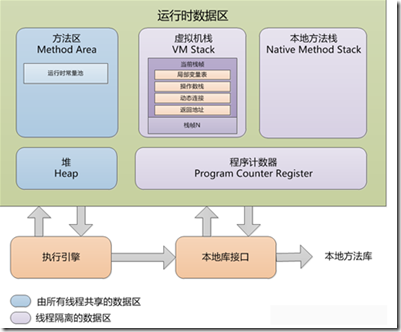
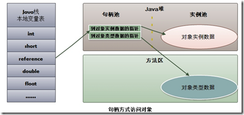

前提, HotSpot, jvm 64 位


##Java 大事记

* 1995 年 5 月 23 日, Java 语言诞生, 提出 "Write Once, Run Anywhere"
* 1996 年 1 月 23 日, JDK 1.0 诞生, 纯解释的虚拟机
* 1997 年 2 月 18 日, JDK 1.1 发布, 代表有内部类与反射
* 1998 年 12 月 4 日, JDK 1.2 发布. 代号 Playground. 分 J2EE J2SE J2ME, 第一次内置 JIT 编译器
* 2000 年 5 月 8  日, JDK 1.3 发布, 代号 Kestel. HotSpot 为默认虚拟机
* 2002 年 2 月 13 日, JDK 1.4 发布, 代号 Merlin
* 2004 年 9 月 30 日, JDK 1.5 发布, 代号 Tiger, 改进内存模型, java.util.concurrent 以及泛型, 动态注解, 可变长参数, 遍历循环(foreach), 自动装箱等
* 2006 年 12 月 11 日, JDK 1.6 发布, 代号 Mustang, java 虚拟机的大量更新, java 宣布开源, 并建立 OpenJDK 组织对源代码管理
* 2009 年 4 月 20 日, 甲骨文 74 亿美元收购 Sun. 取得 Java 的版权.
* 2011 年 7 月 28 日, 甲骨文发布 Java 7.0 的正式版. G1 垃圾收集器
* 2014 年 3 月 19 日, 甲骨文公司发布 Java 8.0 的正式版。


##数据类型

Java虚拟机中, 数据类型可以分为两类: 基本类型和引用类型.

基本类型的变量保存原始值, 即: 他代表的值就是数值本身.
基本类型包括：byte,short,int,long,char,float,double,Boolean,returnAddress

引用类型的变量保存引用值. "引用值"代表了某个对象的引用, 不是对象本身, 而是对象本身存放在这个引用值所表示的地址的位置.
引用类型包括：类类型，接口类型和数组。

###java 运行

####解释器

解释器只是简单地为每个字节码指令查找对应的硬件指令, 并将其发送至 CPU 去执行.

你可以将解析比作使用字典: 每个具体的语句(字节码指令)都有一个准确的翻译(机器代码指令).
从解释器读取并送一个字节码指令到 CPU 执行的那一刻起, 就已经没有机会去优化指令集了. 解析器
同样, 在每次字节码被读取时, 不得不执行解析操作, 并且这个过程是十分缓慢的. 解析是一种
能够执行代码的精确方法, 但是这种不可优化的输出指令集, 对目标平台处理器来说, 可能不会
得到最高性能的指令序列.

####编译器

另一方面, 编译器将全部要执行的代码载入到运行时环境. 当它转译字节码的时候, 它还具备检查
整体或部分运行时上下文的能力, 并且判断如何准确的转译这些代码. 它的判断是基于代码图的分析,
例如不同的指令执行分支和运行时上下文数据.

当一个字节码序列被转译为机器指令集, 并且可以对指令集进行优化时, 用以替换的指令集(优化过的)
被存储进一个叫做代码缓存的结构中. 下一次这些字节码再被执行, 之前优化过的代码可以被快速的从
代码缓存中定位到, 并且用于执行. 有些情况下, 性能计数器可能去除并重写之前的优化, 即编译器运
行了新的优化. 代码缓存的优点是, 结果指令集可以被立刻执行--不需要解析查找或者编译! 这样就提
高了执行速度, 特别是同样的方法要被调用很多次的 java 应用.

####JIT

使用动态编译器可以带来插入性能计数器的机会. 比如, 编译器可能会插入一个性能计数器, 在每次字
节码代码块被调用时, 进行计算. 编译器使用"热点代码"相关的数据, 来决定在正在运行的应用程序中,
哪部分的代码优化给程序最好的影响. 运行时的分析数据使编译器制作出一些正在运行, 或长远提高性
能的代码优化方案. 随着更多分析数据的提炼, 它可以用于更多更好的优化决策, 例如, 如何在语言编译
中, 获得更好的输出指令, 是否需要替换为更有效的指令集, 甚至是否需要去除多余的操作.

参考如下代码

    staticint add7(int x){
        return x+7;
    }

以下是使用javac静态编译后的指令

    iload0
    bipush 7
    iadd
    ireturn

当这个方法被调用时, 字节码块将被动态地编译为机器指令. 当性能计数器(如果监控了此段代码), 在满足
一定条件时, 它也可能被优化. 最终结果可能和以下机器指令集相似:

    lea rax,[rdx+7]
    ret

###Java 内存区域



####程序计数器(Program Counter Register)

在多线程在一个处理器上执行时, 线程之间会频繁切换, 为了让每个线程都能知道下一步
执行那条指令, 将指令地址存放在程序计数器中, 线程执行的时候就能获取需要执行的指令.
因此, 每个线程都有一个程序计数器, 各个线程的程序计数器互不干扰, 如果线程正在执行
一个 java 方法, 记录正在执行的虚拟机字节码指令的地址; 如果执行的是 Native 方法,
计数器值为空(Undified), 此内存区域是唯一不会出现 OutOfMemoryError 的区域

此程序计数器与机器码的指令计数器工作机制类似, 区别是这里指的是 java 编译后生成的
字节码的程序计数器.

生命周期: 与线程共存亡

####虚拟机栈(VM Stack)

这和操作系统的栈原理类似. 但这里指的是 java 方法的栈, 这个栈是 java 虚拟机的栈
, java 虚拟机可以理解为一个操作系统, 这个栈是 java 虚拟机在调用 java 方法的时候
使用, 每个 java 方法被执行的时候就会在虚拟机栈中创建一个栈帧(Stack Frame), 当你
在 java 方法中创建一个局部变量, 该变量就被压入栈帧, 方法调用完成, 该栈帧就退出
虚拟机栈.

局部变量表: 存放在栈帧中, 包括基本数据类型, 引用类型和 returnAddress 类型, 在编
译期间就完成分配, 因为分配的空间是完全确定的, 再方法运行期间不会改变大小

生命周期: 与线程共存亡

异常: 当线程申请的栈深度大于虚拟机所允许的深度, 将抛出 StackOverflowError
的异常, 如果虚拟机的栈可以动态地扩展, 当扩展时无法申请到足够的内存时抛出
OutOfMemoryError 异常

####本地方法栈(Native Method Stack)

可以理解为不同操作系统自己的栈, 由于 java 将各个操作系统的细节向编程人员屏蔽,
那么, 完成相同功能, 对不同系统的的方法可能不同, 因此就需要 java 来根据当前系统
来调用对应系统的方法, 因此, 命名为 Native 方法栈.

由于有些时候, 执行java 方法难免会需要调用操作系统的系统调用, 这个时候本地方法
栈就是为此而生. 因此与虚拟机栈不同的是一个是调用操作系统系统调用所有需要的栈,
一个是调用 java 方法的需要的栈.由于虚拟机规范并没有对此做出强制规定, 因此
完全可以将本地方法栈与虚拟机栈合并处于同一内存. 他们的特定是内存的分配和释放都比
较频繁.

生命周期: 与线程共存亡

异常: StackOverflowError 和 OutOfMemoryError 都可能抛出


####堆(Heap)

所有线程共享

虚拟机启动的时候, 此内存区域的唯一目的是存放所有的对象实例

由于是 GC 管理的主要区域, 因此被称为 GC 堆

从内存回收的角度看, 由于现代的收集器都是采用分代收集算法, 所有可细分为新生代,
老年代; 再细致一点可以由 Eden空间, Frome Survivor空间, to Survivor 空间等

从内存分配的角度看, 线程共享的 java 堆可以划分出多个线程私有的分配缓冲区(Thread
Local Allocation Buffer TLAB).

无论如何划分, 都与存放的内容无关,无论哪个区域存储的都是对象实例.进一步的划分是
为了更好地回收内存, 或更快地分配内存

根据虚拟机规范的规定, java 堆可以处于物理上不连续的内存空间中, 只有逻辑上连续
即可. 既可以是固定大小, 也可以是可扩展的, 不过当前主流的实现都是可扩展的, 通过
-Xmx -Xms 来限定最大和最小内存. 如果在实例分配的时候, 堆中没有内存空间, 并且也
无法扩展的时候就抛出 OutOfMemoryError 异常

####方法区(Method Area)

对应 java 分代中的永久代(permanent generation)

所有线程共享

存储已经虚拟机加载的类信息, 常量, 静态变量, 即时编译器编译后的代码等数据

虽然虚拟机规范把它描述为堆的一个逻辑部分, 但有一个别名为非堆(Not Heap), 目的
很显然是要与堆区别开来. 其实, 之所以要给出这个名字, 可能是因为 HotSpot 中, 将
该区域划入永久代, 原因是这个区域对与内存回收较堆(Heap)需求要低很多. 但并不代表
不需要回收.

根据虚拟机规范的规定, 方法区可以处于物理上不连续的内存空间中, 只有逻辑上连续
即可. 既可以是固定大小, 也可以是可扩展的, 此外可以选择不实现垃圾收集. 但实际
表面这个区域也是需要垃圾回收的, 因为曾经爆出重大 BUG. 这个区域的回收主要是针对
常量池的回收和对类型的卸载. 当方法区无法满足内存分配时, 将抛出 OutOfMemoryError
异常.

####运行时常量池(Runtime Contant Pool)

方法区的一部分, 用于存放编译期生成的各种字面量和符号引用. 但这不是绝对的,这部分
内存完全可能在运行时将新的常量加入, 典型的是 String 的 intern() 方法. 此外,
等同于 Class 文件中的常量池

####直接内存(Direct Memory)

在 JDK 1.4 中引入 NIO(New Input/Output), 引用一种基于通道与缓冲区的 I/O 方式,
它可以通过 Native 函数库直接分配堆外内存, 然后通过一个存储在 java 堆里面的
DirtectByteBuffer 对象作为这块内存的引用进行操作. 由于避免了Native 和 java
堆的来回数据拷贝, 因此可以显著提高性能. 其实就是最近兴起的 off-heap 技术.
主要其实就是克服垃圾回收 STW 对系统的影响, 多见于高实时性的应用.

其实, 就是不想放弃在一般情况下的 GC, 但对于部分内存又希望自己来控制的场景
下出现的. Cassandra 已经采用 off-heap 技术. 不过新出的一门语言 Nim 就显示
地提供了让编程人员来选择哪部分自己控制内存, 哪部分用 GC.


###堆与栈

堆和栈是非常好的抽象. 其实是有哲学思想在里面的.

我们通过前面我们知道, 由于 java 为了屏蔽物理操作系统的细节, 通过 JVM 来统一所有
接口. 因此, JVM 其实就担当了抽象的操作系统. 这里的堆与栈与实际物理操作系统的堆与
栈也极为相似.

堆是共享的, 共享的好处是所有的线程可以将公共的部分共享出来, 共享数据, 这本身可以
很好的节省内存的使用. 内存资源不是很丰富的过去, 这是一种非常好的设计. 可以想象
如果有100个线程都共享10 M 的数据, 那么可以节省 990 M 的空间.

栈是私有的, 私有的好处是隔离, 比如我们的隐私, 我当然不希望也不需要共享出来.
在线程进行切换的时候, 每个线程有自己的运行时数据保持在栈中, 而不是堆中可以
显著加速线程的切换. 最主要的每个线程根本的运行环境数据是不同的, 拥有自己的
栈是理所当然的.

栈中存放的是运行时信息, 主要有局部变量(基本类型与类的引用), 方法返回值(基本类型
与类的引用), 以及调用的上下文的一些信息. 堆中存储对象, 由基本类型构成的. 主要供
栈中的引用对象引用. 栈中通过引用对象而不是直接存储对象, 将存储与运行分离开来. 正
是因为堆和栈的分离的思想, 才使得 Java 的垃圾回收成为可能。

这里需要澄清的是, 上面的堆与栈都指的是 JVM 的堆与栈. 而 JVM
的堆与栈都是在实际物理内存的堆中分配的.

###Java 中的参数传递时传值呢? 还是传引用?

* 不要试图与C进行类比, Java 中没有指针的概念
* 堆中存的是对象. 栈中存的是基本数据类型和堆中对象的引用.

Java 在方法调用传递参数时, 因为没有指针, 所以它都是进行传值调用

例子

void fun() {
    String s = new String("hello");
}

首先, 所有字面值的常量在编译阶段(也就是形成 class 文件的时候)就已经被编译成了常
量池的二进制串. 在 JVM 加载方法 fun() 所属的类的时候, 会在内存的方法区中开辟一
个空间来存放常量池的信息

当 fun() 方法结束之后, 栈中 fun() 所对应的栈帧内所有的指令处理的中间数据全部执行
完毕, 这是栈帧会被回收, 为 s 分配的内存区域将不会存在, s 对象引用的堆中的空间仍然
会存在, 当然, 如果在没有其他对象引用堆中的对象, JVM 的垃圾回收机制会在后续的某次
GC 中回收这一部分的对象空间。

这里只创建了一个对象, 就是那个 new 出来的 String 对象, s 是个局部的变量, 存放的
是 new 出来的 String 的地址. 实际上 fun 这个方法首先被装载到方法区, 里面所有的字
面量都会被放在类的常量池中, 当处于线程中的其他方法调用到这个方法, 那么这个方法会
被压入线程栈, 在它所在的栈帧中进行方法体中指令的运算, 而 s 这样的局部变量和基本
数据类型一样, 会在这个栈帧中进行分配, 计算及方法完成后的释放工作; 当 fun 这个方法
调用完毕之后, 它这个栈帧就会将它弹出, 这样 fun 的调用者就回到了栈顶的位置,
f() 的内存的回收都在出栈中完成, 这样 s 就直接销毁掉了, 而 new 出来的 String 对象
要等待下次的垃圾回收


对于 String 字面值, JVM 会在堆中分配一个叫做 inner String 的对象(相同的字面值只有
唯一的一个Inner String). 然后在常量池中存放指向这个 inner String的引用地址. 这个
过程是常量池解析的一部分. 因此 String s = new String("hello"); 实际上是有两个字符
串对象在堆中存在的。

###为什么不把基本类型放堆中呢?

因为其占用的空间一般是 1~8 个字节--需要空间比较少, 而且因为是基本类型, 所以不会
出现动态增长的情况--长度固定, 因此栈中存储就够了, 如果把他存在堆中是没有什么意义
的(还会浪费空间, 后面说明). 可以这么说, 基本类型和对象的引用都是存放在栈中, 而且
都是几个字节的一个数, 因此在程序运行时, 他们的处理方式是统一的.


###对象的大小

基本数据的类型的大小是固定的, 这里就不多说了. 对于非基本类型的Java对象, 其大小就值得商榷.

在 Java 中, 一个空 Object 对象的大小是 8byte, 这个大小只是保存堆中一个没有任何属性
的对象的大小. 看下面语句:

    Object ob = new Object();

这样在程序中完成了一个 Java 对象的生命, 但是它所占的空间为: 4byte+8byte. 4byte 是
上面部分所说的 Java 栈中保存引用的所需要的空间. 而那 8byte 则是 Java 堆中对象的信息.
因为所有的 Java 非基本类型的对象都需要默认继承 Object 对象, 因此不论什么样的 Java
对象, 其大小都必须是大于 8 byte.

有了Object对象的大小, 我们就可以计算其他对象的大小了.

    class NewObject {
        int count;
        boolean flag;
        Object ob;
    }

其大小为: 空对象大小(8byte)+int大小(4byte)+Boolean大小(1byte)+空Object引用的大小(4byte)=17byte.
但是因为 Java 在对对象内存分配时都是以 8 的整数倍来分, 因此大于 17byte 的最接近 8的
整数倍的是 24, 因此此对象的大小为 24byte.

这里需要注意一下基本类型的包装类型的大小. 因为这种包装类型已经成为对象了, 因此需
要把他们作为对象来看待. 包装类型的大小至少是 12byte(声明一个空 Object 至少需要的空间),
而且 12byte 没有包含任何有效信息, 同时, 因为 Java 对象大小是 8 的整数倍, 因此一个
基本类型包装类的大小至少是 16byte. 这个内存占用是很恐怖的, 它是使用基本类型的 N 倍
(N>2), 有些类型的内存占用更是夸张(随便想下就知道了). 因此, 可能的话应尽量少使用包装类.
在 JDK5.0 以后, 因为加入了自动类型装换, 因此, Java 虚拟机会在存储方面进行相应的优化。


以上是 32 位机器, 如果是64位机器大小是多少呢?  待验证

例子

在一个类方法中

    Object obj = new Object()
    Object obj1 = obj;
    Object Obj2 = obj;

其中 new Object() 将在堆中分配了一块内存来存放 Object 类型的的实例对象.
obj 指向这块分配的内存地址. 而这个变量将存储在 java 栈的本地变量表中,
类型为 reference 类型, 此外, 在 java 堆中必须能查到此对象类型数据的地址
(如对象类型, 父类, 实现的接口, 方法)信息, 这些类型数据信息存储在方法区中.

obj1 值就是 obj1 的地址, obj2 的值也是 obj 的地址, 他们都存放在本地虚拟机
栈中.因此, obj, obj1 obj2 都指向 new Object() 分配的内存空间, 这三个中的
任何一个变量去修改 Object() 都会使得其他变量访问到更新后的值, 这完全和 C
中的指针一样.

那么 obj obj1 obj2 如何访问 Object() 这块内存呢? 两种方式:

1. 使用句柄访问



2. 使用直接指针访问


句柄的优点是, GC 时对象移动的时候, reference 地址不需要改变. 而直接指针访问
reference 的地址是变化的.

直接指针访问的优点是使用指针访问节省了一次指针定位的时间开销.

由于在 java 中对象的访问是非常频繁的, 长期来看, 开销还是很显著的. 因此, HotSpot
目前采用这种方法.


###堆溢出

$ vim HeapOOM.java

``` java HeapOOM.java

import java.util.List;
import java.util.ArrayList;

public class HeapOOM {

    static class OOMObject {
    }

    public static void main(String[] args) {
        List<OOMObject> list = new ArrayList<OOMObject>();
        while (true) {
            list.add(new OOMObject());
        }
    }
}

```java


$ javac javac HeapOOM.java

$ ls

    HeapOOM$OOMObject.class HeapOOM.java

$ java -cp . -Xms10m -Xmx20m -XX:+HeapDumpOnOutOfMemoryError HeapOOM$OOMObject
java.lang.OutOfMemoryError: Java heap space
Dumping heap to java_pid166.hprof ...
Heap dump file created [27574542 bytes in 0.164 secs]
Exception in thread "main" java.lang.OutOfMemoryError: Java heap space
    at java.util.Arrays.copyOf(Arrays.java:2245)
        at java.util.Arrays.copyOf(Arrays.java:2219)
        at java.util.ArrayList.grow(ArrayList.java:242)
        at java.util.ArrayList.ensureExplicitCapacity(ArrayList.java:216)
        at java.util.ArrayList.ensureCapacityInternal(ArrayList.java:208)
        at java.util.ArrayList.add(ArrayList.java:440)
        at HeapOOM.main(HeapOOM.java:14)

$ ls

    HeapOOM$OOMObject.class  HeapOOM.java   java_pid166.hprof

解决思路是通过内存映像分析工具对 dump出的堆转储文件快照进行分析.
只会由两种原因: 1. 内存泄漏. 2. 给虚拟机堆分配的内存太小.

对于第一种问题, 解决思路是查看泄漏对象到 GCRoot 的引用链. 第二中问题
思路是调整 -Xmx 与 -Xms 参数

###虚拟机栈和本地方法栈溢出

$ vim JavaVMStackSOF.java

```java JavaVMStackSOF.java

public class JavaVMStackSOF {
    private int stackLength = 1;

    public void stackLeak() {
        for (int i = 0; i < 1000; i++) {
            int stackVar = 1;
        }
        stackLeak();
    }

    public static void main(String[] args) throws Throwable {
        JavaVMStackSOF oom = new JavaVMStackSOF();
        try {
            oom.stackLeak();
        } catch (Throwable e) {
            System.out.println("stack depth: " + oom.stackLength);
            throw e ;
        }
    }
}
```


$ ls

    JavaVMStackSOF.class  JavaVMStackSOF.java

$ java -cp . -Xms10m -Xmx20m -Xss128k -XX:+HeapDumpOnOutOfMemoryError JavaVMStackSOF

The stack size specified is too small, Specify at least 228k
Error: Could not create the Java Virtual Machine.
Error: A fatal exception has occurred. Program will exit.

$ java -cp . -Xms10m -Xmx20m -Xss228k -XX:+HeapDumpOnOutOfMemoryError JavaVMStackSOF >> error 2>&1

$ ls

    JavaVMStackSOF.class  JavaVMStackSOF.java  error

$ head error

stack depth: 6878
Exception in thread "main" java.lang.StackOverflowError
    at JavaVMStackSOF.stackLeak(JavaVMStackSOF.java:6)
        at JavaVMStackSOF.stackLeak(JavaVMStackSOF.java:7)
        at JavaVMStackSOF.stackLeak(JavaVMStackSOF.java:7)
        at JavaVMStackSOF.stackLeak(JavaVMStackSOF.java:7)
        at JavaVMStackSOF.stackLeak(JavaVMStackSOF.java:7)
        at JavaVMStackSOF.stackLeak(JavaVMStackSOF.java:7)
        at JavaVMStackSOF.stackLeak(JavaVMStackSOF.java:7)
        at JavaVMStackSOF.stackLeak(JavaVMStackSOF.java:7)

我又运行 2 次, stack depth 分别为 6856, 6890

当 i 为 100000, stack depth 分别为 8300, 8309, 8305

由于虚拟机栈内存为 物理内存 - (Xmx + MaxPermSize(最大方法区内存) + 程序计数器内存) - 系统进程内存

###运行常量池溢出

$ vim RuntimeConstantPoolOOM.java
```java RuntimeConstantPoolOOM.java
import java.util.List;
import java.util.ArrayList;

public class RuntimeConstantPoolOOM {
    public static void main(String[] args) {
        List<String> list = new ArrayList<String>();
        int i = 0;
        while (true) {
            list.add(String.valueOf(i++).intern());
        }
    }
}
```
$ javac RuntimeConstantPoolOOM.java

$ java -cp . -Xms10m -Xmx20m -Xss228k -XX:PermSize=10M -XX:MaxPermSize=10M
-XX:+HeapDumpOnOutOfMemoryError RuntimeConstantPoolOOM

结果待测

##垃圾收集器与内存分配策略

###垃圾收集器

在 C 或 Cpp 中引用就是指针, 因此通过查看内存中的一块地址被多少个变量引用, 如果
有变量引用就不能释放这块内存, 如果没有变量引用, 就可以释放, 这在 C 或 cpp 中
必须由程序员来判断并控制, 因此, 如果不小心就会导致本该释放的内存没有释放, 导致
内存泄漏, 本不该释放内存被释放了, 导致访问地址出错. 对应应用开发, 对程序员的
心智负担非常大. 因此, 基于 GC 的语言将这部分内存的是否与申请通过自动化完成.

虽然通过自动化完成, 但是其实方式没有变, 因此必须有专门的进程或线程来监控语言中
每一处申请的内存, 然后, 判断是否有其他对象引用该内存地址. 如果没有, 就将这部分
内存释放, 如果没有就一直保持.

####引用计数器

这种算法好处就是简单, 见名知义, 缺点是无法解决循环引用问题, 下面举例说明,

正常情况

假设申请了一块堆内存给对象 a, 遍历也申请了一块堆内存给对象 b;

    A a = new A();
    B b = new B();
    a = null;
    b = null;

这里 a 指向 new A() 分配的堆内存的首地址, b 指向 new B() 分配的内存首地址. 从此
对 a 的操作就是对堆内存 new A() 的操作, 对 b 的操作就是对堆内存 new B() 的操作.
a 指向的是 new A() 的首地址, b 指向的是 new B() 的首地址. a = null, b = null
在下一次 GC 或退出作用域后被以后 GC 回收, new A() 和 new B() 申请的内存, 由于
没有其他变量指向它, 因此, 在以后的 GC 中也可以被正确的释放

异常情况

假设申请了一块堆内存给对象 a, 遍历也申请了一块堆内存给对象 b;

    A a = new A();
    B b = new B();
    a.x = b;
    b.x = a;
    a = null;
    b = null;

这里 a 指向 new A() 分配的堆内存的首地址, b 指向 new B() 分配的内存首地址. 从此
对 a 的操作就是对堆内存 new A() 的操作, 对 b 的操作就是对堆内存 new B() 的操作.
a 指向的是 new A() 的首地址, b 指向的是 new B() 的首地址. 因此, a.x = b; 可以理
解为 new A() 内存中有一个地址的值为 new B() 的内存首地址. 同时 new B() 的内存中
有一个地址的值为 new B() 的首地址. 这样相当于内存中的两个地址相互引用. 现在
a = null , b = null 都表明虚拟机栈中的 a 和 b 不在指向任何内存地址, 但并不代表
堆中为对象new A() 和 new B() 不再相互引用. 由于 a 和 b 在虚拟栈中, 在退出作用
域后被 GC 回收了, 但是 new A() 和 new B() 却由于相互引用无法回收, 导致内存泄漏.

由上分析, 可见引用技术并不能解决相互引用导致的内存泄漏问题.

####根搜索算法(GC Root Tracing)


根搜索算法基于这样的假设, 所有活动的对象都可以通过一个初始的活动对象集合的迭代
引用(引用的引用)找到. 确定了对象的集合后, 顺着对象的每一个引用层层递归就可以找到
所有的关联的对象, 而没有关联的对象就认为是需要回收的对象.

java 中之所以采用根搜索算法, 是因为这种算法避免了引用计数的循环引用问题, 而且在
生产环境中被证明是可靠的.

首先我们垃圾回收从哪儿开始的呢? 即, 从哪儿开始查找哪些对象是正在被当前系统使用的.
上面分析的堆和栈的区别, 其中栈是真正进行程序执行地方, 所以要获取哪些对象正在被使
用, 则需要从 Java 栈开始. 同时, 一个栈是与一个线程对应的, 因此, 如果有多个线程的
话, 则必须对这些线程对应的所有的栈进行检查.

同时, 除了栈外, 还有系统运行时的寄存器等, 也是存储程序运行数据的. 这样, 以栈或寄
存器中的引用为起点, 我们可以找到堆中的对象, 又从这些对象找到对堆中其他对象的引用,
这种引用逐步扩展, 最终以 null 引用或者基本类型结束, 这样就形成了一颗以 Java 栈中
引用所对应的对象为根节点的一颗对象树, 如果栈中有多个引用, 则最终会形成多颗对象树.
在这些对象树上的对象, 都是当前系统运行所需要的对象, 不能被垃圾回收. 而其他剩余对
象, 则可以视为无法被引用到的对象, 可以被当做垃圾进行回收.

因此，垃圾回收的起点的根对象包括 java 栈, 静态变量, 寄存器...). 而最简单的 Java
栈就是 Java 程序执行的 main 函数. 这种回收方式, 也是上面提到的"标记-清除"的回收
方式

知道垃圾回收在哪开始, GC Root 的对象哪些就很明确到了:

* 虚拟机栈中的引用对象
* 方法区中的类静态属性引用的对象
* 方法区中类常量引用的对象
* 本地方方法栈中 JNI 引用的对象

在 java 1.2 之后, java对引用的概念进行扩充, 将引用分为强引用(Strong Reference),
软引用(Soft Reference), 弱引用(Weak Reference)和虚引用(Phantom Reference)四种.
这四种引用强度依次递减.

强引用指类似 Object obj = new Object() 这种引用, 其中 obj 强引用 new Object(),
垃圾回收器永远不会回收被这种引用的堆内存

软引用指在变量定以后, 如果遇到内存紧张的情况, 就会将这种引用的对象加入 GC 回收
的列表中, 在下一次 GC 的时候释放该变量指向的内存

弱引用指在变量被定义后, 只要之后任何时候发生 GC, 该变量指向的内存就会被释放,
因此存在于一个一个垃圾回收周期内

虚引用指在变量执行一块堆内存地址时, 对这个堆内存不会有任何影响, (如果是引用计数
, 那么, 对这块堆内存的引用计数并不会增加), 唯一的目的是在变量引用的这块堆内存被
回收时收到会一个系统通知.


**例**

$ cat FinalizeEscapeGC.java

``` java
public class FinalizeEscapeGC {
    public static FinalizeEscapeGC SAVE_HOOK = null;

    public void isAlive() {
        System.out.println("yes, I'm still alive");
    }

    @Override
    protected void finalize() throws Throwable {
        super.finalize();
        System.out.println("finalize method is called");
        FinalizeEscapeGC.SAVE_HOOK = this;
    }

    public static void main(String[] args) throws Throwable  {
        SAVE_HOOK = new FinalizeEscapeGC();

        SAVE_HOOK = null;

        System.gc();
        Thread.sleep(500);
        if (SAVE_HOOK != null) {
            SAVE_HOOK.isAlive();
        } else {
            System.out.println("oops, I'm dead");
        }

        SAVE_HOOK = null;
        System.gc();
        Thread.sleep(500);
        if (SAVE_HOOK != null) {
            SAVE_HOOK.isAlive();
        } else {
            System.out.println("oops, I'm dead");
        }
    }
}
```

$ javac FinalizeEscapeGC.java

$ ls

    FinalizeEscapeGC.class  FinalizeEscapeGC.java

$ java -cp . -Xms10m -Xmx20m -Xss228k  -XX:+HeapDumpOnOutOfMemoryError

    FinalizeEscapeGCfinalize method is called
    yes, I'm still alive
    oops, I'm dead

由上结果可见, SAVE_HOOK 第一次为 null, 在 GC 的时候, 由于 finalize() 方法
的调用, 使其不为 null, 但是在, 第二次 GC 的时候, 由于 finalize() 方法没有
执行, 因此, SAVE_HOOK 一直为 null, 因此, 内存被回收. 由此, 我们可以发现
一个对象在第一次 GC 的时候会调用它的 finalize() 方法, 并没有完全释放为该对
象分配的内存, 之后的 GC , 该对象的 finalize() 方法就不会被调用.

事实上, 搜索时发现没有与 GC Root 相连, 就会对对象进行第一次标记, 如果对象的
finalize 方法没有被执行, 即将其放入一个 F-Queue, 并在稍后由虚拟机自建的,低优
先级的 Finalize 线程依次取出 F-Queue 队列中的元素调研其 finalize 方法, 这里
的 finalize 方法并不保证一定会执行, 这主要是考虑一写类的 finalize 方法可能
是死循环. 导致 F-Queue 队列中其他元素的 finalize 方法无法执行. 当第一次的
遍历执行后, 会进行第二次真正的内存回收, 当然, 前提是 F-Queue 用的元素没有引
用新的对象, 如果在 finalize 方法中, 该内存被新的对象引用, 那么就不会回收,
如上例所示.

###方法区的回收

一般方法区的垃圾回收主要分为两部分: 废弃的常量和无用的类.

一个常量判定为废弃的条件: 如果没有任何对象引用常量池中的该常量, 也没有任何地方
引用这个字面量, 如果这时候发生 GC, 这个常量就回收. 需要说明的这里的常量其实
也是通过内存分配的, 只是一般变动比较小.

划分常量池的意义也在于缩小 GC 的范围或频率.

一个类判定为无用的条件 :
* 该类的所有实例都被回收, 也就是堆中已经存在该类的实例
* 加载该类的加载器也被回收
* 该类的 java.lang.Class 对象没有在任何地方被引用, 无法在任何地方通过反射
访问该类的方法.

这里仅仅是可以回收,而并不是事实上一定会回收.


###垃圾收集算法

垃圾回收线程是回收内存的, 而程序运行线程则是消耗(或分配)内存的, 一个回收内存,
一个分配内存, 从这点看, 两者是矛盾的. 因此, 在现有的垃圾回收方式中, 要进行垃
圾回收前, 一般都需要暂停整个应用(即:暂停内存的分配), 然后进行垃圾回收, 回收完
成后再继续应用. 这种实现方式是最直接，而且最有效的解决二者矛盾的方式.

但是这种方式有一个很明显的弊端, 就是当堆空间持续增大时, 垃圾回收的时间也将会
相应的持续增大, 对应应用暂停的时间也会相应的增大. 一些对相应时间要求很高的应用
, 比如最大暂停时间要求是几百毫秒, 那么当堆空间大于几个 G 时, 就很有可能超过这个
限制, 在这种情况下, 垃圾回收将会成为系统运行的一个瓶颈. 为解决这种矛盾, 有了并
发垃圾回收算法, 使用这种算法, 垃圾回收线程与程序运行线程同时运行. 在这种方式下,
解决了暂停的问题, 但是因为需要在新生成对象的同时又要回收对象, 算法复杂性会大大
增加, 系统的处理能力也会相应降低, 同时, "碎片"问题将会比较难解决.

###标记-清除算法

所有的算法都是基于这个算法来的, 我们首先这个算法的基本原理:

该算法跟踪对象引用, 并且用标志位将每个找到的对象标记为 live. 这个标志位通常对应堆上的一个
地址或是一组地址. 例如: 活动位可以是对象头的一个位或是一个位向量, 一个位图.

在标记完成之后就进入了清除阶段. 清除阶段通常都会再次遍历堆(不仅是标记为 live 的对象,而是整个堆),
用来定位那些没有标记的连续内存地址空间(没有被标记的内存就是空闲并可回收的), 然后收集器将它们整理
为空闲列表. 垃圾收集器可以有多个空闲列表(通常按照内存块的大小划分), 有些 JVM(例如:JRockit
Real Time) 的收集器甚至基于应用程序的性能分析和对象大小的统计结果来动态划分空闲列表.

清除阶段过后, 应用程序就可以再次分配内存了. 从空闲列表中为新对象分配内存时, 新分配的内存块需要
符合新对象的大小, 或是线程的平均对象大小, 或是应用程序的 TLAB 大小. 为新对象找到大小合适的内存
块有助于优化内存和减少碎片.

标记阶段执行时间依赖与堆中活动的对象(不需要遍历堆?), 而清除阶段依赖与堆的大小, 因此堆越大, 执行时间越长.

有什么问题么?

1. 效率不高: 在对象的堆空间分配过程中，尤其是大对象的内存分配，不连续的内存空间的工作效率要低于连续的空间。
2. 造成很多内存碎片,导致申请大内存时, 没有合适的空间, 再次引发 GC

###复制算法

为了解决标记-清除的效率问题.

简单地来讲就是将内存分为两部分 from 空间和 to 空间. 当分配空间的时候, 先将对象从 from 空间分配,
frome 空间没有可用空间, 进行一次垃圾回收, 将 from 空间存活的对象移动到 to 空间, 将需要回收的对
象的内存释放, 存活的对象复制 to 空间; 之后, 新分配的对象存放在 from (上一轮的 to 空间), 如果
from 空间满了, 在进行一次垃圾回收, 回收 from 空间的内存, 将存活的对象复制到 to 空间(上一轮的
from 空间). 如此往复.

这里 from 空间一般指被分配内存空间, 而 to 空间指垃圾回收后, 存活对象的空间. 还有指出的是, 存活的
对象不一定就拷贝到 to 空间, 也可能是老年代空间. 后文在表.

最新的算法, 堆中任意空间都可以为 from 空间和 to 空间, 这样它们就不要彼此交换位置, 而是逻辑上交换了位置.

算法简单, 运行高效, 通过复制使得 to 空间没有内存碎片的问题. 但代价也是显然的, 由于可用内存减少了,
to 空间不能参与对象创建, 内存利用率下降了, 最差情况下, from 和 to 空间一样大.

现代商业商业虚拟机都采用这种算法来回收新生代. 研究表面, 98% 的对象都是很快就需要回收的,
相信有编程经验的对此不会有太大的怀疑. 虽然不至于 98% 但的确是绝大多是对象是很快需要回收的.
HotSpot 中将内存分为一块 Eden 和两块 Survivor 空间, 比例为 8:1:1, 其中 Eden 和一块  Survivor
用于内存分配, 剩下的 Survivor 用于保持 GC 后存活的对象. 这里有一个问题是, 如果 GC 后那块
Survivor 无法保持所有存活的对象怎么办? 这个可能性不是没有, 这时就将一部分存活的对象拷贝到老年代.

这种改进的复制算法既保证了空间的连续性，又避免了大量的内存空间浪费。

###标记-压缩(Mark-Compact)

通过复制我们知道, 它适合与对象生命很短的情况, 如果有一部分对象, 长期驻与内存(比如缓存),
那该怎么办? 对于这种情况, 复制算法显然不合适. 因此, 出现了标记-压缩算法.

这里标记和标记-清除的方式基本一致, 而压缩是指通过移动对象来释放连续内存块的垃圾收集策略,
这样通过压缩为创建新对象释放了足够大的空间.

压缩的好处是很显然的, 解决的内存碎片问题, 但是, 当大有的对象越大时,需要的时间越长, 应用
停顿时间就越长.

压缩的暂停时间取决于需要移动的内存大小和需要更新的引用数量. 统计分析表明堆越大, 需要移动
的活动对象和更新的引用数量就越多. 每移动 1GB 到 2GB 活动对象的暂停时间大约是 1 秒钟, 对于
4GB 大小的堆很可能有 25% 的活动对象, 因此偶尔会有大约 1 秒的暂停。

标记-压缩在商业上验证的的两种方式是并行收集器和并发收集器. 两者最大的区别是并行收集器执行期间,
用户线程必须暂停. 而并发收集器可以让用户线程和收集线程并发执行, 垃圾收集器并不独占资源.


####为什么新生代采用复制算法?

因为新生代在绝大多数情况下, 80% 的对象都被回收了, 因此, 我们需要复制的只是 10 %
的对象. 那么, 老年代采用复制算法合适么? 当前不合适,

1. 预留给存活对象的空间接近 50%
2. 复制对象比例太高, 效率低下.

####为什么老年代采用标志-整理算法?

因为老年代绝大多数对象都是存活的, 因此, 只有很小一部分对象被回收, 这部分回收的对象通过将后
面存活的对象移动到前面, 来填充被回收的对象, 而新的对象放在最后面, 这样越是在前面的对象, 变
化的可能性越小, 移动的几率越小, 因此, 采用标记-整理较复制算法, 不仅节约内存空间, 而且效率要
高很多.

影响 java 性能的罪魁祸首是内存碎片化, 有些应用长期运行, 内存碎片化严重, 导致频繁 GC, 性能低下,
不可不通过重启来解决问题. 在 java 垃圾回收中解决碎片化的手段是分代收集和压缩.

###分代收集算法

我们的编程经验发现, 很多对象的作用域或生命周期是很短的, 而有些对象是长期存活的, 基于此假设,
我们将对象分为新生代和老年代. 想想, 一个类中的全局变量和局部变量的比例就可以知道, 新生代和
老年代的比例会很小. 为此, 垃圾收集也应该采用不同的收集算法.

新生代分为 eden 空间、from 空间、to 空间 3 个部分。其中 from 空间和 to 空间可以视为用于复制
的两块大小相同、地位相等，且可进行角色互换的空间块。from 和 to 空间也称为 survivor 空间，即
幸存者空间，用于存放未被回收的对象。

新生代内存满之后运行 Minor GC

新生代到老年代的条件:

* 新生代没有剩余空间可分配时
* 大对象直接被分配到了老年代

老年代内存空满之后运行 Full GC

###增量算法 (Incremental Collecting)

传统分代收集方式虽然提供了并发收集, 但是有一个很致命的地方就是把整个堆做为一个内存块, 这样一
方面会造成碎片(无法压缩), 另一方面他的每次收集都是对整个堆的收集, 无法进行选择, 在暂停时间的
控制上还是很弱. 而增量方式, 通过内存空间的分块, 恰恰可以解决上面问题.

由于在 GC 的时候会发生 STW, 在高吞吐量的应用中, 对 STW 的时间是非常敏感的, 如果时间过长基本
是应用不可接受的, 因此, 如何减少 STW 所引起的停顿成为一个非常关键的问题. 其实, 这个解决方法
一点也不高深, 就是把堆划分成更小的块, 每次对其中的一块进行回收. 这样, STW 所引起的停顿就可以
显著减少. 但是不可避免的是 STW 停顿的次数就多了, 但这是可以接受的化, 这种算法就是最佳选择.
后面的 G1 就是采用这种方法.


###垃圾收集器

下面主要介绍 HotSpot 收集器

收集器根据对象分代以及虚拟机的模式(client 和 Server) 分为以下几种.
收集必须是新生代和老年代组合起来使用. 但不是每一个的新生代都可以和
每一个老年代都可随意组合, 它们是有依赖关系的.

####Serial收集器

特定是只用一个 CPU 或一个线程进行垃圾回收, 此外, 垃圾回收时, 必须暂停所有的工作线程, 即著名
的 STW(Stop The World), 这项工作是由虚拟机自动发起, 自动完成的.

目前是虚拟机在 Client 模式下默认新生代的收集器

算法: 

####ParNew 收集器

与 Serial 除了采用多线程之外, 没有什么区别, 但在单 CPU 情况下性能不见得不 Serial
效果好, 因此, 在多 CPU 多核情况下, 才应该首选该收集器

目前是虚拟机在 Server 模式下首选的新生代的收集器

算法: 

指定参数 -XX:+UseConcMarkSweepGC 或 -XX:+UseParNewGC 使用该收集器

####Parallel Scavenge 收集器

这个收集器关注的是吞吐量, 即 运行用户代码时间/(运行用户代码时间+垃圾收集时间),
而其他收集器关注的是尽可能地缩短在垃圾回收时用于用户线程的停顿时间. 因此, 这个
垃圾收集器适用于后台运算而不需要太多用户交互的任务, 而其他收集是用于用户交互时
尽量缩短响应时间.

目前适用于新生代的收集器

算法: 复制

参数 -XX:MaxGCPauseMillis : 设置最大停顿时间, -XX:GCTimeRatio :吞吐量大小
-XX:+UseAdaptiveSizePolicy  : 自适应调整各个参数

####Serial Old 收集器

Serial 的老年代版本, 同样是单线程收集器

主要用途: 1. 在 JDK 1.5 之前与 Parallel Scavenge 配合使用; 2. 在 CMS
收集器的后备方案, 在并发收集器发送 Concurrent Mode Failure 的时候使用

算法: 标记-整理

####Parallel Old 收集器

是 Parallel Scavenge 的老年代版本, 在 JDK 1.6 才开始提供. 可以配合 Parallel
Scavenge 新生代一起工作, 在之前, Parallel Scavenge 新生代只能与 Serial Old
配合使用. 而其性能往往不能如意.  Parallel Old 的出现结束了这种尴尬的局面.

算法: 标记-整理

####CMS 收集器

CMS 即 Concurrent Mark Sweep. 一种以最短回收停顿时间为目标的收集器, 非常适合
B/S 架构的服务器.

目前适用于老年代的收集器

由于 CMS 收集器不是独占式的回收器, 在 CMS 回收过程中, 应用程序仍然在不停地工作.
在应用程序工作过程中，又会不断地产生垃圾。这些新生成的垃圾在当前 CMS 回收过程中
是无法清除的. 同时, 因为应用程序没有中断, 所以在 CMS 回收过程中, 还应该确保应用
程序有足够的内存可用. 因此, CMS 收集器不会等待堆内存饱和时才进行垃圾回收, 而是当
前堆内存使用率达到某一阈值时, 便开始进行回收, 以确保应用程序在 CMS 工作过程中依
然有足够的空间支持应用程序运行.

算法: 标记-清除

整个过程分为:

1. 初始标记: 标记 GC Root 能关联的对象. 需要 STW
2. 并发标记: GC Root Tracing 的过程, 对于初始标记为可回收的的对象,
如果在初始标记过程中, 应用线程引用过这些对象, 这个改变会在这次被标记.
有了初始标记, 并发标记的时间可以大大缩短.
3. 重新标记: 修正并发标记时, 用户线程运行导致标记变化的部分. 需要 STW
4. 并发清除
5. 并发重置: 在垃圾回收完成后，重新初始化 CMS 数据结构和数据，为下一次垃圾回收做好准备。

默认启动的回收线程数: (CPU数量 + 3) /4

缺点:

1. 对 CPU 资源敏感, 如果 CPU 负载本来就很大, 导致用户程序执行突然降低 50%
2. 无法处理浮动垃圾, 即并发清除时产生的垃圾,  可能导致 Concurrent Mode Failure
失败而触发又一次 Full GC
3. 由于是基于标记-清除的算法, 会有内存碎片, 为了解决这个问题提供了参数
-XX:+UseCMSCompackAtFullCollection 和 -XX:CMSFullGCsBeforeCompaction

####G1 收集器

较 CMS 的优点是采用的标记-整理的算法避免了内存碎片, 此外, 可以精确的控制停顿,
可以接近实时 java(RTSJ)的垃圾收集器的特征了.

大体思路即将新生代和老年代进一步划分, 然后, 每个区域进行优先级划分, 保证在有限
的时间内获得最高的收集效率

目前适用于老年代的收集器

算法: 标记-整理

####C4

* 标记
C4 依赖自我修复的 LVB(load value barrier), 如果一个引用被标记, 能让应用程序立即
看到这种变化.

* 再分配: 堆中一块内存中的存活的对象被拷贝, 剩下的空间可以被直接利用, 而不是回收.
* 再 map

####垃圾收集的时机

任何一次垃圾收集都是需要时机的, 收集器执行之前都应判断执行垃圾收集是否安全,
当应用程序的所有线程都处于安全点就可以开始垃圾收集. 


####什么时候垃圾回收动作执行

* 当年轻代内存满时，会引发一次普通GC，该GC仅回收年轻代。需要强调的时，年轻代满是指Eden代满，Survivor满不会引发GC
* 当年老代满时会引发Full GC，Full GC将会同时回收年轻代、年老代
* 当永久代满时也会引发Full GC，会导致Class、Method元信息的卸载

####什么时候会抛出OutOfMemoryException，并不是内存被耗空的时候才抛出

JVM 98%的时间都花费在内存回收, 并且每次回收的内存小于 2%

####什么时候不可以开始垃圾收集:

* 为对象分配内存的时候
* 优化 CPU 指令的时候

####系统崩溃前的一些现象:

* 每次垃圾回收的时间越来越长, 由之前的 10ms 延长到 50ms 左右, FullGC 的时间也有之前的 0.5s 延长到4、5 s
* FullGC 的次数越来越多, 最频繁时隔不到 1 分钟就进行一次 FullGC
* 年老代的内存越来越大并且每次 FullGC 后年老代没有内存被释放

脏对象(Dirty Object): 在并发 GC 中对象被访问或改变, 需要被 GC 重新遍历的对象

卡表(card table): 512bytes, 引用到脏对象或堆的脏区域,
    老年代引用到年轻代的对象记录在该表中, 极大减少了 minor GC 的时间,
    因为不需要扫描所有的老年代对象

write barrier:

bump-the-pointer:

TLABs (Thread-Local Allocation Buffers): 解决多线程分配问题, 就是将每个线程分配一个部分 Eden 区域.

补充:

新生代进行 Minor GC : Minor GC 非常频繁, 回收速度也比较快

老年代进行 Major GC/Full GC : 一次 Major GC 伴随至少一次 Minor GC, 而且速度是
Minor 的 10 倍以上

###垃圾回收器参数

GC 相关参数总结

1. 与串行回收器相关的参数

-XX:+UseSerialGC:在新生代和老年代使用串行回收器。

-XX:+SuivivorRatio:设置 eden 区大小和 survivor 区大小的比例。

-XX:+PretenureSizeThreshold:设置大对象直接进入老年代的阈值。当对象的大小超过这个值时，将直接在老年代分配。

-XX:MaxTenuringThreshold:设置对象进入老年代的年龄的最大值。每一次 Minor GC
后，对象年龄就加 1。任何大于这个年龄的对象，一定会进入老年代。

2. 与并行 GC 相关的参数

-XX:+UseParNewGC: 在新生代使用并行收集器。

-XX:+UseParallelOldGC: 老年代使用并行回收收集器。

-XX:ParallelGCThreads：设置用于垃圾回收的线程数。通常情况下可以和 CPU
数量相等。但在 CPU 数量比较多的情况下，设置相对较小的数值也是合理的。

-XX:MaxGCPauseMills：设置最大垃圾收集停顿时间。它的值是一个大于 0
的整数。收集器在工作时，会调整 Java
堆大小或者其他一些参数，尽可能地把停顿时间控制在 MaxGCPauseMills 以内。

-XX:GCTimeRatio:设置吞吐量大小，它的值是一个 0-100 之间的整数。假设 GCTimeRatio
的值为 n，那么系统将花费不超过 1/(1+n) 的时间用于垃圾收集。

-XX:+UseAdaptiveSizePolicy:打开自适应 GC 策略。在这种模式下，新生代的大小，eden
和 survivor
的比例、晋升老年代的对象年龄等参数会被自动调整，以达到在堆大小、吞吐量和停顿时间之间的平衡点。

3. 与 CMS 回收器相关的参数

-XX:+UseConcMarkSweepGC: 新生代使用并行收集器，老年代使用 CMS+串行收集器。

-XX:+ParallelCMSThreads: 设定 CMS 的线程数量。

-XX:+CMSInitiatingOccupancyFraction:设置 CMS
收集器在老年代空间被使用多少后触发，默认为 68%。

-XX:+UseFullGCsBeforeCompaction:设定进行多少次 CMS 垃圾回收后,进行一次内存压缩.

-XX:+CMSClassUnloadingEnabled:允许对类元数据进行回收.

-XX:+CMSParallelRemarkEndable:启用并行重标记.

-XX:CMSInitatingPermOccupancyFraction: 当永久区占用率达到这一百分比后, 启动 CMS
回收(前提是-XX:+CMSClassUnloadingEnabled 激活了).

-XX:UseCMSInitatingOccupancyOnly: 表示只在到达阈值的时候, 才进行 CMS 回收.

-XX:+CMSIncrementalMode:使用增量模式，比较适合单 CPU。

4. 与 G1 回收器相关的参数

-XX:+UseG1GC: 使用 G1 回收器.

-XX:+UnlockExperimentalVMOptions: 允许使用实验性参数。

-XX:+MaxGCPauseMills: 设置最大垃圾收集停顿时间。

-XX:+GCPauseIntervalMills: 设置停顿间隔时间。

5. 其他参数

-XX:+DisableExplicitGC: 禁用显示 GC。

###内存分配

内存分配一般认为是在堆上分配, 分配的对象主要在新生代的 Eden 区. 但这不是绝对的
有可能 JIT 编译后被拆散为标量类型间接地在栈上分配, 如果启动了本地线程分配缓冲,
将按线程的优先在 TLAB 上分配. 少数情况直接在老年代中, 分配的规则并不是一概而论.
取决于组合的垃圾回收机制以及虚拟机中内存参数

例1: 老年代分配担保(Handle Promotion)

当新分配对象导致 Eden 区空间不够时, 会将 Eden 区域的对象移动到老年代空间.

$ cat GCTest.java

```java

public class GCTest {
    private static final int _1MB = 1024 * 1024;

    public static void testEden() {
            byte[] allocation1, allocation2, allocation3, allocation4;
            allocation1 = new byte[2 * _1MB];
            allocation2 = new byte[2 * _1MB];
            allocation3 = new byte[2 * _1MB];
            allocation4 = new byte[4 * _1MB];
        }

    public static void main(String[] args) {
            testEden();
        }
}
```

$ java GCTest.java

$ $ java -cp . -verbose:gc -XX:+PrintGCDetails -XX:+UseSerialGC -Xms20m -Xmx20m -Xmn10m -XX:SurvivorRatio=8 GCTest

    [GC[DefNew: 6635K->228K(9216K), 0.0089670 secs] 6635K->6372K(19456K), 0.0090790
    secs] [Times: user=0.01 sys=0.00, real=0.01 secs]
    Heap
     def new generation   total 9216K, used 4654K [0x00000000f4600000, 0x00000000f5000000, 0x00000000f5000000)
       eden space 8192K,  54% used [0x00000000f4600000, 0x00000000f4a52800, 0x00000000f4e00000)
       from space 1024K,  22% used [0x00000000f4f00000, 0x00000000f4f39058, 0x00000000f5000000)
       to   space 1024K,   0% used [0x00000000f4e00000, 0x00000000f4e00000, 0x00000000f4f00000)
     tenured generation   total 10240K, used 6144K [0x00000000f5000000, 0x00000000f5a00000, 0x00000000f5a00000)
       the space 10240K,  60% used [0x00000000f5000000, 0x00000000f5600030, 0x00000000f5600200, 0x00000000f5a00000)
     compacting perm gen  total 21248K, used 2755K [0x00000000f5a00000, 0x00000000f6ec0000, 0x0000000100000000)
       the space 21248K,  12% used [0x00000000f5a00000, 0x00000000f5cb0e18, 0x00000000f5cb1000, 0x00000000f6ec0000)
    No shared spaces configured.

$ java -cp . -verbose:gc -XX:+PrintGCDetails -XX:+UseParNewGC -Xms20m -Xmx20m -Xmn10m -XX:SurvivorRatio=8 GCTest
$ java -cp . -verbose:gc -XX:+PrintGCDetails -XX:+UseConcMarkSweepGC -Xms20m -Xmx20m -Xmn10m -XX:SurvivorRatio=8 GCTest
$ java -cp . -verbose:gc -XX:+PrintGCDetails -XX:+UseParallelGC -Xms20m -Xmx20m -Xmn10m -XX:SurvivorRatio=8 GCTest
$ java -cp . -verbose:gc -XX:+PrintGCDetails -XX:+UseParallelOldGC -Xms20m -Xmx20m -Xmn10m -XX:SurvivorRatio=8 GCTest
$ java -cp . -verbose:gc -XX:+PrintGCDetails -XX:+UseParNewGC -Xms20m -Xmx20m -Xmn10m -XX:SurvivorRatio=8 GCTest
$ java -cp . -verbose:gc -XX:+PrintGCDetails -XX:+UseParNewGC -Xms20m -Xmx20m -Xmn10m -XX:SurvivorRatio=8 GCTest

###大对象直接进入老年代

当对象大于 PretenureSizeThreshold 所指定的值时, 直接进入老年代, 这样的好处是防止
Eden 空间不够时, Minor GC 以及 Handle Promotion 的发生

PretenureSizeThreshold 只适合 Serial 和 PraNew 两款收集器, Parallel Scavenge 不需要

$ cat GCTest.java

```java
public class GCTest {
    private static final int _1MB = 1024 * 1024;

    public static void testPretenureSizeThreshold() {
        byte[] allocation;
        allocation = new byte[10 * _1MB];
    }

    public static void main(String[] args) {
        testPretenureSizeThreshold();
    }
}
```

$ java GCTest.java

$ java -cp . -verbose:gc -XX:+PrintGCDetails -XX:+UseSerialGC -Xms20m -Xmx20m -Xmn10m -XX:SurvivorRatio=8 -XX:PretenureSizeThreshold=3145728 GCTest

    [GC[Tenured: 0K->226K(10240K), 0.0058400 secs] 491K->226K(19456K), [Perm :
    2745K->2745K(21248K)], 0.0059300 secs] [Times: user=0.01 sys=0.00, real=0.01
    secs] 
    [Full GC[Tenured: 226K->215K(10240K), 0.0052620 secs] 226K->215K(19456K), [Perm
    : 2745K->2744K(21248K)], 0.0053230 secs] [Times: user=0.00 sys=0.00, real=0.01
    secs] 
    Exception in thread "main" java.lang.OutOfMemoryError: Java heap space
        at GCTest.testPretenureSizeThreshold(GCTest.java:15)
            at GCTest.main(GCTest.java:20)
    Heap
     def new generation   total 9216K, used 573K [0x00000000f4600000, 0x00000000f5000000, 0x00000000f5000000)
      eden space 8192K,   7% used [0x00000000f4600000, 0x00000000f468f6f8, 0x00000000f4e00000)
      from space 1024K,   0% used [0x00000000f4e00000, 0x00000000f4e00000, 0x00000000f4f00000)
     to   space 1024K,   0% used [0x00000000f4f00000, 0x00000000f4f00000, 0x00000000f5000000)
      tenured generation   total 10240K, used 215K [0x00000000f5000000, 0x00000000f5a00000, 0x00000000f5a00000)
      the space 10240K,   2% used [0x00000000f5000000, 0x00000000f5035cb8, 0x00000000f5035e00, 0x00000000f5a00000)
     compacting perm gen  total 21248K, used 2808K [0x00000000f5a00000, 0x00000000f6ec0000, 0x0000000100000000)
      the space 21248K,  13% used [0x00000000f5a00000, 0x00000000f5cbe2a8, 0x00000000f5cbe400, 0x00000000f6ec0000)
    No shared spaces configured.

例3: 长期存活对象进入老年代

每个对象都有一个 Age 计数器, 每次 Minor GC, 如果对象存活, 复制到 Survivor
它的年龄就加 1. 一个对象的年龄在多少时进入老年代, 可以通过配置
MaxTenuringThreshold 参数来决定.

$ cat GCTest.java

```java
public class GCTest {
    private static final int _1MB = 1024 * 1024;

    public static void testTenuringThreshold() {
        byte[] allocation1, allocation2, allocation3, allocation4;
        allocation1 = new byte[_1MB / 4];
        allocation2 = new byte[4 * _1MB];
        allocation3 = new byte[4 * _1MB];
        allocation3 = null;
        allocation3 = new byte[4 * _1MB];
    }

    public static void main(String[] args) {
        testTenuringThreshold();
    }
}
```

$ javac GCTest.java

$ java -cp . -verbose:gc -XX:+PrintGCDetails -XX:+UseSerialGC -Xms20m -Xmx20m -Xmn10m -XX:SurvivorRatio=8 -XX:MaxTenuringThreshold=1 GCTest

    [GC[DefNew: 4843K->484K(9216K), 0.0062150 secs] 4843K->4580K(19456K), 0.0063080 secs] [Times: user=0.00 sys=0.01, real=0.01 secs] 
    [GC[DefNew: 4829K->0K(9216K), 0.0016780 secs] 8925K->4577K(19456K), 0.0017450 secs] [Times: user=0.00 sys=0.00, real=0.00 secs] 
    Heap
     def new generation   total 9216K, used 4178K [0x00000000f4600000, 0x00000000f5000000, 0x00000000f5000000)
      eden space 8192K,  51% used [0x00000000f4600000, 0x00000000f4a14820, 0x00000000f4e00000)
      from space 1024K,   0% used [0x00000000f4e00000, 0x00000000f4e000e8, 0x00000000f4f00000)
      to   space 1024K,   0% used [0x00000000f4f00000, 0x00000000f4f00000, 0x00000000f5000000)
     tenured generation   total 10240K, used 4577K [0x00000000f5000000, 0x00000000f5a00000, 0x00000000f5a00000)
       the space 10240K,  44% used [0x00000000f5000000, 0x00000000f5478490, 0x00000000f5478600, 0x00000000f5a00000)
     compacting perm gen  total 21248K, used 2755K [0x00000000f5a00000, 0x00000000f6ec0000, 0x0000000100000000)
       the space 21248K,  12% used [0x00000000f5a00000, 0x00000000f5cb0ff8, 0x00000000f5cb1000, 0x00000000f6ec0000)
    No shared spaces configured.

$ java -cp . -verbose:gc -XX:+PrintGCDetails -XX:+UseSerialGC -Xms20m -Xmx20m -Xmn10m -XX:SurvivorRatio=8 -XX:MaxTenuringThreshold=15 GCTest

    [GC[DefNew: 4843K->484K(9216K), 0.0062030 secs] 4843K->4580K(19456K), 0.0062890 secs] [Times: user=0.00 sys=0.00, real=0.01 secs] 
    [GC[DefNew: 4829K->481K(9216K), 0.0018130 secs] 8925K->4577K(19456K), 0.0018810 secs] [Times: user=0.00 sys=0.00, real=0.01 secs] 
    Heap
     def new generation   total 9216K, used 4659K [0x00000000f4600000, 0x00000000f5000000, 0x00000000f5000000)
      eden space 8192K,  51% used [0x00000000f4600000, 0x00000000f4a14820, 0x00000000f4e00000)
      from space 1024K,  47% used [0x00000000f4e00000, 0x00000000f4e78568, 0x00000000f4f00000)
      to   space 1024K,   0% used [0x00000000f4f00000, 0x00000000f4f00000, 0x00000000f5000000)
     tenured generation   total 10240K, used 4096K [0x00000000f5000000, 0x00000000f5a00000, 0x00000000f5a00000)
       the space 10240K,  40% used [0x00000000f5000000, 0x00000000f5400010, 0x00000000f5400200, 0x00000000f5a00000)
     compacting perm gen  total 21248K, used 2755K [0x00000000f5a00000, 0x00000000f6ec0000, 0x0000000100000000)
       the space 21248K,  12% used [0x00000000f5a00000, 0x00000000f5cb0ff8, 0x00000000f5cb1000, 0x00000000f6ec0000)
    No shared spaces configured.

例4 : 动态对象年龄判定

虚拟机并总是要求对象的年龄必须达到 MaxTenuringThreshold 才晋升老年代, 如果在
Survivor 空间中对象中相同年龄的对象空间大于 Survivor 空间的一半, 大于或等于该
年龄的对象将进入老年代, 而无需满足 MaxTenuringThreshold

$ cat GCTest.java

```java

public class GCTest {
    private static final int _1MB = 1024 * 1024;

    public static void testTenuringThreshold2() {
            byte[] allocation1, allocation2, allocation3, allocation4;
            allocation1 = new byte[_1MB / 4];
            allocation2 = new byte[_1MB / 4];
            allocation4 = new byte[_1MB / 4];
            allocation3 = new byte[4 * _1MB];
            allocation3 = null;
            allocation3 = new byte[4 * _1MB];
        }

    public static void main(String[] args) {
            testTenuringThreshold2();
        }
}
```

$ javac GCTest.java


$ java -cp . -verbose:gc -XX:+PrintGCDetails -XX:+UseSerialGC -Xms20m -Xmx20m -Xmn10m -XX:SurvivorRatio=8 -XX:MaxTenuringThreshold=15 GCTest

    [GC[DefNew: 5355K->996K(9216K), 0.0028900 secs] 5355K->996K(19456K), 0.0029580 secs] [Times: user=0.00 sys=0.00, real=0.00 secs]
    Heap
     def new generation   total 9216K, used 5423K [0x00000000f4600000, 0x00000000f5000000, 0x00000000f5000000)
      eden space 8192K,  54% used [0x00000000f4600000, 0x00000000f4a529f0, 0x00000000f4e00000)
      from space 1024K,  97% used [0x00000000f4f00000, 0x00000000f4ff92c8, 0x00000000f5000000)
      to   space 1024K,   0% used [0x00000000f4e00000, 0x00000000f4e00000, 0x00000000f4f00000)
     tenured generation   total 10240K, used 0K [0x00000000f5000000, 0x00000000f5a00000, 0x00000000f5a00000)
       the space 10240K,   0% used [0x00000000f5000000, 0x00000000f5000000, 0x00000000f5000200, 0x00000000f5a00000)
     compacting perm gen  total 21248K, used 2756K [0x00000000f5a00000, 0x00000000f6ec0000, 0x0000000100000000)
       the space 21248K,  12% used [0x00000000f5a00000, 0x00000000f5cb10e8, 0x00000000f5cb1200, 0x00000000f6ec0000)
    No shared spaces configured.


例4: 空间担保分配

在发送 Minor GC 时, 虚拟机会检测之前晋升到老年代的平均大小是否大于老年代的剩余空间, 如果大于,
则改为直接进行 Full GC, 如果小于, 查看 HandlePromotionFailure 设置是否允许担保失败; 如果允许,
那只会进行 Minor GC, 如果不允许, 则要改为一次 Full GC.

如果之前晋升到老年代的平均大小小于老年代剩余空间, 新进入老年代的对象又非常大, 而且 HandlePromotionFailure
担保是允许的, 但是担保失败, 这样的结果是老年代无法容纳新进入的对象, 触发 Full
GC. 这非常类似于 Cache miss 的情况.

$ cat GCTest.java

```java

public class GCTest {
    private static final int _1MB = 1024 * 1024;

    public static void testEden() {
            byte[] allocation1, allocation2, allocation3, allocation4;
            allocation1 = new byte[2 * _1MB];
            allocation2 = new byte[2 * _1MB];
            allocation4 = new byte[7 * _1MB];
        }

    public static void testPretenureSizeThreshold() {
            byte[] allocation;
            allocation = new byte[10 * _1MB];
        }

    public static void testTenuringThreshold() {
            byte[] allocation1, allocation2, allocation3, allocation4;
            allocation1 = new byte[_1MB / 4];
            allocation2 = new byte[4 * _1MB];
            allocation3 = new byte[4 * _1MB];
            allocation3 = null;
            allocation3 = new byte[4 * _1MB];
        }

    public static void testTenuringThreshold2() {
            byte[] allocation1, allocation2, allocation3, allocation4;
            allocation1 = new byte[_1MB / 4];
            allocation2 = new byte[_1MB / 4];
            allocation4 = new byte[_1MB / 4];
            allocation3 = new byte[4 * _1MB];
            allocation3 = null;
            allocation3 = new byte[4 * _1MB];
        }

    public static void testHandlePromotion() {
            byte[] allocation1, allocation2, allocation3, allocation4;
            byte[] allocation5, allocation6, allocation7;

            allocation1 = new byte[2 * _1MB];
            allocation2 = new byte[2 * _1MB];
            allocation3 = new byte[2 * _1MB];
            allocation1 = null;
            allocation4 = new byte[2 * _1MB];
            allocation5 = new byte[2 * _1MB];
            allocation6 = new byte[2 * _1MB];
            allocation4 = null;
            allocation5 = null;
            allocation6 = null;
            allocation7 = new byte[2 * _1MB];
        }

    public static void main(String[] args) {
            //testEden();
            //testPretenureSizeThreshold();
            //testTenuringThreshold();
            //testTenuringThreshold2();
            testHandlePromotion();
        }
}
```

$ java -cp . -verbose:gc -XX:+PrintGCDetails -XX:+UseSerialGC -Xms20m -Xmx20m -Xmn10m -XX:SurvivorRatio=8 -XX:HandlePromotionFailure=true GCTest

    OpenJDK 64-Bit Server VM warning: ignoring option HandlePromotionFailure=true; support was removed in 6.0_24
    [GC[DefNew: 6635K->228K(9216K), 0.0060670 secs] 6635K->4324K(19456K), 0.0061520 secs] [Times: user=0.00 sys=0.00, real=0.01 secs]
    [GC[DefNew: 6458K->228K(9216K), 0.0015500 secs] 10554K->4324K(19456K), 0.0016250 secs] [Times: user=0.00 sys=0.00, real=0.00 secs]
    Heap
     def new generation   total 9216K, used 2688K [0x00000000f4600000, 0x00000000f5000000, 0x00000000f5000000)
      eden space 8192K,  30% used [0x00000000f4600000, 0x00000000f4866fb0, 0x00000000f4e00000)
      from space 1024K,  22% used [0x00000000f4e00000, 0x00000000f4e39348, 0x00000000f4f00000)
      to   space 1024K,   0% used [0x00000000f4f00000, 0x00000000f4f00000, 0x00000000f5000000)
     tenured generation   total 10240K, used 4096K [0x00000000f5000000, 0x00000000f5a00000, 0x00000000f5a00000)
       the space 10240K,  40% used [0x00000000f5000000, 0x00000000f5400020, 0x00000000f5400200, 0x00000000f5a00000)
     compacting perm gen  total 21248K, used 2756K [0x00000000f5a00000, 0x00000000f6ec0000, 0x0000000100000000)
       the space 21248K,  12% used [0x00000000f5a00000, 0x00000000f5cb11f8, 0x00000000f5cb1200, 0x00000000f6ec0000)
    No shared spaces configured.


$ java -cp . -verbose:gc -XX:+PrintGCDetails -XX:+UseSerialGC -Xms20m -Xmx20m -Xmn10m -XX:SurvivorRatio=8 -XX:HandlePromotionFailure=false GCTest

    OpenJDK 64-Bit Server VM warning: ignoring option HandlePromotionFailure=false; support was removed in 6.0_24
    [GC[DefNew: 6635K->228K(9216K), 0.0060690 secs] 6635K->4324K(19456K), 0.0061570 secs] [Times: user=0.00 sys=0.01, real=0.01 secs]
    [GC[DefNew: 6706K->225K(9216K), 0.0026140 secs] 10802K->4321K(19456K), 0.0027060 secs] [Times: user=0.00 sys=0.00, real=0.00 secs]
    Heap
     def new generation   total 9216K, used 2355K [0x00000000f4600000, 0x00000000f5000000, 0x00000000f5000000)
      eden space 8192K,  26% used [0x00000000f4600000, 0x00000000f4814820, 0x00000000f4e00000)
      from space 1024K,  22% used [0x00000000f4e00000, 0x00000000f4e386c8, 0x00000000f4f00000)
      to   space 1024K,   0% used [0x00000000f4f00000, 0x00000000f4f00000, 0x00000000f5000000)
     tenured generation   total 10240K, used 4096K [0x00000000f5000000, 0x00000000f5a00000, 0x00000000f5a00000)
       the space 10240K,  40% used [0x00000000f5000000, 0x00000000f5400020, 0x00000000f5400200, 0x00000000f5a00000)
     compacting perm gen  total 21248K, used 2756K [0x00000000f5a00000, 0x00000000f6ec0000, 0x0000000100000000)
       the space 21248K,  12% used [0x00000000f5a00000, 0x00000000f5cb11f8, 0x00000000f5cb1200, 0x00000000f6ec0000)
    No shared spaces configured.


##调试工具

* rmid
* jdb
* jstatd

* jps : 查看 vmid
* jstat : 监控与统计 heap 的使用情况, 比如按照一定的时间间隔.
* jinfo : 设置与查看虚拟机参数
* jmap : 查看 heap 使用情况 ,生成 dump 文件
* jhat : dump 文件
* jstack : 线程, 锁相关信息
* visualvm : 可视化集成工具, apt-get install visualvm

**生成 dump 文件**

* kill -3 vmid
* 运行时加入参数 -XX:+HeapDumpOnOutOfMemoryError, Heap 异常时生成 dump 文件
* 运行时加入参数 -XX:+HeapDumpOnCtrlBreak, 通过 Ctrl+Break 生成 dump 文件
* jmap -dump:format=b,file=dump.core

java -XX:+PrintFlagsFinal 查看 JVM 参数默认值


##早期编译优化

java 编译期

* 前端编译器 (.java -> .class) : 如 sun javac, Eclipse JDT 中的增量式编译器 ECJ
* 后端编译器 (JIT 编译器, byteCode -> machine Code) : HotSpot VM 中的 C1, C2
* 静态提前编译器(AOT) (.java -> machine Code) : GUN Compiler for Java(GCJ), Excelsior JET

java 中通过将编译器分为前端编译器和后端编译器, 前端编译器专注与语法检查,
提供语法糖, 而后端编译器则专注代码优化. 这种分工让 java 和 jvm 分离开来,
jvm 完全成为一个平台, 可以支持任何符合 jvm 虚拟机语法的语言, 这也是导致
Scala, Cojure, Groovy 等新生语言得到飞速发展的基石.

### javac

javac 完全由 java 语言来实现, 而 HotSpot 主要由 C++ 来实现.

由 java 文件到 class 步骤:

* 解析与填充符号表过程
* 插入注解处理器的注解处理过程
* 分析与字节码过程

##晚期优化

晚期优化主要手段就是 JIT, JIT(Justin Time Compile) 简单可以理解为 java
虚拟机将程序中频繁运行的字节码直接翻译为机器码, 来提高程序的运行速度.

下文主要以 HotSpot 为例

HotSpot 中内置了两个 JIT 编译器, 即 C1 编译器(client 编译器) 和 C2 编译
器(server 编译器)

* -Xint  : 强制解释器
* -Xcomp : 强制编译器

JDK 1.7 Server 模式的默认采用分层编译的策略:

1. 程序解释执行
2. 即 C1 编译, 将字节码编译为 ByteCode, 进行简单可靠的性能优化, 如有必要会进行性能监控
3. 即 C2 编译, 将字节码编译为 ByteCode, 进行一些编译耗时较长的.

JIT 触发条件

1. 被多次调用的方法 :
2. 方法中被多次执行的循环体: 即栈上替换技术(OSR)

这里要说明的是编译的单位是方法, 如果循环被多次执行, 满足条件, 包含这个循环
的方法就会被提交到即时编译器.

####判断依据

**采样的热点探测**

JVM 周期性地检查各个线程的栈顶, 如果某个方法经常出现在栈顶的就认为是热点, 缺点是
如果线程阻塞或其他因素导致误判

**基于计数的热点探测**

为每个方法建立计数器, 统计方法调用的次数, 超过一定次数就认为是热点

HotSpot 采样第二中, 每个方法包含两个计数器:

方法调用计数器(Invocation Counter) : 方法本身被调用的次数
回边计数器(Back Edge Counter) : 方法中循环体执行的次数

方法计数器

在程序执行过程中, 首先会判断该方法是否存在即时编译的版本, 如果存在, 直接执行编译的
版本, 如果不存在, 就对计数器加 1, 当两个计数器的和大于阈值时, 就会向即时编译器提及
这个方法的编译请求. 提交请求后, 解释器继续执行后续的字节码, 在下一次调用该方法的时
候如果编译已经完成, 就直接调用编译后的版本.

此外, 这里的次数可以不是绝对次数, 即为一段时间内的统计, 如果在指定时间内执行次数低
于阈值, 就对该计数器的值减半, 这个过程被成为热度衰减(Counter Decay). 而这段时间被称
为此方法的统计半衰期(Counter Half Life Time). 进行热度衰减的过程是在虚拟机垃圾收集
的时候顺便执行的.

回边计数器

由于在字节码执行过程中, 遇到控制流就会进行地址跳转, 这样跳转被成为回边(Back Edge),
因此, 回边技术主要用于循环体的计数, 因此触发 OSR 编译

回边计数器与方法计数器基本类似, 当回边计数器达到阈值时,会提交 OSR 编译请求, 并将方法
的计数器也调到溢出状态


####相关参数

-XX:-UseCounterDecay : 关闭热度衰减, 让方法计数器采用绝对值, 这样只有运行时间
足够长, 绝大部分代码都会被编译后执行.

-XX:CounterHalfLifeTime : 设置半衰期的时间, 时间为秒

-XX:CompileThreshold : 方法调用的阈值. 默认 10000 次

-XX:OnStackReplacePercentage : (CompileThreshold * OnStackReplacePercentage - InterpreterProfilePercentage) / 100
默认为 10700

-XX:CompileThreshold : 不起作用?


###编译过程

编译是后台的线程专门来做.

-XX:-BackgroundCompilation : 将禁止后台编译, 这样, 当发送编译请求后,
解释器将阻塞, 直到编译完成, 执行本地的编译代码, 才继续执行后续的 byteCode 翻译


###优化手段

去除死代码: 一个编译器在运行过程中发现了一些执行是没有必要的, 它将这些指令从执行的指令集中删除

代码嵌入:

在 cpp 中被称为内联, 即将一些执行频率非常高的跳转指令进行内联, 防止跳转发生.
当然一般这个跳转执行的内容是非常小的. 通过内联的成本远大于跳转的成本.

举例:

    int Process(int y) {
        return p1(y) + p1(y+1) + p1(y+2)
    }

    int p1(int y) {
        if (y >= 0) {
            return y+1;
        } else {
            return y-1;
        }
    }

最后被内联为


    int Process(int y) {
        if (y >= 0) {
            return y+1;
        } else {
            return y-1;
        }
        if (y-1 >= 0) {
            return y-1+1;
        } else {
            return y-1-1;
        }
    }


jump 指令改变了指令指针寄存器, 因此转变了执行流程. 和其他ASSEMBLY类指令相比, 这是个高成本的操作,
这就是为什么要减少或消除 jump 指令.一个非常有用和著名的优化就是代码嵌入。

###循环优化

循环优化在降低执行循环代码的开销有着重要的作用. 在这种情况下, 系统开销意味着昂贵的指针转移, 大量
的条件判断, 没有优化的指令管道(也就是说, 大量的指令集会导致无操作或 CPU 的额外周期). 循环优化有很
多种, 以及大量的优化组合. 典型的包括:

混合循环: 当两个相邻的循环被迭代, 循环次数相同, 这个编译器能够尝试混合循环的主体, 在相同的时间被
并行执行, 当然两个循环体内部不能有相互的引用, 也就是说, 他们必须是完全的相互独立.

反向循环: 基本上你可以使用 do-while 循环替代 while 循环。因为 do-while 循环具备一个 if 子句. 这个
替换可以减少两次指针转移. 然而, 这也增加了条件判断和增加了代码数量. 这种优化是一个极好的例子, 即
如何多付出一点资源来换取更加高效的代码, 在动态运行时, 编译器不得不评估和决定开销和收益的平衡

Tiling loops: 重组循环, 以便于迭代的数据块尺寸适合缓存

Unrolling loops: 能降低循环条件的判断次数和指针转移次数. 你可以将其想象为内嵌两三个要执行的迭代体,
并且不需要接触到循环条件. unrolling loops 运行有风险, 因为它可能会造成管道减少和多余的指令操作,从
而降低性能. 重申一下, 这个判断是编译器运行时作出的, 也就是说, 如果收益足够, 那么付出的开销也是值得的


常见问题

Q: $ jinfo  30446

    Attaching to process ID 30446, please wait...
    Error attaching to process: sun.jvm.hotspot.debugger.DebuggerException:
    Cannot attach to the process

A: cat /proc/sys/kernel/yama/ptrace_scope   结果为 1
   echo 0 > /proc/sys/kernel/yama/ptrace_scope


##off-Heap

##RTSJ

##JIT


$ java -version

    java version "1.7.0_65"
    OpenJDK Runtime Environment (IcedTea 2.5.3) (7u71-2.5.3-0ubuntu0.14.04.1)
    OpenJDK 64-Bit Server VM (build 24.65-b04, mixed mode)

##Jni

##openjdk vs sun jdk


##visualvm 使用指南

visualvm 在 OpenJDK 下默认是没有的, 但是在 Oracle JDK 下是安装的. 在 ubuntu 下
sudo apt-get install visualvm 安装, 也可以到官网直接下载安装.

* [下载地址](http://visualvm.java.net/download.html)
* [文档地址](http://visualvm.java.net/docindex.html)

###建立远程连接

** jstatd 远程连接 **

$ mkdir jstatd

# vim jstatd.all.policy

    grant codebase "file:${java.home}/../lib/tools.jar" {
    permission java.security.AllPermission;
    };

$ jstatd -J-Djava.security.policy=./jstatd.all.policy -J-Djava.rmi.server.hostname=192.168.1.156 &

注: IP 根据具体情况指定

关于 jstatd 的更多安全选项见[这里](http://docs.oracle.com/javase/7/docs/technotes/guides/security/PolicyFiles.html)

** JMX 远程连接 **

JMX 不同于 jstatd, 是通过 agent 的形式以 SNMP 协议提供 JVM 监控接口. 此外,
jstatd 无法监控到 CPU, 而 JMX 弥补了这一缺陷, 因此在生产环境下, JMX
来进行远程监控是首选.

通过 JVM 监控远程程序, 必须在 java 执行远程程序中增加如下 JVM_OPTS 方可被监控

    JVM_OPTS="JVM_OPTS
    -Dcom.sun.management.jmxremote
    -Dcom.sun.management.jmxremote.port=1100
    -Dcom.sun.management.jmxremote.authenticate=false
    -Dcom.sun.management.jmxremote.ssl=false
    -Djava.rmi.server.hostname=192.168.0.132"

为了简单起见, 这里对安全没有任何要求, 实际情况一定要更为安全的方式,
    具体参考部分的 JMX配置

全部配置选项参考[这里](http://docs.oracle.com/javase/7/docs/technotes/guides/management/agent.html#gdevf)

##GC 优化

###为什么要进行 GC 优化

解决如下问题:

* 年老代年轻代大小划分是否合理
* 内存泄漏
* 垃圾回收算法设置是否合理
* 线程死锁检查
* CPU 热点: 检查系统哪些方法占用的大量CPU时间
* 内存热点: 检查哪些对象在系统中数量最大(一定时间内存活对象和销毁对象一起统计)

###优化之前

* 熟悉 GC 类型
* 熟悉 内存类型

###什么时候进行 GC 优化

首先要铭记: GC优化永远是最后一项任务

Java GC 参数设定一些参数不但没有提高 GC 执行速度, 反而可能导致他更慢. GC优化的最基本原则
是将不同的 GC 参数用于 2 台或者多台服务器, 并进行对比, 并将那些被证明提高了性能或者减少了
GC 执行时间的参数应用于服务器. 请谨记这一点.

如果GC执行时间满足下面所有的条件，就意味着无需进行GC优化了。

    Minor GC 执行的很快(小于 50ms)
    Minor GC 执行的并不频繁(大概 10 秒一次)
    Full GC 执行的很快(小于 1s)
    Full GC 执行的并不频繁(10 分钟一次)

上面提到的数字并不是绝对的; 他们根据服务状态的不同而有所区别, 某些服务可能满足于 Full GC
每次 0.9 秒的速度, 但另一些可能不是. 因此, 针对不同的服务设定不同的值以决定是否进行 GC 优化.


###GC 优化的目的

1. 将转移到老年代的对象数量降到最少

按代的 GC 机制由 Oracle JVM 提供, 不包括可以在 JDK7 以及更高版本中使用的 G1 GC.
换句话说, 对象被创建在伊甸园空间, 而后转化到幸存者空间, 最终剩余的对象被送到老年代.
某些比较大的对象会在被创建在伊甸园空间后, 直接转移到老年代空间. 老年代空间上的 GC
处理会比新生代花费更多的时间. 因此, 减少被移到老年代对象的数据可以显著地减少 Full GC
的频率. 减少被移到老年代空间的对象的数量, 可能被误解为将对象留在新生代. 但是, 这是
不可能的. 取而代之, 你可以调整新生代空间的大小.

2. 减少Full GC执行时间

Full GC 的执行时间比 Minor GC 要长很多. 因此, 如果 Full GC 花费了太多的时间(超过 1 秒),
一些连接的部分可能会发生超时错误.

如果你试图通过消减老年代空间来减少 Full GC的执行时间, 可能会导致 OutOfMemoryError 或者
Full GC 执行的次数会增加. 与之相反, 如果你试图通过增加老年代空间来减少 Full GC执行次数,
执行时间会增加. 因此, 你需要将老年代空间设定为一个"合适"的值。

###GC 优化过程

1. 监控GC状态

通过 jstat 命令可以很轻易地查看 GC 状态, 但是, 分析GC的最佳方式是通过 –verbosegc 参数来生成日志,

在查看 GC 状态的时候有件事你需要特别注意, 那就是不要只关注 Minor GC 和 Full GC的执行时间。
还要关注 GC 执行的次数, 例如, 当新生代空间较小时, Minor GC 会过于频繁的执行(有时每秒超过 1 次).
另外, 转移到老年代的对象数增多, 则会导致 Full GC 执行次数增多. 因此, 别忘了加上 –gccapacity 参数
来查看具体占用了多少空间。

快照是系统运行到某一时刻的一个定格. 在我们进行调优的时候, 不可能用眼睛去跟踪所有系统变化,
依赖快照功能, 我们就可以进行系统两个不同运行时刻, 对象(或类,线程等)的不同, 以便快速找到问题


2 .在分析监控结果后，决定是否进行GC优化

在检查 GC 状态的过程中, 你应该分析监控结果以便决定是否进行 GC 优化, 如果分析结果表明执行
GC 的时间只有 0.1-0.3 秒, 那你就没必要浪费时间去进行 GC 优化. 但是, 如果GC的执行时间是 1-3
秒, 或者超过 10 秒, GC 将势在必行。

但是, 如果你已经为 Java 分配了 10GB 的内存, 并且不能再减少内存大小, 你将无法再对 GC 进行优化.
在进行 GC 优化之前, 你必须想清楚你为什么要分配如此大的内存空间. 假如当你分 1 GB 或 2 GB 内存
时出现 OutOfMemoryError, 你应该执行堆内存转储(heap dump), 并消除隐患。


####内存泄漏检查

* 年老代堆空间被占满
* 持久代被占满
* 堆栈溢出
* 线程堆栈满
* 系统内存被占满


###visualvm 连接到远程主机

打开 jvisualvm 工具（默认端口1099）-->添加远程主机-->双机主机IP，即可监控

###参考

http://pengjiaheng.iteye.com
http://stackoverflow.com/questions/10769043/visualvm-not-part-of-openjdk7
http://www.ibm.com/developerworks/cn/java/j-lo-visualvm/index.html
http://docs.oracle.com/javase/7/docs/technotes/guides/visualvm/jmx_connections.html
[JMX 配置](http://docs.oracle.com/javase/7/docs/technotes/guides/management/agent.html#gdevf)


##抽象与具象

VFS, libvirt, OpenStack, JVM, Ceph
