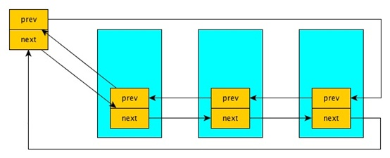
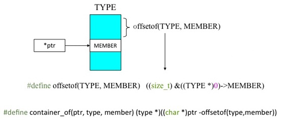

在Linux内核中，提供了一个用来创建双向循环链表的结构 list_head。虽然linux内核是用C语言写的，但是list_head的引入，使得内核数据结构也可以拥有面向对象的特性，通过使用操作list_head 的通用接口很容易实现代码的重用，有点类似于C++的继承机制（希望有机会写篇文章研究一下C语言的面向对象机制）。下面就是kernel中的list_head结构定义：

struct list_head {

　　struct list_head *next, *prev;

};

#define LIST_HEAD_INIT(name) { &(name), &(name) }

需要注意的一点是，头结点head是不使用的，这点需要注意。

使用list_head组织的链表的结构如下图所示：



list_head这个结构看起来怪怪的，它竟没有数据域！所以看到这个结构的人第一反应就是我们怎么访问数据？

其实list_head不是拿来单独用的，它一般被嵌到其它结构中，如：

struct file_node{

　　char c;

　　struct list_head node;

};


此时list_head就作为它的父结构中的一个成员了，当我们知道list_head的地址（指针）时，我们可以通过list.c提供的宏 list_entry 来获得它的父结构的地址。下面我们来看看list_entry的实现:

#define list_entry(ptr,type,member)\

　　container_of(ptr,type,member)

 

#define offsetof(TYPE,MEMBER) ((size_t)&((TYPE *)0)->MEMBER)

#define container_of(ptr,type,member) ( {\

　　const typeof( ((type*)0)->member ) *__mptr=(ptr);\

　　(type*)( (char*)__mptr - offsetof(type,member) );} )

 

这里涉及到三个宏，还是有点复杂的，我们一个一个来看：

#define offsetof(TYPE,MEMBER) ( (size_t)& ((TYPE *)0）-> MEMBER )

我们知道 0 地址内容是不能访问的，但 0地址的地址我们还是可以访问的， 这里用到一个取址运算符

(TYPE *)0 它表示将 0地址强制转换为TYPE类型，((TYPE *)0）-> MEMBER 也就是从0址址找到TYPE 的成员MEMBER 。

我们结合上面的结构来看

struct file_node{

　　char c;

　　struct list_head node;

};

将实参代入 offset( struct file_node, node )；最终将变成这样：

( (size_t) & ((struct file_node*)0）-> node )；这样看的还是不很清楚，我们再变变：

struct file_node *p = NULL;

& p->node;

这样应该比较清楚了，即求 p 的成员 node的地址，只不过p 为0地址，从0地址开始算成员node的地址，也就是 成员 node 在结构体 struct file_node中的偏移量。offset宏就是算MEMBER在TYPE中的偏移量的。

我们再看第二个宏

#define container_of(ptr,type,member) ( {\

　　const typeof( ((type*)0)->member ) *__mptr=(ptr);\

　　(type*)( (char*)__mptr - offsetof(type,member) );} )

这个宏是由两个语句组成，最后container_of返回的结果就是第二个表达式的值。这里__mptr为中间变量，这就是list_head指针类型，它被初始化为ptr的值，而ptr就是当前所求的结构体中list_head节点的地址。为什么要用中间变量，这是考虑到安全性因素，如果传进来一个ptr++，所有ptr++放在一个表达式中会有副作用，像 (p++)+(p++)之类。

(char*)__mptr 之所以要强制类型转化为char是因为地址是以字节为单位的，而char的长度就是一个字节。

container_of的值是两个地址相减，

刚说了__mptr是结构体中list_head节点的地址，offset宏求的是list_head节点MEMBER在结构体TYPE中的偏移量，那么__mptr减去它所在结构体中的偏移量，就是结构体的地址。

所以list_entry(ptr,type,member)宏的功能就是，由结构体成员地址求结构体地址。其中ptr 是所求结构体中list_head成员指针，type是所求结构体类型，member是结构体list_head成员名。通过下图来总结一下：




继续列举一些双链表的常用操作：

双向链表的遍历——list_for_each

//注：这里prefetch 是gcc的一个优化选项，也可以不要

#define list_for_each(pos, head) \

         for (pos = (head)->next; prefetch(pos->next), pos != (head); \

                 pos = pos->next)

 

生成双向链表的头结点——LIST_HEAD()

LIST_HEAD() -- 生成一个名为name的双向链表头节点

#define LIST_HEAD(name) \

struct list_head name = LIST_HEAD_INIT(name)

static inline void INIT_LIST_HEAD(struct list_head *list)

{

　　list->next = list;

　　list->prev = list;

}

双向链表的插入操作 -- list_add()

将new所代表的结构体插入head所管理的双向链表的头节点head之后: （即插入表头）

static inline void list_add(struct list_head *new, struct list_head *head)

{

　　__list_add(new, head, head->next);

}

static inline void __list_add( struct list_head *new, struct list_head *prev, struct list_head *next)

{

　　next->prev = new;

　　new->next = next;

　　new->prev = prev;

　　prev->next = new;

}

从list中删除结点——list_del()

static inline void list_del(struct list_head *entry)

{

　　__list_del(entry->prev, entry->next);

　　entry->next = LIST_POISON1;

　　entry->prev = LIST_POISON2;

}

static inline void __list_del(struct list_head * prev, struct list_head * next)

{

　　next->prev = prev;

　　prev->next = next;

}

 

判断链表是否为空（如果双向链表head为空则返回真，否则为假）——list_empty()

static inline int list_empty(const struct list_head *head)

{

　　return head->next == head;

}


##示例

```
/*
注：这个list.h 是为了配合示例程序而建的，内容来自：linux/include/linux/list.h 和相关文件
*/
#ifndef _LINUX_LIST_H
#define _LINUX_LIST_H
 
struct list_head {
         struct list_head *next, *prev;
};

#define LIST_HEAD_INIT(name) { &(name), &(name) }

#define offsetof(TYPE, MEMBER) ((size_t) &((TYPE *)0)->MEMBER)

#define container_of(ptr, type, member) ({                      \
        const typeof( ((type *)0)->member ) *__mptr = (ptr);    \
        (type *)( (char *)__mptr - offsetof(type,member) );})


static inline void INIT_LIST_HEAD(struct list_head *list)
{
        list->next = list;
        list->prev = list;
}

static inline void __list_add(struct list_head *new, struct list_head *prev,struct list_head *next)
{
        next->prev = new;
        new->next = next;
        new->prev = prev;
        prev->next = new;
}


static inline void list_add(struct list_head *new, struct list_head *head)
{
        __list_add(new, head, head->next);
}
 
 
static inline void __list_del(struct list_head * prev, struct list_head * next)
{
        next->prev = prev;
        prev->next = next;
}
 
static inline void list_del(struct list_head *entry)
{
        __list_del(entry->prev, entry->next);
        entry->next = NULL;
        entry->prev = NULL;
}


#define prefetch(x) __builtin_prefetch(x)


//注：这里prefetch 是gcc的一个优化，也可以不要
#define list_for_each(pos, head) \
         for (pos = (head)->next; prefetch(pos->next), pos != (head); \
                 pos = pos->next)

#define list_entry(ptr, type, member) \
         container_of(ptr, type, member)

#endif
```
在Linux内核中可以使用这个以类似驱动模块的形式加载到内核：（这里就不用使用自定义的list.h了）

```
#include <linux/list.h>
#include <linux/init.h>
#include <linux/module.h>

MODULE_LICENSE("GPL");

#define MAX_NAME_LEN 32
#define MAX_ID_LEN 10


typedef struct stud
{
    struct list_head list;
    char name[MAX_NAME_LEN];
    char stu_number[MAX_ID_LEN];
}num_n_stu;

static int my_main(void)
{

    struct list_head head;
    num_n_stu stu_1;
    num_n_stu stu_2;
    num_n_stu *entry;

    struct list_head *p;
    INIT_LIST_HEAD(&head);

    strcpy(stu_1.name,"lisi");
    strcpy(stu_1.stu_number,"10000000");

    strcpy(stu_2.name,"zhangsan");
    strcpy(stu_2.stu_number,"10000001");

    list_add(&stu_1.list,&head);
    list_add(&stu_2.list,&head);

    list_del(&stu_2.list);

    list_for_each(p,&head)
    {

        entry=list_entry(p,struct stud,list);

        printk("name: %s\n",entry->name);

        printk("stu_number: %s\n",entry->stu_number);

    }
    
    list_del(&stu_1.list);
    
    return 0;

}

static void my_exit(void)
{
    printk("my_exit ! \n");
}


module_init(my_main);
module_exit(my_exit);
```
