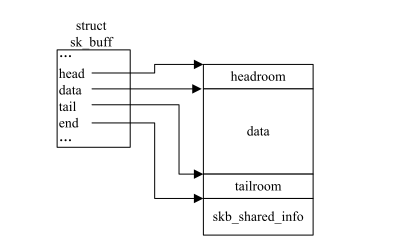
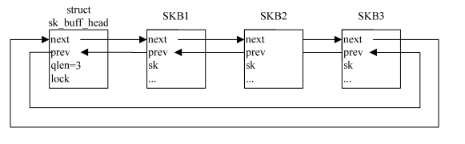
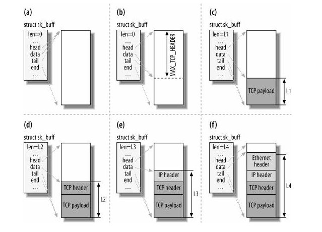
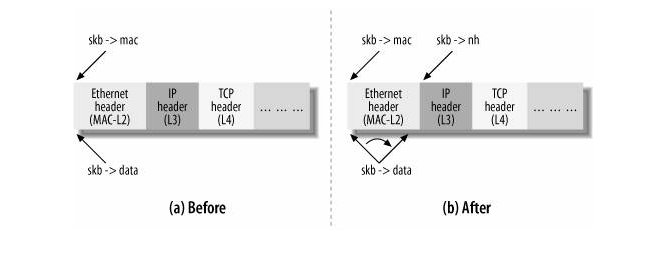
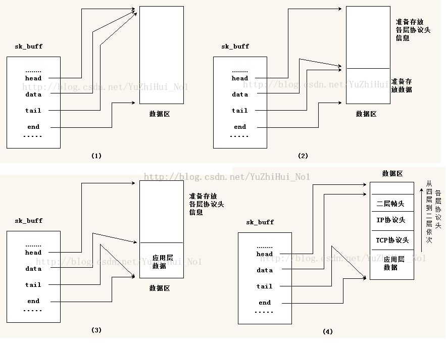
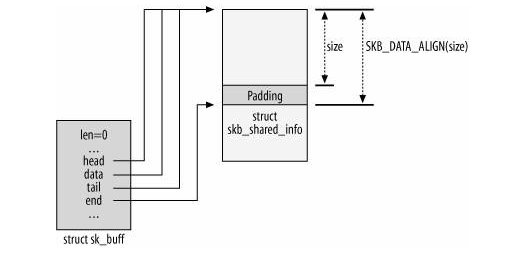
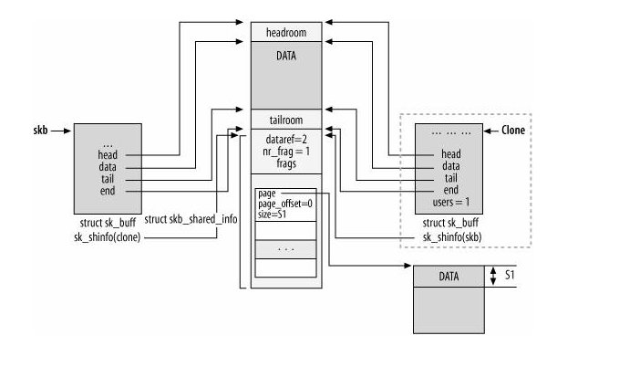
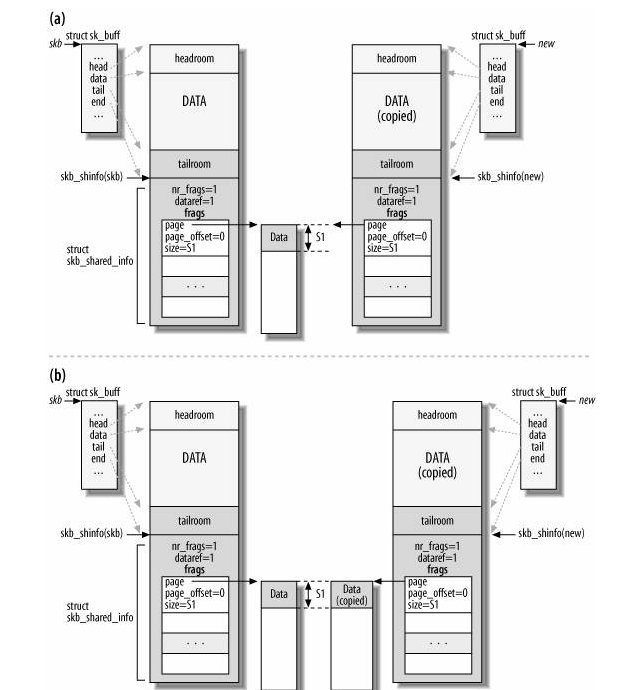
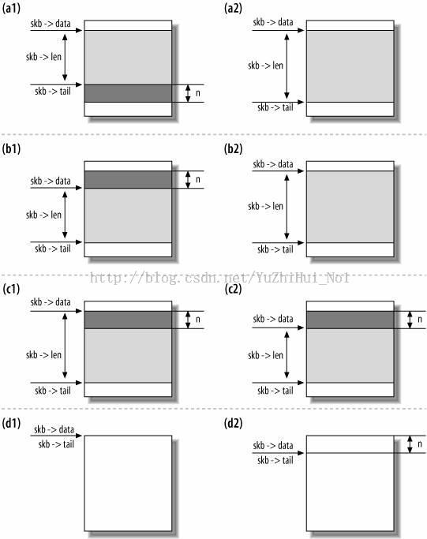

在内核中 sk_buff 表示一个网络数据包, 它是一个双向链表, 而链表头就是 sk_buff_head, 而 sk_buff 的
内存布局可以分作 3 个段, 

* sk_buff 自身
* linear-data buff
* paged-data buff(也就是skb_shared_info)

如下示意图:




##skb 结构体

```
    struct sk_buff {
        /* These two members must be first. */
        struct sk_buff *next;
        struct sk_buff *prev;
        //老版本(2.6以前)应该还有个字段： sk_buff_head *list 即每个sk_buff结构都有个指针指向头节点

        struct sock *sk; //表示从属于那个socket，主要是被4层用到。

        ktime_t tstamp; //表示这个skb被接收的时间。

        //这个表示一个网络设备, 当 skb 为输出时它表示 skb 将要输出的设备, 当接收时, 它表示输入设备.
        //要注意, 这个设备有可能会是虚拟设备(在3层以上看来)
        struct net_device *dev;

        //这里其实应该是 dst_entry 类型，不知道为什么内核要改为 ul. 这个域主要用于路由子系统. 这个数
        //据结构保存了一些路由相关信息
        unsigned long _skb_dst;

        #ifdef CONFIG_XFRM
        struct sec_path *sp;
        #endif

        char cb[48]; //这个域很重要, 我们下面会详细说明. 这里只需要知道这个域是保存每层的控制信息的就够了.

        //这个长度表示当前的 skb 中的数据的长度, 这个长度既包括 buf 中的数据又包括保存在 skb_shared_info 中的数据.
        //这个值是会随着从一层到另一层而改变的, 因为分片数据长度不变, 从L2到L4时, len 要减去帧头大小和网络头大小;
        //从 L4 到 L2 则相反, 要加上帧头和网络头大小.
        unsigned int len,

        data_len; //这个长度只表示 skb_shared_info 中的长度. 所以 len = (tail - data) + data_len;

        __u16 mac_len, //这个长度表示 mac 头的长度(2层的头的长度)

        hdr_len; //这个主要用于 clone 的时候, 它表示 clone 的 skb 的头的长度。


        //接下来是校验相关的域
        union {
        __wsum csum;
            struct {
            __u16 csum_start;
            __u16 csum_offset;
            };
        };
        //优先级, 主要用于QOS
        __u32 priority;
        kmemcheck_bitfield_begin(flags1);

        //接下来是一些标志位
        __u8 local_df:1, //首先是是否可以本地分片的标志

        //为 1 说明头可能被 clone, 或者自己是个克隆的结构体; 同理被克隆时, 自身 skb 和克隆 skb 的 cloned 都要置 1
        cloned:1,

        //这个表示校验相关的一个标记,表示硬件驱动是否为我们已经进行了校验
        ip_summed:2,

        //1. 这个域如果为 1, 则说明这个 skb 的头域指针已经分配完毕, 因此这个时候计算头的长度只需要 head 和 data 的差就可以了.
        //2. 标识 payload 是否被单独引用, 不存在协议首部.
        nohdr:1,

        nfctinfo:3;         //如果被引用, 则决不能再修改协议首部, 也不能通过 skb->data 来访问协议首部.
        __u8 pkt_type:3,    //主要是表示数据包的类型, 比如多播, 单播, 回环等等.
        fclone:2,           //这个域是一个 clone 标记. 主要是在 fast clone 中被设置.

        ipvs_property:1,    //ipvs拥有的域。

        peeked:1,           //这个域应该是 udp 使用的一个域. 表示只是查看数据.

        nf_trace:1;         //netfilter使用的域. 是一个 trace 标记

        __be16 protocol:16; //这个表示 L3 层的协议. 比如 IP, IPV6 等等.

        kmemcheck_bitfield_end(flags1);

        //skb的析构函数，一般都是设置为 sock_rfree 或者 sock_wfree.
        void (*destructor)(struct sk_buff *skb);

        ///netfilter相关的域。
    #if defined(CONFIG_NF_CONNTRACK) || defined(CONFIG_NF_CONNTRACK_MODULE)
        struct nf_conntrack *nfct;
        struct sk_buff *nfct_reasm;
    #endif

    #ifdef CONFIG_BRIDGE_NETFILTER
        struct nf_bridge_info *nf_bridge;
    #endif

        int iif;            //接收设备的index。

    //流量控制的相关域。
    #ifdef CONFIG_NET_SCHED
        __u16 tc_index; /* traffic control index */

    #ifdef CONFIG_NET_CLS_ACT

        __u16 tc_verd; /* traffic control verdict */
    #endif
    #endif

        kmemcheck_bitfield_begin(flags2);
        //多队列设备的映射, 也就是说映射到哪个队列.
        __u16 queue_mapping:16;
    #ifdef CONFIG_IPV6_NDISC_NODETYPE
        __u8 ndisc_nodetype:2;
    #endif
        kmemcheck_bitfield_end(flags2);

    /* 0/14 bit hole */

    #ifdef CONFIG_NET_DMA
        dma_cookie_t dma_cookie;
    #endif

    #ifdef CONFIG_NETWORK_SECMARK
        __u32 secmark;
    #endif

        __u32 mark;                         //skb的标记.

        __u16 vlan_tci;                     //vlan的控制tag.

        sk_buff_data_t transport_header;    //传输层的头
        sk_buff_data_t network_header;      //网络层的头
        sk_buff_data_t mac_header;          //链路层的头。

        /* These elements must be at the end, see alloc_skb() for details.  */
        sk_buff_data_t tail;                //指向数据区中实际数据结束的位置
        sk_buff_data_t end;                 //指向数据区中结束的位置(非实际数据区域结束位置)
        unsigned char *head,                //指向数据区中开始的位置(非实际数据区域开始位置)
        *data;                              //指向数据区中实际数据开始的位置

        unsigned int truesize;              //这个表示整个 skb 的大小,  truesize = end - head + sizeof(sk_buff)
        atomic_t users;                     //skb 的引用计数, skb 被克隆或引用的次数, 在内存申请和克隆时会用到
    };
```

NOTE:

>在老的内核里面 sk_buff 会有一个 list 域直接指向 sk_buff_head 也就是链表头, 现在在 2.6.33 里面这个域已经被删除了.

####char cb[48]

这个字段是 skb 信息控制块, 也就是存储每层的一些协议信息, 当数据包在哪一层时, 存储的就是哪一层协议信息.
这个字段由数据包所在层使用和维护, 如果要访问本层协议信息, 可以通过用一些宏来操作这个成员字段. 如:

    #define TCP_SKB_CB(__skb)  ((struct tcp_skb_cb *)&((__skb)->cb[0]))
    #define FRAG_CB(skb) ((struct ipfrag_skb_cb *)((skb)->cb))

####_u8 fclone:2

这是个克隆状态标志, 到 sk_buff 结构内存申请时会使用到. 这里提前讲下:

* 若 fclone = SKB_FCLONE_UNAVAILABLE, 则表明 skb 未被克隆;
* 若 fclone = SKB_FCLONE_ORIG, 则表明是从 skbuff_fclone_cache 缓存池(这个缓存池上分配内存时, 每次都分配一对 skb 内存)中分配的父 skb, 可以被克隆;
* 若 fclone = SKB_FCLONE_CLONE, 则表明是在 skbuff_fclone_cache 分配的子 skb, 从父 skb 克隆得到的;

####atomic_t users

这是个引用计数, 表明了有多少实体引用了这个 skb. 其作用就是在销毁 skb 结构体时, 先查看下 users 是否为零, 若不为零,
则调用函数递减下引用计数 users 即可; 当某一次销毁时, users 为零才真正释放内存空间. 有两个操作函数:

* atomic_inc(): 引用计数增加 1;
* atomic_dec(): 引用计数减去 1；


##skb_share_info

这个分片结构体和 sk_buff 结构的数据区是一体的, 所以在各种操作时都把他们两个结构看做是一个来操作. 比如:
为 sk_buff 结构的数据区申请和释放空间时, 分片结构也会跟着该数据区一起分配和释放. 而克隆时, sk_buff 的
数据区和分片结构都由分片结构中的 dataref 成员字段来标识是否被引用.

```
    struct skb_shared_info {
        atomic_t    dataref;        //用于数据区的引用计数, 克隆一个 skb 结构体时, 会增加一个引用计数
        unsigned short  nr_frags;   //表示有多少个分片结构
        unsigned short  gso_size;
    #ifdef CONFIG_HAS_DMA
        dma_addr_t  dma_head;
    #endif
        /* Warning: this field is not always filled in (UFO)! */
        unsigned short  gso_segs;
        unsigned short  gso_type;           // 分片的类型
        __be32          ip6_frag_id;
        union skb_shared_tx tx_flags;
        struct sk_buff  *frag_list;         // 这也是一种类型的分配数据
        struct skb_shared_hwtstamps hwtstamps;
        skb_frag_t  frags[MAX_SKB_FRAGS];   //这是个比较重要的数组
    #ifdef CONFIG_HAS_DMA
        dma_addr_t  dma_maps[MAX_SKB_FRAGS];
    #endif
        /* Intermediate layers must ensure that destructor_arg
         * remains valid until skb destructor */
        void *      destructor_arg;
    };
```

从上图也可以看出来分片结构和 sk_buff 的数据区连在一起, end 指针的下个字节就是分片结构的开始位置. 那访问分片结构时,
可以直接用 end 指针作为这个分片结构体的开始(记得要强转成分片结构体)或者用内核定义好的宏

    #define skb_shinfo(SKB) ((struct skb_shared_info *)((SKB)->end))

其中有个成员字段非常重要: skb_frag_t  frags[MAX_SKB_FRAGS]; 其实这就和分片结构的数据区有关. 下面来讲下这个数字中
的元素结构体:

```
    typedef struct skb_frag_struct skb_frag_t;
        struct skb_frag_struct {
                struct page *page;  //指向分片数据区的指针，类似于 sk_buff 中的 data 指针
                __u32 page_offset;  //偏移量, 表示从 page 指针指向的地方, 偏移 page_offset
                __u32 size;         //数据区的长度, 即: sk_buff 结构中的 data_len
            };
```


## skb_buff_head

每个 skb 必须能被整个链表头部快速找到. 为了满足这个需求, 在第一个 SKB 节点前面会插入另一个辅助的 sk_buff_head 结构的头结点,
可以认为该 sk_buff_head 结构就是 SKB 链表的头结点.

```
    struct sk_buff_head {
        /* These two members must be first. */
        struct sk_buff *next;
        struct sk_buff *prev;

        __u32 qlen;         //代表当前链表中 skb 个数
        spinlock_t lock;    //锁，防止并发访问
    };
```



## skb_buff 使用示例

在进行更为详细的介绍之前我们看看 skb 实际的使用场景

struct  sk_buff 的成员 head 指向一个已分配的空间的头部, 该空间用于承载网络数据, end 指向该空间的尾部,
这两个成员指针从空间创建之后, 就不能被修改. data 指向分配空间中数据的头部, tail 指向数据的尾部,这两个
值随着网络数据在各层之间的传递, 修改, 会被不断改动. 所以, 这四个指针指向共同的一块内存区域的不同位置,
该内存区域由 __alloc_skb 在创建缓冲区时创建. 注意: 这些都是 char * 类型的指针, 指向特定的内存块.

下面这张图表示了 buffer 从 TCP 层到链路层的过程中 len, head, data, tail 以及 end 的变化, 通过这个图我
们可以非常清晰的了解到这几个域的区别:



可以很清楚的看到 head 指针为分配的 buffer 的起始位置, end 为结束位置, 而 data 为当前数据的起始位置,
tail 为当前数据的结束位置. len 就是数据区的长度.

然后来看 transport_header, network_header 以及 mac_header 的变化, 这几个指针都是随着数据包到达不同的
层次才会有对应的值, 我们来看下面的图, 这个图表示了当从 2 层到达 3 层对应的指针的变化.



###skb 真实场景介绍

1. sk_buff 结构数据区刚被申请好, 此时 head 指针, data 指针, tail 指针都是指向同一个地方. 记住前面讲过的: head
指针和 end 指针指向的位置一直都不变, 而对于数据的变化和协议信息的添加都是通过 data 指针和 tail 指针的改变来表现的.

2. 开始准备存储应用层下发过来的数据, 通过调用函数 skb_reserve() 来使 data 指针和 tail 指针同时向下移动, 空出一部分
空间来为后期添加协议信息.

3. 开始存储数据了, 通过调用函数 skb_put() 来使 tail 指针向下移动空出空间来添加数据, 此时 skb->data 和 skb->tail 之
间存放的都是数据信息, 无协议信息.

4. 开始添加帧头, 这时就开始调用函数 skb_push() 来使 data 指针向上移动, 空出空间来添加各层协议信息. 直到最后到达二
层, 添加完帧头然后就开始发包了.



------------------------------------------------------------------------------

在内核中有许多很短简单的函数来操作 sk_buff 结构, 在 linux/skbuff.h 和 net/core/skbuff.c 源文件中,
几乎所有函数都有两个版本, 类似 do_something 和 __do_something. 通常来讲, 第一种是封装函数, 增加了
一些额外的参数合理性检查或在调用第二种函数前加入上锁机制.

## skb_init

```
	void __init skb_init(void)
	{
        skbuff_head_cache = kmem_cache_create("skbuff_head_cache",
                sizeof(struct sk_buff),
                0,
                SLAB_HWCACHE_ALIGN|SLAB_PANIC,
                NULL);
        skbuff_fclone_cache = kmem_cache_create("skbuff_fclone_cache",
                (2 * sizeof(struct sk_buff)) + sizeof(atomic_t),
                0,
                SLAB_HWCACHE_ALIGN|SLAB_PANIC,
                NULL);
	}
```


skb_init() 函数中创建了 skbuff_head_cache 高速缓存, 一般情况下, skb 都是从该高速缓存中分配的.
skbuff_fclone_cahe 高速缓存的创建是为了方便 skb 的克隆, 如果一个 skb 在分配的时候就知道可能被克隆,
那么应该从这个高速缓存中分配, 因为这个高速缓存中分配 skb 时, 会同时分配一个后备的skb, 在克隆的时候
直接使用后备的 skb 即可, 不用再次分配 skb, 很明显这样能提高效率.

## alloc_skb

alloc_skb() 用来分配 skb. 数据缓存区和 skb 描述符是两个不同的实体, 这就意味着, 在分配一个 skb 时,
需要分配两块内存, 一块是数据缓存区, 一块是 skb 描述符. __alloc_skb() 调用 kmem_cache_alloc_node()
从高速缓存中获取一个 sk_buff 结构的空间, 然后调用 kmalloc_node_track_caller() 分配数据缓存区.

参数说明如下:


```
    /*
     * size        : 待分配 SKB 的线性存储区的长度;
     * gfp_mask    : 分配内存的方式, 一般为 GFP_KERNEL
     * fclone      : 预测是否会克隆, 用于确定从哪个高速缓存中分配;
     * node        : 当支持 NUMA(非均匀质存储结构)时, 用于确定何种区域中分配 skb.
     */

	struct sk_buff *__alloc_skb(unsigned int size, gfp_t gfp_mask,
	   int fclone, int node)
	{
        struct kmem_cache *cache;
        struct skb_shared_info *shinfo;
        struct sk_buff *skb;
        u8 *data;

	    //这里通过fclone的值来判断是要从 fclone cache 还是说从 head cache 中取.
	    cache = fclone ? skbuff_fclone_cache : skbuff_head_cache;

        //从指定段中为skb分配内存, 分配的方式是去除在DMA内存中分配, 因为DMA内存比较小, 且有特定的作用, 一般不用来分配 skb.
	    skb = kmem_cache_alloc_node(cache, gfp_mask & ~__GFP_DMA, node);
	    if (!skb)
	        goto out;

	    //首先将 size 对齐, 这里是按一级缓存的大小来对齐. 长度为 len(end - head)
	    size = SKB_DATA_ALIGN(size);

	    //然后是数据区的大小, 大小为 size + sizeof(struct skb_shared_info), 这里允许有些数据可以用DMA内存来分配
	    data = kmalloc_node_track_caller(
                        size + sizeof(struct skb_shared_info),
	                    gfp_mask, node);
	    if (!data)
	        goto nodata;

	    //初始化 tail 之前(包含 tail) 为 0
        /*
         * Only clear those fields we need to clear, not those that
         * we will actually initialise below. Hence, don't put any more
         * fields after the tail pointer in struct sk_buff!
         */
	    memset(skb, 0, offsetof(struct sk_buff, tail));

	    //这里 truesize 可以看到就是我们分配的整个 skb + data 的大小
	    skb->truesize = size + sizeof(struct sk_buff);

	    atomic_set(&skb->users, 1);     //users加一.

	    //一开始 head 和 data 是一样大的.
	    skb->head = data;
	    skb->data = data;
	    skb_reset_tail_pointer(skb);    //设置tail指针

	    //一开始tail也就是和data是相同的。
	    skb->end = skb->tail + size;
	    kmemcheck_annotate_bitfield(skb, flags1);
	    kmemcheck_annotate_bitfield(skb, flags2);
	#ifdef NET_SKBUFF_DATA_USES_OFFSET
	    skb->mac_header = ~0U;
	#endif

	    //初始化 shinfo, 这个我就不介绍了
        shinfo = skb_shinfo(skb);
        atomic_set(&shinfo->dataref, 1);
        shinfo->nr_frags        = 0;
        shinfo->gso_size        = 0;
        shinfo->gso_segs        = 0;
        shinfo->gso_type        = 0;
        shinfo->ip6_frag_id     = 0;
        shinfo->tx_flags.flags  = 0;
        skb_frag_list_init(skb);
        memset(&shinfo->hwtstamps, 0, sizeof(shinfo->hwtstamps));

	    /* fclone为1,说明多分配了一块内存, 因此需要设置对应的 fclone 域.
         * 虽然是分配了两个sk_buff结构内存, 但是数据区却是只有一个的, 所以是两个 sk_buff
         * 结构中的指针都是指向这一个数据区的. 也正因为如此, 所以分配 sk_buff 结构时也顺
         * 便分配了个引用计数器
         */
	    if (fclone) {
            struct sk_buff *child = skb + 1;  //可以看到多分配的内存刚好在当前的 skb 的下方.
            atomic_t *fclone_ref = (atomic_t *) (child + 1);

	        kmemcheck_annotate_bitfield(child, flags1);
	        kmemcheck_annotate_bitfield(child, flags2);

	        //设置标记. 这里要注意, 当前的 skb 和多分配的 skb 设置的 fclone 是不同的.
	        skb->fclone = SKB_FCLONE_ORIG;
	        atomic_set(fclone_ref, 1);
	        child->fclone = SKB_FCLONE_UNAVAILABLE;
	    }
    out:
        return skb;
        nodata:
        kmem_cache_free(cache, skb);
        skb = NULL;
        goto out;
	}
```

####fclone 标志

* 若 fclone = SKB_FCLONE_UNAVAILABLE, 则表明 skb 未被克隆;
* 若 fclone = SKB_FCLONE_ORIG, 则表明是从 skbuff_fclone_cache 缓存池(这个缓存池上分配内存时, 每次都分配一对 skb 内存)中分配的父 skb, 可以被克隆;
* 若 fclone = SKB_FCLONE_CLONE, 则表明是在 skbuff_fclone_cache 分配的子 skb, 从父 skb 克隆得到的;

需要说明的是,  __alloc_skb() 一般不被直接调用, 而是被封装函数调用, 如 __netdev_alloc_skb(), alloc_skb(), alloc_skb_fclone() 等函数.

```
    //来源 linux-2.6.32.63/include/linux/sk_buff.h

    //用来分配单纯的 sk_buff 结构
    static inline struct sk_buff *alloc_skb(unsigned int size,
                                    gfp_t priority)
    {
        return __alloc_skb(size, priority, 0, -1);
    }

    //用来分配克隆 sk_buff 结构
    static inline struct sk_buff *alloc_skb_fclone(unsigned int size,
                                           gfp_t priority)
    {
                return __alloc_skb(size, priority, 1, -1);
    }


    /*
     * 它是用 GFP_ATOMIC 的内存分配方式来申请的(一般我们用GFP_KERNEL), 这是个原子操作,
     * 表示申请时不能被中断. 其实还有个申请函数: netdev_alloc_skb()
     */
    struct sk_buff *dev_alloc_skb(unsigned int length)
    {
        /*
         * There is more code here than it seems: 
         * __dev_alloc_skb is an inline 
         */
        return __dev_alloc_skb(length, GFP_ATOMIC);
    }

    static inline struct sk_buff *__dev_alloc_skb(unsigned int length,
                                          gfp_t gfp_mask)
    {
        struct sk_buff *skb = alloc_skb(length + NET_SKB_PAD, gfp_mask);
        if (likely(skb))
            skb_reserve(skb, NET_SKB_PAD);
            return skb;
        }
    }
```

调用alloc_skb()之后的套接口缓存结构:



NOTE:

    这里的 size = end - head, 而
    skb->data_len 为 tail-data
    skb->len = data_len + sizeof(skb_shared_info)
    skb->truesize = size + sizeof(skb_buff)

-----------------------------------------------------

##skb_clone


```
    /**
     *    skb_clone    -    duplicate an sk_buff
     *    @skb: buffer to clone
     *    @gfp_mask: allocation priority
     *
     *    Duplicate an &sk_buff. The new one is not owned by a socket. Both
     *    copies share the same packet data but not structure. The new
     *    buffer has a reference count of 1. If the allocation fails the
     *    function returns %NULL otherwise the new buffer is returned.
     *
     *    If this function is called from an interrupt gfp_mask() must be
     *    %GFP_ATOMIC.
     */

	struct sk_buff *skb_clone(struct sk_buff *skb, gfp_t gfp_mask)
	{
        struct sk_buff *n;

        // n 为 skb 紧跟着那块内存, 这里如果 skb 是通过 skb_fclone 分配的, 那么 n 就是一个 skb.
        n = skb + 1;

        /* 判断原始 skb 是否是从 skbuff_fclone_cache 缓冲区中分配的, 从 skbuff_fclone_cache 分配将预先为
         * clone 的 skb 分配好内存, 同时判定该预先分配的 clone skb 是否被使用, 可以看到这里的值就是我们
         * 在 __alloc_skb 中设置的值.
         */
        if (skb->fclone == SKB_FCLONE_ORIG && n->fclone == SKB_FCLONE_UNAVAILABLE) {
            /*
             * 现在的 skb 实际上是一组 skb, 即 fclone 标志为 1.
             * 那么 n 是可用的, 不需要再次申请了, 只需要增加引用计数.
             */
            atomic_t *fclone_ref = (atomic_t *) (n + 1);
            n->fclone = SKB_FCLONE_CLONE;
            atomic_inc(fclone_ref);
        } else {

            /* 主skb并未同时分配 clone skb 的情况, 将重新独立分配 skb 结构作为 clone 的 skb */
            n = kmem_cache_alloc(skbuff_head_cache, gfp_mask);
            if (!n)
                return NULL;

            kmemcheck_annotate_bitfield(n, flags1);
            kmemcheck_annotate_bitfield(n, flags2);
            //设置新的 skb 的 fclone 域. 这里我们新建的 skb, 没有被 fclone 的都是这个标记.
            n->fclone = SKB_FCLONE_UNAVAILABLE;
        }

        /* 拷贝skb中的信息，各种指针等等，并增加数据段的引用计数 */
        return __skb_clone(n, skb);
	}

    /*
     * You should not add any new code to this function. Add it to
     * __copy_skb_header above instead.
     */
    static struct sk_buff *__skb_clone(struct sk_buff *n, struct sk_buff *skb)
    {
    #define C(x) n->x = skb->x

        //让前驱后继指针都为 NULL, 因为这是个单独的 sk_buff 结构体, 没有在 sk_buff 链表上.
        n->next = n->prev = NULL;
        n->sk = NULL;
        /* copy 头部字段，详细请参考源代码，很简单 */
        __copy_skb_header(n, skb);

        C(len);
        C(data_len);
        C(mac_len);
        n->hdr_len = skb->nohdr ? skb_headroom(skb) : skb->hdr_len;
        n->cloned = 1;
        n->nohdr = 0;
        n->destructor = NULL;
        C(tail);
        C(end);
        C(head);
        C(data);
        C(truesize);
        /* 设置 skb 描述符的 users 为 1 */
        atomic_set(&n->users, 1);

        /* 增加 shinfo 中 dataref 的引用计数, 因为 clone 的 skb 与原始 skb 指向同一数据缓冲区 */
        atomic_inc(&(skb_shinfo(skb)->dataref));
        skb->cloned = 1; /* 指明原始skb是被 clone 过的 */

        return n;
    #undef C
    }
```

下图就是 skb_clone 之后的两个skb的结构图:



NOTE:
> 理解 users, cloned, dataref 之间的关系
* users : skb 被引用或克隆的次数
* dataref : 数据区被克隆的次数
* cloned  : skb 是否被克隆或从克隆自其他 skb

由 skb_clone() 函数克隆一个 skb, 然后共享其他数据. 虽然可以提高效率, 但是存在一个很大的缺陷, 就是
当有克隆 skb 指向共享数据区是, 那么共享数据区的数据就不能被修改了. 所以说如果只是让多个 skb 查看
共享数据区内容, 则可以用 skb_clone() 函数来克隆这几个 skb 出来, 提高效率. 但如果涉及到某个 skb 要
修改 sk_buff 结构的数据区, 则必须要用 copy 语义来解决.

## skb_copy

当一个 skb 被 clone 之后, 这个 skb 的数据区是不能被修改的, 这就意为着, 我们存取数据不需要任何锁.
可是有时我们需要修改数据区, 这个时候会有两个选择:

* 一个是我们只修改 linear 段, 也就是 head 和 end 之间的段
* 一种是我们还要修改切片数据, 也就是 skb_shared_info.

这样就有两个函数供我们选择, 第一个是 pskb_copy, 第二个是 skb_copy.

###pskb_copy

我们先来看 pskb_copy, 函数先 alloc 一个新的 skb, 然后调用
skb_copy_from_linear_data 来复制 skb_shared_info 的数据.

不仅拷贝 sk_buff 结构体, 还拷贝 sk_buff 结构体指针 data 所指向的数据区(当然这个数据区包括了分片
结构体, 因为内存分配时, 这两个结构体都是一起分配的, 现在如果要重新为数据区分配内存的话, 那自然
也是一起分配了), 但是分片结构体中所指的数据区是共享的.

```
    /**
      * pskb_copy - create copy of an sk_buff with private head.
      * Make a copy of both an &sk_buff and part of its data, located
      * in header. Fragmented data remain shared. This is used when
      * the caller wishes to modify only header of &sk_buff and needs
      * private copy of the header to alter. Returns %NULL on failure
      * or the pointer to the buffer on success.
      * The returned buffer has a reference count of 1.
      */
    struct sk_buff *pskb_copy(struct sk_buff *skb, gfp_t gfp_mask)
    {
        /*
        *     Allocate the copy buffer
        */
        struct sk_buff *n;
    #ifdef NET_SKBUFF_DATA_USES_OFFSET
        n = alloc_skb(skb->end, gfp_mask);
    #else
        n = alloc_skb(skb->end - skb->head, gfp_mask);
    #endif
        if (!n)
            goto out;

        /* n->head 定位到 skb->head */
        skb_reserve(n, skb->data - skb->head);
        /* Set the tail pointer and length */
        // n->tail 定位到 skb->tail, 并重置 n->len = skb->len
        skb_put(n, skb_headlen(skb));

        //复制线性数据段: n->len = skb->len = skb->data_len + skb->tail - skb->head
        skb_copy_from_linear_data(skb, n->data, n->len);

        //更新相关域
        n->truesize += skb->data_len;
        n->data_len  = skb->data_len;
        n->len          = skb->len;

        //下面只是复制切片数据的指针
        if (skb_shinfo(skb)->nr_frags) {
            int i;

            //skb_shinfo(skb)宏其实就是skb->end
            for (i = 0; i < skb_shinfo(skb)->nr_frags; i++) {
                skb_shinfo(n)->frags[i] = skb_shinfo(skb)->frags[i];
                get_page(skb_shinfo(n)->frags[i].page);
            }
            skb_shinfo(n)->nr_frags = i;
        }

        if (skb_has_frags(skb)) {
                skb_shinfo(n)->frag_list = skb_shinfo(skb)->frag_list;
                skb_clone_fraglist(n);
        }

        copy_skb_header(n, skb);
    out:
        return n;
    }
```

###skb copy

复制skb的所有数据段, 包括分片数据:


```
    struct sk_buff *skb_copy(const struct sk_buff *skb, gfp_t gfp_mask)
    {
        /*
        用 skb 的 data 减去 head 就是这层协议头部的大小, 也许是 L2,L3,和L4.
        */
        int headerlen = skb->data - skb->head;
        /*
        * Allocate the copy buffer
        */

        //先alloc一个新的skb
        struct sk_buff *n;
    #ifdef NET_SKBUFF_DATA_USES_OFFSET
        n = alloc_skb(skb->end + skb->data_len, gfp_mask);
    #else
        n = alloc_skb(skb->end - skb->head + skb->data_len, gfp_mask);
    #endif
        if (!n)
            return NULL;

        /* Set the data pointer */
        skb_reserve(n, headerlen);
        /* Set the tail pointer and length */
        skb_put(n, skb->len);
        ///然后复制所有的数据。
        if (skb_copy_bits(skb, -headerlen, n->head, headerlen + skb->len))
            BUG();

        copy_skb_header(n, skb);
        return n;
    }
```

下面这张图就表示了 psb_copy 和 skb_copy 调用后的内存模型, 其中 a 是 pskb_copy, b 是 skb_copy:



##skb_free

这里主要是判断一个引用标记位 users, 将它减一, 如果大于 0 则直接返回, 否则释放 skb.

```
    void kfree_skb(struct sk_buff *skb)
    {
        if (unlikely(!skb))
            return;
        if (likely(atomic_read(&skb->users) == 1))
            smp_rmb();
        //减一，然后判断。
        else if (likely(!atomic_dec_and_test(&skb->users)))
            return;
        trace_kfree_skb(skb, __builtin_return_address(0));
        __kfree_skb(skb);
    }

    void __kfree_skb(struct sk_buff *skb)
    {
        skb_release_all(skb);
        kfree_skbmem(skb);
    }

    static void skb_release_all(struct sk_buff *skb)
    {
        skb_release_head_state(skb);
        skb_release_data(skb);
    }
```

##辅助函数



###skb_reserve()

此函数在数据缓存区头部预留一定的空间, 通常被用来在数据缓存区中插入协议首部或者在某个边界上对齐.
它并没有把数据移出或移入数据缓存区, 而只是简单地更新了数据缓存区的两个指针--分别指向负载起始和
结尾的 data 和 tail 指针.

请注意: skb_reserve() 只能用于空的 skb, 通常会在分配 skb 之后就调用该函数, 此时 data 和 tail
指针还一同指向数据区的起始位置. 例如, 某个以太网设备驱动的接收函数, 在分配 skb 之后, 向数据缓存
区填充数据之前, 会有这样的一条语句 skb_reserve(skb, 2), 这是因为以太网头部为 14 字节长, 再加上
2 字节就正好 16 字节边界对齐, 所以大多数以太网设备都会在数据包之前保留 2 个字节.

当 skb 在协议栈中向下传递时, 每一层协议都把 skb->data 指针向上移动, 然后复制本层首部, 同时更新
skb->len.

###skb_push()

此函数在数据缓存区的头部加入一块数据. 修改指向数据区起始的指针 data, 使之往上移 len 字节, 使
数据区向上扩大 len 字节, 并更新数据区长度 len. 常用于向外发送数据是从协议栈由上到下填充协议头

###skb_put()

此函数修改指向数据区末尾的指针 tail, 使之往下移 len 字节, 即使数据区向下扩大 len 字节, 并更新
数据区长度len. 常用于接受外部数据时, 构造包时填充协议头, 与 skb_push 正好相反.

###skb_pull()

此函数通过将 data 指针往下移动来在数据区首部忽略 len 字节长度的数据, 通常用于接收到的数据包后
在各层间由下往上传递时, 上层忽略下层的首部.

## skb queue


###初始化函数

```
    static inline void skb_queue_head_init(struct sk_buff_head *list)
    {
        spin_lock_init(&list->lock); // 获得头结点中的自旋锁
        __skb_queue_head_init(list); // 调用函数初始化头结点
    }
    static inline void __skb_queue_head_init(struct sk_buff_head *list)
    {
        list->prev = list->next = (struct sk_buff *)list;   // 创建一个链表
        list->qlen = 0;                                     // 链表节点个数为零
    }
```

###插入函数

```
    void skb_queue_head(struct sk_buff_head *list, struct sk_buff *newsk)
    {
        unsigned long flags;

        spin_lock_irqsave(&list->lock, flags);
        __skb_queue_head(list, newsk);
        spin_unlock_irqrestore(&list->lock, flags);
    }

    static inline void __skb_queue_head(struct sk_buff_head *list,
                        struct sk_buff *newsk)
    {
        __skb_queue_after(list, (struct sk_buff *)list, newsk);
        // 第一个 list 本来表示的是一个链表指针, 第二个 list 是由第一个队列指针 list 强转为链表头部结点
    }

    static inline void __skb_queue_after(struct sk_buff_head *list,
                         struct sk_buff *prev,
                         struct sk_buff *newsk)
    {
        __skb_insert(newsk, prev, prev->next, list); // 这里的prev实则是链表头部结点
    }


    void skb_queue_tail(struct sk_buff_head *list, struct sk_buff *newsk)
    {
        unsigned long flags;

        spin_lock_irqsave(&list->lock, flags);
        __skb_queue_tail(list, newsk);
        spin_unlock_irqrestore(&list->lock, flags);
    }

    static inline void __skb_queue_tail(struct sk_buff_head *list,
                       struct sk_buff *newsk)
    {
        __skb_queue_before(list, (struct sk_buff *)list, newsk); // 调用函数实现参数的变化
    }

    static inline void __skb_queue_before(struct sk_buff_head *list,
                          struct sk_buff *next,
                          struct sk_buff *newsk)
    {
        __skb_insert(newsk, next->prev, next, list);    // 调用函数实现真正的插入操作
    }

    static inline void __skb_insert(struct sk_buff *newsk,
                    struct sk_buff *prev, struct sk_buff *next,
                    struct sk_buff_head *list)
    {
        newsk->next = next;
        newsk->prev = prev;
        next->prev  = prev->next = newsk;
        list->qlen++;
    }
```

###出队列函数

```
    struct sk_buff *skb_dequeue(struct sk_buff_head *list)
    {
        unsigned long flags;
        struct sk_buff *result;

        spin_lock_irqsave(&list->lock, flags);
        result = __skb_dequeue(list);
        spin_unlock_irqrestore(&list->lock, flags);
        return result;
    }

    static inline struct sk_buff *__skb_dequeue(struct sk_buff_head *list)
    {
        struct sk_buff *skb = skb_peek(list);
        if (skb)
            __skb_unlink(skb, list);
        return skb;
    }

    static inline struct sk_buff *skb_peek(struct sk_buff_head *list_)
    {
        struct sk_buff *list = ((struct sk_buff *)list_)->next;
        if (list == (struct sk_buff *)list_)
            list = NULL;
        return list;
    }

    struct sk_buff *skb_dequeue_tail(struct sk_buff_head *list)
    {
        unsigned long flags;
        struct sk_buff *result;

        spin_lock_irqsave(&list->lock, flags);
        result = __skb_dequeue_tail(list);
        spin_unlock_irqrestore(&list->lock, flags);
    }

    static inline struct sk_buff *__skb_dequeue_tail(struct sk_buff_head *list)
    {
        struct sk_buff *skb = skb_peek_tail(list);
        if (skb)
            __skb_unlink(skb, list);
        return skb;
    }

    static inline struct sk_buff *skb_peek_tail(struct sk_buff_head *list_)
    {
        struct sk_buff *list = ((struct sk_buff *)list_)->prev;
        if (list == (struct sk_buff *)list_)
            list = NULL;
        return list;
    }

    static inline void __skb_unlink(struct sk_buff *skb, struct sk_buff_head *list)
    {
        struct sk_buff *next, *prev;

        list->qlen--; // 队列元素计数器自减1
        next       = skb->next; // 下面的实现分析看图
        prev       = skb->prev;
        skb->next  = skb->prev = NULL;
        next->prev = prev;
        prev->next = next;
    }
```


###清空队列函数

```
    void skb_queue_purge(struct sk_buff_head *list)
    {
        struct sk_buff *skb;
        while ((skb = skb_dequeue(list)) != NULL)
            kfree_skb(skb);
    }
```

###遍历队列操作

	    #define skb_queue_walk(queue, skb) \
            for (skb = (queue)->next;                    \
                 prefetch(skb->next), (skb != (struct sk_buff *)(queue));    \
                 skb = skb->next)
    // 上面的遍历是从 queue 头结点开始遍历，直到遍历循环回到queue结束.
    // 也就是遍历整个队列操作, 但该宏不能做删除skb操作,一旦删除了skb后, skb->next 就是非法的(因为此时skb不存在).

    #define skb_queue_walk_safe(queue, skb, tmp)                    \
            for (skb = (queue)->next, tmp = skb->next;            \
                 skb != (struct sk_buff *)(queue);              \
                 skb = tmp, tmp = skb->next)

    // 这个宏也是从queue头结点开始遍历整个队列操作，唯一不同的是这个宏用了一个临时变量，就是防止遍历时要删除掉skb变量,
    // 因为删除掉了skb后，也可以从skb=tmp中再次获得，然后依次tmp = skb->next;(此时skb是存在的)所以遍历时，可以做删除操作.

    #define skb_queue_walk_from(queue, skb)                     \
            for (; prefetch(skb->next), (skb != (struct sk_buff *)(queue));  \
                 skb = skb->next)
    // 这个宏是从skb元素处开始遍历直到遇到头结点queue结束，该宏只能做查看操作，不能做删除skb操作，分析如第一个宏

    #define skb_queue_walk_from_safe(queue, skb, tmp)               \
            for (tmp = skb->next;                        \
                 skb != (struct sk_buff *)(queue);              \
                 skb = tmp, tmp = skb->next)
    // 这个宏也是从skb元素开始遍历直到遇到queue元素结束，但该宏可以做删除skb元素操作，具体分析如第一个宏

    #define skb_queue_reverse_walk(queue, skb) \
            for (skb = (queue)->prev;                    \
                 prefetch(skb->prev), (skb != (struct sk_buff *)(queue));    \
                 skb = skb->prev)
    // 这是个逆反遍历宏，就是从queue头结点的尾部开始（或者说从前驱元素开始）直到遇到 queue 元素节点.
    // 也即是从头结点尾部开始遍历了整个队列，此宏和第一、第三个宏一样，不能做删除操作.

###插入数据函数

    // skb为被添加的sk_buff类型的结构体，from为将要添加的数据源，copy为数据源的长度
    static inline int skb_add_data(struct sk_buff *skb,
                       char __user *from, int copy)
    {
        const int off = skb->len;

        if (skb->ip_summed == CHECKSUM_NONE) {// 表示检验ip包的校验
            int err = 0;
            // 数据拷贝操作，这里调用了skb_put()函数让tail往下移空出控件来存放将要拷贝的数据，并且返回tail指针
            __wsum csum = csum_and_copy_from_user(from, skb_put(skb, copy),
                                    copy, 0, &err);
            if (!err) {
                skb->csum = csum_block_add(skb->csum, csum, off); // 这个应该是IP校验计算吧
                return 0;
            }
        } else if (!copy_from_user(skb_put(skb, copy), from, copy)) // 这是最本质的数据拷贝操作宏，同样调用了skb_put()函数返回tail指针
            return 0;

        __skb_trim(skb, off); // 这个是删除数据操作，将在下一个数据删除（skb_trim()函数）分析
        return -EFAULT; 
    }

    static inline
    __wsum csum_and_copy_from_user (const void __user *src, void *dst,
                          int len, __wsum sum, int *err_ptr)
    {
        if (access_ok(VERIFY_READ, src, len)) // 判断数据长度关系
            return csum_partial_copy_from_user(src, dst, len, sum, err_ptr); // 调用拷贝函数
        if (len)
            *err_ptr = -EFAULT;
        return sum;
    }

    static __inline__
    __wsum csum_partial_copy_from_user(const void __user *src,
                                             void *dst, int len, __wsum sum,
                                             int *err_ptr)
    {
            if (copy_from_user(dst, src, len)) { // 拷贝操作
                    *err_ptr = -EFAULT;
                    return (__force __wsum)-1;
            }
            return csum_partial(dst, len, sum); // 设置校验和
    }

    // 这是调用memcpy()函数来对数据进行拷贝，to是tail指针，from是将要插入的数据源指针，n是数据源长度
    #define copy_from_user(to, from, n) (memcpy((to), (from), (n)), 0)

删除数据函数

    void skb_trim(struct sk_buff *skb, unsigned int len)  
    {
        // 这里值得注意的是len不是要删除的数据长度，而是删除后的数据长度，即是新的数据长度。
        // 所以新的数据长度不能比开始的skb的长度还大，否则就是插入增加数据函数而不是删除数据函数了
        if (skb->len > len)
            __skb_trim(skb, len);// 调用函数进行删除数据操作
    }

    static inline void __skb_trim(struct sk_buff *skb, unsigned int len)
    {
        if (unlikely(skb->data_len)) {
            WARN_ON(1);
            return;
        }
        skb->len = len; // 为新的skb赋上删除后的len值
        skb_set_tail_pointer(skb, len); // 调用函数删除操作
    }

    static inline void skb_set_tail_pointer(struct sk_buff *skb, const int offset)
    {
        skb->tail = skb->data + offset; // 实质上没有对数据进行删除，只是让tail指针偏移，改变有效数据值
    }


    static inline int pskb_trim(struct sk_buff *skb, unsigned int len)
    {
        return (len < skb->len) ? __pskb_trim(skb, len) : 0; // 这个功能和上面类似，如果新len值小于skb原有的值，则做删除操作
    }
    static inline int __pskb_trim(struct sk_buff *skb, unsigned int len)
    {
        if (skb->data_len)// 如果分片结构数据区有数据
            return ___pskb_trim(skb, len);// 则调用该函数来删除分片结构中的数据区数据
        __skb_trim(skb, len);// 这个和上面删除sk_buff结构中的数据区数据一样
        return 0;
    }

###拆分数据函数

    // skb为原来的skb结构体（将要被拆分的），skb1为拆分后得到的子skb，len为拆分后的skb的新长度
    void skb_split(struct sk_buff *skb, struct sk_buff *skb1, const u32 len)
    {
        int pos = skb_headlen(skb);// pos = skb->len - skb->data_len，pos是skb结构中数据区的有效数据长度

        if (len < pos)   // 如果拆分长度小于skb数据区中的有效长度，则调用下面函数
            skb_split_inside_header(skb, skb1, len, pos);// 该函数只拆分skb数据区中的数据
        else  // 反之，如果拆分长度不小于skb数据区中的有效长度，则调用下面函数
            skb_split_no_header(skb, skb1, len, pos);// 拆分skb结构中的分片结构中数据区数据
    }

    // 这是只拆分sk_buff结构数据区的数据，其他参数不变，参数：pos则是sk_buff结构数据区中有效数据长度
    static inline void skb_split_inside_header(struct sk_buff *skb,
                           struct sk_buff* skb1,
                           const u32 len, const int pos)
    {
        int i;
        // 这是个把sk_buff结构中有效数据拷贝到新的skb1中,pos为有效数据长度，len为剩下数据长度，得：pos-len为要拷贝的数据长度
        // skb_put(skb1,pos-len)是移动tail指针让skb1结构数据区空出空间来存放将要拷贝的数据，该函数返回tail指针
        skb_copy_from_linear_data_offset(skb, len, skb_put(skb1, pos - len),
                         pos - len);
                // 为了方便理解，把该函数实现代码注释进来
                // skb为要被拆分的sk_buff结构，offset为剩下新的skb数据长度，to为skb1结构中tail指针，len为要拷贝的数据长度
                // static inline void skb_copy_from_linear_data_offset(const struct sk_buff *skb,
            //                  const int offset, void *to,
            //                  const unsigned int len)
            // {
            // 从skb要剩下的数据位置开始（即是skb->data+offset，skb->data和skb->data+offset之间的数据是要保留的）
            // to则是tail指针移动前返回的一个位置指针（详细请看skb_put()函数实现），拷贝len长度内容
            //  <span style="white-space:pre">    </span>memcpy(to, skb->data + offset, len);
            //<span style="white-space:pre">  </span>}
            // 如果对sk_buff结构及相关结构体中成员变量了解，则这些代码就非常好理解了。
            // nr_frags为多少个分片数据区，循环把所有分片数据拷贝到skb1中
        for (i = 0; i < skb_shinfo(skb)->nr_frags; i++)
            skb_shinfo(skb1)->frags[i] = skb_shinfo(skb)->frags[i];

        //下面做的都是些成员字段拷贝赋值操作，并且设置skb的字段
        skb_shinfo(skb1)->nr_frags = skb_shinfo(skb)->nr_frags;
        skb_shinfo(skb)->nr_frags  = 0;
        skb1->data_len          = skb->data_len;
        skb1->len           += skb1->data_len;
        skb->data_len           = 0;
        skb->len        = len;
        skb_set_tail_pointer(skb, len);// 下面把实现函数代码注释进来，方便理解
            //  static inline void skb_set_tail_pointer(struct sk_buff *skb, const int offset)
            //  {
            //      // 这是把tail指针移到数据区的最后面
            //      skb->tail = skb->data + offset;
            //  }
    }

    // 这是拆分分片结构数据区数据，同理，其他参数不变，参数：pos则是sk_buff结构数据区中有效数据长度
    static inline void skb_split_no_header(struct sk_buff *skb,
                           struct sk_buff* skb1,
                           const u32 len, int pos)
    {
        int i, k = 0;
        // 开始设置sk_buff结构数据区内容
        const int nfrags = skb_shinfo(skb)->nr_frags;
        skb_shinfo(skb)->nr_frags   = 0;
        skb1->len                   = skb1->data_len = skb->len - len;
        skb->len                    = len;
        skb->data_len               = len - pos;

        // 这是循环拆分分片结构数据区数据
        for (i = 0; i < nfrags; i++) {
            int size = skb_shinfo(skb)->frags[i].size;
        // 其实拆分，数据区存储不会动，动的只是指向这些数据存储的位置指针
           //  下面都是把skb的一些指向分片结构数据区的指针赋值给skb1中的数据区相关变量
            if (pos + size > len) {
                skb_shinfo(skb1)->frags[k] = skb_shinfo(skb)->frags[i];
                if (pos < len) {
                    get_page(skb_shinfo(skb)->frags[i].page);
                    skb_shinfo(skb1)->frags[0].page_offset += len - pos;
                    skb_shinfo(skb1)->frags[0].size -= len - pos;
                    skb_shinfo(skb)->frags[i].size   = len - pos;
                    skb_shinfo(skb)->nr_frags++;
                }
                k++;
            } else
                skb_shinfo(skb)->nr_frags++;
            pos += size;
        }
        skb_shinfo(skb1)->nr_frags = k;
    }
```

##参考

* http://blog.chinaunix.net/uid-14518381-id-3397881.html
* http://blog.csdn.net/scottgly/article/details/6821782
* http://blog.chinaunix.net/uid-23629988-id-262233.html
* http://blog.csdn.net/column/details/linux-skb.html
* http://www.cnblogs.com/zhuyp1015/archive/2012/08/04/2623353.html
* http://blog.csdn.net/yuzhihui_no1/article/details/38666589
* http://blog.csdn.net/yuzhihui_no1/article/details/38737615
* http://blog.csdn.net/yuzhihui_no1/article/details/38827603
