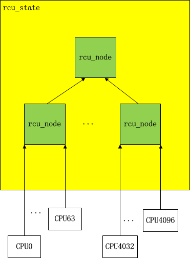
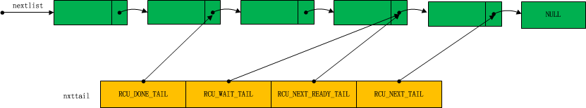

代码分布

        在分析代码之前， 先看看代码的分布情况。RCU实现的代码包含在下列一些文件中，此处用到的是linux 3.6.4的代码。
< include/linux/rcupdate.h >     

           RCU实现的头文件，所有使用RCU的代码都需要包含它
< include/rcutree.h >               

           包含rcupdate.h中没有包含的函数声明。
< include/rcutiny.h >                

           包含rcupdate.h中没有包含的函数声明。
< kernel/rcupdate.c >               

           包括一些RCU实现的基础函数的实现。
< kernel/rcutree.h >                 

           包含Tree RCU用到的结构信息，TREE_RCU将所有的CPU组织成一颗树，通过层次结构来判别进程是否通过了宽限期，这种方式适用于多个CPU的系统。
< kernel/rcutree.c >                 

          包含Tree RCU的主要实现代码。
< kernel/rcutree_plugin.h >     

          其实也是TREE RCU实现的一部分。主要包含了抢入式TreeRCU的代码。适用于抢入式的系统，抢入式的系统适用于需要低延迟的桌面或者嵌入式系统。
< kernel/rcutiny.c >                  

          Tiny RCU的主要实现代码，TINY_RCU适用于单个CPU，尤其是嵌入式操作系统。
< kernel/rcutiny_plugin.h >      

          主要包含了抢入式Tiny RCU的代码
< kernel/rcu.h >                       

          定义了debug的接口，实现了__rcu_reclaim。
< kernel/rcutorture.c>               

         对RCU进行稳定性测试的代码，通过配置CONFIG_RCU_TORTURE_TEST，可以在系统启动的时候运行稳定性测试。
< kernel/rcutree_trace.c>        

         通过配置CONFIG_RCU_TRACE，可以记录RCU的运行信息。
< include/trace/events/rcu.h>  

         为rcutree_trace.c定义的头文件。

    RCU处理的基本流程

      RCU实现的关键集中在宽限期的处理上，这个过程需要保证销毁对象前，当前系统中所有CPU上运行的进程都通过了静止状态（quiescent state）。

     1， 程序调用call_rcu，将要删除的对象保存起来。并标记或者开始一个宽限期（同一时间只能运行一个宽限期，所以当已经有宽限期在运行的时候，其它的宽限期必须等待）。

     2， 在读取数据开始和结尾处增加 rcu_read_lock 和 rcu_read_unlock来标记读过程。为了保证删除过程知道读过程的结束，在非抢占式RCU实现中是在rcu_read_lock开始处禁止进程抢占。这样做就可以保证再运行下一次进程切换的时候，读过程已经结束。其实系统也不会去统计各个CPU上是否存在过读线程，所以所有的CPU都会在进程切换的时候通知系统它处于进制状态。当所有的CPU都通过静止状态的时候，系统就会标记它通过了一个宽限期。

     3，由于一个宽限期结束的时候，只有最后一个通过静止状态的CPU知道当前的宽限期已经结束，它并不会去通知其它CPU；同时出于性能考虑，系统也不会在宽限期结束后，马上去执行销毁过程。所以每个CPU都有一个固定的函数去检测是否有等待执行的宽限期，如果没有特别紧急的任务时，会去执行这些过程。

 接下来，要分析Tree RCU的实现，先来看看它提供的一些接口函数。

      1， call_rcu  与 synchronize_rcu都是删除对象时调用的函数。call_rcu将数据提交后会返回，而synchronize_rcu会调用call_rcu，并一直等待对象被删除后才返回。还有call_rcu_bh与synchronize_rcu_bh等接口函数，会在后续讲述。

   2，rcu_read_lock 和 rcu_read_unlock

	// <linux/rcuupdate.h>
    static inline void __rcu_read_lock(void)  
    {  
            preempt_disable();  
    }  
       
    static inline void __rcu_read_unlock(void)  
    {  
            preempt_enable();  
    }  

	static inline void rcu_read_lock(void)  
    {  
            __rcu_read_lock();  
            __acquire(RCU);  
            rcu_lock_acquire(&rcu_lock_map);  
            rcu_lockdep_assert(!rcu_is_cpu_idle(),  
                               "rcu_read_lock() used illegally while idle");  
    }  
    static inline void rcu_read_unlock(void)  
    {  
            rcu_lockdep_assert(!rcu_is_cpu_idle(),  
                               "rcu_read_unlock() used illegally while idle");  
            rcu_lock_release(&rcu_lock_map);  
            __release(RCU);  
            __rcu_read_unlock();  
    }  

rcu_read_lock与rcu_read_unlock在非抢占式下的实现比较简单就是 preempt_disable与preempt_enable。这样做的目的是当调用schedule的时候，就可以肯定读的过程已经结束。其它_acquire(RCU)等函数是调试用的代码，暂不做讨论。

     3， rcu_note_context_switch 在schedule中调用，每次进程切换就代表着一个静止状态。该函数会把当前的CPU状态设置为通过状态。

       4， rcu_check_callbacks 在每次时钟周期里调用(update_process_times)。通过它会触发软件中断，软件中断对应着rcu_process_callbacks，这是一个真正繁忙的函数，他会检测当前CPU的状态，向父节点传递静止状态信息，调用注册函数等一系列工作。

       在进一步了解这些函数之前，我们先来看看你Tree RCU的结构。

TREE RCU简介

        在统计CPU的状态的时候，需要用到一个结构来存放所有CPU的状态。在早期的实现中，所有的状态都保存在一个结构中，这样做的后果是所有的CPU在更新自己状态的时候，都需要锁定该结构对象，一定程度上影响了系统性能。为了提高性能，把一定数目的CPU组成了一个节点（默认设定64个CPU为一个节点）；当节点超过64个的时候，再把这些节点按64为单位划分为归属不同的父节点；如此类推，最后的一个单独的节点作为根节点。这样在更新CPU状态的时候，只需要锁定自己所属的节点就可以了。按节点设置的数目，可见这个结构只对CPU数成百上千的系统才真正起作用（我都没见过超过32个cpu的机器，不知道是啥样的感觉）。

这样所有的CPU就按层级结构组织了起来，也就是一个树结构。当一个系统的CPU数少于64个的时候，只要一个rcu_node就可以。

          每个CPU在完成宽限期检测的时候，就会去更新它所属的rcu_node的值，当一个rcu_node所包含的CPU的状态都更新过以后，该node就会去更新它所属的父节点的值。直到最后一个根节点。

TREE RCU数据结构

       为了实现该结构，系统提供了以下结构。

rcu_data

         由于RCU需要统计每个CPU是否通过了宽限期，提供了rcu_data来保存信息。另外每个销毁的对象并不是直接删除，也保存在rcu_data中，等到合适的时机来执行。

    struct rcu_data {  
             /* 1) 静止状态和宽限期处理: */  
             unsigned long   completed;      /* 对比 rsp->completed */  
                                             /* 目的是检测宽限期是否完成. */  
             unsigned long   gpnum;          /* 当前CPU上最高的宽限期数目*/  
                                             /* 在宽限期开始的时候设置. */  
             unsigned long   passed_quiesce_gpnum;  
                                             /* 已经通过的宽限期数目. */  
             bool            passed_quiesce; /* 是否通过了静止状态，在进程切换等状态会设置. */  
             bool            qs_pending;     /* 对于当前执行的宽限期，该CPU是否执行完成. */  
             bool            beenonline;     /* CPU是否在线，不在线的CPU需要特殊处理，以提高性能*/  
             bool            preemptible;    /* 是否抢占式RCU? */  
             struct rcu_node *mynode;        /* 这个CPU对应的 rcu_node */  
             unsigned long grpmask;          /* 占用1bit，对应与所属的rcu_node. */  
     #ifdef CONFIG_RCU_CPU_STALL_INFO  
             unsigned long   ticks_this_gp;  /* The number of scheduling-clock */  
                                             /*  ticks this CPU has handled */  
                                             /*  during and after the last grace */  
                                             /* period it is aware of. */  
     #endif /* #ifdef CONFIG_RCU_CPU_STALL_INFO */  
             /* 2) 批处理*/  
             /* 
              * 
              * 当nxtlist不为空的时候，会通过nxttail划分为以下几部分 
              * 每一个部分为空的时候，它的指针会被设置成与它的下一部分相同 
              * 当nxtlist为空的时候，所有的nxttail都会指向nxtlist的地址，这时候nxtlist指向NULL 
              * 
              * [nxtlist, *nxttail[RCU_DONE_TAIL]): 
              *    批处理的开始节点# <= ->completed 
              *    这些节点的宽限期已经完成，可以执行销毁操作。 
              *    当调用rcu_process_callbacks()的时候，下一批完成宽限期的节点也会放到这儿. 
              * [*nxttail[RCU_DONE_TAIL], *nxttail[RCU_WAIT_TAIL]): 
              *    批处理的开始节点 # <= ->completed - 1: 等待当前的批处理完成 
              * [*nxttail[RCU_WAIT_TAIL], *nxttail[RCU_NEXT_READY_TAIL]): 
              *    已知的当下次宽限期开始，可以开始等待的节点。 
              * [*nxttail[RCU_NEXT_READY_TAIL], *nxttail[RCU_NEXT_TAIL]): 
              *    当前不确定下次宽限期开始后，是否可以开始等待状态的节点。 
              *    *nxttail[RCU_NEXT_TAIL] 的值将永远是NULL， 
              *    它表示nxtlist的结束. 
              * 
              */  
             struct rcu_head *nxtlist;  
             struct rcu_head **nxttail[RCU_NEXT_SIZE];  
             long            qlen_lazy;      /* # kfree_rcu调用的次数，kfee_rcu等同于call_rcu，只是它不需要销毁的对象提供销毁函数*/  
             long            qlen;           /* # 当前需要执行销毁操作的次数，每次call_rcu会加一，执行过后减一*/  
             long            qlen_last_fqs_check;  
                                             /* 对应与qlen，最后一次执行的次数*/  
             unsigned long   n_cbs_invoked;  /* 执行销毁操作的次数. */  
             unsigned long   n_cbs_orphaned; /* 统计离线后CPU上剩下的callback函数的个数 */  
             unsigned long   n_cbs_adopted;  /* 从离线后的CPU上移出的callback函数的个数 */  
             unsigned long   n_force_qs_snap;  
                                             /* 其它CPU是否在执行fore_qs? */  
             long            blimit;         /* nxtlist保存的上限 */  
       
             /* 3) 动态时钟,*/  
             struct rcu_dynticks *dynticks;  /* 每个CPU都包含一个动态时钟. */  
             int dynticks_snap;              /* 用于检测CPU是否在线. */  
       
             /* 4) 强制执行时候处理的CPU */  
             unsigned long dynticks_fqs;     /* 由于进入dynticks idle而被处理的CPU. */  
             unsigned long offline_fqs;      /* 由于不在在线被处理的CPU. */  
       
             /* 5) __rcu_pending() 的统计信息，这些信息都是在记录调用信息的时候使用. */  
             unsigned long n_rcu_pending;    /* rcu_pending() 调用次数，自从启动. */  
             unsigned long n_rp_qs_pending;  
             unsigned long n_rp_report_qs;  
             unsigned long n_rp_cb_ready;  
             unsigned long n_rp_cpu_needs_gp;  
             unsigned long n_rp_gp_completed;  
             unsigned long n_rp_gp_started;  
             unsigned long n_rp_need_fqs;  
             unsigned long n_rp_need_nothing;  
       
             /* 6) _rcu_barrier() 的回调函数. */  
             struct rcu_head barrier_head;  
       
             int cpu;  
             struct rcu_state *rsp;  
     };  

    1，completed ，gpnum ， passed_quiesce_gpnum

           gpnum表示当前正在运行的宽限期的个数，每当一个宽限期开始的时候，会设置这个值与其父节点相同。passed_quiesce_gpnum为当前CPU通过的宽限期个数，它的值在宽限期开始的时候小于gpnum，当这个CPU经过一个静止状态的时候，会把它设置成gpnum的值，通过对比它与父节点中的gpnum是否相同，可以确定该CPU是否通过了宽限期。passed_quiesce_gpnum只是表示这个CPU通过了宽限期，而completed表示所有的CPU都通过了宽限期，设置该值的同时，可以将nxtlist中等待的回调函数移动到完成队列。

         2， nxtlist 与nxttail

           nxtlist保存的是指向rcu_head对象，rcu_head的定义如下：        

struct callback_head {
        struct callback_head *next;
        void (*func)(struct callback_head *head);
};
#define rcu_head callback_head

          rcu_head的结构并不复杂，它包含一个回调函数指针。而next可以把rcu_head连成一个列表。

nxtlist指向一个rcu_head 列表，而nxttail的四个元素是指向指针的指针，它们指向的是rcu_head对象的next。RCU_DONE_TAIL指向的rcu_head对象之前的对象是可以销毁的对象。RCU_WAIT_TAIL指向的正在等待宽限期的元素，RCU_NEXT_READ_TAIL指向的是等待下次宽限期的元素，RCU_NEXT_TAIL指向最后一个元素，这个元素总是指向NULL。

###rcu_node

    struct rcu_node {  
             raw_spinlock_t lock;    /* rcu_node的锁，用来保护以下的一些成员*/  
      
             unsigned long gpnum;    /* 该节点当前的宽限期的数量 */  
                                     /* 该值等于或者比父节点的值小1*/  
             unsigned long completed; /* 该节点完成的宽限期数量*/  
                                      /* 该值等于或者比父节点的值小1*/  
             unsigned long qsmask;   /* 标记这个节点对应的所有CPU或者子节点是否完成了当前的宽限期*/  
                                     /* 每一个bit对应一个cpu或者一个子节点.*/  
             unsigned long expmask;  /* 需要执行 ->blkd_tasks 的元素 */                              
                                     /*  (应用于TREE_PREEMPT_RCU). */  
             atomic_t wakemask;      /* 需要唤醒kthread的CPU. */  
                                       
             unsigned long qsmaskinit;  
                                     /* 每个宽限期开始时，用它来初始化qsmask，不存在或者不在线的CPU需要清除. */  
             unsigned long grpmask;  /* 对应于父节点中的位置. */  
                                     /* 只是用一bit. */  
             int     grplo;          /* 该节点代表的CPU或者子节点开始的位置. */  
             int     grphi;          /* 该节点代表的CPU或者子节点结束的位置. */  
             u8      grpnum;         /* 下一级的CPU或者子节点的个数. */  
             u8      level;          /* 跟节点是 0. */  
             struct rcu_node *parent;  
             struct list_head blkd_tasks;  
                                     /* 阻断读关键段的任务列表 */  
                                     /*  */  
                          
             struct list_head *gp_tasks;  
                                     /* 指向第一个阻断读关键段的任务 */  
                                       
                                       
             struct list_head *exp_tasks;  
      
         /*以下为抢先式下加速RCU过程的变量*/                                 
      
    #ifdef CONFIG_RCU_BOOST  
             struct list_head *boost_tasks;  
                                     /* Pointer to first task that needs to be */  
                                     /*  priority boosted, or NULL if no priority */  
                                     /*  boosting is needed for this rcu_node */  
                                     /*  structure.  If there are no tasks */  
                                     /*  queued on this rcu_node structure that */  
                                     /*  are blocking the current grace period, */  
                                     /*  there can be no such task. */  
             unsigned long boost_time;  
                                     /* When to start boosting (jiffies). */  
             struct task_struct *boost_kthread_task;  
                                     /* kthread that takes care of priority */  
                                     /*  boosting for this rcu_node structure. */  
             unsigned int boost_kthread_status;  
                                     /* State of boost_kthread_task for tracing. */  
             unsigned long n_tasks_boosted;  
                                     /* Total number of tasks boosted. */  
             unsigned long n_exp_boosts;  
                                     /* Number of tasks boosted for expedited GP. */  
             unsigned long n_normal_boosts;  
                                     /* Number of tasks boosted for normal GP. */  
             unsigned long n_balk_blkd_tasks;  
                                     /* Refused to boost: no blocked tasks. */  
             unsigned long n_balk_exp_gp_tasks;  
                                     /* Refused to boost: nothing blocking GP. */  
             unsigned long n_balk_boost_tasks;  
                                     /* Refused to boost: already boosting. */  
             unsigned long n_balk_notblocked;  
                                     /* Refused to boost: RCU RS CS still running. */  
             unsigned long n_balk_notyet;  
                                     /* Refused to boost: not yet time. */  
             unsigned long n_balk_nos;  
                                     /* Refused to boost: not sure why, though. */  
                                     /*  This can happen due to race conditions. */  
     #endif /* #ifdef CONFIG_RCU_BOOST */  
             struct task_struct *node_kthread_task;  
                                     /* kthread that takes care of this rcu_node */  
                                     /*  structure, for example, awakening the */  
                                     /*  per-CPU kthreads as needed. */  
             unsigned int node_kthread_status;  
                                     /* State of node_kthread_task for tracing. */  
     } ____cacheline_internodealigned_in_smp;  

  每个rcu_node代表着 一组CPU或者子节点。在非抢占式下，它的结构并不复杂。由于可能有多个CPU对它进行处理，所有进行相应操作的时候，需要lock保护。

###rcu_state

    struct rcu_state {  
            struct rcu_node node[NUM_RCU_NODES];    /* 保存了所有的节点. */  
            struct rcu_node *level[RCU_NUM_LVLS];   /* 每个层级所指向的节点. */  
            u32 levelcnt[MAX_RCU_LVLS + 1];         /* # 每一层的节点数. */  
            u8 levelspread[RCU_NUM_LVLS];           /* 每一层的CPU/节点数. */  
            struct rcu_data __percpu *rda;          /* 指向rcu_data. */  
            void (*call)(struct rcu_head *head,     /* rcu_barrier指向的回调函数. */  
                         void (*func)(struct rcu_head *head));  
      
            /* The following fields are guarded by the root rcu_node's lock. */  
      
            u8      fqs_state ____cacheline_internodealigned_in_smp;  
                                                    /* 调用force_quiescent_state时的状态. */  
            u8      fqs_active;                     /* force_quiescent_state() 正在运行*/  
                                                      
            u8      fqs_need_gp;                    /* 因为 force_quiescent_state() 正在运行*/  
                                                    /* 一个CPU需要运行的宽限期被阻止*/  
      
            u8      boost;                          /* 加速. */  
            unsigned long gpnum;                    /* 当前的宽限起数量. */  
            unsigned long completed;                /* # 最后一次完成的宽限期数量. */  
      
            /* 以下的成员被根rcu_node的lock保护. */  
      
            raw_spinlock_t onofflock;               /* 开始一个新的宽限期的时候，阻止CPU上下线*/  
                                                      
            struct rcu_head *orphan_nxtlist;        /* 等待宽限期的孤儿回调函数的列表 */  
                                                      
            struct rcu_head **orphan_nxttail;       /* 以上列表的结尾. */  
            struct rcu_head *orphan_donelist;       /* 需要执行的孤儿回调函数列表 */  
                                                      
            struct rcu_head **orphan_donetail;      /* 以上列表的结尾. */  
            long qlen_lazy;                         /* 懒惰回调函数的个数. */  
            long qlen;                              /* 总的回调函数的个数. */  
            struct task_struct *rcu_barrier_in_progress;  
                                                    /* 调用rcu_barrier()的进程, */  
                                                    /* 没有的话指向NULL. */  
            struct mutex barrier_mutex;             /* 执行barrier需要的互斥锁. */  
            atomic_t barrier_cpu_count;             /* # 等待barrier的CPU数 . */  
            struct completion barrier_completion;   /* 在barrier结束的时候调用. */  
            unsigned long n_barrier_done;           /* 在_rcu_barrier()开始结束处都需要调用++ */  
                                                      
            raw_spinlock_t fqslock;                 /* 只有一个进程能调用 force_quiescent_state().*/  
                                                      
            unsigned long jiffies_force_qs;         /* force_quiescent_state()开始的时间 */  
                                                      
            unsigned long n_force_qs;               /* 调用force_quiescent_state()的次数 */  
                                                      
            unsigned long n_force_qs_lh;            /* 因为lock不可用，而退出force_quiescent_state()的次数 */  
                                                      
            unsigned long n_force_qs_ngp;           /* 因为当前有宽限期执行，而退出force_quiescent_state()的次数*/  
                                                      
            unsigned long gp_start;                 /* 宽限期开始的时间*/  
                                                      
            unsigned long jiffies_stall;              
                                                   
            unsigned long gp_max;                   /*  最长的宽限的jiffie数 */  
                                                      
            char *name;                             /* 结构的名字. */  
            struct list_head flavors;               /* 系统中的rcu_state. */  
    };  

    rcu_state 保存了所有的node，宽限期的判断只要取出根节点，也就是第一个元素就可以。还有一些初始化要用到的变量。还有孤儿回调函数用于处理离线CPU遗留的信息。剩下还有很多统计信息，这些内容在讲解代码实现的时候再仔细考虑。

RCU的实现集中在以下几个步骤：

         1， 调用call_rcu，将回调函数增加到列表。

         2,   开始一个宽限期。

         3,   每个CPU报告自己的状态，直到最后一个CPU，结束一个宽限期。

         4， 宽限期结束，每个CPU处理自己的回调函数。

###call_rcu的实现  

    static void  
    __call_rcu(struct rcu_head *head, void (*func)(struct rcu_head *rcu),  
               struct rcu_state *rsp, bool lazy)  
    {  
            unsigned long flags;  
            struct rcu_data *rdp;  
      
            WARN_ON_ONCE((unsigned long)head & 0x3); /* 检测head在内存中是否对齐! */  
            debug_rcu_head_queue(head);  
            head->func = func;  
            head->next = NULL;  
      
            smp_mb(); /* Ensure RCU update seen before callback registry. */  
      
            /* 
             * 这是一个检测宽限期开始或者结束的机会。 
             * 当我们看到一个结束的时候，可能还会看到一个开始。 
             * 反过来，看到一个开始的时候，不一定能看到一个结束， 
             * 因为宽限期结束需要一定时间。 
             */  
            local_irq_save(flags);  
            rdp = this_cpu_ptr(rsp->rda);  
      
            /* 将要增加callback到nxtlist. */  
            ACCESS_ONCE(rdp->qlen)++;  
            if (lazy)  
                    rdp->qlen_lazy++;  
            else  
                    rcu_idle_count_callbacks_posted();  
            smp_mb();  /* Count before adding callback for rcu_barrier(). */  
            *rdp->nxttail[RCU_NEXT_TAIL] = head;  
            rdp->nxttail[RCU_NEXT_TAIL] = &head->next;  
      
            if (__is_kfree_rcu_offset((unsigned long)func))  
                    trace_rcu_kfree_callback(rsp->name, head, (unsigned long)func,  
                                             rdp->qlen_lazy, rdp->qlen);  
            else  
                    trace_rcu_callback(rsp->name, head, rdp->qlen_lazy, rdp->qlen);  
      
            /* 去处理rcu_core。 */  
            __call_rcu_core(rsp, rdp, head, flags);  
            local_irq_restore(flags);  
    }  

  call_rcu中最主要的工作，就是将回调函数加入到CPU的nxtlist列表。这里用到了指针处理的小技巧，我们来看看。首先看看nxttail的初始化：

    static void init_callback_list(struct rcu_data *rdp)  
    {  
            int i;  
      
            rdp->nxtlist = NULL;  
            for (i = 0; i < RCU_NEXT_SIZE; i++)  
                    rdp->nxttail[i] = &rdp->nxtlist;  
    }  

我们看到nxttail的全部成员都指向了nxtlist的地址。当nxtlist为空的时候，也是这个情形。

       *rdp->nxttail[RCU_NEXT_TAIL] = head;       

       当nxtlist为空的时候， *rdp->nxttail[RCU_NEXT_TAIL] 得到的其实就是nxtlist，将head的值赋予它。

       rdp->nxttail[RCU_NEXT_TAIL] = &head->next;

       之后 RCU_NEXT_TAIL指向 head的next指针。这样当再有一个节点加入的时候，*rdp->nxttail[RCU_NEXT_TAIL]得到的其实就是前一次加入的head的next指针，它将指向新加入的值。如此，nxtlist就成为了一个链表。或者这样理解，rdp->nxttail[RCU_NEXT_TAIL] 指向的就是nxtlist中最后一个节点的 next指针。

       除了将回调函数插入，该函数其它代码多为检查代码。而最后要调用__call_rcu_core，该函数的功用主要是在回调函数太多或者等待时间过长的状态下，强制执行RCU状态更新。我们暂时不关注。
开始一个宽限期

       在一个宽限期结束，或者当一个CPU检测到自身有需要一个宽限期的时候会开始一个新的宽限期，开始宽限期的代码如下：

    static void  
    rcu_start_gp(struct rcu_state *rsp, unsigned long flags)  
            __releases(rcu_get_root(rsp)->lock)  
    {  
            struct rcu_data *rdp = this_cpu_ptr(rsp->rda);  
            struct rcu_node *rnp = rcu_get_root(rsp);  
      
            if (!rcu_scheduler_fully_active ||  
                !cpu_needs_another_gp(rsp, rdp)) {  
                    /* 
                     * 如果scheduler 还没有启动non-idle任务 
                     * 或者不需要启动一个新的宽限期则退出。 
                     * 需要再次判断cpu_needs_another_gp， 
                     * 是因为可能有多个CPU执行这个过程。 
                     */  
                   raw_spin_unlock_irqrestore(&rnp->lock, flags);  
                   return;  
            }  
      
            if (rsp->fqs_active) {  
                    /* 
                     * 这个CPU需要一个宽限期，而force_quiescent_state() 
                     * 正在运行，告诉它开始一个。 
                     */  
                    rsp->fqs_need_gp = 1;  
                    raw_spin_unlock_irqrestore(&rnp->lock, flags);  
                    return;  
            }  
      
            /* 开始一个新的宽限期并且初始化。 */  
            rsp->gpnum++;  
            trace_rcu_grace_period(rsp->name, rsp->gpnum, "start");  
            WARN_ON_ONCE(rsp->fqs_state == RCU_GP_INIT);  
            rsp->fqs_state = RCU_GP_INIT; /* 阻止 force_quiescent_state。 */  
            rsp->jiffies_force_qs = jiffies + RCU_JIFFIES_TILL_FORCE_QS;  
            record_gp_stall_check_time(rsp);  
            raw_spin_unlock(&rnp->lock);  /* leave irqs disabled. */  
      
            /* 排除CPU的热插拔。*/  
            raw_spin_lock(&rsp->onofflock);  /* irqs already disabled. */  
      
           /* 
        * 从父节点开始以广度优先的方式，遍历所有的节点，设置qsmask的值， 
        * 所有在线CPU所在bit都将被设置成1。 
        * 通过遍历rsp->node[]数组就可以达到这个目的。 
        * 其它CPU在自己所属的节点还没有被设置前，只有可能访问这个节点， 
        * 因为它所作的判断是宽限期还没有开始。 
        * 此外，我们排除了CPU热插拔。 
        *  
        * 直到初始化过程完成之前，这个宽限期不可能完成，因为至少当前的 
        * CPU所属的bit将不会被设置。这个是因为我们启动了禁止中断，所以 
        * 这个CPU不会调用到宽限期检测代码。 
        */  
        rcu_for_each_node_breadth_first(rsp, rnp) {  
                    raw_spin_lock(&rnp->lock);      /* irqs already disabled. */  
                    rcu_preempt_check_blocked_tasks(rnp);  
                    rnp->qsmask = rnp->qsmaskinit;  
                    rnp->gpnum = rsp->gpnum;  
                    rnp->completed = rsp->completed;  
                    if (rnp == rdp->mynode)  
                            rcu_start_gp_per_cpu(rsp, rnp, rdp);  
                    rcu_preempt_boost_start_gp(rnp);  
                    trace_rcu_grace_period_init(rsp->name, rnp->gpnum,  
                                                rnp->level, rnp->grplo,  
                                                rnp->grphi, rnp->qsmask);  
                    raw_spin_unlock(&rnp->lock);    /* irqs remain disabled. */  
            }  
      
            rnp = rcu_get_root(rsp);  
            raw_spin_lock(&rnp->lock);              /* irqs already disabled. */  
            rsp->fqs_state = RCU_SIGNAL_INIT; /* force_quiescent_state now OK. */  
            raw_spin_unlock(&rnp->lock);            /* irqs remain disabled. */  
            raw_spin_unlock_irqrestore(&rsp->onofflock, flags);  
    }  

  标记一个新的宽限期开始，rcu_state要做的就是将gp_num加1。然后再设置所有node，qsmask被设置成qsmasinit，qsmask每个bit代表一个CPU，所有在线的CPU都将被设置成1；gpnum将被设置成新值。嗯，一个新宽限期的开始只需要设置这些标记位。

##CPU的宽限期检测

当一个宽限期开始后，每个CPU都需要检测自己的状态，如果已经通过静止状态，那么就向上一级node进行报告。

        这个处理过程，可以分为两个步骤：

                1， 检测新的处理过程开始，设置rcu_data中的gpnum和passed_quiesce，另外用qs_pending标记一个待处理的新宽限期的开始。

                2， 一个静止状态结束，向上一级node报告这个过程。

        这两个过程通过rcu_check_quiescent_state()来实现，需要注意的是这个函数隔一段时间调用一次，并不只调用一次。

    /* 
    * 检测这个CPU是否还不知道一个新宽限期开始，如果是设置它的变量。 
    * 否则检查它是不是第一次通过静止状态，如果是，向上报告。 
    */  
    static void  
    rcu_check_quiescent_state(struct rcu_state *rsp, struct rcu_data *rdp)  
    {  
        /* 如果有新的宽限期开始，记录它并返回。*/  
        if (check_for_new_grace_period(rsp, rdp))  
            return;  
      
        /* 
         * 这个CPU是否已经处理过它的宽限期?如果是返回。 
         */  
        if (!rdp->qs_pending)  
            return;  
      
        /* 
         * 是否通过了静止状态？如果没有，返回。 
             */  
        if (!rdp->passed_quiesce)  
            return;  
      
        /* 
         * 向所属的node报告。(但rcu_report_qs_rdp() 仍然会去判断它)。 
         */  
        rcu_report_qs_rdp(rdp->cpu, rsp, rdp, rdp->passed_quiesce_gpnum);  
    }  

   A， CPU检测新宽限期的开始

    /*  
     * 为当前CPU，更新rcu_data的状态，去标记一个新宽限期的开始 
     * 如果当前CPU启动了一个宽限期或者检测到一个新的宽限期开始， 
     * 都需要调用这个函数。这个过程必须锁定父节点的lock，另外需 
     * 要禁止中断 
     */  
    static void __note_new_gpnum(struct rcu_state *rsp, struct rcu_node *rnp, struct rcu_data *rdp)  
    {  
        if (rdp->gpnum != rnp->gpnum) {  
            /* 
            * 如果当前的宽限期需要处理这个CPU的状态，设置并 
             * 去检测它的静止状态。否则不要去管它。 
             */          
                    rdp->gpnum = rnp->gpnum;  
            trace_rcu_grace_period(rsp->name, rdp->gpnum, "cpustart");  
            if (rnp->qsmask & rdp->grpmask) {  
                rdp->qs_pending = 1;  
                rdp->passed_quiesce = 0;  
            } else {  
                rdp->qs_pending = 0;  
            }  
            zero_cpu_stall_ticks(rdp);  
        }  
    }  
      
    static void note_new_gpnum(struct rcu_state *rsp, struct rcu_data *rdp)  
    {  
        unsigned long flags;  
        struct rcu_node *rnp;  
      
        local_irq_save(flags);  
        rnp = rdp->mynode;  
        if (rdp->gpnum == ACCESS_ONCE(rnp->gpnum) || /* outside lock. */  
            !raw_spin_trylock(&rnp->lock)) { /* irqs already off, so later. */  
            local_irq_restore(flags);  
            return;  
        }  
        __note_new_gpnum(rsp, rnp, rdp);  
        raw_spin_unlock_irqrestore(&rnp->lock, flags);  
    }  
      
    /* 
     * 在我们的上次检测之后，其它CPU启动了一个新的宽限期？ 
     * 如果是更新相应的rcu_data的状态。 
     * 必须是在rdp对应的CPU上执行。 
     */  
    static int  
    check_for_new_grace_period(struct rcu_state *rsp, struct rcu_data *rdp)  
    {  
        unsigned long flags;  
        int ret = 0;  
      
        local_irq_save(flags);  
        if (rdp->gpnum != rsp->gpnum) {  
            note_new_gpnum(rsp, rdp);  
            ret = 1;  
        }  
        local_irq_restore(flags);  
        return ret;  
    }  

 check_for_new_grace_period 和 note_new_gpnum分别用来检测rdp的gpnum与rsp已经对应的rnp的值是否相同，来确定是否有一个新的宽限期开始。之所以需要检测两次，是因为在rsp设置以后，rnp可能并没有设置完成。

        __note_new_gpnum 将设置gpnum的值。另外设置 qs_pending为1，该标记位代表该节点还没有向父节点报告自己的状态；passed_quiesce为0，表示需要一个静止状态，设置该位是因为下次调用rcu_check_quiescent_state()可能是在一个读过程还没有结束的时候。

         qs_pending的状态有可能为0，这只在以下情形下出现：当前CPU在宽限期开始的时候实在离线状态，而现在变成了在线。

         我们注意到在 check_for_new_grace_period检测到有新的宽限期开始后，rcu_check_quiescent_state将直接返回，因为这个宽限期可能是在该CPU的上一个静止状态之前已经开始，所以需要等待下一个静止状态。

 

      B，CPU报告静止状态

      当再一次调用到rcu_check_quiescent_state()的时候，check_for_new_grace_period()将返回FALSE，接着运行后面的函数来判断 qs_pending 和 passed_quiesce 的值来决定是否调用rcu_report_qs_rdp。需要判断qs_peding是因为当这次rcu_report_qs_rdp调用成功的时候，下次再运行rcu_check_quiescent_state()则不需要继续运行后续函数。

    static void  
    rcu_report_qs_rdp(int cpu, struct rcu_state *rsp, struct rcu_data *rdp, long lastgp)  
    {  
        unsigned long flags;  
        unsigned long mask;  
        struct rcu_node *rnp;  
      
        rnp = rdp->mynode;  
        raw_spin_lock_irqsave(&rnp->lock, flags);  
        if (lastgp != rnp->gpnum || rnp->completed == rnp->gpnum) {  
      
            /* 
            * 如果宽限期的处理已经完成，那么返回。 
             */          
                    rdp->passed_quiesce = 0; /* need qs for new gp. */  
            raw_spin_unlock_irqrestore(&rnp->lock, flags);  
            return;  
        }  
        mask = rdp->grpmask;  
        if ((rnp->qsmask & mask) == 0) {  
            raw_spin_unlock_irqrestore(&rnp->lock, flags);  
        } else {  
            rdp->qs_pending = 0;  
      
            /* 
             *  可以确定这个宽限期还没有结束，所以可以确定当前CPU上的 
             *  所有回调函数可以在下次宽限期结束后处理。 
             */  
            rdp->nxttail[RCU_NEXT_READY_TAIL] = rdp->nxttail[RCU_NEXT_TAIL];  
      
            rcu_report_qs_rnp(mask, rsp, rnp, flags); /* rlses rnp->lock */  
        }  
    }  

 从我看来，这个函数只会调用到最后一个else分支，而之前的连个if分支都不会调用到。因为在调用该函数前，代码已经做了必要的检测。

        以此来看，这个函数的功用就是设置qs_pending的值，阻止这次宽限期没有完成之前再次调用掉该函数；设置nxttail，决定下次宽限期后可以执行的回调函数；然后向父节点报告静止状态完成。

     C，向上报告

    static void  
    rcu_report_qs_rnp(unsigned long mask, struct rcu_state *rsp,  
              struct rcu_node *rnp, unsigned long flags)  
        __releases(rnp->lock)  
    {  
        struct rcu_node *rnp_c;  
      
        /* 向上遍历所有层级 */  
        for (;;) {  
            if (!(rnp->qsmask & mask)) {  
      
                /* 这个CPU的标记已经被清除，证明已经处理过了，返回 */  
                raw_spin_unlock_irqrestore(&rnp->lock, flags);  
                return;  
            }  
            rnp->qsmask &= ~mask;  
            trace_rcu_quiescent_state_report(rsp->name, rnp->gpnum,  
                             mask, rnp->qsmask, rnp->level,  
                             rnp->grplo, rnp->grphi,  
                             !!rnp->gp_tasks);  
            if (rnp->qsmask != 0 || rcu_preempt_blocked_readers_cgp(rnp)) {  
      
                /* 这个节点中还有其它CPU没有处理完成，那么返回 */  
                raw_spin_unlock_irqrestore(&rnp->lock, flags);  
                return;  
            }  
            mask = rnp->grpmask;  
            if (rnp->parent == NULL) {  
      
                /* 到这儿，已经到了根节点 */  
      
                break;  
            }  
            raw_spin_unlock_irqrestore(&rnp->lock, flags);  
            rnp_c = rnp;  
            rnp = rnp->parent;  
            raw_spin_lock_irqsave(&rnp->lock, flags);  
            WARN_ON_ONCE(rnp_c->qsmask);  
        }  
      
        /* 
        *  程序运行到这儿，说明所有的CPU都通过了宽限期， 
        *  那么调用rcu_report_qs_rsp()来结束这个宽限期。 
        */   
            rcu_report_qs_rsp(rsp, flags); /* releases rnp->lock. */  
    }  

   这个过程并不复杂，清理rnp中qsmask对应该CPU的bit。然后判断该节点是否处理完成，如果是则继续向上调用，否则就退出函数。最后一个CPU调用后，可以调用到rcu_report_qs_rsp()。

    static void rcu_report_qs_rsp(struct rcu_state *rsp, unsigned long flags)  
        __releases(rcu_get_root(rsp)->lock)  
    {  
        unsigned long gp_duration;  
        struct rcu_node *rnp = rcu_get_root(rsp);  
        struct rcu_data *rdp = this_cpu_ptr(rsp->rda);  
      
        WARN_ON_ONCE(!rcu_gp_in_progress(rsp));  
      
        /* 
         * Ensure that all grace-period and pre-grace-period activity 
         * is seen before the assignment to rsp->completed. 
         */  
        smp_mb(); /* See above block comment. */  
        gp_duration = jiffies - rsp->gp_start;  
        if (gp_duration > rsp->gp_max)  
            rsp->gp_max = gp_duration;  
      
        /* 
         * 当前CPU知道宽限期已经结束，不过其它CPU都认为它还在运行。 
         * 由于completed还没有设置，其它CPU都不会对父node进行处理。 
         * 所以这时候将各个node标记为完成是安全的。 
         *  
         * 不过当前CPU有等待下一次宽限期的回调函数的时候，我们会 
         * 先去处理下一个宽限期。 
         * 这儿使用RCU_WAIT_TAIL代替了RCU_DONE_TAIL，这是因为当前 
         * CPU还没有进一步处理完成状态，当前RCU_WAIT_TAIL状态的元 
         * 素其实在这次宽限期结束后，已经可以执行了。 
         *  
         */  
        if (*rdp->nxttail[RCU_WAIT_TAIL] == NULL) {  
            raw_spin_unlock(&rnp->lock);  /* irqs remain disabled. */  
      
            /* 
             * 设置 rnp->completed的值，避免这个过程要等到下一次宽限期开始。          
             */  
            rcu_for_each_node_breadth_first(rsp, rnp) {  
                raw_spin_lock(&rnp->lock); /* irqs already disabled. */  
                rnp->completed = rsp->gpnum;  
                raw_spin_unlock(&rnp->lock); /* irqs remain disabled. */  
            }  
            rnp = rcu_get_root(rsp);  
            raw_spin_lock(&rnp->lock); /* irqs already disabled. */  
        }  
      
        rsp->completed = rsp->gpnum;  /* Declare the grace period complete. */  
        trace_rcu_grace_period(rsp->name, rsp->completed, "end");  
        rsp->fqs_state = RCU_GP_IDLE;  
        rcu_start_gp(rsp, flags);  /* releases root node's rnp->lock. */  
    }  

 这个过程最主要的内容就是设置rsp->completed的值，中间多了对node的处理。因为在rcu_start_gp中也会对node进行处理，当前CPU无法判断其它CPU是否需要一个宽限期，但它自身还有等待宽限期的回调函数的时候，它确定会有一个新的宽限期马上开始，所以忽略这个过程。     
 

###CPU的宽限期结束处理

     这个过程也可以分为两个步骤，第一步是检查宽限期是否结束，第二步是调用已完成的回调函数。

A, CPU检测宽限期的结束

     每个CPU都会定期检查当前的宽限期是否结束，如果结束将处理自身状态已经nxtlist表。rcu_process_gp_end就是用来做这个事情:

    static void  
    rcu_process_gp_end(struct rcu_state *rsp, struct rcu_data *rdp)  
    {  
        unsigned long flags;  
        struct rcu_node *rnp;  
      
        local_irq_save(flags);  
        rnp = rdp->mynode;  
        if (rdp->completed == ACCESS_ONCE(rnp->completed) || /* outside lock. */  
            !raw_spin_trylock(&rnp->lock)) { /* irqs already off, so later. */  
            local_irq_restore(flags);  
            return;  
        }  
        __rcu_process_gp_end(rsp, rnp, rdp);  
        raw_spin_unlock_irqrestore(&rnp->lock, flags);  
    }  

当 rdp->completed与rnp->completed的值不同的时候，会调用__rcu_process_gp_end来完成具体的工作。

    static void  
    __rcu_process_gp_end(struct rcu_state *rsp, struct rcu_node *rnp, struct rcu_data *rdp)  
    {  
        /* 之前的宽限期是否完成？ */  
        if (rdp->completed != rnp->completed) {  
      
            /* 推进回调函数，即使是NULL指针也没关系。 */  
            rdp->nxttail[RCU_DONE_TAIL] = rdp->nxttail[RCU_WAIT_TAIL];  
            rdp->nxttail[RCU_WAIT_TAIL] = rdp->nxttail[RCU_NEXT_READY_TAIL];  
            rdp->nxttail[RCU_NEXT_READY_TAIL] = rdp->nxttail[RCU_NEXT_TAIL];  
      
            /* 更新completed。 */  
            rdp->completed = rnp->completed;  
            trace_rcu_grace_period(rsp->name, rdp->gpnum, "cpuend");  
      
            /* 
            * 如果当前的CPU在外部的静止的状态（如离线状态）， 
             * 可能已经错过了其它CPU发起的宽限期。所以需要更 
            * 新gpnum的值，同时要注意不要错过当前正在运行的 
            * 宽限期，所以它的值被设置成与rnp->completed相同， 
            * 此时rnp->gpnum 可以已经加1，那么后续的调用 
            * rcu_check_quiescent_state()会去检测新的宽限期。 
            */       
                    if (ULONG_CMP_LT(rdp->gpnum, rdp->completed))  
                rdp->gpnum = rdp->completed;  
      
            /* 
             * 如果下次的宽限期不需要当前CPU报告静止状态, 
             * 设置qs_pending为0。 
                 */  
            if ((rnp->qsmask & rdp->grpmask) == 0)  
                rdp->qs_pending = 0;  
        }  
    }  

这个过程的重点是设置nxttail的值，将根据它来进行下一步的处理。

 

   B,回调函数的调用

    static void rcu_do_batch(struct rcu_state *rsp, struct rcu_data *rdp)  
    {  
        unsigned long flags;  
        struct rcu_head *next, *list, **tail;  
        int bl, count, count_lazy, i;  
      
        /* 没有回调函数，那么返回。*/  
        if (!cpu_has_callbacks_ready_to_invoke(rdp)) {  
            trace_rcu_batch_start(rsp->name, rdp->qlen_lazy, rdp->qlen, 0);  
            trace_rcu_batch_end(rsp->name, 0, !!ACCESS_ONCE(rdp->nxtlist),  
                        need_resched(), is_idle_task(current),  
                        rcu_is_callbacks_kthread());  
            return;  
        }  
      
        /* 
         * 提取回调函数的list，需要禁用中断，以防止调用call_rcu()。  
         */   
            local_irq_save(flags);  
        WARN_ON_ONCE(cpu_is_offline(smp_processor_id()));  
        bl = rdp->blimit;  
        trace_rcu_batch_start(rsp->name, rdp->qlen_lazy, rdp->qlen, bl);  
        list = rdp->nxtlist;  
        /*  
         * 已经将list指向了nxtlist，此时将nxtlist指向 *rdp->nxttail[RCU_DONE_TAIL]。 
         * 由于nxttail指向的是 rcu_head中的next指针的地址，所以此处得到的就是next所 
         * 指向的rcu_head对象。 
         */  
        rdp->nxtlist = *rdp->nxttail[RCU_DONE_TAIL];  
        /*将*rdp->nxttail[RCU_DONE_TAIL]指向NULL，也就是将list中的最后一个元素的next设置成NULL*/  
        *rdp->nxttail[RCU_DONE_TAIL] = NULL;  
        /*tail指向list最后一个元素的next指针的地址*/  
        tail = rdp->nxttail[RCU_DONE_TAIL];  
        /*此时rdp->nxttail[RCU_DONE_TAIL]指向的内容已经移出，所以让它重新指向nxtlist的地址*/  
        for (i = RCU_NEXT_SIZE - 1; i >= 0; i--)  
            if (rdp->nxttail[i] == rdp->nxttail[RCU_DONE_TAIL])  
                rdp->nxttail[i] = &rdp->nxtlist;  
        local_irq_restore(flags);  
      
        /* 调用回调函数 */  
        count = count_lazy = 0;  
        while (list) {  
            next = list->next;  
            prefetch(next);  
            debug_rcu_head_unqueue(list);  
            if (__rcu_reclaim(rsp->name, list))  
                count_lazy++;  
            list = next;  
            /* 当已经全部运行完毕或者CPU有更重要的事情的时候，退出循环。 */  
            if (++count >= bl &&  
                (need_resched() ||  
                 (!is_idle_task(current) && !rcu_is_callbacks_kthread())))  
                break;  
        }  
      
        local_irq_save(flags);  
        trace_rcu_batch_end(rsp->name, count, !!list, need_resched(),  
                    is_idle_task(current),  
                    rcu_is_callbacks_kthread());  
      
        /* 更新数量。并将没有执行完的回调函数重新放进列表。 */  
        if (list != NULL) {  
            *tail = rdp->nxtlist;  
            rdp->nxtlist = list;  
            for (i = 0; i < RCU_NEXT_SIZE; i++)  
                if (&rdp->nxtlist == rdp->nxttail[i])  
                    rdp->nxttail[i] = tail;  
                else  
                    break;  
        }  
        smp_mb(); /* 为了 rcu_barrier()统计运行过的回调函数 */  
        rdp->qlen_lazy -= count_lazy;  
        ACCESS_ONCE(rdp->qlen) -= count;  
        rdp->n_cbs_invoked += count;  
      
        /* Reinstate batch limit if we have worked down the excess. */  
        if (rdp->blimit == LONG_MAX && rdp->qlen <= qlowmark)  
            rdp->blimit = blimit;  
      
        /* Reset ->qlen_last_fqs_check trigger if enough CBs have drained. */  
        if (rdp->qlen == 0 && rdp->qlen_last_fqs_check != 0) {  
            rdp->qlen_last_fqs_check = 0;  
            rdp->n_force_qs_snap = rsp->n_force_qs;  
        } else if (rdp->qlen < rdp->qlen_last_fqs_check - qhimark)  
            rdp->qlen_last_fqs_check = rdp->qlen;  
        WARN_ON_ONCE((rdp->nxtlist == NULL) != (rdp->qlen == 0));  
      
        local_irq_restore(flags);  
      
        /* 如果还有回调函数没有执行，通知再次调用软中断 */  
        if (cpu_has_callbacks_ready_to_invoke(rdp))  
            invoke_rcu_core();  
    }  

     rcu_do_batch主要作用是取出nxtlist中，nxttail[RCU_DONE_TAIL]之前的元素，遍历执行它们。这时候销毁过程真正的执行了。这段函数需要仔细想想nxttail的处理。

      到此RCU中涉及到的主干函数介绍完了，但是还需要与进程切换等过程交互。将在下节分析它们。

   RCU的实现是通过在update_process_times() 中调用rcu_check_callbacks()来达到这个目的的。每个CPU都会定期的调用update_process_times()。rcu_check_callbacks()会去检查当前的RCU机制中是否有需要处理的内容，如当前CPU需要开启一个新的宽限期，当前CPU上的宽限期还没有处理完成。如果有需要处理的内容，将触发一个软件中断，真正的操作由软件中断触发的rcu_process_callbacks()来完成。

###rcu_check_callbacks

    void rcu_check_callbacks(int cpu, int user)  
    {  
            trace_rcu_utilization("Start scheduler-tick");  
            increment_cpu_stall_ticks();  
            if (user || rcu_is_cpu_rrupt_from_idle()) {  
      
                     /* 
                      * 如果是从用户模式或者是idle模式调用该函数， 
                      * 那么这个CPU是静止状态。 
                      *  
                      * 此处不需要内存屏障。因为rcu_sched_qs()和 
                      * and rcu_bh_qs()支处理CPU自身的局部变量， 
                      * 其它CPU不会访问和修改,至少当CPU在线的时候。 
                      *  
                      */                  
                      rcu_sched_qs(cpu);  
                      rcu_bh_qs(cpu);          
            } else if (!in_softirq()) {                  
                     /* 
                     * 运行到这儿，如果不是软件中断。如果当前CPU上运行的 
                     * 软中断的读过程，肯定已经完成，所以标记它。 
                     * 
                     */                 
                     rcu_bh_qs(cpu);  
            }  
            rcu_preempt_check_callbacks(cpu); /*抢先式下的检测*/  
            if (rcu_pending(cpu))  
                    invoke_rcu_core();  
            trace_rcu_utilization("End scheduler-tick");  
    }  

  该函数的主要功能是通过 rcu_pending()判断是否当前有需要处理的rcu内容，如果有调用invoke_rcu_core()。

    static int rcu_pending(int cpu)  
    {  
        struct rcu_state *rsp;  
      
        for_each_rcu_flavor(rsp)  
            if (__rcu_pending(rsp, per_cpu_ptr(rsp->rda, cpu)))  
                return 1;  
        return 0;  
    }  

 rcu_pending会循环所有的rcu_state，在非抢占式模式下，有rcu_sched_state 和rcu_bh_state 两个实例。

    static int __rcu_pending(struct rcu_state *rsp, struct rcu_data *rdp)  
    {  
        struct rcu_node *rnp = rdp->mynode;  
      
        rdp->n_rcu_pending++;  
      
        /* Check for CPU stalls, if enabled. */  
        check_cpu_stall(rsp, rdp);  
      
        /*  是否宽限期在等待这个CPU去完成静止状态呢?  */  
        if (rcu_scheduler_fully_active &&  
            rdp->qs_pending && !rdp->passed_quiesce) {  
      
            /* 
             * 如果force_quiescent_state() 需要马上执行，而这个CPU 
             * 需要一个静止状态，强制执行本地进程切换。       
             */  
            rdp->n_rp_qs_pending++;  
            if (!rdp->preemptible &&  
                ULONG_CMP_LT(ACCESS_ONCE(rsp->jiffies_force_qs) - 1,  
                     jiffies))  
                set_need_resched();  
        } else if (rdp->qs_pending && rdp->passed_quiesce) {  
            rdp->n_rp_report_qs++;  
            return 1;  
        }  
      
        /* 这个CPU是否有callbacks等着调用? */  
        if (cpu_has_callbacks_ready_to_invoke(rdp)) {  
            rdp->n_rp_cb_ready++;  
            return 1;  
        }  
      
        /* 当前CPU有需要执行的宽限期，而没有其它的宽限期在执行?  */  
        if (cpu_needs_another_gp(rsp, rdp)) {  
            rdp->n_rp_cpu_needs_gp++;  
            return 1;  
        }  
      
        /* 另一个CPU上执行的宽限期结束?   */  
        if (ACCESS_ONCE(rnp->completed) != rdp->completed) { /* outside lock */  
            rdp->n_rp_gp_completed++;  
            return 1;  
        }  
      
        /* 有新的RCU开始? */  
        if (ACCESS_ONCE(rnp->gpnum) != rdp->gpnum) { /* outside lock */  
            rdp->n_rp_gp_started++;  
            return 1;  
        }  
      
        /* 一个宽限期运行了太长时间，需要强制执行? */  
        if (rcu_gp_in_progress(rsp) &&  
            ULONG_CMP_LT(ACCESS_ONCE(rsp->jiffies_force_qs), jiffies)) {  
            rdp->n_rp_need_fqs++;  
            return 1;  
        }  
      
        /* 无事可做 */  
        rdp->n_rp_need_nothing++;  
        return 0;  
    }  

__rcu_pending 判断了可能存在的各种情形，如果有需要处理的工作的话，就返回1，否则返回0。

    static void invoke_rcu_core(void)  
    {  
        raise_softirq(RCU_SOFTIRQ);  
    }  

  invoke_rcu_core()的作用是开启软中断。在初始化的时候，系统已经注册了软中断。

    open_softirq(RCU_SOFTIRQ, rcu_process_callbacks);

    static void rcu_process_callbacks(struct softirq_action *unused)  
    {  
        struct rcu_state *rsp;  
      
        trace_rcu_utilization("Start RCU core");  
        for_each_rcu_flavor(rsp)  
            __rcu_process_callbacks(rsp);  
        trace_rcu_utilization("End RCU core");  
    }  

    static void  
    __rcu_process_callbacks(struct rcu_state *rsp)  
    {  
        unsigned long flags;  
        struct rcu_data *rdp = __this_cpu_ptr(rsp->rda);  
      
        WARN_ON_ONCE(rdp->beenonline == 0);  
      
        /* 
         * 如果一个宽限期运行了很长时间，那么强制静止状态。 
         *  
         */  
        if (ULONG_CMP_LT(ACCESS_ONCE(rsp->jiffies_force_qs), jiffies))  
            force_quiescent_state(rsp, 1);  
      
        /* 
         * 处理宽限期结束相关内容。 
         */  
        rcu_process_gp_end(rsp, rdp);  
      
        /* 检测是否有新的宽限期开始或者静止状态需要向上报告。 */  
        rcu_check_quiescent_state(rsp, rdp);  
      
        /* 当前CPU需要新的宽限期吗? */  
        if (cpu_needs_another_gp(rsp, rdp)) {  
            raw_spin_lock_irqsave(&rcu_get_root(rsp)->lock, flags);  
            rcu_start_gp(rsp, flags);  /* releases above lock */  
        }  
      
        /* 如果有等着调用的回调函数，那么调用它。 */  
        if (cpu_has_callbacks_ready_to_invoke(rdp))  
            invoke_rcu_callbacks(rsp, rdp);  
    }  

  软件中断其实就是调用之前提到过的函数来完成具体的任务。

http://yzcyn.blog.163.com/blog/static/38484300201343103537898/
http://yzcyn.blog.163.com/blog/static/38484300201343103837915/
