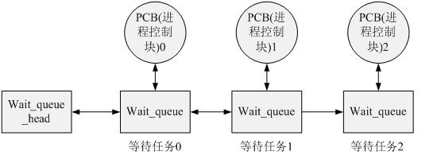

在Linux内核中等待队列有很多用途，可用于中断处理、进程同步及定时。我们在这里只说，进程经常必须等待某些事件的发生。等待队列实现了在事件上的条件等待: 希望等待特定事件的进程把自己放进合适的等待队列，并放弃控制全。因此，等待队列表示一组睡眠的进程，当某一条件为真时，由内核唤醒它们。

等待队列由循环链表实现，其元素包括指向进程描述符的指针。每个等待队列都有一个等待队列头(wait queue head),等待队列头是一个类型为wait_queue_head_t的数据结构

相关内容可以在linux/include/wait.h中找到

（1）定义等待队列头（相关内容可以在linux/include/wait.h中找到）

等待队列头结构体的定义：

struct __wait_queue_head {

　　spinlock_t  lock;          //自旋锁变量，用于在对等待队列头          

　　struct list_head task_list;  // 指向等待队列的list_head

}; 

typedef struct __wait_queue_head  wait_queue_head_t;

使用等待队列时首先需要定义一个wait_queue_head，这可以通过DECLARE_WAIT_QUEUE_HEAD宏来完成，这是静态定义的方法。该宏会定义一个wait_queue_head，并且初始化结构中的锁以及等待队列。当然，动态初始化的方法也很简单，初始化一下锁及队列就可以了。

#define DECLARE_WAIT_QUEUE_HEAD(name) \ 

wait_queue_head_t name = __WAIT_QUEUE_HEAD_INITIALIZER(name)

#define __WAIT_QUEUE_HEAD_INITIALIZER(name) { \

　　.lock                = __SPIN_LOCK_UNLOCKED(name.lock),                \

　　.task_list        = { &(name).task_list, &(name).task_list } }

将lock赋为unlocked, 将等待队列头指向的等待队列链表指向name,从而将等待队列头和等待队列连起来;

 一般在写程序的时候将DECLARE_WAIT_QUEUE_HEAD分成两步来完成：

声明：

wait_queue_head_t  wait_que;

初始化：

init_waitqueue_head( &wait_que);

 

     Linux中等待队列的实现思想如下图所示，当一个任务需要在某个wait_queue_head上睡眠时，将自己的进程控制块信息封装到wait_queue中，然后挂载到wait_queue的链表中，执行调度睡眠。当某些事件发生后，另一个任务（进程）会唤醒wait_queue_head上的某个或者所有任务，唤醒工作也就是将等待队列中的任务设置为可调度的状态，并且从队列中删除。

Linux将进程状态描述为如下五种：

TASK_RUNNING：可运行状态。处于该状态的进程可以被调度执行而成为当前进程。

TASK_INTERRUPTIBLE：可中断的睡眠状态。处于该状态的进程在所需资源有效时被唤醒，也可以通过信号或定时中断唤醒（因为有signal_pending()函数）。

TASK_UNINTERRUPTIBLE：不可中断的睡眠状态。处于该状态的进程仅当所需资源有效时被唤醒。

TASK_ZOMBIE：僵尸状态。表示进程结束且已释放资源，但其task_struct仍未释放。

TASK_STOPPED：暂停状态。处于该状态的进程通过其他进程的信号才能被唤醒。
