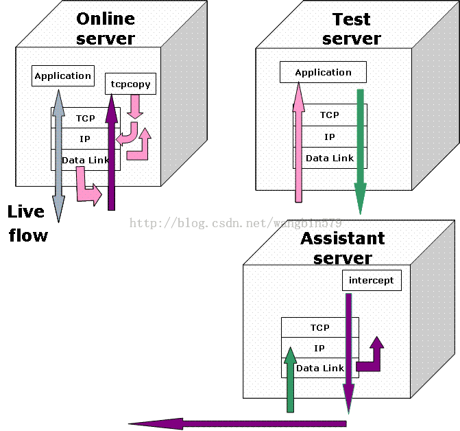
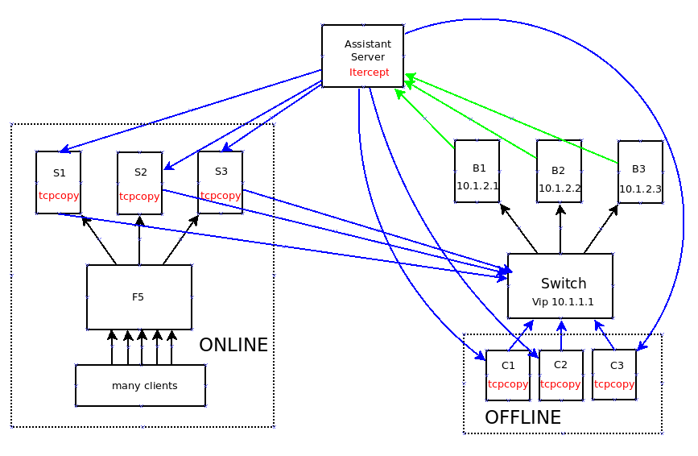

为什么用 tcpcopy 进行负载均衡测试
----------------------------

tcpcopy介绍
----------------------------

tcpcopy 是由网易技术部于 2011 年 9 月开源的一个项目, tcpcopy 是一种请求复制工具。
可以将线上流量拷贝到测试机器，实时的模拟线上环境。在不影响线上用户的情况下，使用
线上流量进行测试，以尽早发现 bug。也可以通过放大流量，进行压力测试，评估系统承载能力。

与传统的压力测试工具（如：abench）相比，tcpcopy 的最大优势在于其实时及真实性，
除了少量的丢包，完全拷贝线上流量到测试机器，真实的模拟线上流量的变化规律。

原理
----------------------------

1. 客户端访问线上服务器
2. 线上服务器的 tcpcopy 进程将 ip 层的数据包拷贝一份到测试服务器
3. 测试服务器响应客户端的请求, 将应答消息回复给辅助服务器
4. 辅助服务器在链路层捕获应答包回复给线上的 tcpcopy 进程，在 ip 层将应答包丢掉.

注
    线上的 tcpcopy 对系统的负载很小, 不会给线上服务器造成很多压力.

通过以上四步将线上流量无缝导入到测试服务器, 对于我们负载均衡网关我们可以这样部署

注:

* 每台后端服务器都是双网卡, 每条服务器连接的不同颜色的线代表不同的网卡
* S1 S2 S3 与 B1 B2 B3 运行相同的服务

其中, 测试可以分为在线模式和离线模式

**在线模式**

1. F5 是现有的均衡网关, 后面由 3 台服务器, 每台服务的另一个网卡连接到交换机上,且运行 tcpcopy

    $S1: tcpcopy -x 80-10.1.2.100-80 -s 10.1.2.30 -c 10.1.3.x -d
    $S2: tcpcopy -x 80-10.1.2.100-80 -s 10.1.2.30 -c 10.1.4.x -d
    $S3: tcpcopy -x 80-10.1.2.100-80 -s 10.1.2.30 -c 10.1.5.x -d

上述命令, 使得每台服务器的将客户端流量拷贝对应的交换机的端口,
并且修改对应的客户端 ip 分别为 10.1.的3, 4, 5 网段的随机 ip

2. 拷贝的流量经过云网关的均匀负载后端服务器 B1 B2 B3

3. B1,B2,B3 分别增加如下路由

    $B1: route add -net 10.1.3.0 netmask 255.255.255.0 gw 10.1.2.30
    $B2: route add -net 10.1.4.0 netmask 255.255.255.0 gw 10.1.2.30
    $B3: route add -net 10.1.5.0 netmask 255.255.255.0 gw 10.1.2.30

后端服务器处理客户端的请求后, 按照上述路由, 将应答转发给辅助服务器(Assistant Server)

4. 辅助服务器运行 itercept 程序

   itercept -i eth0 -F "tcp and src port 80" -d

上述命令, 将使得辅助服务器捕获链路层的应答消息头发送给交换机, 交换机将对应的请求转发到后端服务器 S1 S2 S3, 在应答包到达 IP 层将其丢掉

5. 在线后端服务器 S1, S2, S3 收到交换机的应答后, 关闭对应的连接

**离线模式**

如果担心 tcpcopy 进程会干扰线上服务, 也可以通过 tcpdump 在各个服务器上
抓包, 将抓包的数据生成流量进行测试

1. 在线上的每台后端服务器运行 tcpdump 将对应的客户端流量抓包后保持

   $S1 tcpdump -i eth0 tcp and port 80 -s 0 -w s1.pcap
   $S2 tcpdump -i eth0 tcp and port 80 -s 0 -w s2.pcap
   $S3 tcpdump -i eth0 tcp and port 80 -s 0 -w s3.pcap

2. 经过一个时间的抓包, 将抓包的文件拷贝到 C1, C2, C3, 分别运行 tcpcopy
生成测试流量

   $C1: ./tcpcopy -i s1.pcap -x 80-10.1.1.100
   $C2: ./tcpcopy -i s2.pcap -x 80-10.1.1.100
   $C3: ./tcpcopy -i s3.pcap -x 80-10.1.1.100

3. 拷贝的流量经过云网关的均匀负载后端服务器 B1 B2 B3

4. B1,B2,B3 分别增加如下路由

    $B1: route add -net 10.1.3.0 netmask 255.255.255.0 gw 10.1.2.30
    $B2: route add -net 10.1.4.0 netmask 255.255.255.0 gw 10.1.2.30
    $B3: route add -net 10.1.5.0 netmask 255.255.255.0 gw 10.1.2.30

后端服务器处理客户端的请求后, 按照上述路由, 将应答转发给辅助服务器(Assistant Server)

5. 辅助服务器运行 itercept 程序

   itercept -i eth0 -F "tcp and src port 80" -d

上述命令, 将使得辅助服务器捕获链路层的应答消息头发送给交换机, 交换机将对应的请求转发到
客户端 C1 C2 C3, 在应答包到达 IP 层将其丢掉

6. 客户端 C1, C2, C3 收到交换机的应答后, 关闭对应的连接

高级
---------------------------

* 流量可以加倍
* 辅助服务器可以扩展为多台

好处
---------------------------

* 通过实际的线上流量测试云网关与 F5 或其他同类产品的性能,功能等等.
* 上线前的真实模拟, 有助于发现产品 bug

参考
---------------------------
[tcpcopy 1.0 使用方法](http://blog.csdn.net/wangbin579/article/details/8950282)_
[tcpcopy 架构变化](http://blog.csdn.net/wangbin579/article/details/8949315)
[tcpcopy 实践](http://www.cnblogs.com/zhengyun_ustc/p/tcpcopy.html)
