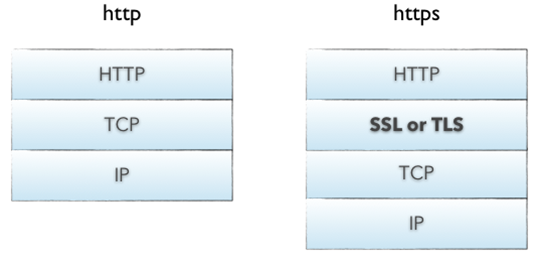
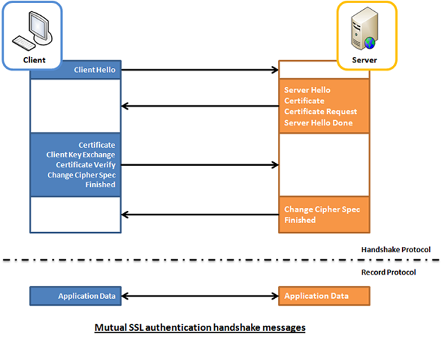
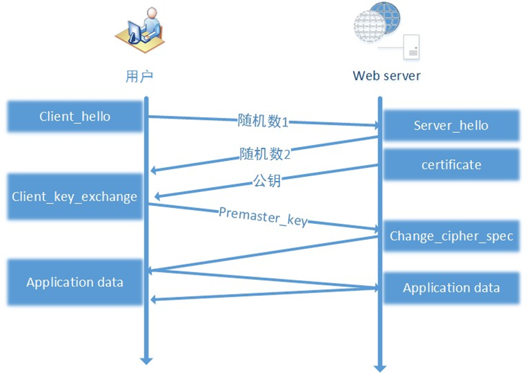
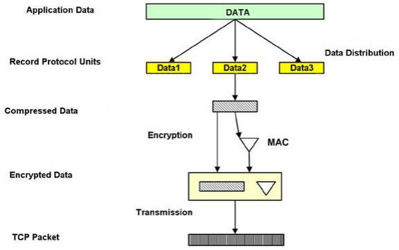
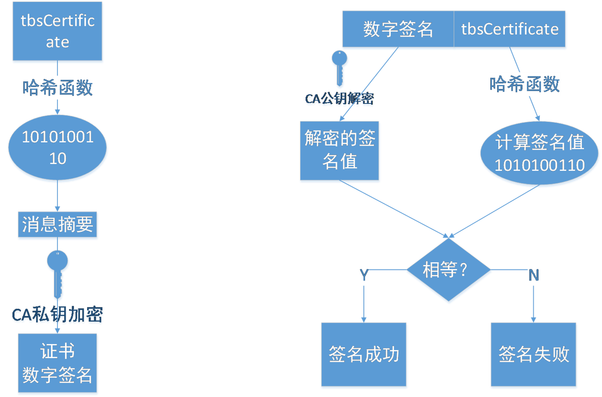
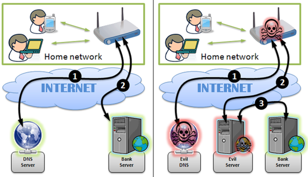
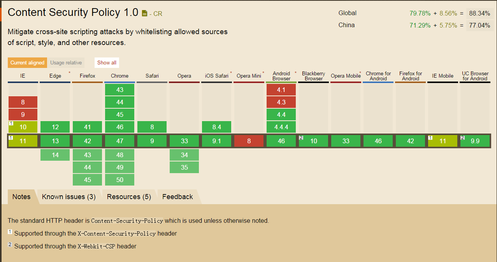

http://www.woniubi.cn/https_summary_getting_to_know/

##为什么要使用https

明文传输的http, 存在被内网嗅探以及内容被劫持的危险, 无论是用户还是网站管理者都不愿意看到这种情况发生.

* 窃取用户隐私: 用户提交密码的时候，可以被嗅探或者被路由器被攻破，拦截数据，从而密码泄露。另外一些网页传输一些明文的资料，也可能被泄露。
* 跟踪用户行为: 用户上网的时候，服务器返回的html当中，插入一段JS，用户都做了什么，浏览了什么页面，都可以被人得知。你搜索了一个东西，也许很快就有人给你打电话联系你 。
* 网页挂马: 很简单，利用浏览器漏洞，可以自动下载木马并且运行。
* 广告联盟: 页面插入广告，引导或者误导用户点击，用户以为是网站添加的，网站管理者躺着中枪。另外用户输入一个地址的时候，先跳转到广告联盟，然后跳转回来，相当于是广告联盟引流过去，这样网站管理者就得多付钱，用户体验也降低了。
* 账户安全: 不安全的http，下面不敢输入密码呀。

还有一些的危险方面，不一一列举。


##一种安全的解决方案-https

* 具有身份认证
* 保证数据完整性
* 数据加密，即使数据泄露，也无法破解。
* 效率，可以被容忍
* 现在的客户端以及服务端基本上都可以支持
* 可以使用现在主流的加密算法

###多了中间层 SSL/TLS

> 尼古拉斯赵四曾说过,在东北没有什么事儿是一顿烧烤解决不了的。同样在软件行业，有类似的这么一句话。
计算机的任何问题都可以通过增加一个虚拟层来解决



SSL网景公司发明，后来被IETF改名为TLS。现在常见的版本，有SSL 3.0，TLS 1.0 ,TLS 1.1, TLS 1.2四个版本。但是SSL3.0 TLS1.0有很大的安全漏洞，最好不要使用了。

###版本支持情况

服务器端，随时可以更新版本支持最新的版本，也可以配置支持哪些版本。

浏览器端，一般是发布的时候，支持当时主流的版本。后期的版本，就支持不了。维基百科，有相关的浏览器的支持情况。

如果服务端最低版本支持TLS1.0，而IE6 默认支持版本SSL 3.0，怎么办？用户无法访问了呗。


###SSL/TLS都做了什么事情

* 版本协商，客户端以及服务端都支持的最高版本。
* 加密算法协商，包括对称加密算法，以及非对称加密算法等。
* 压缩算法协商。
* 密钥协商，商定传输数据时需要的对称加密的key。
* 数据传输的加解密。


##他们是如何完成协商的

https是基于TCP握手之后，然后开始SSL握手的。平常一些文章说HTTPS是4次握手，其实是7次握手。



首先是客户端发送client Hello ,然后服务端发送Server Hello,就完成了大部分的协商，只剩下密钥协商。这两个Hello不是一般的Hello

```
    struct {
        ProtocolVersion client_version;  //支持的最高的版本号
        Random random;  //随机数，参数密钥的计算
        SessionID session_id;  // session id
        CipherSuite cipher_suites<0..216-1>;//支持的对称加密算法列表，非对称加密算法列表，MAC算法列表
        CompressionMethod compression_methods<0..28-1>;  //支持压缩算法列表
    } ClientHello;

    struct {
        ProtocolVersion server_version;//协商之后的版本号
        Random random;  //发送随机数，参与密钥的计算
        SessionID session_id;  // session id
        CipherSuite cipher_suite;  //协商之后的对称加密算法，非对称加密算法，MAC算法
        CompressionMethod compression_method;  //协商的压缩算法
    } ServerHello;
```

客户端发送自己能支持的版本以及算法列表，然后服务端根据自己情况，确定大家都使用这个版本以及算法。

如果客户端支持SSL 3.0, TLS1.0 ,TLS 1.1，他会发送TLS1.1。服务端它支持TLS1.0-1.2版本，最后他们会使用TLS1.1。协商的目的，就是大家都可以使用的最高的版本。如果服务器只支持TLS1.2，那么协商就失败，连接就会关闭。

算法协商，不是版本号，是根据客户端传过来的列表顺序，挨个检查，直到第一个服务端也支持。

###密钥协商

密钥协商，就是协商传输数据加密需要的key.



这个图和上一篇文章的图相对简单了很多，去掉一些无用的东东。

* 两个随机数，分别通过Hello 结构体传输给对方，他们会参与到密钥的计算。
* 服务端会把证书传给客户端，证书里面带着公钥。
* 客户端把两个随机数，加入到密钥计算当中。然后生成对称加密的密钥，通过公钥加密传输给服务端
* 服务端使用私钥解密出来对称加密的密钥。
* 最后他们使用对称加密的密钥进行加解密传输。

####对称加密和非对称加密分别存在的意义

全程都使用非对称加密是否可以？

不可以。1：非对称加解密非常消耗CPU，用来加密应用数据，非常耗时。2：非对称加密的内容的长度不能超过密钥长度，现在密钥的长度一般采用2048位，也就是256个字节。

全程使用对称加密是否可以？

不可以，密钥中途可能被拦截，数据也就会被篡改以及破解。

所以既要保证效率也要保证安全。

####协商出来的对称加密key怎么使用？

一直以为对称加密key是一个字符串，其实是6个。他们是如何使用的？

    client_write_MAC_secret
    server_write_MAC_secret
    client_write_key
    server_write_key
    client_write_IV
    server_write_IV



比如服务端传送数据。

* 一份数据，切分成多个小份数据。
* 小份数据经过压缩。
* 压缩数据使用server_write_IV 和 server_write_key，使用对称加密算法，计算数据。
* 压缩数据使用server_write_MAC_secret，进行MAC算法哈希，来防止数据被篡改以及丢失，保证数据的完整性。
* 然后把这连个数据，一起发给客户端。
* 客户端首先解密数据，然后使用server_write_MAC_secret，进行MAC算法哈希，对比MAC值是否一致，如果一致，就认为数据正确。否则就会丢弃。

客户端发送数据也是这样，双发发送数据，使用不同的key。

这样做的目的是可以保证数据加密，也可以保证数据的完整性。

###证书的信任

 坏人太多，我们不得不防。如果出现下面这种中间人攻击，怎么处理？


 我们即使通过https连接，但是我们可能连接的是坏人的服务器，他们也开启了https，作为客户端如何区分是不是坏人的服务器。这个时候就看客户端对服务端的证书的是否信任了。

产生证书的途径有两种，自签名证书和CA机构颁发。我们的电脑里面，会保存一份受信任的CA机构的根证书，浏览器就信任电脑这份CA列表颁发的证书，Firefox信任自带的CA列表。

下面问题来了？

###如何区分是不是CA机构颁发的证书呢？

证书里面含有很多信息，比如使用者是谁，使用的域名，有效期等。最重要的还有一个数字签名。



* 先创建一个证书请求，然后上传到CA结构。
* CA机构会检查上传者的信息以及域名等信息，如果通过进行下一步。
* CA机构，把证书请求的信息，进行哈希，得出一个值，然后通过他的私钥计算出来数字签名。
* 最后产生数字证书给请求者。
* 网站管理员会把证书部署到服务器上面，用户访问的时候，服务端会发送到浏览器。
* 浏览器根据证书信息，哈希出来一个值，我们称为A。
* 浏览器使用CA机构根证书，里面有公钥。然后解密数字签名，得出一个值，我们称为B。
* 对比A和B，是否一致，如果一致的话，那就代表是CA机构颁发的。

如果CA机构的私钥泄露的话，其他人都可以伪造证书颁发了。

###仅仅检查是不是CA机构颁发的就可以了吗？

肯定不是的呀，还得检查有效期，域名信息是否一致等。

###服务端使用https，用户一定是安全的吗？



左图是正常的连接。右图也是一个中间人攻击，你可能使用http连接方式连接坏人的网站，没有任何的警告，所以说，如果重要的信息，非HTTPS页面不要乱填。

###页面是HTTPS，域名也正确，一定是安全的吗？

答案也是否定的，有可能坏人在你的电脑里面安装了一个根证书，导致即使是自签名证书，浏览器也信任这个证书，没有任何的报警。

###我们为什么要上https

我说为了保护用户隐私，你们相信吗？我们就是这么一个目的，电商网站里面有不少页面，涉及到用户电话，地址的信息。

###上线前的疑问

我们的业务是在很多国家下面都有的，每一个国家的基础设施不一样，导致访问网站的速度还是不一样的。

所以问题来了？

* 所有的国家都上，还是部分国家上？
* 全站上？还是部分页面上？
* 所有的终端上，还是PC端，M站，APP分别上？

这些问题如果不解决，是不能随便上线的，所以我们进行了数据调研。

###数据调研

我们买了一些基调数据以及页面埋点（幸亏用户前端性能检测是我负责的），可以得知不同国家的网络速度。一些国家或者地区网速太慢，就暂时不上https。

另外调研了国内以及国际的一些主流的网站，全站上的有，部分页面上的也有，最后我们对不涉及用户隐私信息的页面，暂时不上https。

###上线前的目标

* 可以灰度上线（部分国家，用户，终端等）
* 可以快速上下线（设置一个开关，可以快速的开启或者暂停某个国家https）
* 可以协议检测纠正（涉及用户隐私的页面，不允许走http，进行302纠正）

###除了开发还做了什么

* 页面梳理，哪些页面需要走https，提前需要和前端开发的同学定义好，尽量不走302。
* 静态资源梳理。
* 服务器配置。
* 证书购买。

这里面最困难的是静态资源梳理。Https页面，要求静态资源以及Ajax请求也都必须走https，对于http资源是拒绝加载的。部分的移动浏览器是没有这个限制的，但是最好我们都是https。

静态资源来源很多地方，常见的有：

* 开发需要的JS，CSS，图片
* 运营通过CMS上传的图片
* 其他服务的图片

我们对于静态资源资源做了很多，总结了一下常用的

* 协议自适应。平常的资源是http://开头，我们现在变成了//，浏览器可以根据当前的协议，自动的加载相同协议的资源。
* 保存转化。修改一些相应系统，保存图片的时候，协议地址更改成为//
* 动态转化。一些其他系统，不太愿意或者改动的地方比较麻烦，我们需要在后端转化完成给前端。

做了这些，总有可能失误，想不到的地方，所以我们防止万一这种情况的出现，就添加了一个header头部。

###保全之策-CSP

    Content-Security-Policy:upgrade-insecure-requests
    <meta http-equiv="Content-Security-Policy" content="upgrade-insecure-requests">

这两个作用是相同的，任意添加一个就可以，第一个添加html当中的 http header头部当中，第二个是添加到html当中。

这个的作用，https页面，出现http资源，浏览器可以自动加载相应的https资源。这就要保证这个域名同时支持http以及https。

但是这个只能作为保全之策，并不是所有的浏览器都支持。



###最后的感悟

还有一些东西，没有写，比如说HSTS，非对称加密算法，Keyless Key， Session id，东西太多，而了解太少。还有很多想了解的地方，如何优化连接等。
