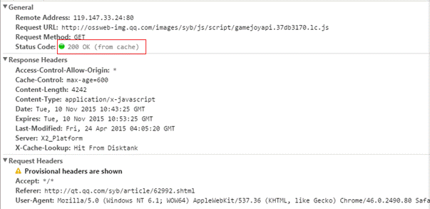
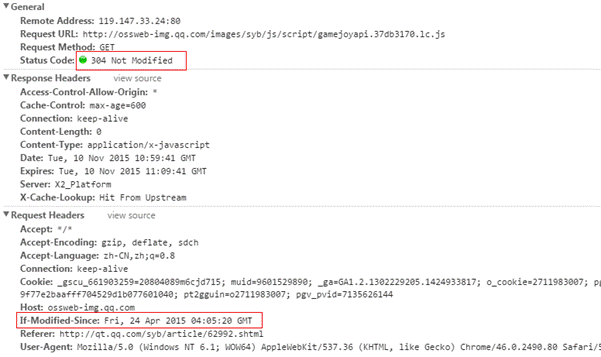
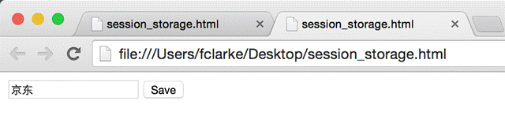
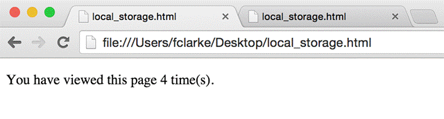

## H5 缓存机制介绍

H5，即 HTML5，是新一代的 HTML 标准，加入很多新的特性。离线存储（也可称为缓存机制）是其中一个非常重要的特性。H5 引入的离线存储，这意味着 web 应用可进行缓存，并可在没有因特网连接时进行访问。

H5 应用程序缓存为应用带来三个优势：

* 离线浏览 用户可在应用离线时使用它们
* 速度 已缓存资源加载得更快
* 减少服务器负载 浏览器将只从服务器下载更新过或更改过的资源。

根据标准，到目前为止，H5 一共有6种缓存机制，有些是之前已有，有些是 H5 才新加入的。

* 浏览器缓存机制
* Dom Storgage（Web Storage）存储机制
* Web SQL Database 存储机制
* Application Cache（AppCache）机制
* Indexed Database （IndexedDB）
* File System API

下面我们首先分析各种缓存机制的原理、用法及特点；然后针对 Anroid 移动端 Web 性能加载优化的需求，看如果利用适当缓存机制来提高 Web 的加载性能。

##H5 缓存机制原理分析

###浏览器缓存机制

浏览器缓存机制是指通过 HTTP 协议头里的 Cache-Control（或 Expires）和 Last-Modified（或 Etag）等字段来控制文件缓存的机制。这应该是 WEB 中最早的缓存机制了，是在 HTTP 协议中实现的，有点不同于 Dom Storage、AppCache 等缓存机制，但本质上是一样的。可以理解为，一个是协议层实现的，一个是应用层实现的。

Cache-Control 用于控制文件在本地缓存有效时长。最常见的，比如服务器回包：Cache-Control:max-age=600 表示文件在本地应该缓存，且有效时长是600秒（从发出请求算起）。在接下来600秒内，如果有请求这个资源，浏览器不会发出 HTTP 请求，而是直接使用本地缓存的文件。

Last-Modified 是标识文件在服务器上的最新更新时间。下次请求时，如果文件缓存过期，浏览器通过 If-Modified-Since 字段带上这个时间，发送给服务器，由服务器比较时间戳来判断文件是否有修改。如果没有修改，服务器返回304告诉浏览器继续使用缓存；如果有修改，则返回200，同时返回最新的文件。

Cache-Control 通常与 Last-Modified 一起使用。一个用于控制缓存有效时间，一个在缓存失效后，向服务查询是否有更新。

Cache-Control 还有一个同功能的字段：Expires。Expires 的值一个绝对的时间点，如：Expires: Thu, 10 Nov 2015 08:45:11 GMT，表示在这个时间点之前，缓存都是有效的。

Expires 是 HTTP1.0 标准中的字段，Cache-Control 是 HTTP1.1 标准中新加的字段，功能一样，都是控制缓存的有效时间。当这两个字段同时出现时，Cache-Control 是高优化级的。

Etag 也是和 Last-Modified 一样，对文件进行标识的字段。不同的是，Etag 的取值是一个对文件进行标识的特征字串。在向服务器查询文件是否有更新时，浏览器通过 If-None-Match 字段把特征字串发送给服务器，由服务器和文件最新特征字串进行匹配，来判断文件是否有更新。没有更新回包304，有更新回包200。Etag 和 Last-Modified 可根据需求使用一个或两个同时使用。两个同时使用时，只要满足基中一个条件，就认为文件没有更新。

另外有两种特殊的情况：

* 手动刷新页面（F5)，浏览器会直接认为缓存已经过期（可能缓存还没有过期），在请求中加上字段：Cache-Control:max-age=0，发包向服务器查询是否有文件是否有更新。

* 强制刷新页面（Ctrl+F5)，浏览器会直接忽略本地的缓存（有缓存也会认为本地没有缓存），在请求中加上字段：Cache-Control:no-cache（或 Pragma:no-cache），发包向服务重新拉取文件。

下面是通过 Google Chrome 浏览器（用其他浏览器+抓包工具也可以）自带的开发者工具，对一个资源文件不同情况请求与回包的截图。

首次请求：200


缓存有效期内请求：200(from cache)



缓存过期后请求：304（Not Modified)



一般浏览器会将缓存记录及缓存文件存在本地 Cache 文件夹中。Android 下 App 如果使用 Webview，缓存的文件记录及文件内容会存在当前 app 的 data 目录中。

分析：Cache-Control 和 Last-Modified 一般用在 Web 的静态资源文件上，如 JS、CSS 和一些图像文件。通过设置资源文件缓存属性，对提高资源文件加载速度，节省流量很有意义，特别是移动网络环境。但问题是：缓存有效时长该如何设置？如果设置太短，就起不到缓存的使用；如果设置的太长，在资源文件有更新时，浏览器如果有缓存，则不能及时取到最新的文件。

Last-Modified 需要向服务器发起查询请求，才能知道资源文件有没有更新。虽然服务器可能返回304告诉没有更新，但也还有一个请求的过程。对于移动网络，这个请求可能是比较耗时的。有一种说法叫“消灭304”，指的就是优化掉304的请求。

抓包发现，带 if-Modified-Since 字段的请求，如果服务器回包304，回包带有 Cache-Control:max-age 或 Expires 字段，文件的缓存有效时间会更新，就是文件的缓存会重新有效。304回包后如果再请求，则又直接使用缓存文件了，不再向服务器查询文件是否更新了，除非新的缓存时间再次过期。

另外，Cache-Control 与 Last-Modified 是浏览器内核的机制，一般都是标准的实现，不能更改或设置。以 QQ 浏览器的 X5为例，Cache-Control 与 Last-Modified 缓存不能禁用。缓存容量是12MB，不分HOST，过期的缓存会最先被清除。如果都没过期，应该优先清最早的缓存或最快到期的或文件大小最大的；过期缓存也有可能还是有效的，清除缓存会导致资源文件的重新拉取。

还有，浏览器，如 X5，在使用缓存文件时，是没有对缓存文件内容进行校验的，这样缓存文件内容被修改的可能。

分析发现，浏览器的缓存机制还不是非常完美的缓存机制。完美的缓存机制应该是这样的：

* 缓存文件没更新，尽可能使用缓存，不用和服务器交互；
* 缓存文件有更新时，第一时间能使用到新的文件；
* 缓存的文件要保持完整性，不使用被修改过的缓存文件；
* 缓存的容量大小要能设置或控制，缓存文件不能因为存储空间限制或过期被清除。

以X5为例，第1、2条不能同时满足，第3、4条都不能满足。

在实际应用中，为了解决 Cache-Control 缓存时长不好设置的问题，以及为了”消灭304“，Web前端采用的方式是：

    在要缓存的资源文件名中加上版本号或文件 MD5值字串，如 common.d5d02a02.js，common.v1.js，同时设置 Cache-Control:max-age=31536000，也就是一年。在一年时间内，资源文件如果本地有缓存，就会使用缓存；也就不会有304的回包。

    如果资源文件有修改，则更新文件内容，同时修改资源文件名，如 common.v2.js，html页面也会引用新的资源文件名。

通过这种方式，实现了：缓存文件没有更新，则使用缓存；缓存文件有更新，则第一时间使用最新文件的目的。即上面说的第1、2条。第3、4条由于浏览器内部机制，目前还无法满足。

###Dom Storage 存储机制

DOM 存储是一套在 Web Applications 1.0 规范中首次引入的与存储相关的特性的总称，现在已经分离出来，单独发展成为独立的 W3C Web 存储规范。 DOM 存储被设计为用来提供一个更大存储量、更安全、更便捷的存储方法，从而可以代替掉将一些不需要让服务器知道的信息存储到 cookies 里的这种传统方法。

上面一段是对 Dom Storage 存储机制的官方表述。看起来，Dom Storage 机制类似 Cookies，但有一些优势。

Dom Storage 是通过存储字符串的 Key/Value 对来提供的，并提供 5MB （不同浏览器可能不同，分 HOST)的存储空间（Cookies 才 4KB)。另外 Dom Storage 存储的数据在本地，不像 Cookies，每次请求一次页面，Cookies 都会发送给服务器。

DOM Storage 分为 sessionStorage 和 localStorage。localStorage 对象和 sessionStorage 对象使用方法基本相同，它们的区别在于作用的范围不同。sessionStorage 用来存储与页面相关的数据，它在页面关闭后无法使用。而 localStorage 则持久存在，在页面关闭后也可以使用。

Dom Storage 提供了以下的存储接口：

```
    interface Storage {
    readonly attribute unsigned long length;
    [IndexGetter] DOMString key(in unsigned long index);
    [NameGetter] DOMString getItem(in DOMString key);
    [NameSetter] void setItem(in DOMString key, in DOMString data);
    [NameDeleter] void removeItem(in DOMString key);
    void clear();
    };
```

sessionStorage 是个全局对象，它维护着在页面会话(page session)期间有效的存储空间。只要浏览器开着，页面会话周期就会一直持续。当页面重新载入(reload)或者被恢复(restores)时，页面会话也是一直存在的。每在新标签或者新窗口中打开一个新页面，都会初始化一个新的会话。


```
    <script type="text/javascript">
     // 当页面刷新时，从sessionStorage恢复之前输入的内容
     window.onload = function(){
        if (window.sessionStorage) {
            var name = window.sessionStorage.getItem("name");
            if (name != "" || name != null){
                document.getElementById("name").value = name;
             }
         }
     };

     // 将数据保存到sessionStorage对象中
     function saveToStorage() {
        if (window.sessionStorage) {
            var name = document.getElementById("name").value;
            window.sessionStorage.setItem("name", name);
            window.location.href="session_storage.html";
         }
     }
     </script>

    <form action="./session_storage.html">
        <input type="text" name="name" id="name"/>
        <input type="button" value="Save" onclick="saveToStorage()"/>
    </form>
```

当浏览器被意外刷新的时候，一些临时数据应当被保存和恢复。sessionStorage 对象在处理这种情况的时候是最有用的。比如恢复我们在表单中已经填写的数据。

把上面的代码复制到 session_storage.html（也可以从附件中直接下载）页面中，用 Google Chrome 浏览器的不同 PAGE 或 WINDOW 打开，在输入框中分别输入不同的文字，再点击“Save”，然后分别刷新。每个 PAGE 或 WINDOW 显示都是当前PAGE输入的内容，互不影响。关闭 PAGE，再重新打开，上一次输入保存的内容已经没有了。


Local Storage 的接口、用法与 Session Storage 一样，唯一不同的是：Local Storage 保存的数据是持久性的。当前 PAGE 关闭（Page Session 结束后），保存的数据依然存在。重新打开PAGE，上次保存的数据可以获取到。另外，Local Storage 是全局性的，同时打开两个 PAGE 会共享一份存数据，在一个PAGE中修改数据，另一个 PAGE 中是可以感知到的。

```
    <script>
      //通过localStorage直接引用key, 另一种写法，等价于：
      //localStorage.getItem("pageLoadCount");
      //localStorage.setItem("pageLoadCount", value);
      if (!localStorage.pageLoadCount)
    localStorage.pageLoadCount = 0;
         localStorage.pageLoadCount = parseInt(localStorage.pageLoadCount) + 1;
         document.getElementById('count').textContent = localStorage.pageLoadCount;
    </script>

    <p>
        You have viewed this page
        <span id="count">an untold number of</span>
        time(s).
    </p>
```

将上面代码复制到 local_storage.html 的页面中，用浏览器打开，pageLoadCount 的值是1；关闭 PAGE 重新打开，pageLoadCount 的值是2。这是因为第一次的值已经保存了。



用两个 PAGE 同时打开 local_storage.html，并分别交替刷新，发现两个 PAGE 是共享一个 pageLoadCount 的。


