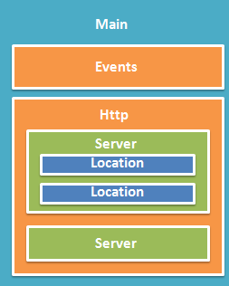
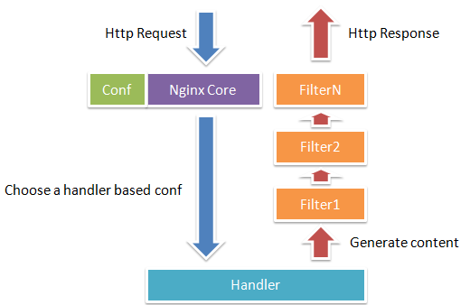

1. 初探nginx架构
2. handler模块
3. Nginx编译、安装、配置
4. Hello World模块开发

##初探nginx架构

nginx 在启动后, 在 unix 系统中会以 daemon 的方式在后台运行, 后台进程包含一个 master 进程和多个 worker 进程.
我们也可以手动地关掉后台模式, 让 nginx 在前台运行, 并且通过配置让 nginx 取消 master 进程, 从而可以使 nginx
以单进程方式运行(很显然, 生产环境下我们肯定不会这么做, 所以关闭后台模式, 一般是用来调试用的). 所以, 我们可
以看到, nginx 是以多进程的方式来工作的, 当然 nginx 也是支持多线程的方式的, 只是我们主流的方式还是多进程的
方式, 也是 nginx 的默认方式 nginx 在启动后, 会有一个 master 进程和多个 worker 进程

1. master进程主要用来管理worker进程, 包含:

    1) 接收来自外界的信号
    2) 向各worker进程发送信号
    3) 监控worker进程的运行状态
    4) 当worker进程退出后(异常情况下)，会自动重新启动新的worker进程

2. woker进程: 基本的网络事件, 则是放在 worker 进程中来处理了

    1) 多个 worker 进程之间是对等的, 他们同等竞争来自客户端的请求, 各进程互相之间是独立的
    2) 一个请求, 只可能在一个 worker 进程中处理, 一个 worker 进程, 不可能处理其它进程的请求
    3) worker 进程的个数是可以设置的, 一般我们会设置与机器 cpu 核数一致, 这里面的原因与 nginx 的进程模型以及事件处理模型是分不开的


从上文中我们可以看到, master 来管理 worker 进程, 所以我们只需要与 master 进程通信就行了. master 进程会接收来自外界发来的信号, 再根
据信号做不同的事情. 所以我们要控制 nginx, 只需要通过 kill 向 master 进程发送信号就行了. 比如 kill -HUP pid, 则是告诉 nginx, 从容地
重启nginx, 我们一般用这个信号来重启 nginx, 或重新加载配置, 因为是从容地重启, 因此服务是不中断的

    1. 首先 master 进程在接到信号后, 会先重新加载配置文件
    2. 然后再启动新的 worker 进程, 并向所有老的 worker 进程发送信号, 告诉他们可以光荣退休了
    3. 新的 worker 在启动后, 就开始接收新的请求(并获取新的配置文件)
    4. 而老的 worker 在收到来自 master 的信号后, 就不再接收新的请求, 并且在处理完当前进程中的未完成请求后, 再退出
    /*
    当然, 直接给 master 进程发送信号, 这是比较老的操作方式, nginx 在 0.8 版本之后, 引入了一系列命令行参数, 来方便我们管理. 比如

    1) ./nginx -s reload: 重启 nginx: 执行命令时，我们是启动一个新的 nginx 进程, 而新的 nginx 进程在解析到 reload 参数后, 就知道我们
    的目的是控制 nginx 来重新加载配置文件了, 它会向 master 进程发送信号, 然后接下来的动作, 就和我们直接向 master 进程发送信号一样了
    2) ./nginx -s stop: 停止nginx的运行
    */

worker 进程之间是平等的, 每个进程, 处理请求的机会也是一样的. 当我们提供 80 端口的 http 服务时, 一个连接请求过来, 每个进程都有可能处理这个连接

    1. 每个 worker 进程都是从 master 进程 fork 过来
    2. 在 master 进程里面, 先建立好需要 listen 的 socket(listenfd) 之后, 然后再 fork 出多个 worker 进程
    3. 所有 worker 进程的 listenfd 会在新连接到来时变得可读(子进程和父进程通过 fork 共享文件句柄, 这使得所有 worker 进程能够拥有同等的机会处理
       本次请求), 为保证只有一个进程处理该连接, 所有 worker 进程在注册 listenfd 读事件前抢 accept_mutex, 抢到互斥锁的那个进程注册 listenfd 读事
       件, 在读事件里调用 accept 接受该连接(connfd), 所有 worker 进程都会去争夺 listenfd 的读权限, 但只有一个 worker 能最终获得, 并调用 accept
       获得 connfd, 进行后续的动作, 而其他未争夺到本次 listenfd 的 worker 则继续等待下一次连接并争夺 listenfd.
    4. 当一个 worker 进程在 accept 这个连接之后, 就开始读取请求, 解析请求, 处理请求, 产生数据后, 再返回给客户端, 最后才断开连接, 这样一个完整的请求就是这样的了
    5. 我们可以看到, 一个请求, 完全由 worker 进程来处理, 而且只在一个 worker 进程中处理

##Nginx Master & Worker架构的优势

1. 对于每个 worker 进程来说, 独立的进程, 不需要加锁, 所以省掉了锁带来的开销
2. 同时在编程以及问题查找时, 也会方便很多
3. 采用独立的进程, 可以让互相之间不会影响, 一个进程退出后, 其它进程还在工作, 服务不会中断, master进程则很快启动新的worker进程

##Nginx的异步非阻塞请求模型


看看一个请求的完整过程. 首先, 请求过来, 要建立连接，然后再接收数据，接收数据后，再发送数据。具体到系统底层，就是读写事件，而当
读写事件没有准备好时，必然不可操作，如果不用非阻塞的方式来调用，那就得阻塞调用了，事件没有准备好，那就只能等了，等事件准备好了，
你再继续吧。阻塞调用会进入内核等待，cpu就会让出去给别人用了，对单线程的worker来说，显然不合适，当网络事件越多时，大家都在等待呢，cpu空
闲下来没人用，cpu利用率自然上不去了，更别谈高并发了。好吧，你说加进程数，这跟apache的线程模型有什么区别，注意，别增加无谓的上下文切换。
所以，在nginx里面，最忌讳阻塞的系统调用了。不要阻塞，那就非阻塞喽。非阻塞就是，事件没有准备好，马上返回EAGAIN，告诉你，事件还没准备好呢，
你慌什么，过会再来吧。好吧，你过一会，再来检查一下事件，直到事件准备好了为止，在这期间，你就可以先去做其它事情，然后再来看看事件好了没。
虽然不阻塞了，但你得不时地过来检查一下事件的状态，你可以做更多的事情了，但带来的开销也是不小的。所以，才会有了异步非阻塞的事件处理机制，
具体到系统调用就是像select/poll/epoll/kqueue这样的系统调用。它们提供了一种机制，让你可以同时监控多个事件，调用他们是阻塞的，但可以设置
超时时间，在超时时间之内，如果有事件准备好了，就返回。这种机制正好解决了我们上面的两个问题，拿epoll为例(在后面的例子中，我们多以epoll
为例子，以代表这一类函数)，当事件没准备好时，放到epoll里面，事件准备好了，我们就去读写，当读写返回EAGAIN时，我们将它再次加入到epoll
里面。这样，只要有事件准备好了，我们就去处理它，只有当所有事件都没准备好时，才在epoll里面等着。这样，我们就可以并发处理大量的并发了，
当然，这里的并发请求，是指未处理完的请求，线程只有一个，所以同时能处理的请求当然只有一个了，只是在请求间进行不断地切换而已，切换也是
因为异步事件未准备好，而主动让出的。这里的切换是没有任何代价，你可以理解为循环处理多个准备好的事件，事实上就是这样的。与多线程相比，
这种事件处理方式是有很大的优势的，不需要创建线程，每个请求占用的内存也很少，没有上下文切换，事件处理非常的轻量级。并发数再多也不会导致
无谓的资源浪费（上下文切换）。更多的并发数，只是会占用更多的内存而已。 我之前有对连接数进行过测试，在24G内存的机器上，处理的并发请求数
达到过200万。现在的网络服务器基本都采用这种方式，这也是nginx性能高效的主要原因。

我们之前说过，推荐设置worker的个数为cpu的核数，在这里就很容易理解了，更多的worker数，只会导致进程来竞争cpu资源了，从而带来不必要的
上下文切换。而且，nginx为了更好的利用多核特性，提供了cpu亲缘性的绑定选项，我们可以将某一个进程绑定在某一个核上，这样就不会因为进程
的切换带来cache的失效。像这种小的优化在nginx中非常常见，同时也说明了nginx作者的苦心孤诣。比如，nginx在做4个字节的字符串比较时，会将
4个字符转换成一个int型，再作比较，以减少cpu的指令数等等

Relevant Link:

http://tengine.taobao.org/book/chapter_02.html#

##handler模块

作为第三方开发者最可能开发的就是三种类型的模块

    1. handler: Handler模块就是接受来自客户端的请求并产生输出的模块
       配置文件中使用 location 指令可以配置 content handler 模块, 当 Nginx 系统启动的时候, 每个 handler 模块都有一次机会把自己关联到对应
       的 location 上(如果有多个 handler 模块都关联了同一个 location, 那么实际上只有一个 handler 模块真正会起作用)

      handler模块处理的结果通常有三种情况
        1) 处理成功
        2) 处理失败(处理的时候发生了错误)
        3) 拒绝去处理.
        在拒绝处理的情况下, 这个 location 的处理就会由默认的 handler 模块来进行处理. 例如, 当请求一个静态文件的时候, 如果关联到这个 location
        上的一个handler模块拒绝处理, 就会由默认的ngx_http_static_module 模块进行处理, 该模块是一个典型的 handler 模块

    2. filter
    3. load-balancer

##模块的基本数据结构

###模块配置结构

基本上每个模块都会提供一些配置指令, 以便于用户可以通过配置来控制该模块的行为. 这些配置信息的存储就需要定义该模块的配置结构来进行存储

Nginx 的配置信息分成了几个作用域(scope,有时也称作上下文)

1. main
2. server
3. location

每个模块提供的配置指令也可以出现在这几个作用域里. 那对于这三个作用域的配置信息, 每个模块就需要定义三个不同的数据结构去进行存储, 有一点
需要特别注意的就是, 在模块的开发过程中, 我们最好使用 nginx 原有的命名习惯. 这样跟原代码的契合度更高, 对于模块配置信息的定义, 命名习惯是

    ngx_http_<module name>_(main|srv|loc)_conf_t。这里有个例子

###模块配置指令

一个模块的配置指令是定义在一个静态数组中的, src/core/ngx_conf_file.h

    struct ngx_command_s
    {
        //配置指令的名称
        ngx_str_t             name;

        /*
        该配置的类型，其实更准确一点说，是该配置指令属性的集合。nginx提供了很多预定义的属性值(一些宏定义)，通过逻辑或运算符可组合在一起，形成对这个配置指令的详细的说明
        1. NGX_CONF_NOARGS：配置指令不接受任何参数
        2. NGX_CONF_TAKE1：配置指令接受1个参数
        3. NGX_CONF_TAKE2：配置指令接受2个参数
        4. NGX_CONF_TAKE3：配置指令接受3个参数
        5. NGX_CONF_TAKE4：配置指令接受4个参数
        6. NGX_CONF_TAKE5：配置指令接受5个参数
        7. NGX_CONF_TAKE6：配置指令接受6个参数
        8. NGX_CONF_TAKE7：配置指令接受7个参数
        可以组合多个属性，比如一个指令即可以不填参数，也可以接受1个或者2个参数。那么就是NGX_CONF_NOARGS|NGX_CONF_TAKE1|NGX_CONF_TAKE2
        1. NGX_CONF_TAKE12：配置指令接受1个或者2个参数
        2. NGX_CONF_TAKE13：配置指令接受1个或者3个参数
        3. NGX_CONF_TAKE23：配置指令接受2个或者3个参数
        4. NGX_CONF_TAKE123：配置指令接受1个或者2个或者3参数
        5. NGX_CONF_TAKE1234：配置指令接受1个或者2个或者3个或者4个参数
        6. NGX_CONF_1MORE：配置指令接受至少一个参数
        7. NGX_CONF_2MORE：配置指令接受至少两个参数
        8. NGX_CONF_MULTI: 配置指令可以接受多个参数，即个数不定

        1. NGX_CONF_BLOCK：配置指令可以接受的值是一个配置信息块。也就是一对大括号括起来的内容。里面可以再包括很多的配置指令。比如常见的server指令就是这个属性的
        2. NGX_CONF_FLAG：配置指令可以接受的值是”on”或者”off”，最终会被转成bool值
        3. NGX_CONF_ANY：配置指令可以接受的任意的参数值。一个或者多个，或者”on”或者”off”，或者是配置块
        值得注意的是，无论如何，nginx的配置指令的参数个数不可以超过NGX_CONF_MAX_ARGS个。目前这个值被定义为8，也就是不能超过8个参数值

        下面介绍一组说明配置指令可以出现的位置的属性。
        1. NGX_DIRECT_CONF：可以出现在配置文件中最外层。例如已经提供的配置指令daemon，master_process等
        2. NGX_MAIN_CONF: http、mail、events、error_log等
        3. NGX_ANY_CONF: 该配置指令可以出现在任意配置级别上

        对于我们编写的大多数模块而言，都是在处理http相关的事情，也就是所谓的都是NGX_HTTP_MODULE，对于这样类型的模块，其配置可能出现的位置也是分为直接出现在http里面，以及其他位置
        1. NGX_HTTP_MAIN_CONF: 可以直接出现在http配置指令里
        2. NGX_HTTP_SRV_CONF: 可以出现在http里面的server配置指令里
        3. NGX_HTTP_LOC_CONF: 可以出现在http server块里面的location配置指令里
        4. NGX_HTTP_UPS_CONF: 可以出现在http里面的upstream配置指令里
        5. NGX_HTTP_SIF_CONF: 可以出现在http里面的server配置指令里的if语句所在的block中
        6. NGX_HTTP_LMT_CONF: 可以出现在http里面的limit_except指令的block中
        7. NGX_HTTP_LIF_CONF: 可以出现在http server块里面的location配置指令里的if语句所在的block中。
        */
        ngx_uint_t            type;

        /*
        set是一个函数指针，当nginx在解析配置的时候，如果遇到这个配置指令，将会把读取到的值传递给这个函数进行分解处理。因为具体每个配置指令的值如何处理，只有定义这个配置指令的人是最清楚的 
        char *(*set)(ngx_conf_t *cf, ngx_command_t *cmd, void *conf);
        1. cf: 该参数里面保存从配置文件读取到的原始字符串以及相关的一些信息。特别注意的是这个参数的args字段是一个ngx_str_t类型的数组
            1) 该数组的首个元素是这个配置指令本身
            2) 第二个元素是指令的第一个参数
            3) 第三个元素是第二个参数，依次类推
        2. cmd: 这个配置指令对应的ngx_command_t结构
        3. conf: 就是定义的存储这个配置值的结构体。用户在处理的时候可以使用类型转换，转换成自己知道的类型，再进行字段的赋值

        为了更加方便的实现对配置指令参数的读取，nginx已经默认提供了对一些标准类型的参数进行读取的函数，可以直接赋值给set字段使用。下面来看一下这些已经实现的set类型函数
        1. ngx_conf_set_flag_slot： 读取NGX_CONF_FLAG类型的参数
        2. ngx_conf_set_str_slot:读取字符串类型的参数
        3. ngx_conf_set_str_array_slot: 读取字符串数组类型的参数
        4. ngx_conf_set_keyval_slot： 读取键值对类型的参数
        5. ngx_conf_set_num_slot: 读取整数类型(有符号整数ngx_int_t)的参数
        6. ngx_conf_set_size_slot:读取size_t类型的参数，也就是无符号数
        7. ngx_conf_set_off_slot: 读取off_t类型的参数
        8. ngx_conf_set_msec_slot: 读取毫秒值类型的参数
        9. ngx_conf_set_sec_slot: 读取秒值类型的参数
        10. ngx_conf_set_bufs_slot： 读取的参数值是2个，一个是buf的个数，一个是buf的大小。例如： output_buffers 1 128k;
        11. ngx_conf_set_enum_slot: 读取枚举类型的参数，将其转换成整数ngx_uint_t类型
        12. ngx_conf_set_bitmask_slot: 读取参数的值，并将这些参数的值以bit位的形式存储。例如：HttpDavModule模块的dav_methods指令
        */
        char               *(*set)(ngx_conf_t *cf, ngx_command_t *cmd, void *conf);

        /*
        该字段被NGX_HTTP_MODULE类型模块所用(我们编写的基本上都是NGX_HTTP_MOUDLE，只有一些nginx核心模块是非NGX_HTTP_MODULE)，该字段指定当前配置项存储的内存位置。实际上是使用哪个内存池的问题
        因为http模块对所有http模块所要保存的配置信息，划分了main, server和location三个地方进行存储，每个地方都有一个内存池用来分配存储这些信息的内存。这里可能的值为 
        1. NGX_HTTP_MAIN_CONF_OFFSET
        2. NGX_HTTP_SRV_CONF_OFFSET
        3. NGX_HTTP_LOC_CONF_OFFSET
        4. 0(NGX_HTTP_MAIN_CONF_OFFSET)
        */
        ngx_uint_t            conf;

        /*
        指定该配置项值的精确存放位置，一般指定为某一个结构体变量的字段偏移。因为对于配置信息的存储，一般我们都是定义个结构体来存储的
        那么比如我们定义了一个结构体A，该项配置的值需要存储到该结构体的b字段。那么在这里就可以填写为offsetof(A, b)
        对于有些配置项，它的值不需要保存或者是需要保存到更为复杂的结构中时，这里可以设置为0 
        */
        ngx_uint_t            offset;

        //该字段存储一个指针。可以指向任何一个在读取配置过程中需要的数据，以便于进行配置读取的处理。大多数时候，都不需要，所以简单地设为0即可
        void                 *post;
    };

    //需要注意的是，就是在ngx_http_hello_commands这个数组定义的最后，都要加一个ngx_null_command作为结尾
    #define ngx_null_command  { ngx_null_string, 0, NULL, 0, 0, NULL }

###模块上下文结构

这是一个ngx_http_module_t类型的静态变量。这个变量实际上是提供一组回调函数指针，这些函数有在创建存储配置信息对象时被调用的函数，
也有在创建前和创建后会调用的函数。这些函数都将被nginx在合适的时间进行调用

    typedef struct
    {
        //在创建和读取该模块的配置信息之前被调用
        ngx_int_t   (*preconfiguration)(ngx_conf_t *cf);

        //在创建和读取该模块的配置信息之后被调用
        ngx_int_t   (*postconfiguration)(ngx_conf_t *cf);

        //调用该函数创建本模块位于http block的配置信息存储结构。该函数成功的时候，返回创建的配置对象。失败的话，返回NULL
        void       *(*create_main_conf)(ngx_conf_t *cf);
        //调用该函数初始化本模块位于http block的配置信息存储结构。该函数成功的时候，返回NGX_CONF_OK。失败的话，返回NGX_CONF_ERROR或错误字符串
        char       *(*init_main_conf)(ngx_conf_t *cf, void *conf);

        //调用该函数创建本模块位于http server block的配置信息存储结构，每个server block会创建一个。该函数成功的时候，返回创建的配置对象。失败的话，返回NULL
        void       *(*create_srv_conf)(ngx_conf_t *cf);
        //因为有些配置指令既可以出现在http block，也可以出现在http server block中。那么遇到这种情况，每个server都会有自己存储结构来存储该server的配置，
        但是在这种情况下http block中的配置与server block中的配置信息发生冲突的时候，就需要调用此函数进行合并，该函数并非必须提供，当预计到绝对不会发生
        需要合并的情况的时候，就无需提供。当然为了安全起见还是建议提供。该函数执行成功的时候，返回NGX_CONF_OK。失败的话，返回NGX_CONF_ERROR或错误字符串
        char       *(*merge_srv_conf)(ngx_conf_t *cf, void *prev, void *conf);

        //调用该函数创建本模块位于location block的配置信息存储结构。每个在配置中指明的location创建一个。该函数执行成功，返回创建的配置对象。失败的话，返回NULL
        void       *(*create_loc_conf)(ngx_conf_t *cf);
        //与merge_srv_conf类似，这个也是进行配置值合并的地方。该函数成功的时候，返回NGX_CONF_OK。失败的话，返回NGX_CONF_ERROR或错误字符串
        char       *(*merge_loc_conf)(ngx_conf_t *cf, void *prev, void *conf);
    } ngx_http_module_t;

Nginx里面的配置信息都是上下一层层的嵌套的，对于具体某个location的话，对于同一个配置，如果当前层次没有定义，那么就使用上层的配置，
否则使用当前层次的配置(就近原则) 这些配置信息一般默认都应该设为一个未初始化的值，针对这个需求，Nginx定义了一系列的宏定义来代表各
种配置所对应数据类型的未初始化值，如下

    #define NGX_CONF_UNSET       -1
    #define NGX_CONF_UNSET_UINT  (ngx_uint_t) -1
    #define NGX_CONF_UNSET_PTR   (void *) -1
    #define NGX_CONF_UNSET_SIZE  (size_t) -1
    #define NGX_CONF_UNSET_MSEC  (ngx_msec_t) -1

###模块的定义

对于开发一个模块来说，我们都需要定义一个ngx_module_t类型的变量来说明这个模块本身的信息，这是这个模块最重要的一个信息，它告诉了nginx
这个模块的一些信息，上面定义的配置信息，还有模块上下文信息，都是通过这个结构来告诉nginx系统的，也就是加载模块的上层代码，都需要通过
定义的这个结构，来获取这些信息


    typedef struct ngx_module_s      ngx_module_t;
    struct ngx_module_s {
        ngx_uint_t            ctx_index;
        ngx_uint_t            index;
        ngx_uint_t            spare0;
        ngx_uint_t            spare1;
        ngx_uint_t            abi_compatibility;
        ngx_uint_t            major_version;
        ngx_uint_t            minor_version;
        void                 *ctx;
        ngx_command_t        *commands;
        ngx_uint_t            type;
        ngx_int_t           (*init_master)(ngx_log_t *log);
        ngx_int_t           (*init_module)(ngx_cycle_t *cycle);
        ngx_int_t           (*init_process)(ngx_cycle_t *cycle);
        ngx_int_t           (*init_thread)(ngx_cycle_t *cycle);
        void                (*exit_thread)(ngx_cycle_t *cycle);
        void                (*exit_process)(ngx_cycle_t *cycle);
        void                (*exit_master)(ngx_cycle_t *cycle);
        uintptr_t             spare_hook0;
        uintptr_t             spare_hook1;
        uintptr_t             spare_hook2;
        uintptr_t             spare_hook3;
        uintptr_t             spare_hook4;
        uintptr_t             spare_hook5;
        uintptr_t             spare_hook6;
        uintptr_t             spare_hook7;
    };

    #define NGX_NUMBER_MAJOR  3
    #define NGX_NUMBER_MINOR  1
    #define NGX_MODULE_V1          0, 0, 0, 0,                              \
        NGX_DSO_ABI_COMPATIBILITY, NGX_NUMBER_MAJOR, NGX_NUMBER_MINOR
    #define NGX_MODULE_V1_PADDING  0, 0, 0, 0, 0, 0, 0, 0

##Nginx编译、安装、配置

###编译安装

    1. wget https://codeload.github.com/nginx/nginx/zip/master
    2. cd /usr/local/nginx/nginx-master
    3. ./auto/configure --prefix=/usr/local/nginx
    make
    make install

    //启动nginx
    /usr/local/nginx/sbin/nginx

    //Nginx默认以Deamon进程启动
    curl -i http://localhost/

    //停止Nginx
    /usr/local/nginx/sbin/nginx -s stop

###Nginx配置文件

    #user  nobody;
    worker_processes  1;

    error_log  logs/error.log;
    #error_log  logs/error.log  notice;
    #error_log  logs/error.log  info;

    pid        logs/nginx.pid;

    events {
        worker_connections  1024;
    }

    http {
        include       mime.types;
        default_type  application/octet-stream;

        #log_format  main  '$remote_addr - $remote_user [$time_local] "$request" '
        #                  '$status $body_bytes_sent "$http_referer" '
        #                  '"$http_user_agent" "$http_x_forwarded_for"';

        access_log  logs/access.log  main;

        sendfile        on;
        #tcp_nopush     on;

        #keepalive_timeout  0;
        keepalive_timeout  65;

        #gzip  on;

        server {
            listen       80;
            server_name  localhost;

            #charset koi8-r;

            #access_log  logs/host.access.log  main;

            location / {
                root   /usr/local/nginx/html;
                index  index.html index.htm;
            }

            #error_page  404              /404.html;

            # redirect server error pages to the static page /50x.html
            #
            error_page   500 502 503 504  /50x.html;
            location = /50x.html {
                root   html;
            }

            # proxy the PHP scripts to Apache listening on 127.0.0.1:80
            #
            #location ~ \.php$ {
            #    proxy_pass   http://127.0.0.1;
            #}

            # pass the PHP scripts to FastCGI server listening on 127.0.0.1:9000
            #
            #location ~ \.php$ {
            #    root           html;
            #    fastcgi_pass   127.0.0.1:9000;
            #    fastcgi_index  index.php;
            #    fastcgi_param  SCRIPT_FILENAME  /scripts$fastcgi_script_name;
            #    include        fastcgi_params;
            #}

            # deny access to .htaccess files, if Apache's document root
            # concurs with nginx's one
            #
            #location ~ /\.ht {
            #    deny  all;
            #}
        }


        # another virtual host using mix of IP-, name-, and port-based configuration
        #
        #server {
        #    listen       8000;
        #    listen       somename:8080;
        #    server_name  somename  alias  another.alias;

        #    location / {
        #        root   html;
        #        index  index.html index.htm;
        #    }
        #}


        # HTTPS server
        #
        #server {
        #    listen       443 ssl;
        #    server_name  localhost;

        #    ssl_certificate      cert.pem;
        #    ssl_certificate_key  cert.key;

        #    ssl_session_cache    shared:SSL:1m;
        #    ssl_session_timeout  5m;

        #    ssl_ciphers  HIGH:!aNULL:!MD5;
        #    ssl_prefer_server_ciphers  on;

        #    location / {
        #        root   html;
        #        index  index.html index.htm;
        #    }
        #}

    }

每个层级可以有自己的指令(Directive)，例如worker_processes是一个main层级指令，它指定Nginx服务的Worker进程数量。有的指令只能在一个层级中配置，
如worker_processes只能存在于main中，而有的指令可以存在于多个层级，在这种情况下，子block会继承父block的配置，同时如果子block配置了与父block
不同的指令，则会覆盖掉父block的配置，指令的格式是

    指令名 参数1 参数2 … 参数N;
    //注意参数间可用任意数量空格分隔，最后要加分号

在开发Nginx HTTP扩展模块过程中，需要特别注意的是main、server和location三个层级，因为扩展模块通常允许指定新的配置指令在这三个层级中
最后要提到的是配置文件是可以包含的，如上面配置文件中"include mime.types"就包含了mine.types这个配置文件，此文件指定了各种HTTP Content-type
一般来说，一个server block表示一个Host，而里面的一个location则代表一个路由映射规则，这两个block可以说是HTTP配置的核心



##Hello World模块开发

###Nginx 模块工作原理

Nginx本身支持多种模块，如HTTP模块、EVENT模块和MAIL模块(本文只讨论HTTP模块)
Nginx本身做的工作实际很少，当它接到一个HTTP请求时，它仅仅是通过查找配置文件将此次请求映射到一个location block，而此location中所配置的各个
指令则会启动不同的模块去完成工作，因此模块可以看做Nginx真正的劳动工作者。通常一个location中的指令会涉及一个handler模块和多个filter
模块(多个location可以复用同一个模块)

    1. handler模块负责处理请求，完成响应内容的生成
    2. filter模块对响应内容进行处理
    //因此Nginx模块开发分为handler开发和filter开发(暂考虑load-balancer模块)




我们接下来学习一个简单的Nginx模块开发全过程，我们开发一个叫echo的handler模块，这个模块功能非常简单，它接收"echo"指令，指令可指定一个
字符串参数，模块会输出这个字符串作为HTTP响应。例如，做如下配置

    location /echo {
        echo "hello nginx";
    }
    //nginx根据conf配置文件来指导其自身的行为


直观来看，要实现这个功能需要三步

    1. 读入配置文件中echo指令及其参数
    2. 进行HTTP包装(添加HTTP头等工作)
    3. 将结果返回给客户端

###定义模块配置结构

首先我们需要一个结构用于存储从配置文件中读进来的相关指令参数，即模块配置信息结构。根据Nginx模块开发规则，这个结构的命名规则为
ngx_http_[module-name]_[main|srv|loc]_conf_t。其中main、srv和loc分别用于表示同一模块在三层block中的配置信息。这里我们的echo
模块只需要运行在loc层级下，需要存储一个字符串参数，因此我们可以定义如下的模块配置

typedef struct {
    ngx_str_t  ed;
} ngx_http_echo_loc_conf_t;

###定义指令

一个Nginx模块往往接收一至多个指令，echo模块接收一个指令“echo”。Nginx模块使用一个ngx_command_t数组表示模块所能接收的所有模块，
其中每一个元素表示一个条指令。ngx_command_t是ngx_command_s的一个别称(Nginx习惯于使用"_s"后缀命名结构体，然后typedef一个同名
"_t"后缀名称作为此结构体的类型名)

下面是echo模块的定义

    static ngx_command_t  ngx_http_echo_commands[] = {
        { ngx_string("echo"),
            NGX_HTTP_LOC_CONF|NGX_CONF_TAKE1,
            ngx_http_echo,
            NGX_HTTP_LOC_CONF_OFFSET,
            offsetof(ngx_http_echo_loc_conf_t, ed),
            NULL },
            ngx_null_command
    };
    //指令数组的命名规则为ngx_http_[module-name]_commands，注意数组最后一个元素要是ngx_null_command结束

参数转化函数(ngx_http_echo)的代码为

    static char *
    ngx_http_echo(ngx_conf_t *cf, ngx_command_t *cmd, void *conf)
    {
        ngx_http_core_loc_conf_t  *clcf;
        clcf = ngx_http_conf_get_module_loc_conf(cf, ngx_http_core_module);

        //修改了核心模块配置（也就是这个location的配置），将其handler替换为我们编写的handler：ngx_http_echo_handler。这样就屏蔽了此location的默认handler，使用ngx_http_echo_handler产生HTTP响应

        clcf->handler = ngx_http_echo_handler;

        //调用ngx_conf_set_str_slot转化echo指令的参数
        ngx_conf_set_str_slot(cf,cmd,conf);

        return NGX_CONF_OK;
    }


###创建合并配置信息

接下来继续学习定义模块Context，这里首先需要定义一个ngx_http_module_t类型的结构体变量，命名规则为ngx_http_[module-name]_module_ctx，
这个结构主要用于定义各个Hook函数。下面是echo模块的context结构

    static ngx_http_module_t  ngx_http_echo_module_ctx = {
        NULL,                                  /* preconfiguration */
        NULL,                                  /* postconfiguration */
        NULL,                                  /* create main configuration */
        NULL,                                  /* init main configuration */
        NULL,                                  /* create server configuration */
        NULL,                                  /* merge server configuration */
        ngx_http_echo_create_loc_conf,         /* create location configration */
        ngx_http_echo_merge_loc_conf           /* merge location configration */
    };

一共有8个Hook注入点，分别会在不同时刻被Nginx调用，由于我们的模块仅仅用于location域，这里将不需要的注入点设为NULL即可


    1. create_loc_conf用于初始化一个配置结构体，如为配置结构体分配内存等工作
    2. merge_loc_conf用于将其父block的配置信息合并到此结构体中，也就是实现配置的继承
    //这两个函数会被Nginx自动调用。注意这里的命名规则：ngx_http_[module-name]_[create|merge]_[main|srv|loc]_conf

下面是echo模块这个两个Hook函数的代码

    static void *ngx_http_echo_create_loc_conf(ngx_conf_t *cf)
    {
        ngx_http_echo_loc_conf_t  *conf;
        //ngx_pcalloc用于在Nginx内存池中分配一块空间，是pcalloc的一个包装。使用ngx_pcalloc分配的内存空间不必手工free，Nginx会自行管理，在适当是否释放
        conf = ngx_pcalloc(cf->pool, sizeof(ngx_http_echo_loc_conf_t));
        if (conf == NULL) {
            return NGX_CONF_ERROR;
        }
        conf->ed.len = 0;
        conf->ed.data = NULL;
        //create_loc_conf新建一个ngx_http_echo_loc_conf_t，分配内存，并初始化其中的数据，然后返回这个结构的指针
        return conf;
    }

    static char *ngx_http_echo_merge_loc_conf(ngx_conf_t *cf, void *parent, void *child)
    {
        ngx_http_echo_loc_conf_t *prev = parent;
        ngx_http_echo_loc_conf_t *conf = child;
        ngx_conf_merge_str_value(conf->ed, prev->ed, "");
        //merge_loc_conf将父block域的配置信息合并到create_loc_conf新建的配置结构体中
        return NGX_CONF_OK;
    }

###编写 Handler

    handler可以说是模块中真正实现功能业务逻辑的代码，它主要有以下四项职责

    1. 读入模块配置
    2. 处理功能业务
    3. 产生HTTP header
    4. 产生HTTP body

```
/*
* Copyright (C) Eric Zhang
*/
#include <ngx_config.h>
#include <ngx_core.h>
#include <ngx_http.h>
/* Module config */
typedef struct {
    ngx_str_t  ed;
} ngx_http_echo_loc_conf_t;
static char *ngx_http_echo(ngx_conf_t *cf, ngx_command_t *cmd, void *conf);
static void *ngx_http_echo_create_loc_conf(ngx_conf_t *cf);
static char *ngx_http_echo_merge_loc_conf(ngx_conf_t *cf, void *parent, void *child);
/* Directives */
static ngx_command_t  ngx_http_echo_commands[] = {
    { ngx_string("echo"),
        NGX_HTTP_LOC_CONF|NGX_CONF_TAKE1,
        ngx_http_echo,
        NGX_HTTP_LOC_CONF_OFFSET,
        offsetof(ngx_http_echo_loc_conf_t, ed),
        NULL },
        ngx_null_command
};
/* Http context of the module */
static ngx_http_module_t  ngx_http_echo_module_ctx = {
    NULL,                                  /* preconfiguration */
    NULL,                                  /* postconfiguration */
    NULL,                                  /* create main configuration */
    NULL,                                  /* init main configuration */
    NULL,                                  /* create server configuration */
    NULL,                                  /* merge server configuration */
    ngx_http_echo_create_loc_conf,         /* create location configration */
    ngx_http_echo_merge_loc_conf           /* merge location configration */
};
/* Module */
//完成了Nginx模块各种组件的开发下面就是将这些组合起来了。一个Nginx模块被定义为一个ngx_module_t结构
ngx_module_t  ngx_http_echo_module = {
    NGX_MODULE_V1,
    &ngx_http_echo_module_ctx,             /* module context */
    ngx_http_echo_commands,                /* module directives */
    NGX_HTTP_MODULE,                       /* module type */
    NULL,                                  /* init master */
    NULL,                                  /* init module */
    NULL,                                  /* init process */
    NULL,                                  /* init thread */
    NULL,                                  /* exit thread */
    NULL,                                  /* exit process */
    NULL,                                  /* exit master */
    NGX_MODULE_V1_PADDING
};
/* Handler function */
//handler会接收一个ngx_http_request_t指针类型的参数，这个参数指向一个ngx_http_request_t结构体，此结构体存储了这次HTTP请求的一些信息
static ngx_int_t ngx_http_echo_handler(ngx_http_request_t *r)
{
    ngx_int_t rc;
    ngx_buf_t *b;
    ngx_chain_t out;
    ngx_http_echo_loc_conf_t *elcf;
    //获取模块配置信息
    elcf = ngx_http_get_module_loc_conf(r, ngx_http_echo_module);
    if(!(r->method & (NGX_HTTP_HEAD|NGX_HTTP_GET|NGX_HTTP_POST)))
    {
        return NGX_HTTP_NOT_ALLOWED;
    }
    //设置response header
    r->headers_out.content_type.len = sizeof("text/html") - 1;
    r->headers_out.content_type.data = (u_char *) "text/html";
    r->headers_out.status = NGX_HTTP_OK;
    r->headers_out.content_length_n = elcf->ed.len;
    if(r->method == NGX_HTTP_HEAD)
    {
        rc = ngx_http_send_header(r);
        if(rc != NGX_OK)
        {
            return rc;
        }
    }
    b = ngx_pcalloc(r->pool, sizeof(ngx_buf_t));
    if(b == NULL)
    {
        ngx_log_error(NGX_LOG_ERR, r->connection->log, 0, "Failed to allocate response buffer.");
        return NGX_HTTP_INTERNAL_SERVER_ERROR;
    }
    out.buf = b;
    out.next = NULL;
    b->pos = elcf->ed.data;
    b->last = elcf->ed.data + (elcf->ed.len);
    b->memory = 1;
    b->last_buf = 1;
    //使用ngx_http_send_header就可以将头信息输出
    rc = ngx_http_send_header(r);
    if(rc != NGX_OK)
    {
        return rc;
    }
    /*
    最后一步也是最重要的一步是输出Response body，Nginx允许handler一次产生一组输出，可以产生多次，Nginx将输出组织成一个单链表结构
    struct ngx_chain_s 
    {
        ngx_buf_t    *buf;
        ngx_chain_t  *next;
    };
    其中ngx_chain_t是ngx_chain_s的别名，buf为某个数据缓冲区的指针，next指向下一个链表节点，可以看到这是一个非常简单的链表
    ngx_buf_t的定义比较长而且很复杂，这里就不贴出来了，请自行参考core/ngx_buf.h。ngx_but_t中比较重要的是pos和last，分别表示要缓冲区数据在内存中的起始地址和结尾地址，这里我们将配置中字符串传进去，last_buf是一个位域，设为1表示此缓冲区是链表中最后一个元素，为0表示后面还有元素。因为我们只有一组数据，所以缓冲区链表中只有一个节点，如果需要输入多组数据可将各组数据放入不同缓冲区后插入到链表
    缓冲数据准备好后，用ngx_http_output_filter就可以输出了(会送到filter进行各种过滤处理)
    */
    return ngx_http_output_filter(r, &out);
}
static char *
ngx_http_echo(ngx_conf_t *cf, ngx_command_t *cmd, void *conf)
{
    ngx_http_core_loc_conf_t  *clcf;
    clcf = ngx_http_conf_get_module_loc_conf(cf, ngx_http_core_module);
    clcf->handler = ngx_http_echo_handler;
    ngx_conf_set_str_slot(cf,cmd,conf);
    return NGX_CONF_OK;
}
static void *
ngx_http_echo_create_loc_conf(ngx_conf_t *cf)
{
    ngx_http_echo_loc_conf_t  *conf;
    conf = ngx_pcalloc(cf->pool, sizeof(ngx_http_echo_loc_conf_t));
    if (conf == NULL) {
        return NGX_CONF_ERROR;
    }
    conf->ed.len = 0;
    conf->ed.data = NULL;
    return conf;
}
static char *
ngx_http_echo_merge_loc_conf(ngx_conf_t *cf, void *parent, void *child)
{
    ngx_http_echo_loc_conf_t *prev = parent;
    ngx_http_echo_loc_conf_t *conf = child;
    ngx_conf_merge_str_value(conf->ed, prev->ed, "");
    return NGX_CONF_OK;
}

```

###Nginx模块的安装

Nginx不支持动态链接模块，所以安装模块需要将模块代码与Nginx源代码进行重新编译。安装模块的步骤如下

    1. cd  /usr/local/nginx/nginx-master/src/http/modules/
    2. mkdir ngx_http_echo_module
    3. cd ngx_http_echo_module
    4. vim /usr/local/nginx/nginx-master/src/http/modules/ngx_http_echo_module/config
    /*
    ngx_addon_name=ngx_http_echo_module
    HTTP_MODULES="$HTTP_MODULES ngx_http_echo_module"
    NGX_ADDON_SRCS="$NGX_ADDON_SRCS $ngx_addon_dir/ngx_http_echo_module.c"
    */

    5. cd /usr/local/nginx/nginx-master
    6. ./auto/configure --prefix=/usr/local/nginx/ --add-module=/usr/local/nginx/nginx-master/src/http/modules/ngx_http_echo_module/
    7. make
    8. make install
    9. vim /usr/local/nginx/conf/nginx.conf
    //编辑增加 
    location /echo {
        echo "hello nginx";
    }

10. 重启

    /usr/local/nginx/sbin/nginx -s stop
    /usr/local/nginx/sbin/nginx

11. 访问

    http://121.40.254.73/echo


##Nginx使用Linux内存加速静态文件访问

Nginx是一个非常出色的静态资源web服务器。如果你嫌它还不够快，可以把放在磁盘中的文件，映射到内存中，减少高并发下的磁盘IO。

先做几个假设。nginx.conf中所配置站点的路径是/home/wwwroot/res，站点所对应文件原始存储路径：/opt/web/res

shell脚本非常简单，思路就是拷贝资源文件到内存中，然后在把网站的静态文件链接指向到内存中即可。具体如下：

```
#! /bin/bash

res_path="/opt/web/res"
mem_path="/dev/shm/res"
lk_path="/home/wwwroot/res"

if [ ! -d "$mem_path" ]; then
        cp -r "$res_path" "$mem_path"
fi

if [ ! -L "$lk_path" ]; then
        ln -s "$mem_path" "$lk_path"
fi
```

更新测试数据
===================

利用上述方法，在公司的测试服务器上做了个测试，速度提升明显，速度几乎翻倍。

测试前提：将测试网站的首页全部内容包括html，图片，js，css等所有元素都拷贝到内存中,并且每次用户请求静态资源文件都不会缓存。使用LoadRunner按照200和100并发分别进行压力测试。

测试结果:

    在高并发下全部使用磁盘文件200人并发 2分钟 平均每次事务响应时间为19.96秒 每秒处理事务数为9.26个
    使用内存200人并发 2分钟 平均每次事务响应时间为11.3秒 每秒处理事务数为15.8个
    在低并发下全部使用磁盘文件100人并发 2分钟 平均每次事务响应时间为10.27秒 每秒处理事务数为9.32个
    使用内存100人并发 2分钟 平均每次事务响应时间为5.84秒 每秒处理事务数为16.17个


参考 http://blog.prosight.me/blogs/889/?utm_source=rss&utm_medium=rss&utm_campaign=nginx%25e4%25bd%25bf%25e7%2594%25a8linux%25e5%2586%2585%25e5%25ad%2598%25e5%258a%25a0%25e9%2580%259f%25e9%259d%2599%25e6%2580%2581%25e6%2596%2587%25e4%25bb%25
