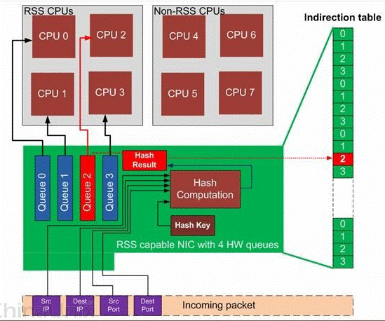
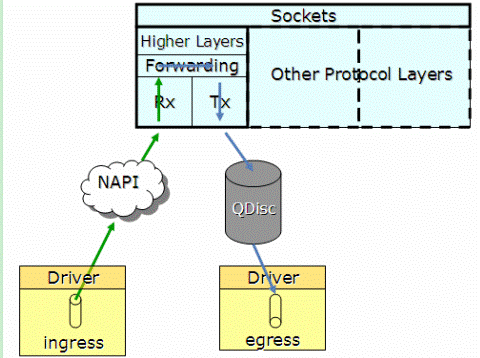
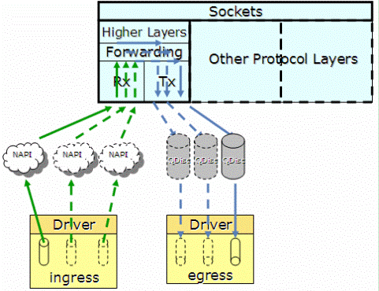
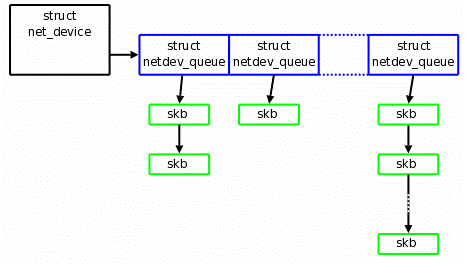
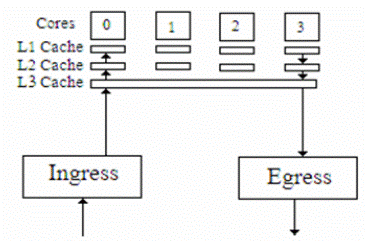

多队列网卡是一种技术, 最初是用来解决网络 IO QoS （quality of service）问题的, 后来随着网络 IO 的带宽的不断提升,
单核CPU不能完全处满足网卡的需求, 通过多队列网卡驱动的支持, 将各个队列通过中断绑定到不同的核上, 以满足网卡的需求.

常见的有 Intel 的 82575, 82576, Boardcom 的 57711 等, 下面以公司的服务器使用较多的 Intel 82575 网卡为例, 分析一
下多队列网卡的硬件的实现以及 linux 内核软件的支持.

###多队列网卡硬件实现

下图是Intel 82575硬件逻辑图, 有四个硬件队列. 当收到报文时, 通过 hash 包头的 SIP, Sport, DIP, Dport 四元组, 将一条
流总是收到相同的队列. 同时触发与该队列绑定的中断.



###2.6.21以前网卡驱动实现

kernel 从 2.6.21 之前不支持多队列特性, 一个网卡只能申请一个中断号, 因此同一个时刻只有一个核在处理网卡收到的包.
如下图1, 协议栈通过 NAPI 轮询收取各个硬件 queue 中的报文到下图2 的 net_device 数据结构中, 通过 QDisc 队列将报文
发送到网卡.




###2.6.21后网卡驱动实现

2.6.21 开始支持多队列特性, 当网卡驱动加载时, 通过获取的网卡型号, 得到网卡的硬件 queue 的数量, 并结合CPU核的数量,
最终通过Sum=Min(网卡queue, CPU core)得出所要激活的网卡 queue 数量(Sum), 并申请 Sum 个中断号, 分配给激活的各个 queue.

下图1, 当某个 queue 收到报文时, 触发相应的中断, 收到中断的核, 将该任务加入到协议栈负责收包的该核的 NET_RX_SOFTIRQ 队
列中(NET_RX_SOFTIRQ在每个核上都有一个实例), 在 NET_RX_SOFTIRQ 中, 调用 NAPI 的收包接口, 将报文收到 CPU 中下图2 的有多
个 netdev_queue 的 net_device 数据结构中.

这样, CPU 的各个核可以并发的收包, 就不会应为一个核不能满足需求, 导致网络 IO 性能下降.






###中断绑定

当 CPU 可以平行收包时, 就会出现不同的核收取了同一个 queue 的报文, 这就会产生报文乱序的问题, 解决方法是将一个 queue 的
中断绑定到唯一的一个核上去, 从而避免了乱序问题. 同时如果网络流量大的时候, 可以将软中断均匀的分散到各个核上, 避免 CPU
成为瓶颈.

如下 8 核心的服务器中, p2p1 不支持网卡多队列, 而 p4p1, p4p2, p4p3, p4p4
都支持网卡多队列, 因此每个网卡分配了 8 个队列

$cat /proc/interrnet

               CPU0       CPU1       CPU2       CPU3       CPU4       CPU5       CPU6       CPU7

	 42:       1431        773         28        243         63        857         30        263  IR-PCI-MSI-edge      xhci_hcd
	 43:       2419      37979          0          0        239          0          0          0  IR-PCI-MSI-edge      p2p1
	 44:      28396       3589       3554       5499      29244      23712       6976      34999  IR-PCI-MSI-edge      ahci
	 45:          0          0          0          0          0          0          0          0  IR-PCI-MSI-edge      p4p1
	 46:         73          0         10          0          0          0          0       1169  IR-PCI-MSI-edge      p4p1-TxRx-0
	 47:         73          0          0        709        470          0          0          0  IR-PCI-MSI-edge      p4p1-TxRx-1
	 48:         83          0         55          0          0        760        255         99  IR-PCI-MSI-edge      p4p1-TxRx-2
	 49:        577          5         25        625          0         10          0         10  IR-PCI-MSI-edge      p4p1-TxRx-3
	 50:       1098          0          0        144          0          0         10          0  IR-PCI-MSI-edge      p4p1-TxRx-4
	 51:        313          0         65         30          0          0        755         89  IR-PCI-MSI-edge      p4p1-TxRx-5
	 52:         73          0        195        549        270        145          0         20  IR-PCI-MSI-edge      p4p1-TxRx-6
	 53:        323         10        520          0        110          0          0        289  IR-PCI-MSI-edge      p4p1-TxRx-7
	 54:          0          0          0          0          0          0          0          0  IR-PCI-MSI-edge      p4p2
	 55:        143          5          0        349          0         20        735          0  IR-PCI-MSI-edge      p4p2-TxRx-0
	 56:        233          0         30        114          0          0        695        180  IR-PCI-MSI-edge      p4p2-TxRx-1
	 57:        148         10        170         49          0        175        510        190  IR-PCI-MSI-edge      p4p2-TxRx-2
	 58:        183         20        455        229         15          0        260         90  IR-PCI-MSI-edge      p4p2-TxRx-3
	 59:        442          0        425        155        125         15         30         60  IR-PCI-MSI-edge      p4p2-TxRx-4
	 60:         73         15        450         75         25        195        195        224  IR-PCI-MSI-edge      p4p2-TxRx-5
	 61:        143         25        295        184         20          0        380        205  IR-PCI-MSI-edge      p4p2-TxRx-6
	 62:        208         10        255        129         10         85        265        290  IR-PCI-MSI-edge      p4p2-TxRx-7
	 63:          0          0          0          0          0          0          0          0  IR-PCI-MSI-edge      p4p3
	 64:        388         15         70        220        170         40        235        114  IR-PCI-MSI-edge      p4p3-TxRx-0
	 65:        298          5        105        239        140        130        280         55  IR-PCI-MSI-edge      p4p3-TxRx-1
	 66:        183         50        155        190         30        185        225        234  IR-PCI-MSI-edge      p4p3-TxRx-2
	 67:        143          0        275        249        125        140        250         70  IR-PCI-MSI-edge      p4p3-TxRx-3
	 68:        283         10         90        155        130        135        150        299  IR-PCI-MSI-edge      p4p3-TxRx-4
	 69:        258         30         65        329          0         90        390         90  IR-PCI-MSI-edge      p4p3-TxRx-5
	 70:        158         20        280         85          5         50        155        499  IR-PCI-MSI-edge      p4p3-TxRx-6
	 71:        118          0        415        230        210        125         25        129  IR-PCI-MSI-edge      p4p3-TxRx-7
	 72:          0          0          0          0          0          0          0          0  IR-PCI-MSI-edge      p4p4
	 73:        133          5        290        144          0         55        440        185  IR-PCI-MSI-edge      p4p4-TxRx-0
	 74:        423         35        120        195          0         60        215        204  IR-PCI-MSI-edge      p4p4-TxRx-1
	 75:        213         20         15        314          0          0        545        145  IR-PCI-MSI-edge      p4p4-TxRx-2
	 76:        193         20         85        249        115         75        405        110  IR-PCI-MSI-edge      p4p4-TxRx-3
	 77:        373         10         95         54        110          0        300        310  IR-PCI-MSI-edge      p4p4-TxRx-4
	 78:        133         15        405        165         50        160        115        209  IR-PCI-MSI-edge      p4p4-TxRx-5
	 79:        138         45        430         75        215          0         40        309  IR-PCI-MSI-edge      p4p4-TxRx-6
	 80:        498         45        270        165          0         55          0        219  IR-PCI-MSI-edge      p4p4-TxRx-7
	 81:         13          0          0          0          0          0          0          0  IR-PCI-MSI-edge      mei_me
	 82:        499          0          0          0          0          0          0          0  IR-PCI-MSI-edge      snd_hda_intel
	 83:       3015          0          0          0          0          0          0          0  IR-PCI-MSI-edge      nouveau


###中断亲合纠正

一些多队列网卡驱动实现的不是太好, 在初始化后会出现下图中同一个队列的 tx, rx 中断绑定到不同核上的问题, 这样数据在 core0 与 core1 之间
流动, 导致核间数据交互加大, cache命中率降低, 降低了效率.



linux network 子系统的负责人 David Miller 提供了一个脚本, 首先检索 /proc/interrupts 文件中的信息, 按照下图中 eth0-rx-0($VEC) 中的 VEC
得出中断 MASK, 并将 MASK 写入中断号 53 对应的 smp_affinity 中. 由于 eth-rx-0 与 eth-tx-0 的 VEC 相同, 实现同一个 queue 的 tx 与 rx 中
断绑定到一个核上, 如下图所示.


###多队列网卡识别

#lspci -vvv

Ethernet controller 的条目内容, 如果有 MSI-X && Enable+ && TabSize > 1, 则该网卡是多队列网卡

$ sudo lspci -vvv | grep "MSI-X\|MSI:"

	Capabilities: [90] MSI: Enable+ Count=1/1 Maskable- 64bit-
	Capabilities: [80] MSI: Enable+ Count=1/8 Maskable- 64bit+
	Capabilities: [8c] MSI: Enable+ Count=1/1 Maskable- 64bit+
	Capabilities: [60] MSI: Enable+ Count=1/1 Maskable- 64bit+
	Capabilities: [80] MSI: Enable- Count=1/1 Maskable- 64bit-
	Capabilities: [80] MSI: Enable- Count=1/1 Maskable- 64bit-
	Capabilities: [80] MSI: Enable- Count=1/1 Maskable- 64bit-
	Capabilities: [80] MSI: Enable- Count=1/1 Maskable- 64bit-
	Capabilities: [80] MSI: Enable+ Count=1/1 Maskable- 64bit-
	Capabilities: [68] MSI: Enable+ Count=1/1 Maskable- 64bit+
	Capabilities: [68] MSI: Enable- Count=1/1 Maskable- 64bit+
	Capabilities: [50] MSI: Enable+ Count=1/1 Maskable- 64bit+
	Capabilities: [b0] MSI-X: Enable- Count=4 Masked-
	Capabilities: [50] MSI: Enable- Count=1/1 Maskable+ 64bit+
	Capabilities: [70] MSI-X: Enable+ Count=10 Masked-
	Capabilities: [50] MSI: Enable- Count=1/1 Maskable+ 64bit+
	Capabilities: [70] MSI-X: Enable+ Count=10 Masked-
	Capabilities: [50] MSI: Enable- Count=1/1 Maskable+ 64bit+
	Capabilities: [70] MSI-X: Enable+ Count=10 Masked-
	Capabilities: [50] MSI: Enable- Count=1/1 Maskable+ 64bit+
	Capabilities: [70] MSI-X: Enable+ Count=10 Masked-


Message Signaled Interrupts(MSI) 是 PCI 规范的一个实现, 可以突破 CPU 256 条 interrupt 的限制, 使每个设备具有多个中断线变成可能,
多队列网卡驱动给每个 queue 申请了 MSI. MSI-X 是 MSI 数组, Enable+ 指使能, TabSize 是数组大小. 


##附录

通过 /proc/interrupts 找到不同网卡的中断号, 然后计算网卡的MASK, 把掩码写入 /proc/irq/中断号/smp_affinity

```shell

	# setting up irq affinity according to /proc/interrupts
	# 2008-11-25 Robert Olsson
	# 2009-02-19 updated by Jesse Brandeburg
	#
	# > Dave Miller:
	# (To get consistent naming in /proc/interrups)
	# I would suggest that people use something like:
	# char buf[IFNAMSIZ+6];
	#
	# sprintf(buf, "%s-%s-%d",
	#         netdev->name,
	#  (RX_INTERRUPT ? "rx" : "tx"),
	#  queue->index);
	#
	#  Assuming a device with two RX and TX queues.
	#  This script will assign:
	#
	# eth0-rx-0  CPU0
	# eth0-rx-1  CPU1
	# eth0-tx-0  CPU0
	# eth0-tx-1  CPU1
	#

	set_affinity()
	{
		MASK=$((1<<$VEC))
		printf "%s mask=%X for /proc/irq/%d/smp_affinity\n" $DEV $MASK $IRQ
        #printf "%X" $MASK > /proc/irq/$IRQ/smp_affinity
		#echo $DEV mask=$MASK for /proc/irq/$IRQ/smp_affinity
		#echo $MASK > /proc/irq/$IRQ/smp_affinity
	}

	if [ "$1" = "" ] ; then
	 echo "Description:"
	 echo "    This script attempts to bind each queue of a multi-queue NIC"
	 echo "    to the same numbered core, ie tx0|rx0 --> cpu0, tx1|rx1 --> cpu1"
	 echo "usage:"
	 echo "    $0 eth0 [eth1 eth2 eth3]"
	fi


	# check for irqbalance running
	IRQBALANCE_ON=`ps ax | grep -v grep | grep -q irqbalance; echo $?`
	if [ "$IRQBALANCE_ON" == "0" ] ; then
	 echo " WARNING: irqbalance is running and will"
	 echo "          likely override this script's affinitization."
	 echo "          Please stop the irqbalance service and/or execute"
	 echo "          'killall irqbalance'"
	fi

	#
	# Set up the desired devices.
	#

	for DEV in $*
	do
	  for DIR in rx tx TxRx
	  do
		 MAX=`grep $DEV-$DIR /proc/interrupts | wc -l`
		 if [ "$MAX" == "0" ] ; then
		   MAX=`egrep -i "$DEV:.*$DIR" /proc/interrupts | wc -l`
		 fi
		 if [ "$MAX" == "0" ] ; then
		   echo no $DIR vectors found on $DEV
		   continue
		   #exit 1
		 fi
		 for VEC in `seq 0 1 $MAX`
		 do
		    IRQ=`cat /proc/interrupts | grep -i $DEV-$DIR-$VEC"$"  | cut  -d:  -f1 | sed "s/ //g"`
		    if [ -n  "$IRQ" ]; then
		      set_affinity
		    else
		       IRQ=`cat /proc/interrupts | egrep -i $DEV:v$VEC-$DIR"$"  | cut  -d:  -f1 | sed "s/ //g"`
		       if [ -n  "$IRQ" ]; then
		         set_affinity
		       fi
		    fi
		 done
	  done
	done

```


		HOWTO for multiqueue network device support
		===========================================

Section 1: Base driver requirements for implementing multiqueue support

Intro: Kernel support for multiqueue devices
---------------------------------------------------------

Kernel support for multiqueue devices is always present.

Section 1: Base driver requirements for implementing multiqueue support
-----------------------------------------------------------------------

Base drivers are required to use the new alloc_etherdev_mq() or
alloc_netdev_mq() functions to allocate the subqueues for the device.  The
underlying kernel API will take care of the allocation and deallocation of
the subqueue memory, as well as netdev configuration of where the queues
exist in memory.

The base driver will also need to manage the queues as it does the global
netdev->queue_lock today.  Therefore base drivers should use the
netif_{start|stop|wake}_subqueue() functions to manage each queue while the
device is still operational.  netdev->queue_lock is still used when the device
comes online or when it's completely shut down (unregister_netdev(), etc.).


Section 2: Qdisc support for multiqueue devices

-----------------------------------------------

Currently two qdiscs are optimized for multiqueue devices.  The first is the
default pfifo_fast qdisc.  This qdisc supports one qdisc per hardware queue.
A new round-robin qdisc, sch_multiq also supports multiple hardware queues. The
qdisc is responsible for classifying the skb's and then directing the skb's to
bands and queues based on the value in skb->queue_mapping.  Use this field in
the base driver to determine which queue to send the skb to.

sch_multiq has been added for hardware that wishes to avoid head-of-line
blocking.  It will cycle though the bands and verify that the hardware queue
associated with the band is not stopped prior to dequeuing a packet.

On qdisc load, the number of bands is based on the number of queues on the
hardware.  Once the association is made, any skb with skb->queue_mapping set,
will be queued to the band associated with the hardware queue.


Section 3: Brief howto using MULTIQ for multiqueue devices
---------------------------------------------------------------

The userspace command 'tc,' part of the iproute2 package, is used to configure
qdiscs.  To add the MULTIQ qdisc to your network device, assuming the device
is called eth0, run the following command:

# tc qdisc add dev eth0 root handle 1: multiq

The qdisc will allocate the number of bands to equal the number of queues that
the device reports, and bring the qdisc online.  Assuming eth0 has 4 Tx
queues, the band mapping would look like:

band 0 => queue 0
band 1 => queue 1
band 2 => queue 2
band 3 => queue 3

Traffic will begin flowing through each queue based on either the simple_tx_hash
function or based on netdev->select_queue() if you have it defined.

The behavior of tc filters remains the same.  However a new tc action,
skbedit, has been added.  Assuming you wanted to route all traffic to a
specific host, for example 192.168.0.3, through a specific queue you could use
this action and establish a filter such as:

tc filter add dev eth0 parent 1: protocol ip prio 1 u32 \
	match ip dst 192.168.0.3 \
	action skbedit queue_mapping 3

Author: Alexander Duyck <alexander.h.duyck@intel.com>
Original Author: Peter P. Waskiewicz Jr. <peter.p.waskiewicz.jr@intel.com>
