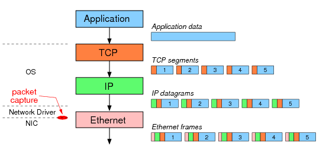
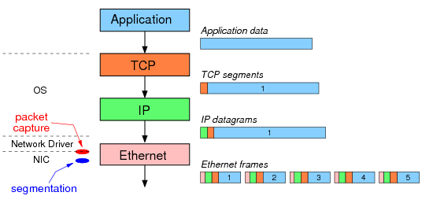

##offload 技术概论

现在, 越来越多的网卡设备支持 offload 特性, 来提升网络收/发性能. offload 是将本来该操作系统进行的一些数据包处理
(如分片,重组等)放到网卡硬件中去做, 降低系统 CPU 消耗的同时, 提高处理的性能.

包括 LSO/LRO,GSO/GRO,TSO/UFO 等.

###LSO/LRO

分别对应到发送和接收两个方向, 是 Large Segment Offload 和 Large Receive Offload.

首先来看 LSO. 我们知道计算机网络上传输的数据基本单位是离散的网包, 既然是网包, 就有大小限制, 这个限制就是 MTU
(Maximum Transmission Unit)的大小, 一般是 1518 字节. 比如我们想发送很多数据出去, 经过 OS 协议栈的时候, 会自动
帮你拆分成几个不超过 MTU 的网包. 然而, 这个拆分是比较费计算资源的(比如很多时候还要计算分别的 checksum), 由 CPU
来做的话, 往往会造成使用率过高. 那可不可以把这些简单重复的操作 offload 到网卡上呢？

于是就有了 LSO, 在发送数据超过 MTU 限制的时候(太容易发生了), OS 只需要提交一次传输请求给网卡, 网卡会自动的把
数据拿过来, 然后进行切, 并封包发出, 发出的网包不超过 MTU 限制.

接下来看 LSO, 当网卡收到很多碎片包的时候, LRO 可以辅助自动组合成一段较大的数据, 一次性提交给 OS 处理.

一般的, LSO 和 LRO 主要面向 TCP 报文.

###GSO/GRO

Generic Segmentation Offload 和 Generic Receive Offload, 分别比 LSO 和 LRO 更通用, 自动检测网卡支持特性, 支持
分包则直接发给网卡, 否则先分包后发给网卡. 新的驱动一般用 GSO/GRO.

###TSO/UFO

TCP Segmentation Offload 和 UDP fragmentation offload, 分别对应 TCP 报文和 UDP 报文.

很典型的, TCP 协议中就考虑了分片存在的情况, 往往是切分 TCP 的数据包, 叫做 TSO. 而一般的情况, 则称为 LSO 或者 GSO.

对于其他不支持切片的协议例如 UDP, 则只能进行 IP 层上的切片.

##检查与开关

可以通过 ethtool -k eth0 命令来查看各个选项的当前状态, 注意输出中各种 off-load 选项的状态.

### ethtool -k eth0

    Features for eth0:
    rx-checksumming: on
    tx-checksumming: on
            tx-checksum-ipv4: on
            tx-checksum-ip-generic: off [fixed]
            tx-checksum-ipv6: on
            tx-checksum-fcoe-crc: off [fixed]
            tx-checksum-sctp: off [fixed]
    scatter-gather: on
            tx-scatter-gather: on
            tx-scatter-gather-fraglist: off [fixed]
    tcp-segmentation-offload: on
            tx-tcp-segmentation: on
            tx-tcp-ecn-segmentation: off [fixed]
            tx-tcp6-segmentation: on
    udp-fragmentation-offload: off [fixed]
    generic-segmentation-offload: on
    generic-receive-offload: on
    large-receive-offload: off [fixed]
    rx-vlan-offload: on
    tx-vlan-offload: on
    ntuple-filters: off [fixed]
    receive-hashing: on
    highdma: on [fixed]
    rx-vlan-filter: on [fixed]
    vlan-challenged: off [fixed]
    tx-lockless: off [fixed]
    netns-local: off [fixed]
    tx-gso-robust: off [fixed]
    tx-fcoe-segmentation: off [fixed]
    tx-gre-segmentation: off [fixed]
    tx-ipip-segmentation: off [fixed]
    tx-sit-segmentation: off [fixed]
    tx-udp_tnl-segmentation: off [fixed]
    tx-mpls-segmentation: off [fixed]
    fcoe-mtu: off [fixed]
    tx-nocache-copy: on
    loopback: off [fixed]
    rx-fcs: off [fixed]
    rx-all: off
    tx-vlan-stag-hw-insert: off [fixed]
    rx-vlan-stag-hw-parse: off [fixed]
    rx-vlan-stag-filter: off [fixed]
    l2-fwd-offload: off [fixed]

通过 ethtool -K eth0 gso off/on 这样的命令来开关.

##offload 应用场景

###VXLAN

VXLAN 现在已经是常见的二层虚拟化实现技术, 但是由于它需要对每个数据包都进行封装, 解封装等操作,
导致基于软件的解决方案效率不高.  现在已经有网卡开始支持对 VXLAN 进行一些辅助操作, 包括封装,
解封装, 以及 checksum 计算等.

###网络虚拟化

那么, 这些 offload 技术, 跟虚拟化有什么联系呢 ?

在网络虚拟化中, 一个最常见的技术就是隧道, 这是实现 overlay 的通用手段. 而实现隧道无非就两种思路,
一种是把转发信息放到包头上, 即封装/解封装(无论VXLAN还是STT都是这个思路); 另外一种是由额外的数据
库管理, 转发时候进行查询. 这两种思路各有利弊, 这里不细说, 如果我们采用封装/解封装的作法, 那么可
能原来网包并没有超过 MTU 限制, 加上封装包头就超了, 这就需要进行切片了.

所以 VMware 在其旗舰产品 NVP 中强调可以通过 TSO 来提高转发性能.

当然, 前提是网卡能够支持, 并且在 OS 中配置打开.

此外, 多核服务器中的网卡还推荐考虑 RSS(Receive Side Scaling), 将网流分配到多个 RSS 队列上, 多个
队列绑定到不同的核心上, 分散负载.

##offload 的缺点

在我们学习网络协议的时候发现, tcpdump 抓的包不是 1500, 而是远远大于 1500, 这就是
GRO GSO 在起作用, 因此, 在我们调试网络, 学习网络协议的时候, 或者进行网络测试的时候,
经常需要关闭 GRO, GSO 以及 TSO.

$ sudo ethtool -K eth0 gso off
$ sudo ethtool -K eth0 gro off
$ sudo ethtool -K eth0 tso off

##例子

###GSO TSO 测试

1. 创建 10 KB 的数据

cd /tmp
dd if=/dev/zero of=pac2 ibs=10000 count=1

2. 测试传输

tcpdump -i eth0 -n 'dst port 9000'
nc -k -l 9000
nc 10.1.1.1 9000 < pc2

3. 关闭 TSO, 重复步骤 2 抓包

sudo ethtool -K lo tso off

发现有的包的大小仍然大于 MSS = 1460 = 1500(MTU) - 40)

NOTE:

如果 TCP 存在 options, MSS = 1448 = 1500(MTU) - 52

4. 关闭 GSO, 重复步骤 2 抓包

sudo ethtool -K lo gso off

##参考

http://www.sandilands.info/sgordon/segmentation-offloading-with-wireshark-and-ethtool
