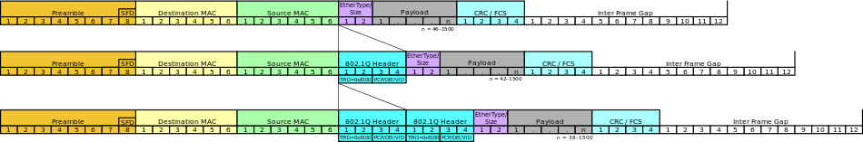
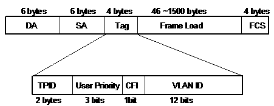
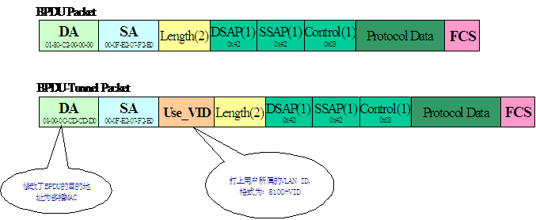
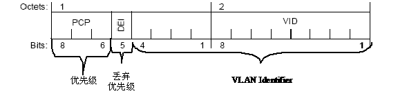

##QinQ

QinQ 技术（也称Stacked VLAN 或Double VLAN）是指将用户私网 VLAN 标签封装在公网 VLAN 标签中，使报文带着两层
VLAN 标签穿越运营商的骨干网络，在公网中只根据外层 VLAN 标签传播，私网 VLAN 标签被屏蔽，这样，不仅对数据流
进行了区分，而且由于私网 VLAN 标签被透明传送，不同的用户 VLAN 标签可以重复使用，只需要外层 VLAN 标签的在公
网上唯一即可，实际上也扩大了可利用的 VLAN 标签数量。

QinQ 的标准是 IEEE802.1ad（IEEE802.1ad的全称是:Virtual Bridged Local Area Networks Amendment 4: Provider
Bridges）该标准是在 2006 年 5 月份才形成正式标准的，所以当前我们常见的各厂商实现的 QinQ 和该标准有较大的不同，
但各厂商的实现均大同小异。

本文分为两大部分，第一部分主要介绍当前常见的 QinQ 的各个方面，第二部分介绍 802.1ad 以及该标准同当前我们所常见
的QinQ的区别。

##QinQ的产生

随着三层交换机的不断成熟和大量应用，许多企业网和小型城域网用户都倾向于使用三层交换机来搭建骨干网，由于以下三个
原因，这些用户一般都不愿意使用基于 MPLS 或者 IP 协议的 VPN：

* 配置、维护工作相对比较繁杂；
* 许多厂商的三层交换机不支持MPLS功能，如果用户搭建基于MPLS的VPN，势必要淘汰这些设备，浪费资源；
* 支持MPLS功能的单板一般价格昂贵，小型用户难以承受。

而 QinQ 可以提供一种廉价、简洁的二层 VPN 解决方案，不需要信令协议的支持，可以通过纯静态配置实现，而且只需要网络
边缘设备支持 QinQ，内部只需要可以支持 802.1Q 的设备即可，所以越来越多的小型用户倾向于使用该功能构建自己的 VPN 网络。

运营商在通过 Ethernet 提供 Internet 接入业务时需要对客户标识，做到精细化管理，而且随着新业务的开展（如Triple-Play、
Wholesale、VPN），运营商还需要对业务进行细分，以区别提供不同的管道、QoS策略。原有基于 802.1Q 只有 4096 个 vlan 标识
不能满足这样的需要，QinQ 正好可以扩展这样的标识，同时还可以利用不同的 VLAN 来区分运营商的服务和不同的客户。利用 QinQ
提供接入时具用以下的优点：

* 可以解决日益紧缺的公网 VLAN ID 资源问题；
* 用户可以规划自己的私网 VLAN ID，不会导致与公网 VLAN ID 冲突；
* 提供一种较为简单的二层 VPN 解决方案；
* 使用户网络具有较高的独立性，在服务提供商升级网络时，用户网络不必更改原有的配置；
* 可以按不同层次的 VLAN ID 来区分不同的业务；
* QinQ 技术上完全可以多层嵌套，没有限制，仅受 Ethernet 报文长度的限制，具有很好的扩充性。

##QinQ 报文封装

QinQ 的报文封装就是在原有 802.1Q 报文中的 TAG 头上再加上一层 TAG 封装，用来扩展 VLAN 的范围，如图1 所示：

##QinQ的报文转发过程

在通过QinQ实现简单的二层VPN过程中报文是按如下方式转发：

图 2 中在运营商网中使用 VLAN20 来标识客户 A、VLAN30 标识客户 B，当客户 A 的报文到达运营商的边缘交换机时，边缘交换机均
给客户 A 的报文打上一个外层标签（VLAN20），然后在 VLAN20 中转发，不会转发到 VLAN30，报文在离开运营商网络时再剥离掉外层
的标签，转发到用户 A 的网络，从而实现一个简单二层 VPN 功能。

##QinQ报文的TPID值可调功能

TPID（Tag Protocol Identifier，标签协议标识）是 VLAN Tag 中的一个字段，IEEE 802.1Q 协议规定该字段的取值为 0x8100。IEEE
802.1Q 协议定义的以太网帧的 Tag 报文结构如下：

通常在 QinQ 中设备的内外层标签的 TPID 值均采用协议规定的 0x8100，但是某些厂商的设备将 QinQ 报文外层 Tag 的 TPID 值设置为
0x9100 或 0x9200，为了和这些设备兼容，并提供较高的灵活性，我司支持 QinQ 功能的交换机基本上均提供了 QinQ 报文 TPID 值可调功能
（需要注意有的设备整机支持，有的设备是端口支持），能修改 QinQ 设备的外层标签的 TPID 值。（在本文的 802.1ad 部分我们将会看
到 802.1ad 所规定的 TPID 为 0x88a8，所以当设备同标准 802.1ad 设备作 QinQ 对接时也需要TPID可调功能）。

##灵活QinQ（Selective QinQ）

在前面我们所讲的 QinQ 中，通常是以物理端口来划分用户或用户网络，当多个不同用户以不同的 VLAN 接入到同一个端口时则无法区分用户。
另外前面的 QinQ 方案是一种简单二层 VPN 的应用，在运行营商接入环境中往往需要根据用户的应用或接入地点（设备）来区分用户，基于这
种应用产生了灵活 QinQ 方案。

简单讲灵活 QinQ 就是根据用户报文的 Tag 或其他特征（IP/MAC等），给用户报文打上相应的外层 Tag，以达到区分不同用户或应用的目的。

当前灵活 QinQ 主要应用在运营商的接入网络中，在运营商网络中给接入用户分配一个 VLAN，以达到便于问题追踪和防止不同用户间互访，
用外层标签区分用户的应用；或在接入的环境中用外层标签来区分不同的接入地点，用内外两层标签唯一标识出一个接入用户。在这样的应用
中需要 BRAS/SR 设备支持 QinQ 的应用（能够终结双Tag）。

灵活QinQ的应用场景：

灵活QinQ分流的依据有下面几种：

1 根据端口的VLAN区间分流：比如 PC 的 VLAN 范围 1～1000，STB 的 VLAN 范围 1001～2000，网吧的 VLAN 范围 2001～3000；
2 根据报文的协议号分流：比如 PC 采用 PPPoE、STB 采用 IPoE，这些终端都通过一个 VLAN 上行，可以根据 PPPoE 和 IPoE 报文不同的
协议号作为 QinQ 的分流依据；
3 根据报文的目标 IP 地址分流：对于相同源 IP 地址，相同报文封装不同的业务应用报文，比如 PC 上的 SoftPhone 产生的报文，需要根
据报文目的 IP 地址实施灵活 QinQ 进行业务分流；
4 根据 QinQ 的内层标签的区间，在某些级联交换机的组网模式中，下连的交换机已经实施了基于端口的 QinQ，为了实现业务分流，可以根
据 QinQ 的内层VLAN标签的区间实施灵活QinQ进行业务分流。

##BPDU Tunnel(L2 Protocol Tunnel)

QinQ 网络中，运营商网络对客户透明，当客户和运营商网络之间的连接有冗余时必然导致环路问题，如 QinQ 应用示意图 2 中的A客户。这
就需要运营商网络能透明传输 STP/RSTP/MSTP 报文，这样客户可以跨运营商网络构建自己的 STP 树，切断冗余链路。另外为了保证客户全网
VLAN 配置的一致性，动态 VLAN 协议如 GVRP、VTP 等也要求通过运营商网络透传，如果客户使用 GMRP 作组播应用的话，GMRP 报文也要求透传。
同时在透传这些报文时，需要区分开不同用户的二层协议报文。

我们知道以上这些 BPDU 报文是桥设备的二层控制报文（基本上是以LLC封装的），是与设备全局相关的，不带 VLAN Tag，所以需要一种机
制来传输用户的二层控制报文，从而引入了 BPDU Tunnel (Cisco:Layer 2 Protocol Tunneling)的概念，通过 Tunnel 来传播用户的二层控制报文。

通常 BPDU Tunnel 是这样实现的：当 Tunnel 端口收到一个用户的 BPDU 后，把目的 MAC 修改为一个组播 MAC，然后再给协议报文打上用户所属
VLAN 的 Tag 信息，组播 MAC 保证报文在 VLAN 内广播，同时标识这个报文是个 BPDU-Tunnel 报文，交换机在收到这个报文时上送 CPU 处理，
还原其 BPDU 身份，并根据报文中用户所属的 VLAN 信息，把报文送到相应的客户网络。

当前我司的实现就采取了上述这种方法，收到用户的 BPDU 报文后，给这个报文的目的MAC修改为：01-00-0c-cd-cd-d0，再加上运营商分配该用户
的VLAN Tag，如图5所示：

##802.1ad

IEEE 802.1ad的全称是“Virtual Bridged Local Area Networks Amendment 4: Provider Bridges”，该协议的目标是业务提供商在为客户提供业
务时使客户间的服务相互独立，没有相互依赖关系，同时尽量做到业务提供商透明地为客户提供业务。该标准描述了业务提供商（运营商）如何利
用和扩展 802.1Q 在一个统一的网络中为相互独立的客户提供以太网业务。

##标准化过程

该协议于2002年12月第一稿，中间历经了多个Draft，并于2006年５月形成正式标准（Amendment to IEEE Std 802.1Q-2005）。文档可从这里获得
：http://tech/article.php/4360；

##基本概念

C-VLAN  : Customer VLAN，是用户网络内部使用的 VLAN；

S-VLAN  : Service VLAN，服务提供商网络中使用的 VLAN，该 VLAN 标识 VPN 用户或者是用户的业务；

Customer Bridge : Customer 网络中的 Bridge，只能识别 C-VLAN；

Provider Bridge : 服务提供商网络中的 Bridge，根据处理内容的不同又分为 S-VLAN Bridge 和 Provider Edge Bridge。
其中 S-VLAN Bridge 只能识别 S-VLAN； Provider Edge Bridge 可以同时识别 C-VLAN 和 S-VLAN；

C-VLAN Component : 在 Bridge 内可识别、插入、删除 C-VLAN 的实体，每个端口一个，对 C-VLAN 的操作互相独立（两个端口上接收到相同的
C-VLAN，但由于属于不同的客户最后的处理结果会不同）；

S-VLANComponent  : 在 Bridge 内可识别、插入、删除 S-VLAN 的实体，由于在一个 Bridge 内不存在相同的 S-VLAN 属于不同服务提供商的情况，
因此在一个桥内只有一个S-VLAN的实体。

##报文格式

802.1ad 的报文格式，基本同前面我们所讲的 QinQ 报文格式一致，主要的区别就是 802.1ad 中重新定义了 TPID 的值和把原来的 CFI 位修改为
DEI（丢弃标识）位。

同前面所述的 QinQ 相比，在 802.1ad 中明确规定了用户报文和运营商报文的 TPID 值，从而可以简单的区分用户报文和运营商报文：

    Tag Type     Name                                                Value
    C-VLAN Tag  IEEE 802.1Q Tag Protocol Type(802.1Q Tag Type)       81-00
    S-VLAN Tag  IEEE 802.1Q Server Tag Type(802.1Q S-Tag Type)       88-a8

同时标准中对 S-VLAN 的 TCI 位修改为 DEI(Drop Eligible Indicator)，丰富了 QoS 特性，当用户报文进入运营商网络时会打上以 88a8 标识的
外层标签，在离开运营商网络时会剥离这个外层标签。

##802.1ad 如何解决 Tunnel 问题

在传统的 QinQ Tunnel中是通过修改原协议报文的目的地址及加上用户所属 VLAN 标识来传递用户 L2 协议报文的（这样做的缺点在于需要在边缘设
备上对报文进行修改加重设备CPU的负担）。

在 802.1ad 中为 C-VLAN 及 S-VLAN 分配了不同的保留地址，在 S-VLAN 中处理 C-VLAN 中的协议报文和处理普通的数据报文一样，从而不需要
Tunnel 就可以透明传输用户二层协议报文。

    Assignment                                                          Value
    Bridge Group Address                                            01-80-C2-00-00-00
    IEEE 802.3 Full Duplex PAUSE operation                          01-80-C2-00-00-01
    IEEE 802.1X PAE address                                         01-80-C2-00-00-03
    Provider Bridge Group Address                                   01-80-C2-00-00-08
    Provider Bridge GVRP Address                                    01-80-C2-00-00-0D
    IEEE 802.1AB Link Layer Discovery Protocol multicast address    01-80-C2-00-00-0E

##Spanning Tree Protocol

Provider 网络的 STP 操作和 Customer 网络的 STP 操作完全独立运行，相互不关联。在 Provider 网络内部采用不同的 Bridge
Group Address（01-80-C2-00-00-08），对于用户的 BPDU 报文（01-80-C2-00-00-00）作为普通数据报文透传，不进行识别和处理。
Provider 网络边缘的 C-VLAN component 端口可以参与用户 STP 拓扑的计算和用户 BPDU 的处理。

##GVRP

Provider 网络的 GVRP 操作和 Customer 网络的 GVRP 的操作完全独立运行，相互不关联。在 Provider 网络内部采用不同的 Provider
Bridge GVRP Address（01-80-C2-00-00-0D），对于用户GVRP报文（01-80-C2-00-00-21）以及其他的 GARP 保留地址作为普通数据报文透传，
不进行识别和处理。Provider 网络边缘的 C-VLAN component 端口可以参与用户的 GARP 报文的处理。

##802.1ad 对灵活 QinQ 的支持

802.1ad 对灵活 QinQ 的支持同当前常见的灵活 QinQ 基本一致，在 802.1ad 中提供了两种确定用户所属 S-VLAN 的方式：

* 基于端口（Port-based service interface），在这种模式下用户是根据接入的端口来选择 S-VLAN(Service Instance)的
* 基于 C-VLAN（C-Tagged service interfaces），在这种模式下是根据用户使用的 C-VID 来先择 S-VLAN(Service
Instance)，即同当前我们所见的灵活 QinQ 类似。

##参考
http://blog.chinaunix.net/uid-20786208-id-5515010.html
