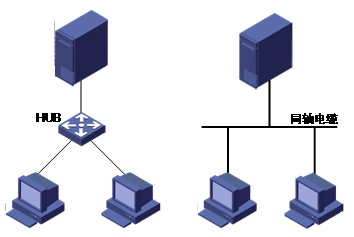
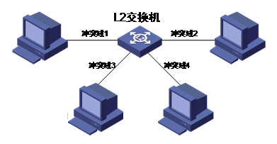
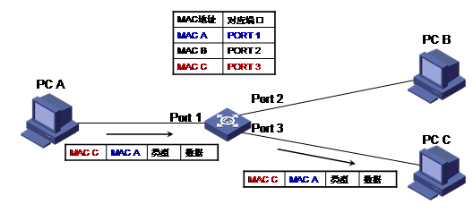
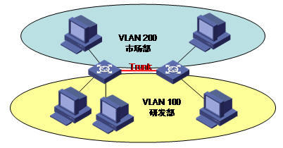
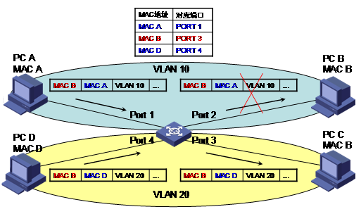
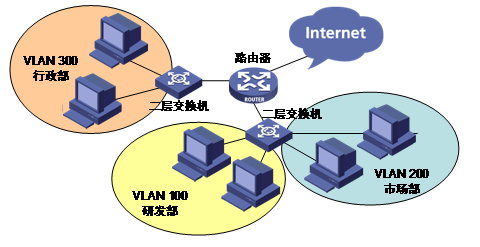
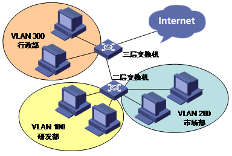
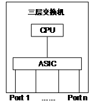
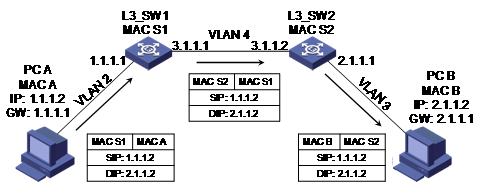

##以太网

自20世纪70年代局域网技术提出以来，各种局域网技术不断产生，其中有的技术发展壮大，而有的技术逐渐被淘汰。
现阶段成熟的局域网技术有三种：以太网（Ethernet）、令牌环（Token Ring）和光纤分布式数据接口（FDDI），
其中以太网技术逐步成为局域网技术的主流

##以太网历史简介

以太网是在 1972 年开创的，Bob Metcalfe（被尊称为“以太网之父”）被 Xerox 雇佣为网络专家，Bob Metcalfe来到
Xerox公司的Palo Alto研究中心（PARC）的第一个任务是把 Palo Alto 的计算机连接到 Arpanet（Internet的前身）。
1972年底，Bob Metcalfe 设计了一套网络，把 Alto 计算机连接起来。在研制过程中，因为该网络是以 ALOHA 系统（
一种无线电网络系统）为基础的，而又连接了众多的 ALTO 计算机，所以 Metcalfe 把它命名为 ALTO ALOHA 网络。
ALTO ALOHA 网络在 1973 年 5 月开始运行，Metcalfe 把这个网络正式改名为以太网（Ethernet），这就是最初的以
太网试验原型，该网络运行的速率为 2.94Mbps，网络运行的介质为粗同轴电缆。1976 年 6 月，Metcalfe 和 Boggs
发表了题为：“以太网：局域网的分布型信息包交换”的著名论文。1977 年底，Metcalfe 和他的三位合作者获得了“具
有冲突检测的多点数据通信系统”的专利，多点传输系统被称为 CSMA／CD(带冲突检测的载波侦听多路访问)。从此，
以太网就正式诞生了。

###大事记

1980年9月30日，DEC、Intel和Xerox公布了第三稿的“以太网，一种局域网：数据链路层和物理层规范，1.0版”，这就
是现在著名的以太网蓝皮书，也称为DIX(取三家公司名字的第一个字母而组成的)版以太网1.0规范。

1982 年，DIX 联盟发布了以太网的第二个版本，即 Ethernet II。

IEEE组成一个定义与促进工业 LAN 标准的委员会，这就是我们今天熟知的802工程委员会

1981 年 6 月，IEEE 802 工程决定组成 802.3 分委员会，以产生基于 DIX 工作成果的国际公认标准，1983 年 6 月
IEEE 802.3 工作组发布了第一个关于以太网技术的 IEEE 标准，即 IEEE 10BASE5。10BASE5 的速率仍然是 10Mbps，
使用的传输介质仍然是粗同轴电缆，允许节点间的最长距离为 500 米。

1984 年美国联邦政府以 FIPS PUB107 的名字采纳 802.3 标准。1989 年 ISO 以标准号 IS88023 采纳 802.3 以太网标
准，至此，IEEE 标准 802.3 正式得到国际上的认可。

1984年，IEEE 发布了10BASE2的标准，10BASE2采用细同轴电缆作为传输介质，允许节点间的最长距离为200米。

1993 年，Kalpana 公司使以太网技术有了另外一个突破——全双工以太网。

1998 年，IEEE 发布 802.3z，1000Mbps 的以太网标准。

2002年，10GE 以太网标准 802.3ae 正式发布

##以太网基础知识

###CSMA/CD

以太网是一种共享介质的局域网技术，多个站点连接到一个共享介质上，同一时间只能有一个站点发送数据。这种共享介
质的通信方式必然存在一个冲突的问题，如何检测链路是否空闲，站点能否发送数据是共享链路必须解决的问题。

这种同一链路连接多个终端，就是多路访问。多路访问控制有多种协议，如随机访问控制协议、受控访问控制协议、通道化
协议。

* 随机访问控制协议中所有连接在共享介质上的终端都具有平等的发送数据的概率，也没有轮询机制，随机访问控制协
议技术主要有：MA、CSMA、CSMA/CD、CSMA/CA。
* 受控访问控制协议是一种轮询机制，通过轮询控制哪个站点来发送数据，主要技术有：预约、轮询、令牌传递。
* 通道化协议是一种复用技术，主要技术包括：FDMA、TDMA、CDMA。

以太网采用了随机访问控制协议中的 CSMA/CD（Carrier Sense Multiple Access with Collision Detection，带有冲突检测
的载波侦听多址访问）方法作为多路访问控制协议。我们可以将 CSMA/CD 比作一次交谈，在这个交谈中每个人都有说话的权力，
但是同一时间只能有一个人说话，否则就会混乱，每个人在说话之前先听是否有别人在说话（即载波侦听），如果这时有人说话，
那只能耐心等待，等待别人结束说话，它才可以发表意见。另外，有可能两个人同一时间都想开始说话，此时就会出现冲突，但
当两个人同时说话时，两个人都会发现他们在同一时间讲话（即冲突检测），这时说话立即终止，随机的等待一段时间后（回退），
再开始说话。这时第一个开始说话的人开始说话，第二个人必须等待，直到第一个人说完后才开始说话。

以太网的 CSMA/CD 工作方式与以上类似。当一个站点有数据帧要发送时，它开始检测物理介质是否空闲，这个过程称为载波侦听。
如果此时介质忙，则只能耐心等待，推迟数据帧的发送。

如果载波侦听过程中发现介质空闲，则必须等待IFG（Inter Frame Gap）时间让物理信道恢复平稳，同时也让接收者对接收的帧作
必要的处理。等待 IFG 时间后开始发送数据帧。如果这时没有其他站点要发送数据则不会发生冲突，站点可以完整的把数据帧发送
完毕，重复下一次发送过程，继续发送下一个数据帧。

如果同一时间有多个站点要发送数据，那么就会发生冲突。冲突发生后，发送站点要持续发送一段时间的干扰信号（jamming），
发送干扰信号的目的是为了确保共享介质上的所有站点都能够检测到这时以太网上已产生了冲突。然后发送站点终止未发送完的数
据帧的发送，等待一个随机时间，这就是回退（backing off），等待的这个随机时间称为回退时间（backoff time）。

回退时间是 SlotTime（SlotTime是传送最短以太网帧所需要的时间，对于 10M 和 100M 来说为传送 512bit 所需要的时间，10M 是
51.2 微秒，100M 是5.12微秒）的整数倍，回退时间的取值范围与检测到冲突的次数有关，每次检测到冲突后，r 选择一个从 0 到 2
^k 的随机整数 0≤r<2^k，这里 k＝MIN {n，10}， n 为检测到冲突的次数。

例如开始传送数据帧后，第一次检测到冲突后需要等待0-1倍SlotTime时间，第二次检测到冲突后等待0-3中随机整数个SlotTime
时间，以此类推。

当检测到的冲突次数超过最大重试次数（通常为16），则表示该数据帧发送失败，停止该数据帧的发送，通知网络管理员发生错误并
丢弃数据帧，或者只是简单的丢弃数据帧，然后重置回退时间为 0，开始冲突检测准备发送下一个数据帧。

在“以太网发展史”一节中说过，DIX 联盟1980年发布以太网的第一个版本，Ethernet I，1982年，DIX 联盟又发布以太网的第二个版本，
即 Ethernet II，1983 年 IEEE 发布了第一个关于以太网的标准，IEEE 发布的标准与 DIX 的 Ethernet II 在技术上是有差别的，
其中一个差别就是关于以太网帧的封装上。Ethernet II 采用了 Type 封装，而最初的 802.3 采用的 Length 封装，因此 Length 封装
也称为raw 802.3封装，目前只有 IPX 支持 Raw 802.3 封装，以 Length 字段后紧跟 0xFFFF 标识。最初的 IEEE 802.3 标准不支持
Type 封装，但是 Type 封装使用极为广泛，在 1997 年，IEEE 802.3 接纳了 Type 封装，所以 Ethernet II 封装有时又称为
802.3 Type 封装。

Preamble/SFD（Start-of-Frame Delimiter）：每个以太网帧发送时都是以8个字节的前导码开始，Preamble是1和0交替（1
0 1 0 1 0…….）的7个字节数据，该部分的作用是通知接收方有数据帧到来，使其与输入的时钟保持同步，56 bit 模式容许站点在帧的
开始可以丢弃一些 bit。SFD 是一个字节 10101011，最后使用11，来通知接收方下一字段就是目的主机的地址了。实际上前导码都是在
物理层加进去的，并不是帧的一部分。

###以太网速率计算

我们通常所说的 10M、100M，1000M、10GE，这些都是指物理介质每秒可以传送多少 bit 的数据。在我们实际中经常使用每秒传送实际数
据帧的数目即 PPS（packets per second）来表示报文的速率。下面介绍对于以太网来说如何进行链路速率与 pps 之间的换算。

以太网传送数据时，每两个帧之间存在帧间隙 IFG（Inter Frame Gap），帧间隙的作用是使介质中的信号处于稳定状态，同时让帧接收者
对接收的帧作必要的处理（如调整缓存取的指针、更新计数、发中断让主机对报文进行处理）。对于 Ethernet（10M） 帧间隙时间为
9.6usec，100M 快速以太网帧间隙为 0.96usec，1000M 帧间隙为 0.096usec，10GE 帧间隙为 0.0096usec，这个时间正好相当于传送 96bit
数据的时间。

下面我们看怎么把以太网速率与 pps 进行换算，假设数据帧的长度为 k bytes（包括CRC），端口速率为 R，转化后的 PPS 为 N，那么：

            N＝R/(k×8＋8×8＋96)

其中 k×8 表示实际数据帧的长度(bits)，8×8表示前导码（Preamble＋SFD）的长度，96bit 相当于帧间隙占用的 bits。

下面举例说明，假设端口速率为 100M，发送数据帧的长度为 64 字节，那么线速发送报文换算成pps后，

     N＝100 000 000/（64×8＋8×8＋96）≈148810 pps

###冲突域和广播域

我们知道在传统的以粗同轴电缆为传输介质的以太网中，同一介质上的多个节点是共享链路的带宽，争用链路的使用权，这样就会发生冲突，
CSMA/CD 机制中当冲突发生时，网络就要进行回退，这段回退的时间内链路上不传送任何数据。而且这种情况是不可避免的。当同一介质上的
节点越多，冲突发生的概率也就会越大。这种连接在同一导线上的所有节点的集合就是一个冲突域。使用同轴电缆和 HUB 连接的主机就属于
一个冲突域。他们共同的特征是所有的节点都要共享带宽，会发生冲突，且一个节点发出的报文（无论是单播、组播、广播）其余节点都可以收到。

由于各种各样的原因，网络中使用了广播，例如 TCP/IP 中的 ARP 使用广播从 IP 来解析 MAC 地址。目的 MAC 为 FFFF-FFFF-FFFF 的地址是
广播地址，这个地址将使所有的节点都处理这个数据帧。广播会占用带宽，而且降低节点的处理效率，必须对广播加以限制。这种一个站点发送
一个广播报文其余节点能够接收到的节点的集合，就是一个广播域。传统的网桥（Bridge）可以根据 MAC 表对单播报文进行转发，对于广播报文
向所有的端口都转发，所以网桥的所有端口连接的节点属于一个广播域，但是每个端口属于一个单独冲突域。

传统的二层交换机所有端口都属于一个广播域，这样就不便于管理和网络变化，假设一个用户现在属于工作组 1，与工作组 1 内的用户在同一个
LAN 中，一段时间后要把该用户划分到工作组 2 中，要加入到工作组 2 中的LAN，那么必须重新连线。这种给网络管理带来了不方便。这样就在
传统二层交换机上引入了 VLAN（Virtual LAN）。每个 VLAN 中的所有节点在同一个广播域，每个 VLAN 是逻辑 LAN，VLAN 之间是二层隔离的。

###半双工、全双工、自协商

在 10BASE5 和 10BASE2 的总线型拓扑中，同一时刻只能有一个节点发送数据。随着 10BASE-T 和 hub 的出现，网络节点的连接变成了点到点的
连接。在节点之间点到点连接中，同一节点同一时刻只能接收或发送数据，不能同时接收、发送数据。这种同一时刻只能接收或发送数据的工作模
式为半双工模式。在半双工模式下，使用 CSMA/CD 的机制来避免冲突。

全双工模式下，同一时刻可以同时接收和发送数据帧。

自协商功能允许一个网络设备能够将自己所支持的工作模式信息传达给网络上的对端，并接收对方可能传递过来的相应信息。对于两端处于自协商
工作方式的设备，最终协商的结果是采用二者技术能力域中优先级低的网口提供的工作方式工作。协商级别一般为 1000Mfull，1000Mhalf，100Mfull，
100Mhalf，10Mfull，10Mhalf。

10BASE-T 的以太网接口（它只支持10M，不支持自协商）在链路 UP 之前会发送 Link Test Pulse（LTP），该脉冲用以检测链路是否应该UP；
而 100BASE-T 以太网接口（它只支持100M，不支持自协商）在链路 UP 之前会发送 FAST ETHERNET IDLE 流，用以检测链路是否应该 UP。

支持自协商（Autonegotiation）的以太网接口则在链路 UP 之前发送 FLP（Fast Link Pulse），FLP 实际上是一组 LTP 和数据脉冲的组合，它们
表明一种含义：例如我支持 100M 全双工。较旧的设备例如 10BASE-T 仍然将这些 FLP 识别为 LTP，而自协商设备则能够识别 FLP 的含义并通过交
互这种握手信息来使链路成为最优配置。如果自协商设备看到有一般的 LTP（不是有特定含义的FLP）输入，它就将本端设置为 10M 半双工。如果
自协商设备看到有 FAST ETHERNET IDLE 输入，它就将本端设置为 100M 半双工。以上所述的自协商机制只对 10/100 兆铜缆接口或千兆光/电口有效，
100BASE-FX 不支持自协商。

千兆自协商和 10/100 兆自协商使用同样的机制，1000BASE-LX 和 1000BASE-SX 使用自协商机制来协商双工和流控。1000BASE-T 设备的自协商还会
包含附加域（例如是 MASTER 还是 SLAVE）的协商。千兆设备几乎没有半双工的情况（虽然可以协商），所以很多双工的问题都不存在了。

###流控

流控指当接收者没有能力处理接收到的报文时，为了防止丢包，接收者需要通知报文的发送者一段时间内停止发送报文。

对于半双工模式和全双工模式，流控通过不同的方式来实现。在全双工模式下，接收者通过发送一种特殊的数据帧来通知发送者，停止发送报文，这种
特殊的数据帧称为 PAUSE 帧，下面是 PAUSE 帧的结构：

PAUSE 帧的长度固定为 64 字节（包括CRC），PAUSE 帧的目的 MAC 为组播 MAC:0180-c200-0001，源 MAC 为发送 PAUSE 帧的节点的 MAC，LENTH/TYPE
字段固定为 0x8808。MAC CONTROL PARAMETERS 字段表示要求发送者暂停发送流量的时间，数值有效范围为 0－65535，单位为 512bit time（bit time
指链路上传输 1bit 需要的时间，如 100M 链路 bit time为10ns）。如果数据报文的接收者在发送 PAUSE 帧后，在 PAUSE 帧发送的等待时间超时之前
可以处理数据报文，则再发送一个等待时间为 0 的 PAUSE 帧通知数据发送者开始发送数据。

PAUSE 的接收者（也是数据报文的发送者），收到 PAUSE 帧后会根据 PAUSE 帧中的等待时间停止发送报文，等待时间超时后继续发送报文。

半双工模式下，以太网利用 CSMA/CD 机制处理冲突和链路使用问题。根据 CSMA/CD 机制，半双工的模式下，采取的流控方式为 Backpressure，即背压。
该种方法有两种实现，一个是数据接收者有意制造一次冲突，数据发送者检测到冲突采取 Backoff，这样就延缓了数据的发送；另外一个方法是制造载波
信号，使数据发送者感觉到接收者要发送数据，从而通过检测到载波而进行延时传输。

##交换机

###交换机基础

####共享式以太网互连

以太网采用 CSMA/CD 机制，这种冲突检测方法使得以太网可以使用共享总线型的连接方式。最初的局域网搭建
采用 HUB 或者同轴电缆将同一网络的主机互连起来，如图1所示。

HUB与同轴电缆都是典型的物理层设备，所有互连的设备位于一个冲突域中，当网络流量较小时，冲突较少发生，
利用冲突检测机制已经可以较好的保证通信质量；但是当网络流量增加到一定程度时，将导致冲突不断，网络的
吞吐量受到严重影响，数据也可能频繁的由于冲突而被拒绝发送。二层交换机的出现有效的解决了这个问题，大
大的减小了冲突域的范围。

####二层交换原理

二层交换机工作在 OSI 模型的第二层，即数据链路层，它对数据包的转发是建立在链路层信息——MAC（Media
Access Control ）地址基础之上的，它的内部一般使用称为 ASIC（Application Specific Integrated Circuit
）的硬件芯片来实现转发，同时由于是硬件转发，其转发性能非常高。二层交换机不同的端口发送和接收数据独立，
各端口属于不同的冲突域，因此有效地隔离了网络中物理层冲突域，使得通过它互连的主机（或网络）之间不必再
担心流量大小对于数据发送冲突的影响，典型的组网结构如图2所示。

由于二层交换机的转发依据是MAC地址，下面先简单介绍一下这个概念。

**MAC地址简介**

在每个以太网帧的帧头，都包含有一个目的 MAC 地址和一个源 MAC 地址，它的作用是标志帧的源节点和目的节点的
物理地址。一个 MAC 地址有 48bit（6个字节），从应用上可以分为单播地址、组播地址、广播地址：

单播地址：第 1 字节的最低位为 0，比如 0000-0EF3-0038，一般用于标志唯一的设备；
组播地址：第 1 字节的最低位为 1，比如 0100-5E00-0001，一般用于标志同属一组的多个设备；
广播地址：所有 48 bit 全为 1，即 FFFF-FFFF-FFFF，它用于标志同一网段中的所有设备。

**二层交换基本原理**

二层交换机通过解析和学习以太网帧的源MAC来维护MAC地址与端口的对应关系（保存MAC与端口对应关系的表称为MAC表），
通过其目的MAC来查找MAC表决定向哪个端口转发，基本流程如下：

1. 二层交换机收到以太网帧，将其源 MAC 与接收端口的对应关系写入 MAC 表，作为以后的二层转发依据。如果 MAC 表中
已有相同表项，那么就刷新该表项的老化时间。MAC 表表项采取一定的老化更新机制，老化时间内未得到刷新的表项将被删除掉；

2. 根据以太网帧的目的 MAC 去查找 MAC 表，如果没有找到匹配表项，那么向所有端口转发（接收端口除外）；如果目的 MAC
是广播地址，那么向所有端口转发（接收端口除外）；如果能够找到匹配表项，则向表项所示的对应端口转发，但是如果表项所
示端口与收到以太网帧的端口相同，则丢弃该帧。

从上述流程可以看出，二层交换通过维护 MAC 表以及根据目的 MAC 查表转发，有效的利用了网络带宽，改善了网络性能。图4 是
一个二层交换的示例。

二层交换机的 MAC 地址老化和刷新通常直接由硬件 ASIC 芯片来完成，这里顺便介绍一下其通常采用的机制：

1 在芯片中储存的每一个动态添加的MAC地址表项都有一个 1 bit 长度的老化标志，同时芯片有一个老化定时器用于控制地址老化；
2 对于新学习到的MAC地址表项，其老化标志位置1；对于已经学习到的MAC表项，如果后续有报文的源MAC与表项相同，那么将其老化标志位刷新为1；
3 每当芯片的老化定时器超时后，将MAC地址表中老化标志位等于1的项目，修改其老化标志位等于0；对于MAC地址表中老化标志位等于0的项目，直接删除。

在这样的老化更新机制下，MAC 地址的实际老化时间并不是精确的，而是一个范围：1～2倍的老化定时器时间。

二层交换机虽然能够隔离冲突域，但是它并不能有效的划分广播域。因为从前面介绍的二层交换机转发流程可以看出，广播报文以
及目的 MAC 查找失败的报文会向所有端口转发，当网络中的主机数量增多时，这种情况会消耗大量的网络带宽，并且在安全性方面
也带来一系列问题。当然，通过路由器来隔离广播域是一个办法，但是由于路由器的高成本以及转发性能低的特点使得这一方法应用
有限。基于这些情况，二层交换中出现了 VLAN 技术。

**支持 VLAN 的二层交换机**

 VLAN简介

VLAN，即Virtual Local Area Network（虚拟局域网），遵循 IEEE802.1Q 标准，它在原来的以太网帧源 MAC 字段的后面加入了 4 个字节的 VLAN
Tag.

VLAN Tag中各字段的含义如下：

* Type：取固定值0x8100，用于标志VLAN Tag；
* User Priority：用户优先级，用于流量的等级划分；
* Flag：该bit在以太网中固定取0；
* VLAN-ID：取值为0～4095，用于标志不同VLAN。

由于不同 VLAN 之间是二层隔离的，通过将不同的主机划分到不同的 VLAN 中去，就有效的控制了广播域的范围。我们知道，通常情况下主机发出的
报文都是不带 VLAN Tag的（称为Untagged报文），那么如何将这样的报文划分到某个 VLAN 中去呢。VLAN 划分的方法有多种，包括基于端口划分、
基于 MAC 划分、基于 IP 划分、基于协议划分等等。目前，基于端口来划分 VLAN 是使用最为广泛的，也就是通过收到报文的端口来决定 Untagged
报文属于哪个 VLAN。当 Untagged 报文进入交换机内部以后，会根据VLAN划分被加上 VLAN Tag，然后进行后续转发处理。当然，如果报文本身是带
了VLAN Tag的，就直接根据其中的 VLAN ID 来决定了。图6是一个 VLAN 应用的示意图。

图6中，两台二层交换机之间的链路一般称为 Trunk 链路，其上传输的一般都是带 VLAN Tag 的报文（称为Tagged报文），这样的报文进入交换机以
后直接根据其 VLAN ID来区分VLAN。

交换机引入VLAN后，带来了以下好处：

* 有效控制广播域范围，广播流量仅在VLAN内转发；
* 配置灵活，虚拟局域网的范围可根据需要随时调整；
* 由于不同VLAN之间二层隔离，带来了更高的安全性。

有关 VLAN 的内容这里不再深入讨论，感兴趣的同学可参考其他 VLAN 相关文档。

支持 VLAN 的二层交换机，其二层转发和 MAC 地址维护方式都发生了一定的变化，下面分别讨论两种不同的 MAC 地址维护方式的交换机。

**SVL方式的二层交换机**

SVL（Shared VLAN Learning）方式的二层交换机在学习 MAC 地址并建立 MAC 地址表的过程中并不附加 VLAN ID，或者说它的 MAC 地址表
是为所有 VLAN 共享使用的。它的二层转发基本流程如下：

1. 根据接收到的以太网帧的源MAC信息添加或刷新MAC地址表项；
2. 根据目的 MAC 信息查找MAC地址表，如果没有找到匹配项，那么在报文对应的 VLAN 内广播；
3. 如果找到匹配项，但是表项对应的端口并不属于报文对应的VLAN，那么丢弃该帧；
4. 如果找到匹配项，且表项对应的端口属于报文对应的 VLAN，那么将报文转发到该端口，但是如果表项对应端口与收到以太网帧的端口相同，则丢弃该帧。

这种类型的二层交换机转发与普通二层交换机转发基本相同，只是多了转发过程中的 VLAN 检查。这样的交换机可能遇到下述问题：位于不同
VLAN 的主机（或网络设备）具有相同的 MAC 地址，由于 SVL 交换机所有 VLAN 共享一个 MAC 表，这样对应的 MAC 表项中端口就会不断的变化，
而且两个 VLAN 的报文转发也会受到影响，这种情况如图7所示。

图7中，VLAN 10 的 PC A 发送给 PC B 的报文由于 MAC 地址表查找结果与 VLAN 不符而被丢弃了；同理，当 MAC B 学习到 PORT 2 时，
VLAN 20 的 PC D 和 PC C 之间的通信就会出现问题。这样，虽然不同的主机被隔离在了不同的冲突域和广播域中，但是 MAC 地址却可能
导致不同 VLAN 的通信相互影响。

在实际应用中，SVL方式的二层交换机已经比较少见了。

**IVL方式的二层交换机**

IVL（Independent VLAN Learning）方式的交换机在学习 MAC 地址并建立 MAC 地址表的过程中同时附加 VLAN ID，同一个 MAC 地址可以出
现在不同的 VLAN 中，这样的方式也可以理解为每个 VLAN 都有自己独立的 MAC 地址表。它的二层转发基本流程如下：

1 根据接收到的以太网帧的源MAC＋VLAN-ID信息添加或刷新MAC地址表项；
2 根据目的 MAC＋VLAN-ID 查找 MAC 地址表项，如果没有找到匹配项，那么在 VLAN-ID 对应的 VLAN 内广播；
3 如果能够找到匹配表项，则向表项所示的对应端口转发，但是如果表项所示端口与收到以太网帧的端口相同，则丢弃该帧。

SVL方式交换机上可能遇到的转发问题，在IVL交换机中得以解决，如图 8 所示。

IVL方式的二层交换机转发流程更加清晰，VLAN之间不会互相影响，目前实际应用中的二层交换机大多采用这种方式。

###三层交换机的基本原理

早期的网络中一般使用二层交换机来搭建局域网，而不同局域网之间的网络互通由路由器来完成。那时的网络流量，
局域网内部的流量占了绝大部分，而网络间的通信访问量比较少，使用少量路由器已经足够应付了。通常的组网结构如图 9。

但是，随着数据通信网络范围的不断扩大，网络业务的不断丰富，网络间互访的需求越来越大，而路由器由于自身成本高、
转发性能低、端口数量少等特点无法很好的满足网络发展的需求。我们知道，路由器主要是通过 IP 转发（三层转发）来实
现不同网络间的互连，那么是否能够将交换机的高性能应用到三层转发中去呢？答案是肯定的，三层交换机就是这样一种实
现了高速三层转发的设备。大多数三层交换机采用 ASIC 硬件芯片来完成转发，ASIC 芯片内部集成了 IP 三层转发的功能，
包括检查IP报文头、修改存活时间（TTL）参数、重新计算 IP 头校验和、IP 包的数据链路封装等等。三层交换机的组网结
构如图 10 所示。

路由器的三层转发主要依靠 CPU 进行，而三层交换机的三层转发依靠 ASIC 芯片完成，这就决定了两者在转发性能上的巨大差别。
当然，三层交换机并不能完全替代路由器，路由器所具备的丰富的接口类型、良好的流量服务等级控制、强大的路由能力等仍然是
三层交换机的薄弱环节。

目前的三层交换机一般是通过 VLAN 来划分二层网络并实现二层交换，同时能够实现不同 VLAN 间的三层 IP 互访。在讨论三层交
换机的转发原理之前有必要交代一下不同网络的主机之间互访时的行为：

* 源主机在发起通信之前，将自己的 IP 与目的主机的 IP 进行比较，如果两者位于同一网段（用网络掩码计算后具有相同的网络号），
那么源主机直接向目的主机发送 ARP 请求，在收到目的主机的 ARP 应答后获得对方的物理层（MAC）地址，然后用对方 MAC 作为报
文的目的 MAC 进行报文发送。位于同一 VLAN（网段）中的主机互访时属于这种情况，这时用于互连的交换机作二层交换转发；

* 当源主机判断目的主机与自己位于不同网段时，它会通过网关（Gateway）来递交报文，即发送 ARP 请求来获取网关 IP 地址对应
的 MAC，在得到网关的 ARP 应答后，用网关 MAC 作为报文的目的 MAC 进行报文发送。注意，发送报文的源 IP 是源主机的IP，目的
IP 仍然是目的主机的IP。位于不同 VLAN（网段）中的主机互访时属于这种情况，这时用于互连的交换机作三层交换转发。

**三层交换机硬件结构**

为了后续讨论的三层交换原理便于理解，这里简单介绍一下三层交换机的内部结构，如图11所示。

根据图 11，三层交换机内部的两大部分是 ASIC 和 CPU，它们的作用分别如下：

**ASIC**

完成主要的二三层转发功能，内部包含用于二层转发的 MAC 地址表以及用于 IP 转发的三层转发表；

**CPU**

用于转发的控制，主要维护一些软件表项（包括软件路由表、软件ARP表等等），并根据软件表项的转发信息来配置 ASIC 的硬件三层转发表。
当然，CPU 本身也可以完成软件三层转发。

从三层交换机的结构和各部分作用可以看出，真正决定高速交换转发的是ASIC中的二三层硬件表项，而ASIC的硬件表项来源于CPU维护的软件表项。

**三层交换原理**

下面分别以两种组网情况下的主机间通信来解释三层交换机的转发原理。

组网 1 如图 12 所示，通信的源、目的主机连接在同一台三层交换机上，但它们位于不同 VLAN（网段）。对于三层交换机来说，
这两台主机都位于它的直连网段内，它们的 IP 对应的路由都是直连路由。

图12中标明了两台主机的 MAC、IP地址、网关，以及三层交换机的 MAC、不同 VLAN 配置的三层接口IP。当 PC A 向 PC B 发起 ICMP 请求时，
流程如下：（假设三层交换机上还未建立任何硬件转发表项）

1. 根据前面的描述，PC A首先检查出目的IP地址2.1.1.2（PC B）与自己不在同一网段，因此它发出请求网关地址 1.1.1.1 对应 MAC 的 ARP 请求；

2. L3_SW 收到 PC A 的 ARP 请求后，检查请求报文发现被请求 IP 是自己的三层接口 IP，因此发送 ARP 应答并将自己的三层接口 MAC（MAC S）
包含在其中。同时它还会把 PC A 的 IP 地址与 MAC 地址对应（1.1.1.2<==>MAC A）关系记录到自己的 ARP 表项中去（因为ARP请求报文中包含了
发送者的 IP 和 MAC）；

3. PC A 得到网关（L3_SW）的 ARP 应答后，组装 ICMP 请求报文并发送，报文的目的 MAC＝MAC S、源 MAC＝MAC A、源 IP＝1.1.1.2、目的 IP＝2.1.1.2；

4.  L3_SW 收到报文后，首先根据报文的源 MAC+VID（即VLAN ID）更新 MAC 地址表。然后，根据报文的目的 MAC＋VID 查找 MAC 地址表，发现匹配
了自己三层接口 MAC 的表项。这里说明一下，三层交换机为 VLAN 配置三层接口 IP 后，会在交换芯片的 MAC 地址表中添加三层接口 MAC＋VID 的
表项，并且为表项的三层转发标志置位。当报文的目的 MAC 匹配这样的表项以后，说明需要作三层转发，于是继续查找交换芯片的三层表项；

5. 交换芯片根据报文的目的 IP 查找其三层表项，由于之前未建立任何表项，因此查找失败，于是将报文送到 CPU 去进行软件处理；

6. CPU 根据报文的目的 IP 去查找其软件路由表，发现匹配了一个直连网段（PC B 对应的网段），于是继续查找其软件 ARP 表，仍然查找失败。
然后 L3_SW 会在目的网段对应的 VLAN 3 的所有端口发送请求地址 2.1.1.2 对应 MAC 的 ARP 请求；

7.  PC B 收到 L3_SW 发送的 ARP 请求后，检查发现被请求 IP 是自己的 IP，因此发送 ARP 应答并将自己的 MAC（MAC B）包含在其中。同时，
将 L3_SW 的 IP 与 MAC 的对应关系（2.1.1.1<==>MAC S）记录到自己的 ARP 表中去；

8. L3_SW 收到 PC B 的 ARP 应答后，将其 IP 和 MAC 对应关系（2.1.1.2<==>MAC B）记录到自己的 ARP 表中去，并将 PC A 的 ICMP 请求报文发
送给 PC B，报文的目的 MAC 修改为 PC B 的 MAC（MAC B），源 MAC 修改为自己的 MAC（MAC S）。同时，在交换芯片的三层表项中根据刚得到的
三层转发信息添加表项（内容包括IP、MAC、出口VLAN、出端口），这样后续的 PC A 发往 PC B 的报文就可以通过该硬件三层表项直接转发了；

9. PC B 收到 L3_SW 转发过来的 ICMP 请求报文以后，回应 ICMP 应答给 PC A。ICMP 应答报文的转发过程与前面类似，只是由于 L3_SW 在之前已
经得到 PC A 的 IP 和 MAC 对应关系了，也同时在交换芯片中添加了相关三层表项，因此这个报文直接由交换芯片硬件转发给PC A；

10. 这样，后续的往返报文都经过查MAC表=>查三层转发表的过程由交换芯片直接进行硬件转发了。

从上述流程可以看出，三层交换机正是充分利用了“一次路由（首包CPU转发并建立三层硬件表项）、多次交换（后续包芯片硬件转发）”的原理实现了
转发性能与三层交换的完美统一。

下面介绍另一种组网情况的三层转发流程，如图13所示。

图 13 中标明了两台主机的 MAC、IP 地址、网关，以及两台三层交换机的 MAC、不同 VLAN 配置的三层接口 IP。假设 L3_SW1 上配置了静态路由：ip
route 2.1.1.0 255.255.255.0 3.1.1.2；L3_SW2上配置了静态路由：ip route 1.1.1.0 255.255.255.0 3.1.1.1。当然，路由信息也可以通过动态路由
协议的交互来获得，有关路由的知识请查阅相关文档。

这种组网情况下的转发过程与图12的组网1情况是类似的，下面的流程讲解中将省略部分前面已经分析过的细节内容。当 PC A 向 PC B 发起ICMP请求时，
流程如下：（假设三层交换机上还未建立任何硬件转发表项）

1. PC A 首先检查出目的 IP 地址 2.1.1.2（PC B）与自己不在同一网段，因此它通过 ARP 解析得到网关地址 1.1.1.1 对应的 MAC（MAC S1）。然后，
PC A 组装 ICMP 请求报文并发送，报文的目的 MAC＝MAC S1、源 MAC＝MAC A、源IP＝1.1.1.2、目的IP＝2.1.1.2；

2. L3_SW1 收到报文后，首先根据报文的源 MAC+VID 更新 MAC 地址表。然后，根据报文的目的 MAC＋VID 查找 MAC 地址表，发现匹配了自己三层接口
MAC 的表项，于是继续查找芯片的三层转发表；

3. 由于之前未建立任何表项，因此三层转发表查找失败，于是将报文送到 CPU 去进行软件处理；

4. CPU 根据报文的目的 IP 去查找其软件路由表，发现匹配路由 2.1.1.0/24，其下一跳 IP 地址为 3.1.1.2，于是继续查找 3.1.1.2 是否有对应的 ARP，
仍然查找失败。然后 L3_SW1 在下一跳地址 3.1.1.2 对应的 VLAN 4 内发起 ARP 请求，并得到 L3_SW2 的回应，从而得到 IP 和 MAC 对应关系
（3.1.1.2<==>MAC S2）；

5. L3_SW1 将 PC A 发出的 ICMP 请求报文转发给 L3_SW2，报文的目的 MAC 修改为 L3_SW2 的 MAC（MAC S2），源 MAC 修改为自己的 MAC（MAC S1）。
同时，将刚刚用到的转发信息添加到交换芯片的三层转发表中去，包括匹配的网段 2.1.1.0/24、下一跳地址的 MAC（MAC S2）、出口 VLAN、出端口。
这样，后续发往 2.1.1.2 的报文就可以直接通过交换芯片硬件转发了；

6. L3_SW2 收到报文后，与组网 1 中的处理类似，经过查MAC表=>查三层转发表=>送CPU=>匹配直连路由=>ARP解析=>转发报文同时添加硬件表项的过程，
将报文转发给 PC B，此时报文的目的 MAC 修改为 PC B 的 MAC（MAC B），源 MAC 修改为 L3_SW2 的 MAC（MAC S2）。这样后续发往 2.1.1.2 的报文
就直接由交换芯片硬件转发了；

7. PC B 收到来自 PC A 的 ICMP 请求报文后进行 ICMP 应答。由于在 ICMP 请求报文转发的过程中，每个网段的两端节点都已经通过 ARP 解析得到了
对方的 IP 和 MAC 对应关系，因此应答报文的转发完全由交换芯片完成（查MAC表=>查三层转发表=>发送）；

8. 这样，后续的往返报文都经过查 MAC表=>查三层转发表的过程由交换芯片直接进行硬件转发了。

从上述两种组网情况下的转发流程可以看出，三层交换机的转发具有以下特点：

* 首包通过CPU转发，同时建立交换芯片硬件表项；后续包由交换芯片直接硬件转发，即常说的“一次路由、多次交换”；
* 交换芯片的硬件转发并不关心路由的具体下一跳 IP 地址是多少，硬件三层表项中只包含了目的地址（或网段）、目的 IP（或下一跳IP）对应的MAC、
出口 VLAN、出端口；（这里说明一下，并不是所有的三层交换机的硬件三层表项都会包含“出端口”的，这一点后面会有具体介绍。）
* IP 报文每经过一次三层转发，它的源、目的 MAC 都会变化，但是源、目的 IP 是始终不变的。

疑问：如果路由是静态配置的，那么交换机无法知道对端的　MAC 是合理的，如果是运行动态路由协议，那么，交换机应该在知道对端路由之前已经知道
对端的 MAC 了

**三层交换的其他一些技术细节**

在三层交换转发中，交换芯片（ASIC）起到了至关重要的作用，因此三层交换机的性能和转发特点主要取决于交换芯片的实现机制。在上述讲解的
三层交换原理只是一个大致的转发流程，对于使用了不同交换芯片的三层交换机，其硬件转发过程中的一些细节内容是有所区别的。本节主要就硬件三层
表项的结构和查表方式介绍几种不同的实现。

**三层表项的精确匹配和最长匹配**

从前面的描述可以看出，三层转发是必然需要路由信息的，而转发过程中的路由选择决定了报文的最终出口如何，三层交换机只是将这种路由功能整合到
交换芯片中去了。路由选择存在精确匹配和最长匹配两种方式，精确匹配即目的IP地址与路由的地址信息必须完全吻合，而最长匹配则是选择所有包含了
目的地址的路由中掩码最长的一条。

早期的三层交换机上，其交换芯片多采用精确匹配的方式，它们的硬件三层表项中只包含具体的目的 IP 地址，并不带掩码信息。比如在转发目的 IP 为
2.1.1.2 的报文时，通过软件查找匹配了非直连路由 2.1.1.0/24，那么就将 2.1.1.2 的转发信息添加到交换芯片中去，如果继续来了目的 IP 为 2.1.1.3
的报文需要转发，则要重新进行软件查找，并在交换芯片中为 2.1.1.3 增加新的表项。这样的选路方式和表项结构对交换芯片的硬件资源要求很高，因为
芯片中集成的表项存储空间是很有限的，如果要转发大量目的 IP 地址不同的报文那么就需要添加大量的硬件表项。曾经泛滥一时的冲击波病毒，就导致了
当时大量的只支持精确匹配的三层交换机资源耗尽。因为冲击波病毒的手段之一就是发送巨大数量的网段扫描报文，而多数三层交换机上都配置了缺省路由，
这样所有的报文在 CPU 软件查找时都能够找到匹配路由，进而针对每一个病毒报文的目的 IP 都需要新增硬件表项并迅速将硬件资源占满。这样，大部分
用户的正常数据流由于转发资源耗尽而得不到高速处理了。

由于精确匹配方式的三层交换机的这种缺陷，后期的三层交换机增加了对最长匹配方式的支持，即硬件三层表项中可同时包含 IP 地址和掩码，在查找时
遵循最长匹配原则。这种类型的三层交换机，一般在软件路由表建立时就将路由信息添加到硬件三层表中去，包括直连路由和非直连路由。对于直连路由，
对应的硬件三层表项的 “to CPU” 标志位始终置 1，报文的目的 IP 匹配这样的表项以后被送往 CPU 处理，CPU 软件会在直连网段发送 ARP 请求，并将
获取的 ARP 信息作为主机路由添加到硬件表项中（对应的“to CPU”标志位置0），这样后续的同样目的 IP 的报文就直接通过新添的硬件表项转发了；对
于非直连路由，当下一跳地址的对应 ARP 信息还未获得时，对应的硬件三层表项的“to CPU”标志位置 1，报文的目的 IP 匹配这样的表项以后被送往 CPU
处理，CPU 软件会在下一跳地址对应的直连网段发送 ARP 请求，并使用获取的 ARP 信息中的下一跳 MAC、出口 VLAN 等信息更新对应的硬件三层表项，然
后将其“to CPU”标志位置 0，这样后续的目的 IP 匹配该非直连路由的报文就能够直接通过修改后的硬件表项转发了。

目前，大多数的三层交换机均能够同时支持精确匹配表项和最长匹配表项，一般来说精确匹配表项对应于软件中的 ARP 表，最长匹配表项对应于软件中的
直连路由和非直连路由。

**三层表项的出口信息**

在上述描述的交换机三层转发流程中，曾经提到，硬件三层表项由目的 IP（或网段）、目的 IP（或下一跳IP）对应MAC、出口 VLAN、出端口组成，采用这
样表项的三层交换芯片一般直接通过查找三层转发表项就能够完成转发。这种处理机制流程简单、转发效率高，但是也使得 CPU 软件对硬件表项的配置控制
比较复杂，因为每当 IP 地址对应的 MAC 和物理端口出现变化，就必须对三层转发表项进行更新。而在交换机上二层信息变化的可能性是比较大的，特别是
交换机支持链路聚合、生成树等冗余机制，所以在某些应用环境中 CPU 不得不经常的对三层转发表进行更新，一旦更新出现问题（特别是出端口错误）必然
对转发造成严重的不利影响。

不过，并不是所有三层交换机的硬件三层表项都带有出端口信息，部分交换芯片使用的硬件表项只包括目的 IP（或网段）、目的 IP（或下一跳IP）对应 MAC、
出口 VLAN，从转发流程上来说有以下变化：根据报文的目的 IP 查找三层转发表后，只得到了目的 IP（或下一跳IP）对应的 MAC 和出口 VLAN；然后继续根据
MAC+VID 去查找 MAC 地址表，并最终获得出端口信息，如果查找 MAC 表失败的话会在出口 VLAN 进行广播。这样的处理机制虽然增加了芯片处理复杂度，但
是流程更加清晰合理，CPU 的处理也更加简单，因为物理出口的变化只需要反映在 MAC 地址表中就可以了，硬件三层表项无需频繁更新。

这两种处理方式的交换芯片各有优势，不同厂商会根据成本、可靠性、产品定位等各方面因素来进行选择，这也使得不同型号的三层交换机在同一应用环境中
可能有不同的表现。

###交换机参数

背板带宽指的是背板整个的交换容量，交换容量指cpu的交换容量，包转发指的是三层转发的容量

##线速

考察交换机上所有端口能提供的总带宽。计算公式为端口数*相应端口速率*2（全双工模式）
如果总带宽≤标称背板带宽，那么在背板带宽上是线速的。

###第二层包转发线速

第二层包转发率=千兆端口数量×1.488Mpps+百兆端口数量*0.1488Mpps+其余类型端口数*相应计算方法，如果这个速率能≤标称
二层包转发速率，那么交换机在做第二层交换的时候可以做到线速。

###第三层包转发线速

同上

如果能满足上面三个条件，那么我们就说这款交换机真正做到了线性无阻塞

###1.488Mpps是怎么得到的呢?

* 对于万兆以太网，一个线速端口的包转发率为14.88Mpps。
* 对于千兆以太网，一个线速端口的包转发率为1.488Mpps。
* 对于快速以太网，一个线速端口的包转发率为0.1488Mpps。
* 对于OC－12的POS端口，一个线速端口的包转发率为1.17Mpps。
* 对于OC－48的POS端口，一个线速端口的包转发率为4.68MppS。

以太网传输最小包长就是 64 字节、POS 口是 40 字节。包转发线速的衡量标准是以单位时间内发送 64byte 的数据包(最小包)
的个数作为计算基准的。对于千兆以太网来说，计算方法如下：

    1,000,000,000bps/8bit/(64+8+12)byte = 1,488,095pps

说明：当以太网帧为 64byte 时，需考虑 8byte 的帧头和 12byte 的帧间隙的固定开销。故一个线速的千兆以太网端口在转发
64byte 包时的包转发率为 1.488Mpps。快速以太网的线速端口包转发率正好为千兆以太网的十分之一，为 148.8kpps（0.1488Mpps）。

##端口总速率

每个帧头都要加上了 8 个字节的前导符，前导符的作用在于告诉监听设备数据将要到来。然后，以太网中的每个帧之间都要有帧间隙，
即每发完一个帧之后要等待一段时间再发另外一个帧，在以太网标准中规定最小是 12 个字节，然而帧间隙在实际应用中有可能会比
12 个字节要大，在这里我用了最小值。每个帧都要有 20 个字节的固定开销，我们再来算一下交换机单个端口的实际吞吐量：

    148，809×(64+8+12)×8≈100Mbps，

通过这个公式不难看出，真正的数据交换量占到 64/84=76%，交换机端口链路的"线速"数据吞吐量实际上只有 76Mbps，另外一部分被
用来处理了额外的开销，这两者加起来才是标准的百兆或者千兆

##内部结构

背板带宽资源的利用率与交换机的内部结构息息相关。交换机的内部结构主要有以下几种：

一是共享内存结构，这种结构依赖中心交换引擎来提供全端口的高性能连接，由核心引擎检查每个输入包以决定路由。这种方法需要很
大的内存带宽、很高的管理费用，尤其是随着交换机端口的增加，中央内存的价格会很高，因而交换机内核成为性能实现的瓶颈；

二是交叉总线结构，它可在端口间建立直接的点对点连接，这对于单点传输性能很好，但不适合多点传输；

三是混合交叉总线结构，这是一种混合交叉总线实现方式，它的设计思路是，将一体的交叉总线矩阵划分成小的交叉矩阵，中间通过一
条高性能的总线连接。其优点是减少了交叉总线数，降低了成本，减少了总线争用；但连接交叉矩阵的总线成为新的性能瓶颈。

##工作原理

首先，要先了解为什么要有 CSMA 这个技术，因为传统的总线型以太网络里线路是共享的，收发在一条线路上，所以需要在发包之前侦听
一下，就好像双向单车道，上路前要观望一下；而双工链路是收发独立的，就好像是双向双车道，大家都是同一个方向，不存在冲突的可能；
再回到题主的问题，在交换机内部也是收发独立的，转发芯片、phy芯片都是两个方向的，所以可以实现全双工；再加上目前绝大多数普通交
换机都是存储转发，收到的报文先存储，再查表转发，多个入口到同一个出口的报文存在先后顺序，这样就不会出现 hub 的冲突情况了。为
了避免多到一造成的拥塞，在出方向还有相应的拥塞调度机制保证。

###集线器VS交换机

ISO/RM 开放体系模型中对应的层次就不一样，集线器是工作在第一层（物理层），而交换机至少是工作在第二层，更高级的交换机可以
工作在第三层（网络层）和第四层（传输层）。

* 交换机的数据传输方式不同 

集线器的数据传输方式是广播（broadcast）方式，而交换机的数据传输是有目的的，数据只对目的节点发送，只是在自己的 MAC 地址表
中找不到的情况下第一次使用广播方式发送，然后因为交换机具有 MAC 地址学习功能，第二次以后就不再是广播发送了，又是有目的的发
送。这样的好处是数据传输效率提高，不会出现广播风暴，在安全性方面也不会出现其它节点侦听的现象。用集线器组成的网络称为共享
式网络，而用交换机组成的网络称为交换式网络。

共享式以太网存在的主要问题是所有用户共享带宽，每个用户的实际可用带宽随网络用户数的增加而递减。这是因为当信息繁忙时，多个
用户可能同时“争用”一个信道，而一个信道在某一时刻只允许一个用户占用，所以大量的用户经常处于监测等待状态，致使信号传输时产
生抖动、停滞或失真，严重影响了网络的性能。

* 带宽占用方式不同

在带宽占用方面，集线器所有端口是共享集线器的总带宽，而交换机的每个端口都具有自己的带宽，这样就交换机实际上每个端口的带宽
比集线器端口可用带宽要高许多，也就决定了交换机的传输速度比集线器要快许多。交换机在传输数据时是并行传输，多个端口对之间可
以同时传输数据，或者一个端口内的各台计算机之间的交换数据不会影响到另外一个端口内的数据通信。

* 传输模式不同

集线器只能采用半双工方式进行传输的，因为集线器是共享传输介质的，这样在上行通道上集线器一次只能传输一个任务，要么是接收数
据，要么是发送数据。交换机可以是半双工操作，也可以是全双工操作。

集线器工作于物理层，每个端口相当于一个中继器，原理很简单，只对物理电信号放大中继，所有端口同属一个冲突域，主要用来延伸
网络访问距离，扩展终端数量。因此, 集线器不能隔离冲突域.

交换机工作于数据链路层，它的每个端口相当于一个集线器，原理是根据数据帧头的 MAC 地址转发帧到合适的端口，每个端口是一个
独立的冲突域。因此, 交换机可以隔离冲突域

打个比方,
集结器相当于一个大办公区，两个人之间沟通必然会干扰其他人，影响效率，同时也没有私密性。而交换机相当于每个人都在独立的办公室，
沟通只需要根据办公室门牌号（MAC地址）找到本人，在办公室私聊就可以了，影响的只是办公室外面走廊（背板带宽）。

打个比方一个8口 hub，当端口 1 上的机器要给端口 8 上的机器发数据，那这个数据是这样跑的：首先她在端口 1 上侦听 hub 上有没有数
据在传输，如果没有，端口 1 就跳出来向 hub 上喊：“我有数据包要给端口8，请端口8听到后回话”, 这个数据被以广播的方式发送到 hub
上的其余 7 个口上，每端口都会接到这样的数据包，然后端口2－－－端口7会发一则消息给端口口1：“我不是端口8，请你快 tmd 释放带宽资源”
与此同时端口8会发消息给断口 1：“我是端口 8，你在找我吗？”端口 1 收到上述消息后，会和端口 8 进行确认，然后他们建立传输链接，
完成数据转发。等如果端口 1 在发送寻找断口 8 的消息后，没有得到相应，那她还会接着发这个消息，直到收到端口 8 的回答。等端口 1
和端口 8 完整数据转发后，假设他们还要进行通讯，那么 hub 上还会重复以上的过程。由此可见hub的通信方式点点碰撞，一个数据，需要
送达所有的端口，这不但增加了数据转发的时间，更要命的是hub往往会给网络带来可怕的广播风暴。

##背板带宽 VS 交换网板

所谓背板，是机框背部内侧的一块板子，上有到所有线卡的连接，提供线卡的供电、数据、管理、控制平面的各种通道。现在的
交换机，为了提高背板器件可用性，一般不会在背板上设计芯片，而全部是硬件链路，将器件故障率降低。背板带宽说的就是背
板所能提供的数据通道的带宽。

交换机上交换网板，用来进行跨线卡转发的数据交换。从线卡A到线卡B的数据转发路径是线卡A->背板->交换网板->背板->线卡B。
交换网板上一般会有一个或者多个交换芯片，交换机芯片通过交换网板内部链路、背板与各个线卡相连，提供线卡之间的数据交换。
交换容量就是指交换网板所能提供的数据交换能力。

背板，相当于公路，或者是一根（多条物理连接）连接线卡与交换网的网线；而交换网板，则是框式交换机的引擎。背板带宽一般
会远远超出当前交换能力需求，然而背板容量再大，道路再宽，交换网板也就是引擎不给力车子也是跑不快的。

总而言之，一句话：交换容量可以看做是交换机当前的一个整体性能指标，而背板带宽则说明了该机框具备的未来性能提升的空间。
