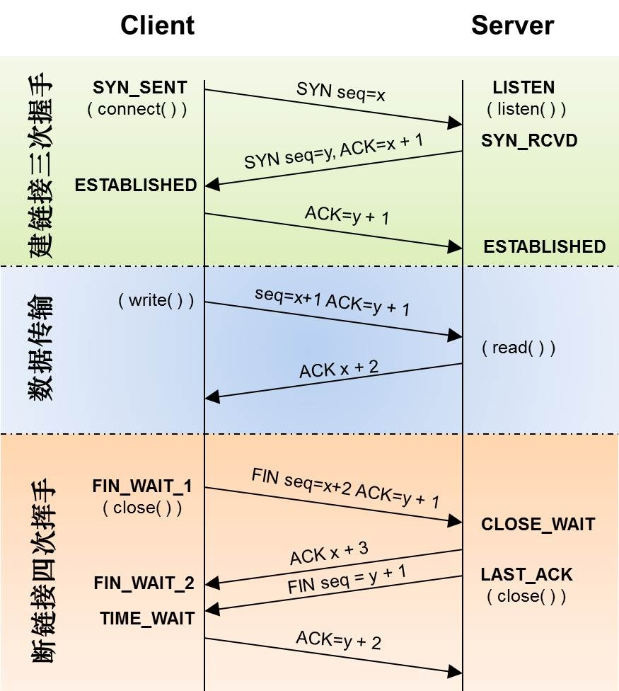
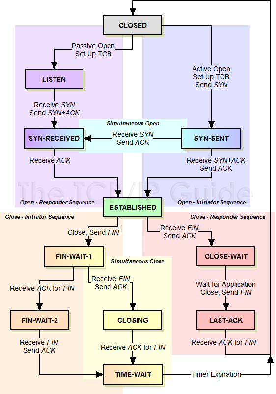

#如何学习 TCP　协议

##入门

##理解概念

TCP 提供一种面向连接的,可靠的,字节流服务.

**面向连接**

两个使用 TCP 的应用在彼此交换数据之前必须建立连接, 完成必须关闭连接, 对比 UDP

**可靠**

确保全部的数据是立即可达, 接受者接收到包与发送者发送的包完整且顺序一致

传输前: 数据分片
传输中: 超时重传(超时重传和快速重传), 流量控制
传输后: 首部校验, 失序重排, 去重, 确认

**字节流服务**

两个应用通过 TCP 连接交换 8 bit构成的字节流. TCP 不在字节流中插入记录标志符,不对字节流内容作任何解释

此外, TCP 为应用层提供全双工服务, TCP 为一个没有选择确认,没有选择否认的滑动窗口协议

##协议格式

##基本原理

###从连接建立,传输数据,到断开连接的状态变化

###连接建立之三次握手过程

####为什么是三次, 不是两次, 四次或更多 ?

要正确回答这个问题, 首先要理解对可靠的约束, TCP 每次发送都是需要对端确认的, 而 UDP 就不需要, 这就本身
表明 TCP 较 UDP 是可靠的. 我相信刨根问底的你, 绝对不会满足这样的回答, 我们继续探讨.

建立连接的过程

1 客户端首先发送请求,请求连接服务器, 等待服务器应答
2 服务器收到客户端请求, 发送应答给客户端
3 服务器发送请求, 告诉客户端已经准备好了
4 客户端收到服务器请求, 发送服务器已经收到

从这里看应该是四次数据交互怎么就成了三次呢? 这里关键是, 将服务器的接受客户端请求, 发送应答, 与发送请求
合并在一起了, 因此, 就减少了一次数据传送, 变成三次. 同理, 关闭连接也是这样, 但是关闭为什么不能是三次呢?
且待下文分析

再回到可靠性上, 到这里, 一定有人在想, 一请一答怎么可能可靠呢?

* 问题一: 如果客户端发送的请求服务的没有收到怎么办?
* 问题二: 如果服务器的应答客户端没收到怎么办?

这不是无穷递归了么? 事实上, 这个问题是不存在的, 原因是, 客户端通过超时来确定请求是否到达客户端, 如果
在一定时间内没有收到服务器的应答, 客户端会重新发送之前的请求, 经过一定的重试次数后，仍然不能成功, 就认为
服务器连接失败, 因此通过超时机制, 只要客户端和服务器是网络可达的, 服务器就一定能收到客户端的请求.
在看问题二, 服务器收到客户端的请求后发送应答, 是不是和问题一的思路一样, 是的, 服务器给客户端发送应答
也是利用超时机制来解决客户端的接收问题. 关于超时机制, 后文会详述.

当然, 至此, 问题似乎已经解决, 其实还没有, 因为, 假设客户端发送请求, 服务器收到了, 服务器发送应答, 客户端
也收到了, 问题是服务器如何确定客户端收到了呢? 是不是要客户端继续发送收到服务器的应答了呢? 这不是还是在
无限循环中么?

这个问题解决办法就是通过发送请求的序列号, 客户端发送请求报文中序列号 N, 服务器收到后应答包中加入 M ACK N+1,
客户端收到服务器的应答报文后, 通过查看 ACK N+1 知道服务的已经收到客户端发送 N 的请求, 发送 N+1:N+X,ACK M+1,
服务器收到客户端的 ACK M+1 知道客户端已经收到服务器的请求, 无限递归问题解决, 两端成功建立连接.

现在你看看上图建立连接的部分是什么样的感觉 ? 顺便思考下, 两次是否可以成功握手, 三次以上就不要考虑了, 因为三
次可以, 你为什么需要四次.

至此, 你已经充分理解, 三次握手是不多不少, 多了是浪费, 少了就不能可靠传输.

当然, 你还会发现 TCP 包首部的 32 位序号和 32 位的确认序号绝不是多余. 这里 32 位长度, 事实上, 在现在的情况下,
32 位长度在有些场合已经遇到瓶颈. 后文再表

###四次断开连接

####为什么是四次结束, 三次不可以么 ?

先看看断开连接的过程:

1 客户端发送 FIN, 表明自己数据已经发送完了(这时客户端还可以接受服务器的数据)
2 服务器收到客户端的 FIN, 应答之
3 服务器的发送 FIN, 表明自己的数据发送完了
4 客户端收到服务器的 FIN, 应答之.

四次, 这里的2, 3 可以合并么? 不可用, 因为, 服务器收到客户端的 FIN, 这时,
服务器可能还有数据要发送, 但数据没有准备好, 于是先把应答发给客户端. 所以2, 3
无法合并. 那为什么握手的2,3可以合并呢? 原因是, 握手时, 双方主要工作是建立连接,
2, 3 之间, 服务器不需要等待或依赖什么, 因此, 2,3 可以合并.

还有一个疑问是, 服务器完全可以等自己的数据准备好了, 再发送应答啊, 这样不就可以
减少为 3 次了么?

TIPS: 对于四次握手, 很多人感觉太冗余了, 因此, 现在很多应用直接 RST 断开连接, 干脆利落

###能读懂 wireshark 中与 TCP 协议相关的所有字段

了解三次握手, 四次分手, 我们来看看, 实际中网络通信的过程, 当然, 神器就是 tcpdump
和 wireshark

* Seq
* Win
* Mss
* Option
* F P U S .

####建立连接

方式:

* 一方主动打开,另一方被动打开
* 双方都主动打开

####断开连接

方式:

* 一方主动关闭,另一方被动关闭
* 双方都主动关闭

* Seq: 最大为 2^32-1, 到达最大值后从 0 开始
* MSS(Maximum Segment Size) : 发送方指明本端能接受的最大报文长度,
通常在通信的第一个报文中指明该字段, 如果一方不接受另一方的 MSS 大小, 默认是 536,
以适应 576 的 IP报文(536 + TCP头 + IP头), 以太网中该值可以为 1460(1500-40)
* SYN: 开始建立连接的第一个包, SYN 置 1
* ACK: 连接建立后,一直为 1, 在应答序列号只有在 ACK 为 1 时才有效
* FIN: 发送端完成数据发送
* RST: 重建连接
* Win: 发送方希望下次接收的数据长度阈值, 最大窗口为 65535, 在现代的网络中, 有时候已经遭遇瓶颈
* URG: 置 1 时, 紧急指针才有效
* PSH: 接收方应该尽快将这个报文交给应用程序, 发送方无法通过编程来设置, 当缓存区清空的时候, 协议栈自动会设置该标志位

###TCP 状态转换

###客户端主动打开, 服务端被动打开

1  客户端发送 SYN 未收到 ACK 时,进入 SYN_SENT
2  服务器收到 SYN, 发送 SYN, ACK 进入 SYN_RCVD
3  客户端收到服务器 ACK, 以及服务器发送的 SYN 后, 发送 ACK 后, 进入 ESTABLISHED
4  服务器收到 ACK, 不发送, 进入 ESTABLISHED
5  客户端和服务器收发数据
6  客户端发送 FIN, 进入 FIN_WAIT_1
7  服务器收到 FIN, 发送 ACK, 进入 CLOSE_WAIT
8  客户端收到 ACK, 不发送, 进入 FIN_WAIT_2
9  服务器发送 FIN, 进入 LAST_ACK
10 客户端收到 FIN, 发送 ACK， 进入 TIME_WAIT
11 服务器收到 ACK, 进入 CLOSED
12 2MSL 超时后进入 CLOSED

###异常情况

1  客户端发送 SYN 未收到 ACK 时,进入 SYN_SENT
2  服务器收到 SYN, 发送 SYN, ACK 进入 SYN_RCVD
3  客户端发送 RST
4  服务端收到 RST, 返回 LISTEN 状态, 等待另一个连接请求到来

###2MSL

当一个 TCP 执行主动关闭, 并发回最后一个 ACK, 该连接必须在 TIME_WAIT 状态停留的时间为 2 倍的 MSL.
这样的好处是让 TCP 再次发送最后一个 ACK 以防这个 ACK 丢失(另一端超时并重传最后的FIN), 缺点是直到
2MSL 结束 这个 TCP 连接在 2MSL 等待期间, 不能再被使用, 一般 2MSL 为 4 分钟,实现常是 1 分钟或 30 秒

1. 如果是客户端执行主动关闭, 2MSL 没有什么影响, 因为客户端不会端口重用,而且端口是不固定的
2. 如果是服务端主动关闭, 2MSL 就可能产生影响, 因为服务器一般都是绑定到固定端口

验证

1. 服务器启动一个服务(绑定 8000 端口), 客户端连接服务器, 然后停止服务, 重启服务
2. 客户端连接服务器绑定到固定端口(9000), 连接服务器, 然后, 关闭客户端, 重新连接服务器
3. 服务器启动服务(绑定8000d端口), 客户端绑定(9000)端口, 连接服务器, 主动关闭服务器, 然后以服务器的
8000 端口为客户端, 客户端的 9000 端口为服务端口, 服务器连接客户端的 9000 端口
4. 在 3 中，服务器连接客户端的时候打开 SO_REUSEADDR
5. 在 1 中, 启动服务器时打开 SO_REUSEADDR.

###RST

* 到不存在的端口
* 异常终止一个连接 SO_LINGER
* 半打开连接: 客户端掉电, 服务器重启,客户端重新发送数据

半关闭: 例如远程执行命令
平静时间:
同时打开: 既是服务器又是客户端
同时关闭: 同时 FIN
TCP 选项:

**注**

* MSL(Maximum Segment Lifetime)
* 两个导致进入 ESTABLISHED 的状态变迁对应打开一个连接, 两个导致从 ESTABLISHED 离开的变迁对应关闭一个连接
* CLOSED 不是一个真正的状态, 而是一个假想的起点和终点

此外, 还有如下零碎的知识点;

1. src_ip, src_port, dst_ip, dst_pot 为四元组, 唯一标志一个 TCP 连接
2. src_ip, src_port, protocol, dst_ip, dst_port 为我们常说的五元组, 唯一标志一个连接
3. 连接建立开始的序号叫 ISN (initial Sequence Number), 即初始序列号, 绝不是从抓包软件中看到的从 0 开始, 此外这个需要是 2的 32 次方
4. 连接建立和连接终止时, TCP 数据部分为 0, 因此 TCP 报文数据部分是可选的
5. 校验和是强制性的
6. 首部没有可选字段, 为20 个字节, 包含可选字段最大为 60 字节(4 * 15)
7. TCP 接受一个连接将其放入队列, 而应用层接受连接是将其从队列中取出
8. TCP 确认仅仅表明TCP已经正确接受了数据

至此, 你可以在简历上说了解 TCP 了. 但要说熟悉, 还需要下文的帮助

##熟悉

要达到熟悉, 必须能够回答如下问题

* 如何衡量某个网络对的数据承载能力?
* 当数据达到网络的承载能力会发生什么?
* 如何让数据不要超过网络的承载能力?
* 为什么要流控?
* TCP 发送者是如何限制发送速率的?
* TCP 发送者如何知道网络发生了拥塞? 丢包, ACK 的达到速率
* 发生拥塞 TCP 发送者是如何处理的?
* 慢启动到拥塞避免(或Additive Increase)的条件是什么? Slow Start Threshold(ssthresh)
* 拥塞避免的峰值是什么? advertised window
* Additive Increase 到拥塞避免的条件是什么?
* 如果发生 Loss Event 如何处理?
  1. 3 次重复 ACK: ssthresh[new] = ssthresh[old]/2 cwnd[new] = ssthresh, 进入拥塞避免或 (Additive Increase)阶段
  2. 超时:  ssthresh[new] = ssthresh[old]/2 cwnd[new] = MSS, 进入慢启动阶段

##TCP 窗口

* MTU
* MSS(Maximum Segment Size)
* 发送窗口
* 接受窗口(receiver window(rwnd)): 也叫通告窗口,可变,即滑动窗口, 接收方的流量控制
* 拥塞窗口(congestion window(cwnd)): 发送方的流量控制 cwnd[new] = cwnd[old] + MSS * MSS/cwnd[old]
* 路径MTU
* 延迟确认
* Nagle算法
* 滑动窗口(sliding window): 窗口张开, 窗口合拢, 窗口收缩
* 通告窗口(advertised window(awnd))
* 慢启动(Slow Start): cwnd[init] = MSS, cwnd[new] = cwnd[old] + MSS
* (Multiplicative Decrease) cwnd[new] = cwnd[old]/2
* AIMD(Additive Increase, Multiplicative Decrease)
* 拥塞避免(congestion avoidance)

它们相互之间的关系

 MTU = MSS + 40

###MSL 与 Seq 的关系

RFC793 中说, ISN 会和一个假的时钟绑在一起, 这个时钟会在每 4 微秒对 ISN 做加一操作, 直到超过 2^32，又从 0 开始. 这样,
一个 ISN 的周期大约是 4.55 个小时. 因为, 我们假设我们的 TCP Segment 在网络上的存活时间不会超过 Maximum Segment Lifetime
（缩写为MSL – Wikipedia语条）. 所以，只要 MSL 的值小于 4.55 小时, 那么, 我们就不会重用到 ISN.

###MSL 与 TIME_WAIT 的关系

##重传

关于重传, 必然是出现了不期望的结果, 那么, 有哪些不期望的结果, 我们一一列出

###握手阶段

1  客户端向服务器发送 SYN 请求, 服务器一直没有收到客户端的 SYN 请求

2  客户端向服务器发送 SYN 请求, 服务器收到客户端的 SYN 请求, 但是服务器没有应答

3  客户端向服务器发送 SYN 请求, 服务器收到客户端的 SYN 请求, 服务器发送 ACK 和自己的 SYN 请求, 但客户端一直没有收到服务器应答

4  客户端向服务器发送 SYN 请求, 服务器收到客户端的 SYN 请求, 服务器发送 ACK 和自己的 SYN 请求, 客户端收到服务器的应答, 但没有应答服务器的 SYN 请求

5  客户端向服务器发送 SYN 请求, 服务器收到客户端的 SYN 请求, 服务器发送 ACK 和自己的 SYN 请求, 客户端收到服务器的应答, 向服务器发送 ACK, 但是服务器一直没有收到客户端的应答

6  客户端向服务器发送 SYN 请求, 服务器收到客户端的 SYN 请求, 服务器发送 ACK 和自己的 SYN 请求, 客户端收到服务器的应答, 向服务器发送 ACK, 服务器收到客户端的应答

对于情况4, 就会出现常见的 syn flood 攻击, 试想, 如果一个客户端发送大量的请求, 但是都不应都服务器的 SYN, 服务器就只能等超时, 在超时阶段,
该客户端就一直占有这个连接, 如果超时时间很长, 服务器的 SYN 队列很快就满了, 无法处理其他正确的请求.

Linux 下解决办法是设置 tcp_syncookies 的参数 —— 当 SYN 队列满了后，TCP 会通过源地址端口, 目标地址端口和时间戳打造出一个特别的 Sequence Number
发回去(又叫cookie), 如果是攻击者则不会有响应, 如果是正常连接, 则会把这个 SYN Cookie 发回来, 然后服务端可以通过 cookie 建连接(即使你不在 SYN
队列中). 请注意, 请先千万别用 tcp_syncookies 来处理正常的大负载的连接的情况. 因为, synccookies 是妥协版的 TCP 协议, 并不严谨. 对于正常的请求,
你应该调整如下三个参数来处理这种攻击

    tcp_synack_retries    可以用他来减少重试次数;
    tcp_max_syn_backlog   可以增大SYN连接数;
    tcp_abort_on_overflow 处理不过来干脆就直接拒绝连接了。

###数据传送阶段

1 客户端发送请求, 服务器没有收到客户端的请求
2 客户端发送请求, 服务器收到客户端的请求, 但服务器没有应答客户端的请求
3 客户端发送请求, 服务器收到客户端的请求, 服务器应答客户端的请求, 但客户端没有收到

###分手阶段

1. 客户端发送 FIN, 服务器没有收到客户端的 FIN 请求

2. 客户端发送 FIN, 服务器收到了客户端的 FIN 请求, 但没有 ACK

3. 客户端发送 FIN, 服务器收到了客户端的 FIN 请求, 发送 ACK, 客户端没有收到服务器的 ACK

4. 客户端发送 FIN, 服务器收到了客户端的 FIN 请求, 发送 ACK, 客户端收到了服务器的 ACK, 但服务器一直没有发送 FIN

5. 客户端发送 FIN, 服务器收到了客户端的 FIN 请求, 发送 ACK, 客户端收到了服务器的 ACK, 服务器发送 FIN, 但客户端一直没有收到服务器的 FIN 请求

6. 客户端发送 FIN, 服务器收到了客户端的 FIN 请求, 发送 ACK, 客户端收到了服务器的 ACK, 服务器发送 FIN, 但客户端收到服务器的 FIN 请求, 没有发送 ACK

7. 客户端发送 FIN, 服务器收到了客户端的 FIN 请求, 发送 ACK, 客户端收到了服务器的 ACK, 服务器发送 FIN, 但客户端收到服务器的 FIN 请求, 发送 ACK, 但服务没有收到客户端的 ACK

8. 客户端发送 FIN, 服务器收到了客户端的 FIN 请求, 发送 ACK, 客户端收到了服务器的 ACK, 服务器发送 FIN, 但客户端收到服务器的 FIN 请求, 发送 ACK, 服务收到客户端的 ACK

* 延迟确认: 收到数据后直到有数据要回复或者延迟一定时间(200ms)，才确认
* Nagle 算法: 收到数据后直到有数据要回复或者数量满 1 个MSS，才确认, (TCP_NODELAY 关闭该算法)
* 糊涂窗口综合症: 窗口更新发生于窗口大小增加了两个 MSS 或最大接受窗口的 1/2 时,发送窗口更新
* SACK
* Karn / Partridge Algorithm
* Jacobson / Karels Algorithm RFC6289
* Zero Window
* David D Clark’s 方案

##拥塞控制

* RTT:
* RTO 计算方法 A+2D -> A+4D

* 拥塞避免: 慢启动到达临界窗口值，每个往返时间增加 1 个 MSS
* 慢启动: 每收到 n 个确认就把拥塞窗口增加 n 个 MSS
* 快速恢复: 临界窗口值为没有确认包的数据量的 1/2 (不小于 2 MSS), 拥塞窗口设置为临界窗口值加 3, 继续保留在拥塞避免阶段

* 超时重传: 拥塞避免阶段
* 超时重传对拥塞窗口和临界窗口值的影响 : 临界窗口值为没有确认包的数据量的 1/2 (不小于 2 MSS), 拥塞窗口降为 MSS
* 快速重传: 拥塞避免阶段,收到 3 个重复的 ack(表明包丢了); 为什么要 3 个，完全是经验值，为了与乱序区别开来
* 快速重传对拥塞窗口和临界窗口值的影响 : 快速恢复

* TCP Reno
* TCP New Reno

##临界窗口(ssthresh)的确认

* RFC 2001 丢包时的一半大小
* Westwood : 作者 Saverio Mascolo, 适用于经常发送非拥塞性的丢包环境(无线)
* Vega : 通过 RTT 来调整临界窗口值
* Compound : Windows
* BIC
* CUBIC
* HSTCP(High Speed TCP) 算法

对于多个丢包, 更好的解决办法:

* NewReno: RFC 2582, RFC 3782
* SACK   : RFC 2018

* SO_REUSEPORT
* SO_REUSEADDR

##精通

* 深入理解内核网络参数对程序性能, 内存消耗的影响.
* 阅读内核源代码
* 阅读 RFC
* 实践

###SO_SNDBUF、SO_RCVBUF缓存使用上限与实际内存到底有怎样的关系呢?

TCP连接所用内存主要由读写缓存决定, 而读写缓存的大小只与实际使用场景有关, 在实际使用未达到上限时,
SO_SNDBUF、SO_RCVBUF是不起任何作用的. 对读缓存来说, 接收到一个来自连接对端的 TCP 报文时, 会导致
读缓存增加, 当然, 如果加上报文大小后读缓存已经超过了读缓存上限, 那么这个报文会被丢弃从而读缓存大
小维持不变. 什么时候读缓存使用的内存会减少呢? 当进程调用 read, recv 这样的方法读取 TCP 流时, 读
缓存就会减少. 因此，读缓存是一个动态变化的, 实际用到多少才分配多少的缓冲内存, 当这个连接非常空闲
时, 且用户进程已经把连接上接收到的数据都消费了, 那么读缓存使用内存就是 0.

写缓存也是同样道理. 当用户进程调用 send 或者 write 这样的方法发送 TCP 流时, 就会造成写缓存增大.
当然, 如果写缓存已经到达上限, 那么写缓存维持不变, 向用户进程返回失败. 而每当接收到 TCP 连接对端
发来的 ACK 确认了报文的成功发送时, 写缓存就会减少, 这是因为 TCP 的可靠性决定的, 发出去报文后由于
担心报文丢失而不会销毁它, 可能会由重发定时器来重发报文. 因此, 写缓存也是动态变化的, 空闲的正常连
接上, 写缓存所用内存通常也为0.

因此, 只有当接收网络报文的速度大于应用程序读取报文的速度时, 可能使读缓存达到了上限, 这时这个缓存
使用上限才会起作用. 所起作用为: 丢弃掉新收到的报文, 防止这个 TCP 连接消耗太多的服务器资源. 同样,
当应用程序发送报文的速度大于接收对方确认 ACK 报文的速度时, 写缓存可能达到上限, 从而使 send 这样的
方法失败，内核不为其分配内存。

###缓存的大小与TCP的滑动窗口到底有什么关系?

滑动窗口的大小与缓存大小肯定是有关的, 但却不是一一对应的关系, 更不会与缓存上限具有一一对应的关系.
因此, 网上很多资料介绍 rmem_max 等配置设置了滑动窗口的最大值, 与我们 tcpdump 抓包时看到的 win 窗口
值完全不一致, 是讲得通的. 下面我们来细探其分别在哪里.

读缓存的作用有 2 个:

1. 将无序的, 落在接收滑动窗口内的 TCP 报文缓存起来;
2. 当有序的, 可以供应用程序读取的报文出现时, 由于应用程序的读取是延时的, 所以会把待应用程序读取的
报文也保存在读缓存中. 所以, 读缓存一分为二, 一部分缓存无序报文, 一部分缓存待延时读取的有序报文.
这两部分缓存大小之和由于受制于同一个上限值, 所以它们是会互相影响的, 当应用程序读取速率过慢时, 这
块过大的应用缓存将会影响到套接字缓存, 使接收滑动窗口缩小, 从而通知连接的对端降低发送速度, 避免无
谓的网络传输. 当应用程序长时间不读取数据, 造成应用缓存将套接字缓存挤压到没空间, 那么连接对端会收到
接收窗口为 0 的通知, 告诉对方:我现在消化不了更多的报文了.

反之，接收滑动窗口也是一直在变化的.

###为什么初始的接收窗口是5792? 远小于最大接收缓存?

这当然是有原因的, TCP 协议需要考虑复杂的网络环境, 所以使用了慢启动, 拥塞窗口建立连接时的初始窗口
并不会按照接收缓存的最大值来初始化. 这是因为, 过大的初始窗口从宏观角度, 对整个网络可能造成过载引
发恶性循环, 也就是考虑到链路上各环节的诸多路由器, 交换机可能扛不住压力不断的丢包(特别是广域网),而
微观的 TCP 连接的双方却只按照自己的读缓存上限作为接收窗口, 这样双方的发送窗口(对方的接收窗口)越大
就对网络产生越坏的影响. 慢启动就是使初始窗口尽量的小, 随着接收到对方的有效报文, 确认了网络的有效
传输能力后, 才开始增大接收窗口。

不同的linux内核有着不同的初始窗口, 我们以广为使用的 linux2.6.18 内核为例, 在以太网里, MSS 大小为
1460, 此时初始窗口大小为 4 倍的 MSS.

为什么显示窗口是 5792, 并不是 1460*4 为 5840 呢? 这是因为 1460 想表达的意义是: 将
1500 字节的 MTU 去除了 20 字节的 IP 头, 20 字节的 TCP 头以后, 一个最大报文能够承载的有效数据长度.
但有些网络中, 会在 TCP 的可选头部里, 使用 12 字节作为时间戳使用, 这样, 有效数据就是 MSS 再减去 12,
初始窗口就是 (1460-12)*4=5792, 这与窗口想表达的含义是一致的, 即:我能够处理的有效数据长度.

在 linux kernel 3.0 以后的版本中, 初始窗口调整到了 10 个 MSS 大小, 这主要来自于 GOOGLE 的建议. 原因
是这样的, 接收窗口虽然常以指数方式来快速增加窗口大小(拥塞阀值以下是指数增长的, 阀值以上进入拥塞避免
阶段则为线性增长, 而且, 拥塞阀值自身在收到 128 以上数据报文时也有机会快速增加), 若是传输视频这样的大
数据, 那么随着窗口增加到(接近)最大读缓存后, 就会"开足马力"传输数据, 但若是通常都是几十 KB 的网页,
那么过小的初始窗口还没有增加到合适的窗口时, 连接就结束了. 这样相比较大的初始窗口, 就使得用户需要
更多的时间(RTT)才能传输完数据, 体验不好.

###当窗口从初始窗口一路扩张到最大接收窗口时, 最大接收窗口就是最大读缓存吗?

不是, 因为必须分一部分缓存用于应用程序的延时报文读取. 到底会分多少出来呢? 这是可配的系统选项, 如下

    net.ipv4.tcp_adv_win_scale = 2    // 最新的内核为 1

这里的 tcp_adv_win_scale 意味着, 将要拿出 1/(2^tcp_adv_win_scale) 缓存出来做应用缓存. 即, 默认
tcp_adv_win_scale 配置为 2 时, 就是拿出至少 1/4 的内存用于应用读缓存, 那么, 最大的接收滑动窗口
的大小只能到达读缓存的 3/4.

###最大读缓存到底应该设置到多少为合适呢?

当应用缓存所占的份额通过 tcp_adv_win_scale 配置确定后, 读缓存的上限应当由最大的 TCP 接收窗口决定.
初始窗口可能只有 4 个或者 10 个 MSS, 在无丢包情形下随着报文的交互窗口就会增大, 当窗口过大时,"过大"
是什么意思呢? 即, 对于通讯的两台机器的内存而言不算大, 但是对于整个网络负载来说过大了, 就会对网络
设备引发恶性循环, 不断的因为繁忙的网络设备造成丢包. 而窗口过小时, 就无法充分的利用网络资源. 所以,
一般会以 BDP 来设置最大接收窗口(可计算出最大读缓存). BDP 叫做带宽时延积, 也就是带宽与网络时延的乘积,
例如若我们的带宽为 2Gbps, 时延为 10ms, 那么带宽时延积 BDP 则为 2G/8*0.01=2.5MB, 所以这样的网络中
可以设最大接收窗口为 2.5MB, 这样最大读缓存可以设为 4/3*2.5MB=3.3MB。

为什么呢? 因为 BDP 就表示了网络承载能力, 最大接收窗口就表示了网络承载能力内可以不经确认发出的报文.

经常提及的所谓长肥网络, "长"就是是时延长, "肥"就是带宽大, 这两者任何一个大时, BDP 就大, 都应导致
最大窗口增大, 进而导致读缓存上限增大. 所以在长肥网络中的服务器, 缓存上限都是比较大的.(当然, TCP
原始的 16 位长度的数字表示窗口虽然有上限, 但在 RFC1323 中定义的弹性滑动窗口使得滑动窗口可以扩展到
足够大.)

发送窗口实际上就是 TCP 连接对方的接收窗口, 所以可以按接收窗口来推断.

###设置好最大缓存限制后就高枕无忧了吗?

对于一个 TCP 连接来说, 可能已经充分利用网络资源, 使用大窗口, 大缓存来保持高速传输了. 比如在长肥
网络中, 缓存上限可能会被设置为几十兆字节, 但系统的总内存却是有限的, 当每一个连接都全速飞奔使用到
最大窗口时, 1万个连接就会占用内存到几百G了, 这就限制了高并发场景的使用, 公平性也得不到保证. 我们
希望的场景是, 在并发连接比较少时, 把缓存限制放大一些, 让每一个 TCP 连接开足马力工作; 当并发连接
很多时, 此时系统内存资源不足, 那么就把缓存限制缩小一些, 使每一个TCP连接的缓存尽量的小一些, 以容
纳更多的连接.

Linux 为了实现这种场景, 引入了自动调整内存分配的功能, 由 tcp_moderate_rcvbuf 配置决定, 如下:

    net.ipv4.tcp_moderate_rcvbuf = 1

默认 tcp_moderate_rcvbuf 配置为 1, 表示打开了 TCP 内存自动调整功能. 若配置为 0, 这个功能将不会
生效(慎用).

另外请注意:当我们在编程中对连接设置了 SO_SNDBUF、SO_RCVBUF 将会使 Linux 内核不再对这样的连接执行
自动调整功能!

###TCP 内存分配

当系统在非压力模式下, 上面我所说的每个连接的读写缓存上限, 才有可能增加, 当然最大也不会超过
tcp_rmem[2] 或者 tcp_wmem[2]. 相反, 在压力模式下, 读写缓存上限则有可能减少, 虽然上限可能会小于
tcp_rmem[0] 或者 tcp_wmem[0]。

所以, 粗略的总结下, 对这 3 个数组可以这么看:

1. 只要系统 TCP 的总体内存超了 tcp_mem[2], 新内存分配都会失败。
2. tcp_rmem[0] 或者 tcp_wmem[0]优先级也很高, 只要条件 1 不超限, 那么只要连接内存小于这两个值, 就保证新内存分配一定成功.
3. 只要总体内存不超过tcp_mem[0]，那么新内存在不超过连接缓存的上限时也能保证分配成功。
4. tcp_mem[1]与tcp_mem[0]构成了开启、关闭内存压力模式的开关。在压力模式下，连接缓存上限可能会减少。在非压力模式下，连接缓存上限可能会增加，最多增加到tcp_rmem[2]或者tcp_wmem[2]。

###TIME_WAIT

关于TIME_WAIT数量太多. 从上面的描述我们可以知道, TIME_WAIT 是个很重要的状态, 但是如果在大并发的
短链接下，TIME_WAIT 就会太多, 这也会消耗很多系统资源. 只要搜一下, 你就会发现, 十有八九的处理方式
都是教你设置两个参数, 一个叫 tcp_tw_reuse, 另一个叫 tcp_tw_recycle 的参数, 这两个参数默认值都是
被关闭的, 后者 recyle 比前者 resue 更为激进, resue 要温柔一些. 另外, 如果使用 tcp_tw_reuse, 必需
设置 tcp_timestamps=1, 否则无效. 这里, 你一定要注意, 打开这两个参数会有比较大的坑——可能会让 TCP
连接出一些诡异的问题(因为如上述一样, 如果不等待超时重用连接的话, 新的连接可能会建不上. 正如官方
文档上说的一样 " It should not be changed without advice/request of technical experts").

关于tcp_tw_reuse. 官方文档上说 tcp_tw_reuse 加上 tcp_timestamps(又叫PAWS, for Protection Against
Wrapped Sequence Numbers)可以保证协议的角度上的安全, 但是你需要 tcp_timestamps 在两边都被打开(你
可以读一下tcp_twsk_unique的源码). 我个人估计还是有一些场景会有问题.

关于 tcp_tw_recycle. 如果是 tcp_tw_recycle 被打开了话, 会假设对端开启了 tcp_timestamps, 然后会去
比较时间戳, 如果时间戳变大了, 就可以重用. 但是, 如果对端是一个 NAT 网络的话(如:一个公司只用一个
IP 出公网）或是对端的 IP 被另一台重用了, 这个事就复杂了. 建链接的SYN可能就被直接丢掉了(你可能会
看到 connection time out 的错误)(如果你想观摩一下 Linux的内核代码，请参看源码 tcp_timewait_state_process).

关于 tcp_max_tw_buckets. 这个是控制并发的 TIME_WAIT 的数量, 默认值是 180000, 如果超限, 那么,系统
会把多的给 destory 掉, 然后在日志里打一个警告(如:time wait bucket table overflow), 官网文档说这个
参数是用来对抗 DDoS 攻击的. 也说的默认值 180000 并不小. 这个还是需要根据实际情况考虑.

建立起连接后，这就意味着五元组[src IP, dst IP, src Port, dst Port, Protocol]已经确定并和某个进程
pid 绑定, 这个五元组会被加入到内核里面的 sock hash 表里, 通过这个 hash 表后续连接就知道这个已存
在的连接到底是绑定在哪个进程 pid 上的, 而后续报文都会发送到这个 pid, 不至于导致连接混乱.

###MSS 计算

TCP提供的是一种面向连接的，可靠的字节流服务，TCP 提供可靠性的一种重要的方式就是 MSS。通过 MSS，应用数
据被分割成 TCP 认为最适合发送的数据块，由 TCP 传递给 IP 的信息单位称为报文段或段(segment)。代表一个
TCP socket 的结构体 struct tcp_sock 中有多个成员用于确定应用数据被分割成最大为多大的数据块较为合适
(最大报文段长度MSS)。

我们不难联想到，跟最大报文段长度最为相关的一个参数是网络设备接口的 MTU，以太网的 MTU 是 1500，基本 IP
首部长度为20，TCP 首部是 20，所以 MSS 的值可达 1460(MSS不包括协议首部，只包含应用数据)。

前面的 TCP 三次握手协议中我们看到，通讯的双方都通过 TCP 选项通告了自己期望接收的 MSS 值，该值直接来源于
struct tcp_sock 的成员 advmss，而这个值直接取自于网络设备接口的 MTU 减去 IP 首部和 TCP 首部的长度。在本
地以太网中可达 1460(如果首部都不含选项的话)。而成员 rx_opt 是一个结构体 struct tcp_options_received，它
记录的是来自对端的 TCP 选项通告，其成员 mss_clamp 表示 mss 的上限值，其来源就是对端的 MSS 通告，而
mss_user 是用户设置的 mss,其优先级最高，如果有 user_mss，则使用 user_mss，忽略其它。

从上面我们可以看到，MSS 是可以通过 SYN 段进行协商的(MSS 选项只能出现在 SYN 报文段中)，但它并不是任何条件
下都可以协商的，如果一方不接受来自另一方的 MSS 值，并且没有 user_mss，则 MSS 就定为默认值 536 字节（加上
首部，允许576字节的IP数据报)。实际上，struct tcp_sock->rx_opt->mss_clamp 的初始值就定为536，等收到来自对
端的MSS通告后，才进行修改。而结构体struct tcp_sock的成员mss_cache用于缓存上次的有效的mss，其初始值也被定为536。

函数 mytcp_sync_mss 为一个 tcp socket 中的 mss 相关的成员进行数据同步，其基本的一个算法是：

* 当前的MSS正常情况下应该为mtu-IP首部-TCP首部(不包括选项)。
* struct tcp_sock->rx_opt->mss_clamp中含有对端通告的能够接受的MSS值，如果该值小于第一步计算所得到的MSS，则以该值为准。
* IP首部如果带有IP选项，则MSS中要减去选项长度。
* 如果MSS已经小于48了，则令其等于48。
* 减去TCP首部中选项的长度。
* 如果MSS当前已经大于滑动窗口大小的1/2，则取滑动窗口大小的1/2作为MSS值(但不能小于48)。
* 成员mss_cache用于缓存下刚刚计算所得的MSS。

所以，说本地以太网中 MSS 为 1460 的说法并不正确，它还会动态变化，如果 IP 首部和 TCP 首部中出现选项，则 MSS 要
相应的减小，一般 TCP 首部中会有 12 字节的时间戳选项(外加两字节的填充选项)，这时的 MSS 就等于 1448。

MSS 的主要作用是限制另一端主机发送的数据的长度，同时，主机本身也控制自己发送数据报的长度，这将使以较小 MTU
连接到一个网络上的主机避免分段。 struct tcp_sock 有一个成员 xmit_size_goal，用于记录该 socket 发送数据报时
的 segment 的大小，一般情况下它的值就等于 MSS (特殊情况有例外，以后再分析)。

###PRR

https://lwn.net/Articles/458610/
http://tools.ietf.org/html/draft-mathis-tcpm-proportional-rate-reduction-01

##参考

* [RFC5681](http://tools.ietf.org/html/rfc5681)
* [RFC6582](http://tools.ietf.org/html/rfc6582)
* TCP/IP 详解卷一
* Wireshark 网络分析就这么简单
[RFC 793](http://tools.ietf.org/html/rfc793)
[RFC 1122](http://tools.ietf.org/html/rfc1122)
[RFC 6298](http://tools.ietf.org/html/rfc6298)
[RFC 3990](http://www.rfc-editor.org/rfc/rfc3390.txt)
[RFC 3649](http://tools.ietf.org/html/rfc3649)
[linux tcp 相关配置选项](https://www.kernel.org/doc/Documentation/networking/ip-sysctl.txt)
[RFC 2018](http://tools.ietf.org/html/rfc2018)
[RFC 2883](http://www.ietf.org/rfc/rfc2883.txt)
[SACK 性能权衡](http://www.ibm.com/developerworks/cn/linux/l-tcp-sack/)
[TCP那些事上](http://coolshell.cn/articles/11564.html)
[TCP那些事下](http://coolshell.cn/articles/11609.html)
[拥塞避免算法列表](https://en.wikipedia.org/wiki/TCP_congestion-avoidance_algorithm)

附录
SYN(Synchronize Sequence Numbers)
ISN(Inital Sequence Number)
滑动窗口(sliding window)
ssthresh（slow start threshold）
