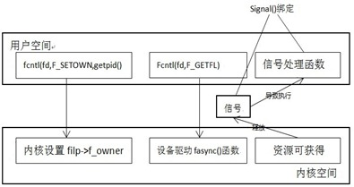

结合阻塞与非阻塞访问、poll 函数可以较好地解决设备的读写，但是如果有了异步通知就更方便了。异步通知的意思是：一旦设备就绪，则主动通知应用程序，这样应用程序根本就不需要查询设备状态，这一点非常类似于硬件上“中断”地概念，比较准确的称谓是：信号驱动(SIGIO)的异步 I/O。可以使用signal()函数来设置对应的信号的处理函数。函数原型是：

void (*signal(int signo,void (*func)(int))) (int)

 

我们先来看一个使用信号驱动的例子，通过signal(SIGIO,input_handler) 对打开的文件fd 启动信号机制，输入可获得时inputhandler被调用，代码如下：

```
/*async_io_app.c*/

#include <sys/types.h>

#include <sys/stat.h>

#include <stdio.h>

#include <fcntl.h>

#include <signal.h>

#include <unistd.h>

#include <stdlib.h>

#define MAX_LEN 100

int fd;

void input_handler(int num)
{

    char data[MAX_LEN];

    int len;

 

    //读取并输出 STDIN_FILENO 上的输入

    len = read(fd, &data, MAX_LEN);

    data[len] = 0;

    printf("input available:%s\n", data);

}

int main()
{

    int oflags;

    //启动信号驱动机制

    fd = open("/dev/CDEV_ZHU", O_RDWR, S_IRUSR | S_IWUSR);

    if(fd == -1)
    {

              printf("Device Open Failure !\n");

              exit(0);

    }

    signal(SIGIO, input_handler);

    fcntl(fd, F_SETOWN, getpid());

    oflags = fcntl(fd, F_GETFL);

    fcntl(fd, F_SETFL, oflags | FASYNC);

    //最后进入一个死循环，程序什么都不干了，只有信号能激发 input_handler 的运行
    //如果程序中没有这个死循环，会立即执行完毕

    while (1);

    return 0;

}
```

下面来解释一下上面的代码。为了一个用户在用户空间中能处理一个设备释放的信号，它必须完成一下3份工作：

 1)通过F_SETOWN控制指令设置设备文件的拥有者为本进程,这样从设备驱动中发出的信号才能被本进程收到。

 2)通过F_SETFL 控制命令设置设备文件支持FASYNC,即异步通知模式。

 3)通过signal()链接信号和信号处理函数。

有了信号的发送，那么就一定得有信号的释放了：

  在设备驱动和应用程序的异步通知交互中，仅仅在应用程序端捕获信号是不够的，因为信号没有的源头是在驱动端，因此要在适当的时机让设备驱动释放信号。

 为了使设备支持异步通知机制，驱动程序中涉及三个操作：

 1)支持F_SETOWN命令，能在这个控制命令处理中设置filp->f_owner为对应的进程ID。不过此项工作已由内核完成，设备驱动无须处理。

 2)支持F_SETFL命令的处理,每当FASYNC标志改变时，驱动程序中fasync()函数将得以进行。因此,驱动程序必须实现fasync()函数。

 3)在设备资源可获得时,调用kill_fasync()函数激发相应的信号。

 驱动程序中上面的三步是和应用程序是一一对应的。如下图：



设备驱动中异步通知编程还是比较简单的，主要就是一些数据结构，和两个函数：

数据结构：fasync_struct结构体

函数：1）处理FASYNC标志变更的函数int fasync_helper(int fd, struct file *filp, int mode ,struct fasync_struct **fa);

2) 释放信号用的函数void kill_fasync(struct fasync_struct **fa, int sig, int band);

和其他设备驱动一样，一般将fasync_struct放到设备结构体中。

 

下面给出驱动程序部分实现支持异步IO的代码：

```
/* async_io_driver.c */

#include <linux/module.h>

#include <linux/init.h>

#include <linux/fs.h>

#include <asm/uaccess.h>

#include <linux/wait.h>

#include <linux/semaphore.h>

#include <linux/device.h>

#include <linux/cdev.h>

#include <linux/sched.h>

#include <linux/fcntl.h>

#include <linux/poll.h>

 

MODULE_LICENSE("GPL");

 

#define LEN  30

#define init_MUTEX(LOCKNAME) sema_init(LOCKNAME,1)

#define DEVICE_NAME  "CDEV_ZHU"

static struct class *cdev_class;

 

struct asycIO                                    

{                                                        

  struct cdev dev_c; /*cdev结构体*/   

  dev_t  dev; 

  char  mem[LEN];

  int   flag ;

  struct semaphore sem; /*并发控制用的信号量*/          

  wait_queue_head_t r_wait; /*阻塞读用的等待队列头*/    

  struct fasync_struct *async_queue; /* 异步结构体指针，用于读 */

};

 

struct asycIO  asyc_device;

 

static int asyc_io_fasync(int fd, struct file *filp, int mode)

{

         return fasync_helper(fd, filp, mode, &asyc_device.async_queue);

}

 

/*文件释放函数*/

int asyc_io_release(struct inode *inode, struct file *filp)

{

         /* 将文件从异步通知列表中删除 */

  asyc_io_fasync( - 1, filp, 0);

  return 0;

}

 

/*写操作*/

static ssize_t asyc_write(struct file *filp, const char __user *buf,size_t count, loff_t *ppos)

{

   int ret = count;

  printk("In asyc_write!　\n");

  down(&asyc_device.sem);  //获取信号量

  memset(asyc_device.mem,0,LEN);

  if (copy_from_user(asyc_device.mem, buf, count))

  {

        up(&asyc_device.sem);

        return    - EFAULT;

  }

  printk("kernel recieve: %s  and the length is %d \n",asyc_device.mem,count);

  up(&asyc_device.sem);

  asyc_device.flag = 1;

 

  if (asyc_device.async_queue)

       kill_fasync(&asyc_device.async_queue, SIGIO, POLL_IN);

 

  wake_up_interruptible(&asyc_device.r_wait);

 

  return ret;

}

 

static ssize_t asyc_read(struct file *filp, char *buf, size_t len, loff_t *off)

{

         int ret = len;

         printk("In asyc_read \n");

    if (wait_event_interruptible(asyc_device.r_wait, asyc_device.flag != 0))

    {

        return    - ERESTARTSYS;

    }

 

    if (down_interruptible(&asyc_device.sem))

    {

        return    - ERESTARTSYS;

    }

 

    asyc_device.flag = 0;

        

    if (copy_to_user(buf, asyc_device.mem, len))

    {

        up(&asyc_device.sem);

        return    - EFAULT;

    }

    up(&asyc_device.sem);

    return ret;

}

 

struct file_operations asyc_fops =

{

         read: asyc_read,

         write: asyc_write,

         fasync: asyc_io_fasync,

         release: asyc_io_release,

};

 

static int __init asyc_init(void)

{

    int ret,err;

        

    ret = alloc_chrdev_region(&(asyc_device.dev),0,1,DEVICE_NAME) ;

    if (ret)

    {

        printk("globalvar register failure");

    }

    else

    {

                   cdev_init(&(asyc_device.dev_c),&asyc_fops);

                  

                   err = cdev_add(&(asyc_device.dev_c),asyc_device.dev,1);

                  

                   if(err)

                   {

                            printk(KERN_NOTICE "error %d adding FC_dev\n",err);

                            unregister_chrdev_region(asyc_device.dev, 1);

                            return err;

                   }

                   else

                   {

                            printk("device register success! \n");

                   }

                  

                   cdev_class = class_create(THIS_MODULE,DEVICE_NAME);

                   if(IS_ERR(cdev_class))

                   {

                            printk("ERR:cannot create a cdev_class\n"); 

                            unregister_chrdev_region(asyc_device.dev, 1);

                            return -1;

                   }

                   device_create(cdev_class, NULL, asyc_device.dev, 0, DEVICE_NAME);

                  

                   asyc_device.flag = 0;

                   init_MUTEX(&(asyc_device.sem));

                   init_waitqueue_head(&(asyc_device.r_wait));

    }

    return ret;

} 

 

static void __exit asyc_exit(void)

{

         device_destroy(cdev_class,asyc_device.dev);

         class_destroy(cdev_class);

         unregister_chrdev_region(asyc_device.dev,1);

         printk(" device exit! \n");

}

 

module_init(asyc_init);

module_exit(asyc_exit);

 

应用程序实现写入功能：

/* async_io_app_w.c*/

#include <sys/types.h>

#include <sys/stat.h>

#include <stdio.h>

#include <fcntl.h>

#include <string.h>

int main()

{

    int fd, num;

    char buffer[100] = {0};

 

    fd = open("/dev/CDEV_ZHU", O_RDWR, S_IRUSR | S_IWUSR);

    printf("open /dev/CDEV_ZHU fd = %d \n",fd);

 

    if (fd != -1)

    {

        while (1)

        {

             memset(buffer,0,sizeof(buffer));

            printf("Please input the buffer:\n");

            scanf("%s", buffer);

             if (buffer[0] == '0') //如果输入 0，退出

            {

                close(fd);

                break;

            }

            write(fd, buffer, strlen(buffer));   

            printf("We have written: %s\n",buffer);

        }

    }

    else

    {

        printf("device open failure\n");

    }

         return 0;

}

``` 

将上面的“async_io_app.c”、“async_io_driver.c”、“async_io_app_w.c”进行编译，加载驱动之后，开两个终端，分别运行async_io_app 和 async_io_app_w，当async_io_app_w有数据写入的时候，async_io_app的终端会打印所写入的数据，当然内核也会打印数据，下面是结果：

