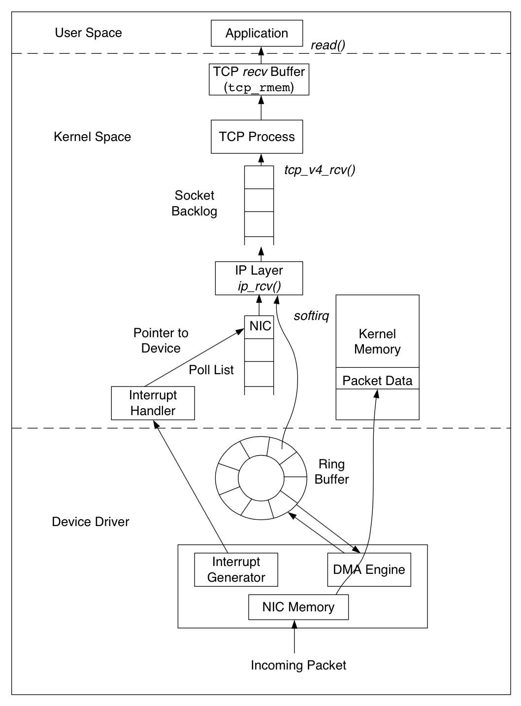
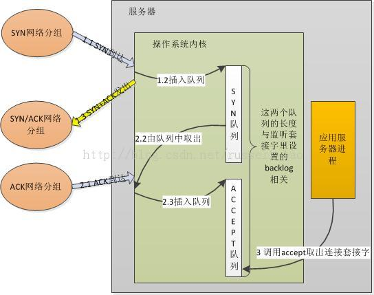
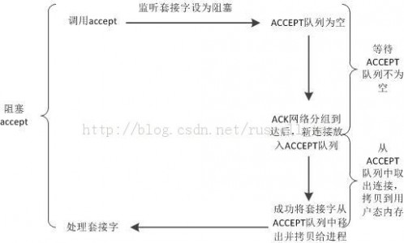

##数据包的接收

从下往上经过了三层: 网卡驱动, 系统内核空间, 用户态空间的应用. Linux内核使用 sk_buff(socket kernel buffers)
数据结构描述一个数据包. 当一个新的数据包到达, NIC(network interface controller)调用 DMA engine, 通过 Ring Buffer
将数据包放置到内核内存区. Ring Buffer 的大小固定, 它不包含实际的数据包, 而是包含了指向 sk_buff 的描述符.
当 Ring Buffer 满的时候, 新来的数据包将给丢弃. 一旦数据包被成功接收, NIC 发起 CPU 中断, 由内核的中断处理程序
将数据包传递给 IP 层. 经过 IP 层的处理, 数据包被放入队列等待 TCP 层处理. 每个数据包经过 TCP 层一系列复杂
的步骤, 更新 TCP 状态机, 最终到达 recv Buffer, 等待被应用接收处理. 有一点需要注意, 数据包到达 recv Buffer,
TCP 就会回 ACK 确认, 既 TCP 的 ACK 表示数据包已经被操作系统内核收到, 但并不确保应用层一定收到数据(例如这个
时候系统 crash), 因此一般建议应用协议层也要设计自己的确认机制.

下面以一个不太精确却通俗易懂的图来说明之:

研究过 backlog 含义的朋友都很容易理解上图. 这两个队列是内核实现的, 当服务器绑定, 监听了某个端口后,
这个端口的 SYN 队列和 ACCEPT 队列就建立好了. 客户端使用 connect 向服务器发起 TCP 连接, 当客户端的
SYN 包到达了服务器后, 内核会把该包放到 SYN 队列(即未完成握手队列)中, 同时回一个 SYN+ACK 包给客
户端. 一段时间后, 客户端再次发来了针对服务器 SYN 包的 ACK 网络分组时, 内核会把连接从 SYN 队列中取出,
再放到 ACCEPT 队列(即已完成握手队列)中. 而服务器调用 accept 时, 其实就是直接从 ACCEPT 队列中取出已
经建立成功的连接套接字而已.

现有我们可以来讨论应用层组件: 为何有的应用服务器进程中, 会单独使用 1 个线程，只调用 accept 方法来建
立连接, 例如 tomcat; 有的应用服务器进程中, 却用 1 个线程做所有的事, 包括 accept 获取新连接.

原因在于: 首先, SYN 队列和 ACCEPT 队列都不是无限长度的, 它们的长度限制与调用 listen 监听某个地址端口
时传递的 backlog 参数有关. 既然队列长度是一个值, 那么, 队列会满吗? 当然会, 如果上图中第 1 步执行的速
度大于第 2 步执行的速度, SYN 队列就会不断增大直到队列满; 如果第 2 步执行的速度远大于第 3 步执行的速度,
ACCEPT 队列同样会达到上限. 第 1,2 步不是应用程序可控的, 但第 3 步却是应用程序的行为, 假设进程中调用
accept 获取新连接的代码段长期得不到执行, 例如获取不到锁, IO阻塞等。

那么, 这两个队列满了后, 新的请求到达了又将发生什么?

若 SYN 队列满, 则会直接丢弃请求, 即新的 SYN 网络分组会被丢弃; 如果 ACCEPT 队列满, 则不会导致放弃连接,
也不会把连接从 SYN 列队中移出, 这会加剧 SYN 队列的增长. 所以, 对应用服务器来说, 如果 ACCEPT 队列中有
已经建立好的 TCP 连接, 却没有及时的把它取出来, 这样, 一旦导致两个队列满了后, 就会使客户端不能再建立新
连接, 引发严重问题。

所以, 如 TOMCAT 等服务器会使用独立的线程, 只做 accept 获取连接这一件事, 以防止不能及时的去 accept 获取连接.

那么, 为什么如 Nginx 等一些服务器, 在一个线程内做 accept 的同时, 还会做其他 IO 等操作呢?

这里就带出阻塞和非阻塞的概念. 应用程序可以把 listen 时设置的套接字设为非阻塞模式(默认为阻塞模式), 这两
种模式会导致 accept 方法有不同的行为. 对阻塞套接字, accept 行为如下图:

这幅图中可以看到, 阻塞套接字上使用 accept, 第一个阶段是等待 ACCEPT 队列不为空的阶段, 它耗时不定, 由客户端
是否向自己发起了 TCP 请求而定, 可能会耗时很长.

对非阻塞套接字, accept 会有两种返回, 如下图:

非阻塞套接字上的 accept, 不存在等待 ACCEPT 队列不为空的阶段, 它要么返回成功并拿到建立好的连接, 要么返回失败.

所以, 企业级的服务器进程中, 若某一线程既使用 accept 获取新连接, 又继续在这个连接上读, 写字符流, 那么, 这个连
接对应的套接字通常要设为非阻塞. 原因如上图, 调用 accept 时不会长期占用所属线程的 CPU 时间片, 使得线程能够及时
的做其他工作.

##附录

###关于 TCP 服务端的接受队列

1. 服务的通过 listen 监听客户端的请求, 此时服务端进入 SYN_RECV 状态.

2. 客户端通过系统调用 connect 发送连接之后, 客户端进入 SYN_SEND 状态

    异常:
        1. 如果网络不通, 客户端显然无法连接到服务端.
        2. 如果网络通, 没有连接到正确的端口, 连接直接返回.
        3. 如果网络是好的, 端口也正确, 但是服务端不应答客户端的 SYN. 客户端会在连接超时后重传.
        更多见 man connect

    配置:

        客户端重传的次数由 /proc/sys/net/ipv4/tcp_syn_retries 决定

3. 服务端会收到客户端的 SYN 包时(服务端仍然处于 SYN_RECV), 将该包存放在一个叫 SYN 队列中(此时进入半链接的状态,
因此也叫半连接队列). 紧接着发送 ACK+SYN 包. 该包有两个作用: 1)应答客户端的 ACK; 2)向客户端发送 SYN 包等待客户
端 ACK

    异常:

        1. 如果 SYN 等待队列满了, 服务端会将该包直接丢弃, 显然客户端无法收到服务端的 SYN+ACK 包;
           由于客户端没有收到服务端应答的 ACK+SYN, 客户端会重传, 具体参考步骤2
        2. 如果服务端不应答, 情况类似上述, 但一般服务端不会这样做.
        3. 如果服务端发送了 ACK+SYN, 但是客户端不应答, 服务端会重传 ACK+SYN

    配置:

        1. 服务端重传由 /proc/sys/net/ipv4/tcp_retries1 决定
        2. 处于半连接 SYN 队列的长度由 max(64, /proc/sys/net/ipv4/tcp_max_syn_backlog) 决定

4. 客户端收到服务端的 ACK+SYN 包后, 进入 ESTABLISHED 状态. 紧接着发送 ACK 给服务端

    异常:
        1. 如果客户端没有收到服务端的 SYN+ACK 包, 超时之后客户端会重传, 具体参考步骤2
        2. 如果客户端不发送 ACK 给服务端, 服务端收不到客户端的 ACK, 服务端就必须重传,
           参考步骤3. (这就是典型的 SYN flood 攻击)

    配置:
        应对 SYN 攻击最简单的方法是开启 syncookies. 即 net.ipv4.tcp_syncookies = 1

5. 服务端收到客户端的 ACK 的包, 服务端进入 ESTABLISHED 状态. 并将该包加入一个叫 Accept 的队列

    异常:
        1. 服务端如果没有收到客户端的 ACK 包, 正常情况(即没有开启 tcp_syncookies
           的情况下). 会在超时之后重传 ACK+SYN 包, 具体参考步骤3
        2. 如果 Accept 队列满后, 服务端默认行为是丢掉该包, 不进行任何处理. 具体参考如下配置部分说明.

    配置
        1. Accept 队列的长度由 min(backlog, somaxconn) 其中
           1) somaxcon 由 /proc/sys/net/core/somaxcon;
           2) backlog 的值则由 listen(int sockfd, int backlog) 中的第二个参数指定;
           3) 当 backlog 大于 somaxcon 时, 仍然为 somaxcon;
        2. 当 Accept 队列满之后, 服务端的行为由 /proc/sys/net/ipv4/tcp_abort_on_overflow 决定, 默认为 0
           1) 如果为 0, 服务端丢弃该包, 不做任何处理, 客户端之后发送数据给服务端, 服务端不做任何处理, 客户端重试,
              多次重试之后, 如果服务端 Accept 队列一直是满的, 客户端返回超时错误; 如果 Accept 有空闲, 服务端会应答给客户端
           2) 如果为 1, 服务端会发送 RST 给客户端, 客户端收到服务端的 RST 包, 连接中断.

6. 服务端的应用层调用 Accept, Accept 队列的包从队列中退出, 拷贝给用户空间.

    异常:
        如果服务端不调用 accept,  Accept 队列满后, 具体行为参考步骤5. accept
        行为参考 man accept

至此, 三次握手成功, 客户端和服务端都认为与对方成功建立连接或出现异常.

实践:

    $ ss -nl
    LISTEN 状态:
    Recv-Q 表示的当前等待服务端调用 accept 完成三次握手的 listen backlog 数值;
    Send-Q 表示的则是最大的 listen backlog 数值，这就就是上面提到的 min(backlog, somaxconn) 的值.

    非 LISTEN :
    Recv-Q 表示 receive queue 中的 bytes 数量;
    Send-Q 表示 send queue 中的 bytes 数值.

    对于 Nginx 来说，backlog 的默认值为 511，这个可以通过 ss/netstat 的 Send-Q
    确认:
    State      Recv-Q Send-Q        Local Address:Port          Peer Address:Port
    LISTEN     0      511                       *:80                       *:*

    可以通过适当的增大 nginx 的 backlog 以及 somaxconn 来增大队列: listen 80 backlog=1638

案例 TODO

1. 模拟 SYN 队列满, 并抓包分析
2. 模拟 Accpet 队列满并抓包分析

read 阻塞导致连接一直阻塞

出现问题的时候，tcp 服务端处理非常慢, 导致大量的连接请求放到 accept 队列, 把 accept 队列阻塞.

客户端发送 SYN, 此时服务端 Accpet 队列已满, 并且 inet_csk_reqsk_queue_yong(sk) > 1, server 端直接丢弃该数据包

客户端等待 3 秒后, 重传 SYN, 此时服务端状态与之前送变化, 仍然丢弃该数据包 

客户端又等待 6 秒后, 重传SYN

服务端 Accept 队列仍然是满的, 但是存在了重传握手的连接请求, 服务端接受连接请求, 并发送 SYN+ACK 给客户端

客户端收到 SYN+ACK, 标记本地连接为 ESTABLISHED 状态, 给服务端应答ACK, connect 系统调用完成。

服务端收到 ACK 后, 尝试将连接放到 Accept 队列, 但是因为 Accept 队列已满, 所以只是标记连接为acked, 并不会
将连接移动到 Accept 队列中, 也不会为连接分配 sendbuf 和 recvbuf 等资源.

客户端的应用程序, 检测到 connect 系统调用完成, 开始向该连接发送数据.

服务端收到数据包, 由于 Aceept 队列仍然是满的, 所以服务端处理也只是标记 acked, 然后返回.

客户端端由于没有收到刚才发送数据的 ACK, 所以会重传刚才的数据包

同上

同上

同上

服务端连接建立定时器生效, 遍历半连接链表, 发现刚才 acked 的连接, 重新发送 SYN+ACK 给客户端。

客户端收到 SYN+ACK 后，根据 ack 值, 使用 SACK 算法, 只重传最后一个 ack 内容.

服务端收到数据包, 由于 Accept 队列仍然是满的, 所以服务端处理也只是标记 acked, 然后返回.

客户端等待 3 秒后, 没有收到对应的 ack, 认为之前的数据包也丢失, 所以重传之前的内容数据包.

服务端连接建立定时器生效, 遍历半连接链表, 发现刚才 acked 的连接, SYN+ACK 重传次数在阀值以内, 重新发送 SYN+ACK 给客户端。

客户端收到 SYN+ACK 后, 根据 ack 值, 使用 SACK 算法, 只重传最后一个 ack 内容.

服务端收到数据包, 由于 accept 队列仍然是满的, 所以服务端处理也只是标记 acked, 然后返回

客户端等待 3 秒后, 没有收到对应的 ack, 认为之前的数据包也丢失, 所以重传之前的内容数据包.

服务端连接建立定时器生效, 遍历半连接链表, 发现刚才 acked 的连接, SYN+ACK 重传次数在阀值以内, 重新发送 SYN+ACK 给客户端。

客户端收到 SYN+ACK 后, 根据 ack 值, 使用 SACK 算法, 只重传最后一个 ack 内容.

服务端收到数据包, 由于 accept 队列仍然是满的, 所以服务端处理也只是标记 acked, 然后返回

客户端等待 3 秒后, 没有收到对应的 ack, 认为之前的数据包也丢失, 所以重传之前的内容数据包.

服务端连接建立定时器生效, 遍历半连接链表, 发现刚才 acked 的连接, SYN+ACK 重传次数在阀值以内, 重新发送 SYN+ACK 给客户端。

客户端收到 SYN+ACK 后, 根据 ack 值, 使用 SACK 算法, 只重传最后一个 ack 内容.

服务端收到数据包, 由于 accept 队列仍然是满的, 所以服务端处理也只是标记 acked, 然后返回

客户端等待 3 秒后, 没有收到对应的 ack, 认为之前的数据包也丢失, 所以重传之前的内容数据包.

服务端收到数据包, 由于 accept 队列仍然是满的, 所以服务端处理也只是标记 acked, 然后返回

客户端等待一段时间后, 认为连接不可用, 于是发送 FIN, ACK 给 server 端. Client 端的状态变为
FIN_WAIT1, 等待一段时间后, 客户端将看不到该链接.

服务端收到 ACK 后, 此时服务端刚好处理完一个请求, 从 Accept 队列中取走一个连接, 此时 Accept
队列中有了空闲, 服务端将请求的连接放到 Accept 队列中.

这样服务端上显示该链接是 ESTABLISHED 的, 但是客户端上已经没有该链接了.

之后, 当服务端从 Accept 队列中取到该连接后, 调用 read 去读取 sock 中的内容, 但是由于客户端早就退出了,
所以 read 就会 block 那里了.

##参考
http://jaseywang.me/2014/07/20/tcp-queue-%E7%9A%84%E4%B8%80%E4%BA%9B%E9%97%AE%E9%A2%98/
http://blog.chinaunix.net/uid-20662820-id-4154399.html
