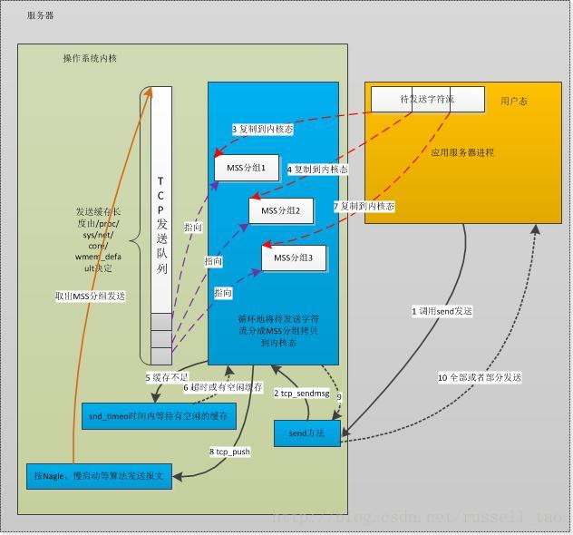

我们已经建立好的 TCP 连接, 对应着操作系统分配的 1 个套接字. 操作 TCP 协议发送数据时, 面对的是数据流.
通常调用诸如 send 或者 write 方法来发送数据到另一台主机, 那么, 调用这样的方法时, 在操作系统内核中发生
了什么事情呢? 我们带着以下 3 个问题来细细分析: 发送方法成功返回时,

* 能保证 TCP 另一端的主机接收到吗?
* 能保证数据已经发送到网络上了吗?
* 套接字为阻塞或者非阻塞时, 发送方法做的事情有何不同?

要回答上面 3 个问题涉及了不少知识点, 我们先在 TCP 层面上看看, 发送方法调用时内核做了哪些事. 我不想去罗列
内核中的数据结构,方法等, 毕竟大部分应用程序开发者不需要了解这些, 仅以一幅示意图粗略表示, 如下:

再详述上图 10 个步骤前, 先要澄清几个概念：MTU、MSS、tcp_write_queue 发送队列, 阻塞与非阻塞套接字, 拥塞窗口,
滑动窗口、Nagle算法。

当我们调用发送方法时, 会把我们代码中构造好的消息流作为参数传递. 这个消息流可大可小, 例如几个字节, 或者几兆字节.
当消息流较大时, 将有可能出现分片. 我们先来讨论分片问题.

MSS与TCP的分片

由上一篇文中可知, TCP 层是第 4 层传输层, 第 3 层 IP 网络层, 第 2 层数据链路层具备的约束条件同样对 TCP 层生效.
下面来看看数据链路层中的一个概念: 最大传输单元 MTU.

无论何种类型的数据链路层, 都会对网络分组的长度有一个限制. 例如以太网限制为 1500 字节, 802.3 限制为 1492 字节.
当内核的 IP 网络层试图发送报文时, 若一个报文的长度大于 MTU 限制, 就会被分成若干个小于 MTU 的报文, 每个报文都会
有独立的 IP 头部.

IP 协议中包总长度的是一个 16 位(2字节)的字段, 这意味一个 IP 包最大可以是 65535 字节.

若 TCP 层在以太网中试图发送一个大于 1500 字节的消息, 调用 IP 网络层方法发送消息时, IP 层会自动的获取所在局域网
的 MTU 值(即路径MTU), 并按照所在网络的 MTU 大小来分片。IP 层同时希望这个分片对于传输层来说是透明的, 接收方的 IP
层会根据收到的多个 IP 包头部, 将发送方 IP 层分片出的 IP 包重组为一个消息.

这种 IP 层的分片效率是很差的, 因为必须所有分片都到达才能重组成一个包, 其中任何一个分片丢失了, 都必须重发所有分片.
所以, TCP层会试图避免 IP 层执行数据报分片.

为了避免 IP 层的分片, TCP 协议定义了一个新的概念: 最大报文段长度 MSS. 它定义了一个 TCP 连接上, 一个主机期望对端主
机发送单个报文的最大长度. TCP 3 次握手建立连接时, 连接双方都要互相告知自己期望接收到的 MSS 大小.

例如(使用tcpdump抓包):

15:05:08.230782 IP 10.7.80.57.64569 > houyi-vm02.dev.sd.aliyun.com.tproxy: S
3027092051:3027092051(0) win 8192 <mss 1460,nop,wscale 8,nop,nop,sackOK>

15:05:08.234267 IP houyi-vm02.dev.sd.aliyun.com.tproxy > 10.7.80.57.64569: S
26006838:26006838(0) ack 3027092052 win 5840 <mss 1460,nop,nop,sackOK,nop,wscale
9>

15:05:08.233320 IP 10.7.80.57.64543 > houyi-vm02.dev.sd.aliyun.com.tproxy: P
78972532:78972923(391) ack 12915963 win 255

由于例子中两台主机都在以太网内, 以太网的 MTU 为 1500, 减去 IP 和 TCP 头部的长度, MSS 就是 1460, 三次握手中, SYN 包
都会携带期望的 MSS 大小.

当应用层调用 TCP 层提供的发送方法时, 内核的 TCP 模块在 tcp_sendmsg 方法里, 会按照对方告知的 MSS 来分片, 把消息流分为
多个网络分组(如图1中的3个网络分组), 再调用 IP 层的方法发送数据.

这个MSS就不会改变了吗？

会的. 上文说过, MSS 就是为了避免 IP 层分片, 在建立握手时告知对方期望接收的 MSS 值并不一定靠得住. 因为这个值是预估的,
TCP连接上的两台主机若处于不同的网络中, 那么, 连接上可能有许多中间网络, 这些网络分别具有不同的数据链路层, 这样, TCP
连接上有许多个 MTU. 特别是, 若中间途径的 MTU 小于两台主机所在的网络 MTU 时, 选定的 MSS 仍然太大了, 会导致中间路由器
出现 IP 层的分片.

怎样避免中间网络可能出现的分片呢 ?

通过 IP 头部的 DF 标志位, 这个标志位是告诉 IP 报文所途经的所有 IP 层代码: 不要对这个报文分片. 如果一个 IP 报文太大必
须要分片, 则直接返回一个 ICMP 错误, 说明必须要分片了, 且待分片路由器网络接受的 MTU 值. 这样, 连接上的发送方主机就可以
重新确定 MSS.

发送方法返回成功后, 数据一定发送到了 TCP 的另一端吗?

答案当然是否定的. 解释这个问题前, 先来看看TCP是如何保证可靠传输的.

TCP 把自己要发送的数据流里的每一个字节都看成一个序号, 可靠性是要求连接对端在接收到数据后, 要发送 ACK 确认, 告诉它已经接
收到了多少字节的数据. 也就是说, 怎样确保数据一定发送成功了呢? 必须等待发送数据对应序号的 ACK 到达, 才能确保数据一定发送
成功. TCP 层提供的send 或者 write 这样的方法是不会做这件事的, 看看图1, 它究竟做了哪些事。

图1 中分为 10 步。

1. 应用程序试图调用 send 方法来发送一段较长的数据

2. 内核主要通过 tcp_sendmsg 方法来完成

3,4. 内核真正执行报文的发送, 与 send 方法的调用并不是同步的. 即, send 方法返回成功了, 也不一定把 IP 报文都发送到网络中了.
因此, 需要把用户需要发送的用户态内存中的数据, 拷贝到内核态内存中, 不依赖于用户态内存, 也使得进程可以快速释放发送数据占用的
用户态内存. 但这个拷贝操作并不是简单的复制, 而是把待发送数据, 按照 MSS 来划分成多个尽量达到 MSS 大小的分片报文段, 复制到内核
中的 sk_buff 结构来存放, 同时把这些分片组成队列, 放到这个 TCP 连接对应的 tcp_write_queue 发送队列中.

5. 内核中为这个 TCP 连接分配的内核缓存是有限的(/proc/sys/net/core/wmem_default). 当没有多余的内核态缓存来复制用户态的待发送
数据时, 就需要调用一个方法 sk_stream_wait_memory 来等待滑动窗口移动, 释放出一些缓存出来(收到ACK后, 不需要再缓存原来已经发送
出的报文, 因为既然已经确认对方收到, 就不需要定时重发, 自然就释放缓存了). 例如:

    wait_for_memory:
        if (copied)
            tcp_push(sk, tp, flags & ~MSG_MORE, mss_now, TCP_NAGLE_PUSH);
        if ((err = sk_stream_wait_memory(sk, &timeo)) != 0)
            goto do_error;

这里的 sk_stream_wait_memory 方法接受一个参数 timeo, 就是等待超时的时间. 这个时间是 tcp_sendmsg 方法刚开始就拿到的, 如下:

    timeo = sock_sndtimeo(sk, flags & MSG_DONTWAIT);

