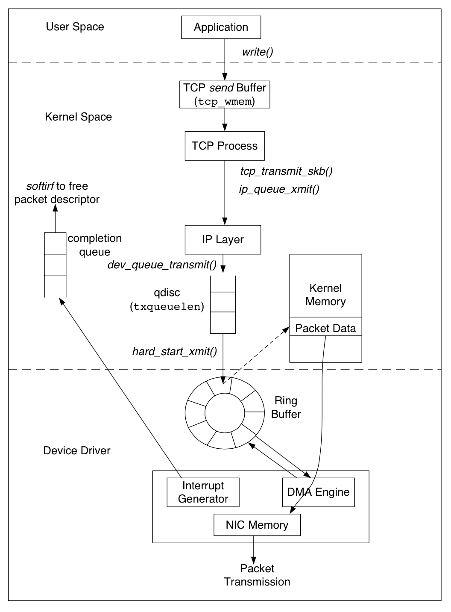

数据包的发送从上往下也经过了三层: 用户态空间的应用, 系统内核空间, 网卡驱动. 应用先将数据写入
TCP sendbuffer, TCP 层将 sendbuffer 中的数据构建成数据包转交给 IP 层. IP 层会将待发送的数据包
放入队列 QDisc(queueing discipline). 数据包成功放入 QDisc 后, 指向数据包的描述符 sk_buff 被放
入 RingBuffer 输出队列, 随后网卡驱动调用 DMA engine 将数据发送到网络链路上.
