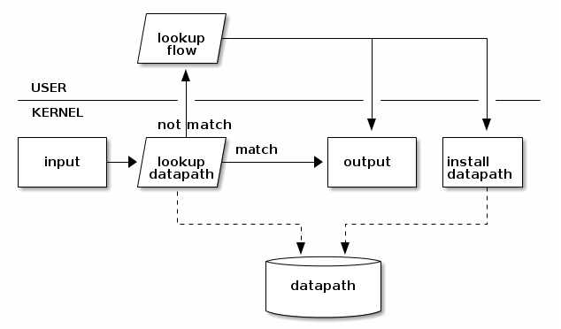

##概念

Open vSwitch中许多网络上的概念与平时接触到的不同，这里介绍一下Open
vSwitch中用到的一些名词及概念。

###Packet

网络转发的最小数据单元，每个包都来自某个端口，最终会被发往一个或多个目标端口，转发数据包的过程就是网络的唯一功能。

###Bridge

OpenvSwitch中的网桥对应物理交换机，其功能是根据一定流规则，把从端口收到的数据包转发到另一个或多个端口。

###Port

端口是收发数据包的单元。OpenvSwitch中，每个端口都属于一个特定的网桥。端口收到的数据包会经过流规则的处理，
发往其他端口；也会把其他端口来的数据包发送出去。OpenvSwitch支持的端口有以下几种：

####Normal Port

用户可以把操作系统中的网卡绑定到 OpenvSwitch 上，OpenvSwitch 会生成一个普通端口处理这块网卡进出的数据包。

####Internal Port

当设置端口类型为 internal，OpenvSwitch 会创建一块虚拟网卡，此端口收到的所有数据包都会交给这块网卡，
网卡发出的包会通过这个端口交给 OpenvSwitch。

NOTE: 当Open vSwitch创建一个新网桥时，默认会创建一个与网桥同名的 Internal Port

####Patch Port

当机器中有多个 Open vSwitch 网桥时，可以使用 Patch Port 把两个网桥连起来。Patch Port总是成对出现，
分别连接在两个网桥上，在两个网桥之间交换数据。

Patch Port 是机房术语，特指用于切换网线连接的接线卡。此卡上面网口成对出现，当需要把两台设备连接起来时，
只需要把两台设备接入同一对网口即可。

####Tunnel Port

隧道端口是一种虚拟端口，支持使用gre或vxlan等隧道技术与位于网络上其他位置的远程端口通讯。

###Interface （iface/接口）

接口是 OpenvSwitch 与外部交换数据包的组件。一个接口就是操作系统的一块网卡，这块网卡可能是 OpenvSwitch
生成的虚拟网卡，也可能是物理网卡挂载在 OpenvSwitch 上，也可能是操作系统的虚拟网卡（TUN/TAP）挂载在
Open vSwitch上。

###Flow

流定义了端口之间数据包的交换规则。每条流分为匹配和动作两部分，匹配部分选择哪些数据包需要可以通过这条流处理，
动作决定这些匹配到的数据包如何转发。流描述了一个网桥上，端口到端口的转发规则。比如我可以定义这样一条流：

    当数据包来自端口A，则发往端口B

来自端口A 就是匹配部分，发往端口B 就是动作部分。

流的定义可能非常复杂，比如：

    当数据包来自端口A，并且其源MAC是aa:aa:aa:aa:aa:aa，并且其拥有vlan
    tag为a，并且其源IP是a.a.a.a，并且其协议是TCP，其TCP源端口号为a，则修改其源IP为b.b.b.b，发往端口B

###Datapath

由于流可能非常复杂，对每个进来的数据包都去尝试匹配所有流，效率会非常低，所以有了 datapath 这个东西。
Datapath 是流的一个缓存，会把流的执行结果保存起来，当下次遇到匹配到同一条流的数据包，直接通过 datapath 处理。
考虑到转发效率，datapath 完全是在内核态实现的，并且默认的超时时间非常短，大概只有3秒左右。

##实现

当Open vSwitch的一个接口收到数据包后，会由下图所描述的流程处理：

收到数据包后，会交给 datapath 内核模块处理，当匹配到对应的 datapath 会直接输出，如果没有匹配到，会交给用户态的
ovs-vswitchd 查询 flow，用户态处理后，会把处理完的数据包输出到正确的端口，并且设置新的 datapath 规则，后续数据
包可以通过新的 datapath 规则实现快速转发。

##QA

Q: 我把 OpenvSwitch 认作是一个虚拟以太网交换机，但是为何文档中不断的提到
bridge，什么是 bridge？

A:在计算机网络中，术语 bridge 与 switch 是同义词。OpenvSwitch 实现一个以太
网交换机（Ethernet switch），与实现一个以太网桥（Ethernet Bridge）是一个意思。

Q: 为何要用 OpenvSwitch 替换 Linux Bridge?
A: 相比于简单的 Linux Bridge，OpenvSwitch 可以实现网络隔离、QoS
配置、流量监控、数据包分析等物理交换网络所具有的功能。

Q: 我创建了一个 bridge，然后把我的物理网卡与其绑定了，就像这样：

    ovs-vsctl add-br br0
    ovs-vsctl add-port br0 eth0

然后，然后我的 eth0 网卡就宕了！救命！(=_=)

A:  一块物理以太网卡如果作为 OpenvSwitch bridge 的一部分，则它不能拥有 IP
地址，如果有，也会完全不起作用。如果发生了上述情况，你可以将 IP 地址绑定至某
OpenvSwitch “internal” 设备来恢复网络访问功能。

例如，假设你的 eth0 IP 地址为
192.168.128.5，在执行上文问题中的命令后，你可以使用如下方法来将 IP 地址绑定至br0
上：

    ifconfig eth0 0.0.0.0
    ifconfig br0 192.168.128.5

Q: 我创建了一个 bridge，然后我把两块物理网卡绑定到了上面，就像这样：

    ovs-vsctl add-br br0
    ovs-vsctl add-port br0 eth0
    ovs-vsctl add-port br0 eth1

然后，我的网络访问就完全混乱了！CPU 利用率也非常高！(=_=)

A: 基本上，你把你的网络打成一个环了。

在上面的设置下，OpenvSwitch 在 eth0 上收到一个广播包后会将其发给 eth1，然后 eth1
上的物理交换机又将这个广播包发还给 eth0，如此往复。当有多个 switch 时，还会产生更
复杂的情况。

解决方案1：

如果你想将 eth0 与 eth1 都绑定至同一个 bridge 从而获得更大的带宽、更高的可靠性，
可以像下面这样做：

    ovs-vsctl add-br br0
    ovs-vsctl add-bond br0 bond0 eth0 eth1

解决方案2：

如果你不想把他们放到一块，你可以弄两个 bridge 嘛：

    ovs-vsctl add-br br0
    ovs-vsctl add-port br0 eth0
    ovs-vsctl add-br br1
    ovs-vsctl add-port br1 eth1

解决方案3：

如果你已经拥有了一个复杂或冗余的网络拓扑结构，但你想预防结环，你就需要打开生成树协议
(spanning tree protocol, STP).

按照下面的命令序列，依序创建 br0, 打开 STP, 然后将 eth0 与 eth1 绑定至 br0.

    ovs-vsctl add-br br0
    ovs-vsctl set bridge br0 stp_enable=true
    ovs-vsctl add-port br0 eth0
    ovs-vsctl add-port br0 eth1

Q: 我好像不能在无线网络中使用 OpenvSwitch？

A: 不可以，Linux Bridge 也不可以。

Q: 有关于 OpenvSwitch 数据库的表结构的文档么？

A: 有的，ovs-vswitchd.conf.db(5) 有详细解释。

##Reference

http://hiaero.net/tag/openvswitch/
https://blog.kghost.info/2014/11/19/openvswitch-internal/
