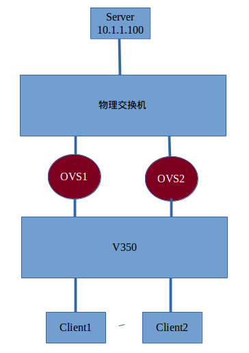

测试说明
===================

1 两台物理机

    一台交换为普通物理交换;
    一台为 OpenFlow V350 交换机连接到控制器

2 OVS1 OVS2 为同一台机器的两个软件交换机.

    其中 OVS1 的两个端口连接到两块物理网卡.
    其中 OVS2 的两个端口连接到两块物理网卡.

3 三台 PC

    其中两台作为 Client1, Client2
    其中一台作为 Server IP 10.1.1.100

如图进行测试.

测试案例 1
===================

测试目的
-------------------

在 V350 端口为 Master-Slave Bond 模式的情况下, 新增加链路不会影响原来链路

初始拓扑
-------------------

* Server 与物理交换机直连
* V350 的两个端口进行 Master-Slave 模式 Bond
* OVS1 两个端口, 分别与物理交换机和 V350 的其中一个 Bond 端口直连
* Client1, Client2 分别与 V350 两个端口直连

测试过程
-------------------

1. Client1,Client2 通过 OVS1 路径访问 Server, 链路正常.
2  OVS2 两个端口, 分别与物理交换机和 V350 的另一个 Bond 端口直连
3. Client1, Client2 仍然通过 OVS1 路径访问 Server, 链路正常.

测试案例 2
===================

测试目的
-------------------

在 V350 端口为 Master-Slave 模式的情况下, 已经建立的链路在断开的情况下自动切换到其他可用链路

初始拓扑
-------------------

* Server 与物理交换机直连
* V350 的两个端口进行 Master-Slave 模式 Bond
* OVS1 两个端口, 分别与物理交换机和 V350 的其中一个 Bond 端口直连
* Client1, Client2 分别与 V350 两个端口直连

测试过程
-------------------

1. Client1, Client2 通过 OVS1 路径访问 Server, 链路正常.
2. OVS2 两个端口, 分别与物理交换机和 V350 的另一个 Bond 端口直连
3. Client1, Client2 仍然通过 OVS1 路径访问 Server, 链路正常.
4. 断开 OVS1 链路(即断开 OVS1 与任一物理机交换机的连接)
5. 在 10s 内, Client1, Client2 切换到 OVS2 路径访问 Server, 链路恢复正常.

测试案例 3
===================

测试目的
-------------------

在 V350 端口为 Master-Slave Bond 模式的情况下, 已经建立的链路在断开后, 新加链路, 自动切换到新加链路

初始拓扑
-------------------

* Server 与物理交换机直连
* V350 的两个端口进行 Master-Slave 模式 Bond
* OVS1 两个端口, 分别与物理交换机和 V350 的其中一个 Bond 端口直连
* Client1, Client2 分别与 V350 两个端口直连

测试过程
-------------------

1. Client1, Client2 通过 OVS1 路径访问 Server, 链路正常.
2. 断开 OVS1 链路(即断开 OVS1 与任一物理机交换机的连接)
3. Client1, Client2 无法访问 Server, 链路异常.
4. OVS2 两个端口, 分别与物理交换机和 V350 的其中一个 Bond 端口直连
5. 在 10s 内, Client1, Client2 切换到 OVS2 路径访问 Server, 链路恢复正常.

结论
==================

为了保证链路的高可用, 把交换机的两个端口进行 Bond(Master-Slave 模式) 与两个 OVS
相连, 可以实现高可用.

测试案例 4
===================

测试目的
-------------------

在 V350 端口为 Balance-SLA Bond 模式的情况下, 在新增加链路, 新增加链路也参与数据转发

初始拓扑
-------------------

* Server 与物理交换机直连
* V350 的两个端口进行 Balance-SLA 模式 Bond
* OVS1 两个端口, 分别与物理交换机和 V350 的其中一个 Bond 端口直连
* Client1, Client2 分别与 V350 两个端口直连

测试过程
-------------------

1. Client1,Client2 通过 OVS1 路径访问 Server, 链路正常.
2. OVS2 两个端口, 分别与物理交换机和 V350 的另一个 Bond 端口直连
3. Client1, Client2 同时通过 OVS1 和 OVS2 路径访问 Server, 链路正常.

测试案例 5
===================

测试目的
-------------------

在 V350 端口为 Balance-SLA Bond 模式的情况下, 已经建立的链路在断开的情况下自动切换到其他可用链路

初始拓扑
-------------------

* Server 与物理交换机直连
* V350 的两个端口进行 Balance-SLA 模式 Bond
* OVS1 两个端口, 分别与物理交换机和 V350 的其中一个 Bond 端口直连
* Client1, Client2 分别与 V350 两个端口直连

测试过程
-------------------

1. Client1,Client2 通过 OVS1 路径访问 Server, 链路正常.
2. OVS2 两个端口, 分别与物理交换机和 V350 的另一个 Bond 端口直连
3. Client1, Client2 同时通过 OVS1 和 OVS2 路径访问 Server, 链路正常.
4. 断开 OVS1 链路(即断开 OVS1 与任一物理机交换机的连接)
5. 在 10s 内, Client1, Client2 切换到 OVS2 路径访问 Server, 链路恢复正常.

测试案例 6
===================

测试目的
-------------------

在 V350 端口为 Balance-SLA Bond 模式的情况下, 已经建立的链路在断开后, 新加链路, 自动切换到新加链路

初始拓扑
-------------------

* Server 与物理交换机直连
* V350 的两个端口进行 Balance-SLA 模式 Bond
* OVS1 两个端口, 分别与物理交换机和 V350 的其中一个 Bond 端口直连
* Client1, Client2 分别与 V350 两个端口直连

测试过程
-------------------

1. Client1,Client2 通过 OVS1 路径访问 Server, 链路正常.
2. 断开 OVS1 链路(即断开 OVS1 与任一物理机交换机的连接)
3. Client1, Client2 无法访问 Server, 链路异常.
4. OVS2 两个端口, 分别与物理交换机和 V350 的另一个 Bond 端口直连
5. 在 10s 内, Client1, Client2 切换到 OVS2 路径访问 Server, 链路恢复正常.
6. 重新连接 OVS1 链路
7. Client1, Client2 同时通过 OVS1 和 OVS2 路径访问 Server, 链路正常.

结论
==================

为了保证链路的高可用, 把交换机的两个端口进行 Bond(Balance-SLA 模式) 与两个 OVS
相连, 可以实现高可用和链路负载均衡.

附注
==================

1. 据此推测即使加入负载均衡功能, 仍然可以实现高可用. 由于物理环境限制, 目前 OVS1 OVS2 都没有连接到控制器. 后续可以测试在加入负载均衡的功能后, 多路径是否可以满足.
2. 目前 v350 支持交换机的端口 Bond 功能. 即将多个端口 Bond 之后, 多个端口可以是 Master-Slave 形式也可以是 Load-Balance 形式

