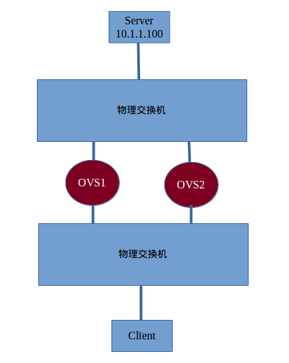

测试说明
===================

1 两台物理机

    其中一台交换为普通物理交换;
    另一台为 OpenFlow V350 连接到控制器.

2 OVS1 OVS2 为同一台机器的两个软件交换机.

    其中 OVS1 的两个端口连接到两块物理网卡.
    其中 OVS2 的两个端口连接到两块物理网卡.

3 两台 PC

    其中一台作为 Client
    其中一台作为 Server IP 10.1.1.100

如图进行测试.

测试案例 1
===================

测试目的
-------------------

在新增加链路不会影响原来链路

初始拓扑
-------------------

* Server 与物理交换机直连
* OVS1 增加两个端口, 分别与两台物理交换机直连
* Client 与物理交换机直连

测试过程
-------------------

1. Client 通过 OVS1 路径访问 Server, 链路正常.
2. OVS2 增加两个端口, 分别与两台物理交换机直连
3. Client 仍然通过 OVS1 路径访问 Server, 链路正常.

测试案例 2
===================

测试目的
-------------------

已经建立的链路在断开的情况下自动切换到其他可用链路

初始拓扑
-------------------

* Server 与物理交换机直连
* OVS1 增加两个端口, 分别与两台物理交换机直连
* Client 与物理交换机直连

测试过程
-------------------

1. Client 通过 OVS1 路径访问 Server, 链路正常.
2. OVS2 增加两个端口, 分别与两台物理交换机直连
3. Client 仍然通过 OVS1 路径访问 Server, 链路正常.
4. 断开 OVS1 链路(即断开 OVS1 与任一物理机交换机的连接)
5. 在 10s 内, Client 切换到 OVS2 路径访问 Server, 链路恢复正常.

测试案例 3
===================

测试目的
-------------------

已经建立的链路在断开后, 新加链路, 自动切换到新加链路

初始拓扑
-------------------

* Server 与物理交换机直连
* OVS1 增加两个端口, 分别与两台物理交换机直连
* Client 与物理交换机直连

测试过程
-------------------

1. Client 通过 OVS1 路径访问 Server, 链路正常.
3. Client 仍然通过 OVS1 路径访问 Server, 链路正常.
4. 断开 OVS1 链路(即断开 OVS1 与任一物理机交换机的连接)
3. Client 无法访问 Server, 链路异常.
2. OVS2 增加两个端口, 分别与两台物理交换机直连
5. 在 10s 内, Client 切换到 OVS2 路径访问 Server, 链路恢复正常.

结论
==================

为了保证链路的高可用, 只要客户端到服务端存在两条链路经过即可.

附注
==================

据此推测即使加入负载均衡功能, 由于物理环境限制, 目前 OVS1 OVS2 都没有连接到控制器. 后续可以测试在加入负载均衡的功能后, 多路径是否可以满足.
