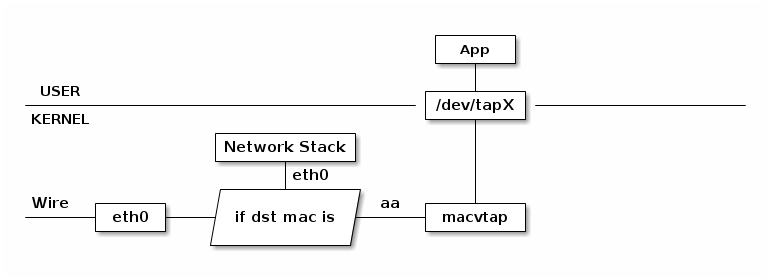

##TUN 设备

TUN 设备是一种虚拟网络设备，通过此设备，程序可以方便得模拟网络行为。先来看看物理设备是如何工作的：

所有物理网卡收到的包会交给内核的 Network Stack 处理，然后通过 Socket API
通知给用户程序。下面看看 TUN 的工作方式：

普通的网卡通过网线收发数据包，但是 TUN 设备通过一个文件收发数据包。所有对这个文件的写操作会通过
TUN 设备转换成一个数据包送给内核；当内核发送一个包给 TUN 设备时，通过读这个文件可以拿到包的内容。

如果我们使用 TUN 设备搭建一个基于 UDP VPN，那么整个处理过程就是这样：

数据包会通过内核网络栈两次。但是经过 App 的处理后，数据包可能已经加密，并且原有的 ip 头被封装在 udp
内部，所以第二次通过网络栈内核看到的是截然不同的网络包。

###TAP 设备

TAP 设备与 TUN 设备工作方式完全相同，区别在于：

* TUN 设备的 /dev/tunX 文件收发的是 IP 层数据包，只能工作在 IP 层，无法与物理网卡做 bridge，但是可以
通过三层交换（如 ip_forward）与物理网卡连通。

* TAP 设备的 /dev/tapX 文件收发的是 MAC 层数据包，拥有 MAC 层功能，可以与物理网卡做 bridge，支持 MAC 层广播

###MACVLAN

有时我们可能需要一块物理网卡绑定多个 IP 以及多个 MAC 地址，虽然绑定多个 IP 很容易，但是这些 IP 会
共享物理网卡的 MAC 地址，可能无法满足我们的设计需求，所以有了 MACVLAN 设备，其工作方式如下：

MACVLAN 会根据收到包的目的 MAC 地址判断这个包需要交给哪个虚拟网卡。单独使用 MACVLAN 好像毫无意义，
但是配合之前介绍的 network namespace 使用，我们可以构建这样的网络：

由于 macvlan 与 eth0 处于不同的 namespace，拥有不同的 network stack，这样使用可以不需要建立 bridge 在 
virtual namespace 里面使用网络。

###MACVTAP

MACVTAP 是对 MACVLAN的改进，把 MACVLAN 与 TAP 设备的特点综合一下，使用 MACVLAN
的方式收发数据包，但是收到的包不交给 network stack 处理，而是生成一个 /dev/tapX
文件，交给这个文件：

由于 MACVLAN 是工作在 MAC 层的，所以 MACVTAP 也只能工作在 MAC 层，不会有 MACVTUN
这样的设备。
