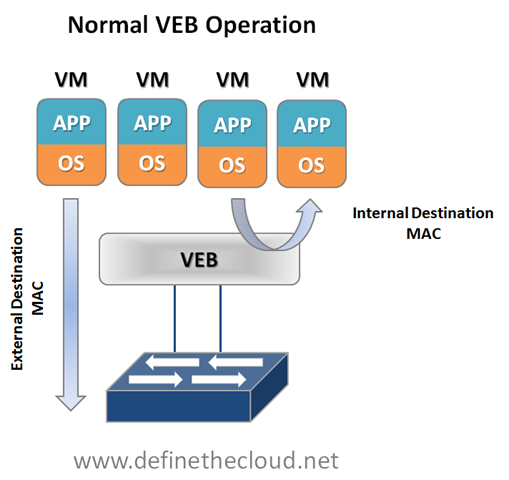
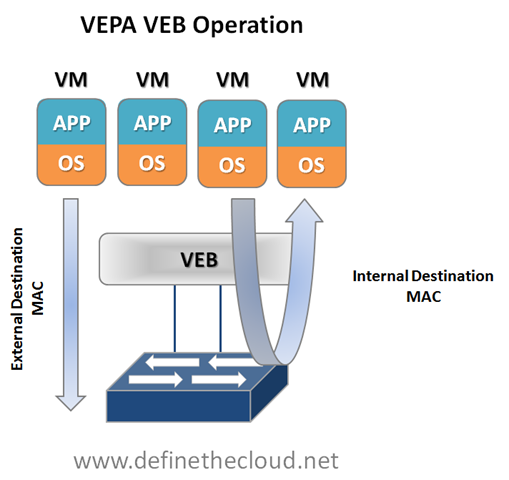
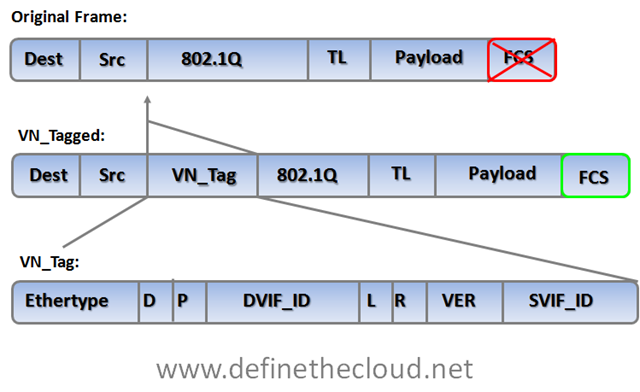
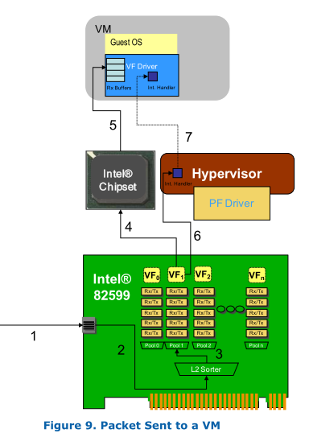

Edge Virtual Bridging (EVB) is an IEEE standard that involves the interaction
between virtual switching environments in a hypervisor and the first layer of
the physical switching infrastructure. The EVB enhancements are following 2
different paths – [802.1qbg][1] and [802.1qbh][2]. BG is also referred to as VEPA (Virtual
Ethernet Port Aggregation); HP has products that are pre-standard VEPA, IBM,
Brocade, Juniper and others are engaged and supporting BG.  BH is also called
VN-Tag; Cisco’s products support VN-Tag today and they brought their solution
to the standards bodies.  Notably absent from the IEEE discussion of virtual
switching is VMware.  The two proposals (BG and BH) are parallel efforts, meaning
that both can become standards and both are "optional" for any product being IEEE
compliant. The standards are likely at least a year from being done in the groups.

First let’s get physical.  Looking at a traditional physical access layer we
have two traditional options for LAN connectivity: Top-of-Rack (ToR) and
End-of-Row (EoR) switching topologies.  Both have advantages and disadvantages.

-------------------------------------------------------------------------------

###EoR:

EoR topologies rely on larger switches placed on the end of each row for server
connectivity.

**Pros**:

* Less Management points
* Smaller Spanning-Tree Protocol (STP) domain
* Less equipment to purchase, power and cool

**Cons**:

* More above/below rack cable runs
* More difficult cable modification, troubleshooting and replacement
* More expensive cabling

-------------------------------------------------------------------------------

###ToR:

ToR utilizes a switch at the top of each rack (or close to it.)

**Pros**:

* Less cabling distance/complexity
* Lower cabling costs
* Faster move/add/change for server connectivity

**Cons**:

* Larger STP domain
* More management points
* More switches to purchase, power and cool

-------------------------------------------------------------------------------

Now let’s virtualize.  In a virtual server environment the most common way to
provide Virtual Machine (VM) switching connectivity is a Virtual Ethernet Bridge
(VEB) in VMware we call this a vSwitch.  A VEB is basically software that acts
similar to a Layer 2 hardware switch  providing inbound/outbound and inter-VM
communication.  A VEB works well to aggregate multiple VMs traffic across a set
of links as well as provide frame delivery between VMs based on MAC address.
Where a VEB is lacking is network management, monitoring and security.
Typically a VEB is invisible and not configurable from the network teams
perspective.  Additionally any traffic handled by the VEB internally cannot be
monitored or secured by the network team.

**Pros**:

* Local switching within a host (physical server)
* Less network traffic
* Possibly faster switching speeds
* Common well understood deployment
* Implemented in software within the hypervisor with no external hardware requirements

**Cons**:

* Typically configured and managed within the virtualization tools by the server team
* Lacks monitoring and security tools commonly used within the physical access layer
* Creates a separate management/policy model for VMs and physical servers
* These are the two issues that VEPA and VN-tag look to address in some way.
* Now let’s look at the two individually and what they try and  solve.

These are the two issues that VEPA and VN-tag look to address in some way.  Now
let’s look at the two individually and what they try and  solve.

-------------------------------------------------------------------------------

##Virtual Ethernet Port Aggregator (VEPA):

VEPA is standard being lead by HP for providing consistent network control
and monitoring for Virtual Machines (of any type.)  VEPA has been used by
the IEEE as the basis for 802.1Qbg ‘Edge Virtual Bridging.’  VEPA comes in
two major forms: a **standard mode** which requires minor software updates to
the VEB functionality as well as upstream switch firmware updates, and a
**multi-channel mode** which will  require additional intelligence on the
upstream switch.

###Standard Mode:

The beauty of VEPA in it’s standard mode is in it’s simplicity, if you’ve worked
with me you know I hate complex designs and systems, they just lead to problems.
In the standard mode the software upgrade to the VEB in the hypervisor simply
forces each VM frame out to the external switch regardless of destination.  This
causes no change for destination MAC addresses external to the host, but for
destinations within the host (another VM in the same VLAN) it forces that
traffic to the upstream switch which forwards it back instead of handling it
internally, called a hairpin turn.)  It’s this hairpin turn that causes the
requirement for the upstream switch to have updated firmware, typical STP
behavior prevents a switch from forwarding a frame back down the port it was
received on (like the saying goes, don’t egress where you ingress.)  The
firmware update allows the negotiation between the physical host and the
upstream switch of a VEPA port which then allows this hairpin turn.  Let’s step
through some diagrams to visualize this.

Again the beauty of this VEPA mode is in its simplicity.  VEPA simply forces VM
traffic to be handled by an external switch.  This allows each VM frame flow to
be monitored managed and secured with all of the tools available to the physical
switch.  This does not provide any type of individual tunnel for the VM, or a
configurable switchport but does allow for things like flow statistic gathering,
ACL enforcement, etc.  Basically we’re just pushing the MAC forwarding decision 
to the physical switch and allowing that switch to perform whatever functions 
it has available on each transaction. The drawback here is that we are now 
performing one ingress and egress for each frame that was previously handled 
internally.  This means that there are bandwidth and latency considerations to be
made.  Functions like Single Root I/O Virtualization (SR/IOV) and Direct Path I/O
can alleviate some of the latency issues when implementing this.  Like any technology
there are typically trade offs that must be weighed.  In this case the added control and
functionality should outweigh the bandwidth and latency additions.

###Multi-Channel VEPA:

Multi-Channel VEPA is an optional enhancement to VEPA that also comes with
additional requirements.  Multi-Channel VEPA allows a single Ethernet connection
(switchport/NIC port) to be divided into multiple independent channels or
tunnels.  Each channel or tunnel acts as an unique connection to the network.
Within the virtual host these channels or tunnels can be assigned to a VM, a
VEB, or to a VEB operating with standard VEPA.  In order to achieve this goal
Multi-Channel VEPA utilizes a tagging mechanism commonly known as Q-in-Q
(defined in 802.1ad) which uses a service tag ‘S-Tag’ in addition to the
standard 802.1q VLAN tag.  This provides the tunneling within a single pipe
without effecting the 802.1q VLAN.  This method requires Q-in-Q capability
within both the NICs and upstream switches which may require hardware changes.

One last point of clarity about VEPA that I think is important – it’s a
host-side entity only. There is nothing in the ‘network’ that is VEPA. Switches
don’t “have the VEPA feature”; switches allow VEPA to exist by enabling the
reflective relay (hairpin) feature. VEPA is an entity within a server that works
in conjunction with reflective relay within a switch.

###Config Guide

1. create two channels (FlexNIC 1 and FlexNIC 2) on the same physical Flex-10
NIC port
2. Create two VEBs (vSwitches) and assign a VM to each
3. Put both VMs on VLAN 10
4. Assign both channels (FlexNICs) to VLAN 10
5. From VM 1 (10.1.1.1) ping VM 2 (10.1.1.2) VMs get to each other via this path
VM 1 ->VEB 1->Channel 1 (FlexNIC 1)->Virtual Connect downlink 1->Virtual Connect
hairpin mode -> Virtual Connect downlink 1 (same downlink as rx) -> Channel 2
(FlexNIC 2) -> VEB 2 -> VM 2.

##VN-Tag:

The VN-Tag standard was proposed by Cisco and others as a potential solution to
both of the problems discussed above: network awareness and control of VMs, and
access layer extension without extending management and STP domains.  VN-Tag is
the basis of 802.1qbh ‘Bridge Port Extension.’  Using VN-Tag an additional
header is added into the Ethernet frame which allows individual identification
for virtual interfaces (VIF.)

The tag contents perform the following functions:

**Ethertype**

    Identifies the VN tag

**D**

    Direction, 1 indicates that the frame is traveling from the bridge to
    the interface virtualizer (IV.)

**P**

    Pointer, 1 indicates that a vif_list_id is included in the tag.

**vif_list_id**

    A list of downlink ports to which this frame is to be forwarded
    (replicated). (multicast/broadcast operation)

**Dvif_id**

    Destination vif_id of the port to which this frame is to be forwarded.

**L**

    Looped, 1 indicates that this is a multicast frame that was
    forwarded out the bridge port on which it was received. In this
    case, the IV must check the Svif_id and filter the frame from the
    corresponding port.

**R**

    Reserved

**VER**

    Version of the tag

**SVIF_ID**

    The vif_id of the source of the frame

The most important components of the tag are the source and destination VIF IDs
which allow a VN-Tag aware device to identify multiple individual virtual
interfaces on a single physical port.

VN-Tag can be used to uniquely identify and provide frame forwarding for any
type of virtual interface (VIF.)  A VIF is any individual interface that should
be treated independently on the network but shares a physical port with other
interfaces.  Using a VN-Tag capable NIC or software driver these interfaces
could potentially be individual virtual servers.  These interfaces can also be
virtualized interfaces on an I/O card (i.e. 10 virtual 10G ports on a single 10G
NIC), or a switch/bridge extension device that aggregates multiple physical 
interfaces onto a set of uplinks and relies on an upstream VN-tag aware
device for management and switching.

Because of VN-tags versatility it’s possible to utilize it for both bridge
extension and virtual networking awareness.  It also has the advantage of
allowing for individual configuration of each virtual interface as if it were a
physical port.  The disadvantage of VN-Tag is that because it utilizes additions
to the Ethernet frame the hardware itself must typically be modified to work
with it.  VN-tag aware switch devices are still fully compatible with
traditional Ethernet switching devices because the VN-tag is only used within
the local system.  For instance in the diagram above VN-tags would be used
between the VN-tag aware switch at the top of the diagram to the VIF but the
VN-tag aware switch could be attached to any standard Ethernet switch.  VN-tags
would be written on ingress to the VN-tag aware switch for frames destined for a
VIF, and VN-tags would be stripped on egress for frames destined for the
traditional network.

##Where does that leave us?

We are still very early in the standards process for both 802.1qbh and 802.1Qbg,
and things are subject to change.  From what it looks like right now the
standards body will be utilizing VEPA as the basis for providing physical
type network controls to virtual machines, and VN-tag to provide bridge
extension.  Because of the way in which each is handled they will be
compatible with one another, meaning a VN-tag based bridge extender would be
able to support VEPA aware hypervisor switches.

Equally as important is what this means for today and today’s hardware.
There is plenty of Fear Uncertainty and Doubt (FUD) material out there
intended to prevent product purchase because the standards process isn’t
completed.  The question becomes what’s true and what isn’t, let’s take care
of the answers FAQ style:

###Will I need new hardware to utilize VEPA for VM networking?

    No, for standard VEPA mode only a software change will be required on the
    switch and within the Hypervisor.  For Multi-Channel VEPA you may require new
    hardware as it utilizes Q-in-Q tagging which is not typically an access layer
    switch feature.

###Will I need new hardware to utilize VN-Tag for bridge extension?

    Yes, VN-tag bridge extension will typically be implemented in hardware so you
    will require a VN-tag aware switch as well as VN-tag based port extenders.

###Will hardware I buy today support the standards?

    That question really depends on how much change occurs with the standards
    before finalization and which tool your looking to use:

    * Standard VEPA – Yes
    * Multi-Channel VEPA – Possibly (if Q-in-Q is supported)
    * VN-Tag – possibly

###Are there products available today that use VEPA or VN-Tag?

    Yes Cisco has several products that utilize VN-Tag: Virtual interface Card
    (VIC), Nexus 2000, and the UCS I/O Module (IOM.)  Additionally HP’s FlexConnect
    technology is the basis for multi-channel VEPA.

##Summary

VEPA and VN-tag both look to address common access layer network concerns and
both are well on their way to standardization.  VEPA looks to be the chosen
method for VM aware networking and VN-Tag for bridge extension.  Devices
purchased today that rely on pre-standards versions of either protocol should
maintain compatibility with the standards as they progress but it’s not
guaranteed. That being said standards are not required for operation and
effectiveness, and most start as unique features which are then submitted to a
standards body.

[1]: http://www.ieee802.org/1/pages/802.1bg.html "802.1bg"
[2]: http://www.ieee802.org/1/pages/802.1bh.html "802.1bh"

