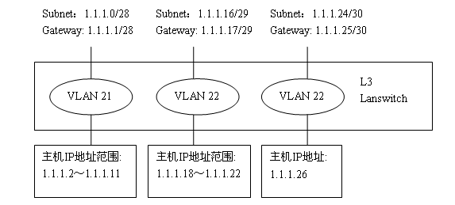
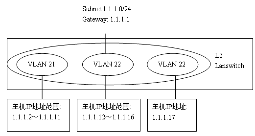
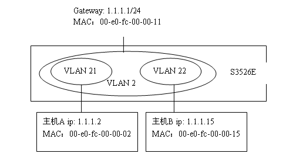
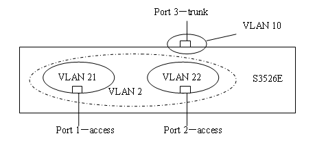
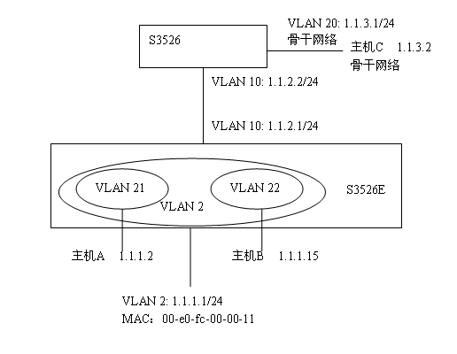

IEEE 提出了 802.1Q 标准，这个标准也可以称为 VLAN 技术的标准，在这个标准中定义了上面提到的 VLAN 标签，同时吸纳了 802.1P
的成果，在以太网上引入了优先级的概念，并制定了 VLAN 标准在未来一段时间内的发展方向，形成的 802.1Q 标准在业界获得了广泛
的推广，它成为 VLAN 史上的一块里程碑。802.1Q 的出现打破了虚拟网依赖于单一厂商的僵局，从一个侧面推动了 VLAN 的迅速发展。

##VLAN成员连接方式

VLAN成员的连接方式分为三种：Access,Trunk,Hybrid;

* Access 连接：报文不带 tag 标签,一般用于和 tag-unaware(不支持802.1Q封装)设备相连，或者不需要区分不同 VLAN 成员时使用；
* Trunk  连接：在 PVID 所属的 VLAN 不带 tag 标签转发,其他 VLAN 中的报文都必须带 tag 标签，用于 tag-aware(支持802.1Q封装)
设备相连，一般用于交换机之间的互连；
* Hybrid 连接：可根据需要设置某些 VLAN 报文带 tag, 某些报文不带 tag。与 trunk 连接最大的不同在于，trunk 连接只有 PVID
所属的 VLAN 不带 tag,其他 VLAN 都必须带 tag,而 Hybrid 连接是可以设置多个 VLAN 不带 tag；

实际应用中，根据设置设备端口的 Access、Trunk、Hybrid 属性来实现各种不同的连接方式。端口属性的应用也远远超出了简单的 VLAN
成员互连

##Tag/Untag报文的处理原则

为了理解 VLAN 内报文的转发，就必须要知道交换机对于不同 VLAN 报文的 tag/untag 的处理原则。

首先，需要明确一点就是，在交换机的内部，为了快速高效的处理，报文都是带tag转发的。其实，这点很好理解，因为交换机上很
可能会配置多个 VLAN,那不同 VLAN 流量区分只有依靠 tag 标签。

下面从报文入和报文出两个方向来介绍。

###报文入方向：

在入方向上，交换机的根本任务就是决定该报文是否允许进入该端口，根据入报文的tag/untag的属性以及端口属性，细分为如下情况：

* 报文为 untag: 允许报文进入该端口，并打上 PVID 的 VLAN tag, 与端口属性无关；
* 报文为 tag:  在这种情况下，需要交换机来判断是否允许该报文进入端口；

    Access端口： PVID 和报文中 tag 标明的VLAN一致，接收并处理报文；否则丢弃。
    Trunk/Hybrid端口：如果端口允许 tag 中标明的 VLAN

通过，则接收并处理报文；否则丢弃。

###报文出方向：

在出方向上，交换机已经完成对报文的转发，其根本任务就是在转发出端口时，是否携带 tag 转发出去，根据出端口属性，细分为如下情况：

* Access端口：将标签剥掉，不带 tag 转发；
* Trunk端口：报文所在 VLAN 和 PVID 相同，则报文不带 tag；否则带 tag；
* Hybrid端口：报文所在 VLAN 配置为 tag，则报文带 tag；否则不带 tag；

##VLAN 划分方式

VLAN在交换机上的实现方式，主要有以下几种：

基于端口：

最为常用的划分方式，据以太网交换机的端口来划分。这种划分的方法的优点是定义 VLAN 成员时非常简单，只要将所有的端口都指定一下
就可以了。它的缺点是，如果 VLAN A 的用户离开了原来的端口，到了一个新的交换机的某个端口，那么就必须重新定义。

基于子网：

这种划分 VLAN 的方法是根据每个主机的网络层地址划分的，虽然这种划分方法是根据网络地址，比如 IP 地址，但它不是路由，与网络层的
路由毫无关系。这种方法的优点是用户的物理位置改变了，不需要重新配置所属的 VLAN，还有，它不需要附加的帧标签来识别 VLAN，这样可
以减少网络的通信量。这种方法的缺点是效率低，因为检查每一个数据包的网络层地址是需要消耗处理时间的，一般的交换机芯片都可以自动
检查网络上数据包的以太网帧头，但要让芯片能检查IP帧头，需要更高的技术，同时更费时。

基于MAC：

这种划分 VLAN 的方法是根据每个主机的 MAC 地址来划分，即对每个 MAC 地址的主机都配置它属于哪个组。这种划分 VLAN 的方法的最大优点
就是当用户物理位置移动时，即从一个交换机换到其他的交换机时，VLAN 不用重新配置，可以认为这种根据 MAC 地址的划分方法是基于用户
的 VLAN，这种方法的缺点是初始化时，所有的用户都必须进行配置，如果有几百个甚至上千个用户的话，配置量是很大的，而且这种划分的方法
也导致了交换机执行效率的降低，因为在每一个交换机的端口都可能存在很多个 VLAN 组的成员，这样就无法限制广播包了。

基于协议：

协议 VLAN 与上面介绍的两种实现方式的原理类似，都是根据数据报文的某个特征进行 VLAN 的划分，只是关注的特征不同。基于协议的 VLAN
通过识别报文的协议类型和封装格式进行VLAN的划分,如IP、IPX、AppleTalk协议族；Ethernet II，802.3，802.3/802.2 LLC， 802.3/802.2
SNAP等封装格式。这种实现方式的优缺点与上面的实现方式类似，效率不高。目前,IEEE 802.1v规定了基于端口和协议（port-and-protocal based
VLAN）的标准草案

##Super VLAN

在LanSwitch网络中，VLAN技术以其对广播域的灵活控制（可跨物理设备）、部署方便而得到了广泛的应用。但是在一般的三层交换机中，通常是采用一个VLAN对应一个三层接口的方式来实现广播域之间的互通的，这在某些情况下导致了对IP地址的较大浪费。

我们来看下面这个例子，设备内VLAN划分如下图所示。

表1. 普通VLAN主机地址划分示例

    VLAN	IP Subnet	Gateway Address	Usable Hosts	Customer Hosts	Needed Hosts
    21      1.1.1.0/28      1.1.1.1          14                 13           10
    22      1.1.1.16/29     1.1.1.17         6                  5            5
    23      1.1.1.24/30     1.1.1.25         2                  1            1

表1 列出了地址的划分情况。VLAN 21 预计未来要有 10 个主机，给其分配一个掩码长 28 的子网 -- 1.1.1.0/28。
网段内子网号 1.1.1.0 和子网定向广播地址 1.1.1.15 不能用作主机地址，1.1.1.1 作为子网缺省网关地址也不可作为
主机地址，剩下地址范围在 1.1.1.2～1.1.1.14 的主机地址可以被主机使用，这部分地址共有13个(2^32-3=13)。
这样，尽管 VLAN 21 只需要 10 个地址就可以满足需求了，但是按照子网划分却要分给它 13 个地址。

依此类推，VLAN 22 预计未来有 5 个主机地址需求，至少需要分配一个 29 位掩码的子网（1.1.1.16 /29）才能满足要求。
VLAN 23 只有 1 个主机，则占用子网 1.1.1.24 /30。

这三个 VLAN 总共需要 10+5+1＝16 个地址，按照普通 VLAN 的编址方式，即使最优化的方案也需要占用
2^(32-28) + 2^(32-29) + 2^(32-30) = 28 个地址，地址浪费了将近一半。

而且，如果VLAN 21后来并没有增长到10台主机，而只增长到了3台主机，本来分一个掩码长29的子网就够用了，但之前却分
了一个子网掩码长28的子网给它，多出来的地址都因不能再被其他VLAN使用而被浪费掉了。

同时，这种划分也给后续的网络升级带来了很大不便。假设 VLAN 23 所在的客户一段时间后需要增加 2 台主机，又不愿意
改变已经分配的 IP 地址。在 1.1.1.24 后面的地址已经分配给了其他人的情况下，那没有办法，只能额外再给他分配一个
的 29 位掩码的子网和一个新的 VLAN 给他。这样 VLAN23 的客户只有 3 台主机，却被迫分配了两个子网，不在同一个 VLAN，
造成管理上的极大不便。

由此我们可以看出，被诸如子网号、子网定向广播地址、子网缺省网关地址消耗掉的IP地址数量是相当可观。同时，这种地址
分配的固有约束也严重降低了编址的灵活性，使许多闲置地址被浪费。为了解决这一问题，Super VLAN 应运而生。

###Super VLAN 的实现

Super VLAN 技术（也称为VLAN Aggregation，即 VLAN 聚合）针对上述缺陷作了改进，它引入 super-VLAN 和 sub-VLAN的
概念。一个 super-VLAN 可以包含一个或多个保持着不同广播域的 sub-VLAN。sub-VLAN 不再占用一个独立的子网网段。在同
一个 super-VLAN 中，无论主机属于哪一个 sub-VLAN，它的 IP 地址都在 super-VLAN 对应的子网网段内。

这样，通过 sub-VLAN 间共用同一个三层接口，既减少了一部分子网号、子网缺省网关地址和子网定向广播地址的消耗，又实
现了不同广播域使用同一子网网段地址，消除了子网差异，增加了编址的灵活性，减少了闲置地址浪费。从而，在保证了各个
sub-VLAN作为一个独立广播域实现了广播隔离的同时，将从前使用普通VLAN浪费掉的IP地址节省下来。

仍以前面的例子进行说明。用户需求不变。仍旧是VLAN 21预计有10个主机，VLAN 22 预计有5个，VLAN 23 预计1个。按照
Super VLAN的实现方式，令VLAN 2为super-VLAN，分配子网1.1.1.0/24，子网缺省网关地址1.1.1.1，子网定向广播地址1.1.1.255，
如图2所示。则sub-VLAN——VLAN 21、VLAN 22、VLAN 23的地址划分如表2所示。

表2 Super VLAN主机地址划分示例

    VLAN    IP Subnet   Gateway Address     Usable Hosts    Customer Hosts
    21      1.1.1.0/24      1.1.1.1             10              .2-.11
    22      1.1.1.0/24      1.1.1.1             5               .12-.16
    23      1.1.1.0/24      1.1.1.1             1               .17

从表中我们可以看到，VLAN 21、VLAN 22、VLAN 23共用同一个子网号1.1.1.0、子网缺省网关地址1.1.1.1和子网定向广播地址1.1.1.255。
这样，普通VLAN实现方式中用到的1.1.1.16、1.1.1.24这样的子网号（1.1.1.0仍被作为子网号被占用）和1.1.1.17、1.1.1.25这样的子网
缺省网关（1.1.1.1仍作为子网缺省网关被占用），以及1.1.1.15、1.1.1.23、1.1.1.27这样的子网定向广播地址就都可以用来作为主机IP
地址使用了。

Super VLAN的实现中，各sub-VLAN间的界线也不再是从前的子网界线了，它们可以根据其各自主机的需求数目在super-VLAN对应子网内
灵活的划分地址范围。譬如，原来在分配给VLAN 21的子网1.1.1.0/28中的1.1.1.12～1.1.1.14这3个地址是被闲置浪费掉的。用Super
VLAN来实现，就可以把这些地址划分给VLAN 22。如果VLAN 21最终只用了3个地址的情况，那么剩下的地址还可以分配给其他的sub-VLAN。

这样，3个VLAN一共需要16个地址，实际上在这个子网里就刚好分配了16个地址给它们。这16个主机地址加上子网号、子网缺省网关、
子网定向广播地址，一共用去了19个IP地址，网段内仍剩余237的地址可以被任意sub-VLAN内的主机使用。

###super-VLAN 和sub-VLAN

在Super VLAN中，引入super-VLAN和sub-VLAN的概念。这是两种与以往的VLAN不同的VLAN类型。

super-VLAN和通常意义上的VLAN不同，它只建立三层接口，而不包含物理端口。因此，可以把它看作一个逻辑的三层概念——若干sub-VLAN
的集合。与一般没有物理端口的VLAN不同的是，它的三层虚接口的UP状态不依赖于其自身物理端口的UP，而是只要它所含sub-VLAN中存在
UP状态的物理端口。

sub-VLAN 则只包含物理端口，但不能建立三层VLAN虚接口。它与外部的三层交换是靠super-VLAN的三层虚接口来实现的。

我们可以这样看：每一个普通VLAN都有一个三层逻辑接口和若干物理端口。而Super VLAN把这两部分剥离开来：sub-VLAN只映射若干物理端口，
负责保留各自独立的广播域；而用一个super-VLAN来实现所有sub-VLAN共享同一个三层接口的需求，使不同sub-VLAN内的主机可以共用同一个
super-VLAN的网关，在super-VLAN对应的子网里分配地址；然后再通过建立super-VLAN和sub-VLAN间的映射关系，把三层逻辑接口和物理端口
这两部分有机的结合起来，并用ARP Proxy来实现sub-VLAN间的三层互访，从而在实现普通VLAN的功能的同时，达到节省IP地址的目的。

##Super VLAN的通信

###super-VLAN内部通信

###4.1.1 VLAN聚合带来的问题

VLAN聚合（即Super VLAN）在实现不同VLAN间共用同一子网网段地址的同时，也给sub-VLAN间的三层转发带来了问题。原本在三层交换机上，
VLAN间是可以通过走各自不同的上行网关进行三层转发的。但是super-VLAN内的主机使用的是同一个网段的地址，共用同一个上行网关，
即使是属于不同的sub-VLAN的主机，由于其地址同属一个子网，设备会认为它们是二层互通的，会做二层转发，而不会送网关进行三层转发。
而实际上sub-VLAN间在二层是相互隔离的，这就造成了sub-VLAN间无法通信的局面（具体过程参见4.1.3中的举例）。

解决之道就是，用ARP Proxy来实现sub-VLAN间的互通。

###ARP Proxy原理

一个物理网络的子网（subnet）中的源主机向另一个物理网络的子网中的目的主机发ARP request，和源主机直连的网关用自己接口的MAC
地址代替目的主机回ARP reply，这个过程称为ARP 代理。 也称作混合ARP(ARP promiscuous)、ARP 出租(ARP hack)，或者叫(透明)子网网
关((transparent) subnet ARP gateways)。

PROXY ARP 的基本过程如下：

1. 源主机向另一物理网络的子网的目的主机发ARP请求；
2. 与源主机网络相连的网关已经使能ARP PROXY功能，如果存在到达目的主机的正常路由，则代替目的主机REPLY自己接口的MAC地址；
3. 源主机向目的主机发送的IP报文都发给了路由器；
4. 路由器对报文做正常的IP路由转发；
5. 发往目的主机的IP报文通过网络，最终到达目的主机。

4.1.3 用ARP Proxy实现不同sub-VLAN间的三层互通

例如，super-VLAN—VLAN 2包含sub-VLAN—VLAN 21和VLAN 22。IP地址和MAC地址如图3所示。

VLAN 21内的主机A与VLAN 22内的主机B的过程如下（假设主机 A 的ARP表中无B对应表项）：A要发送报文给B，则将B的IP地址——1.1.1.15
和A自己所在网段1.1.1.0/24 进行比较，由于VLAN 21 和VLAN 22 同属一个super-VLAN所在子网，于是发广播ARP请求B的MAC，而B并不在VLAN
21的广播域内，无法接收到这个ARP。此时，ARP Proxy所做的就是，当A在二层发出的ARP Request在其广播域内没有回应时，网关开始在
路由表查找，发现下一跳为直连路由接口，则在该接口发一个广播ARP请求B的MAC地址；得到B的回应后，就把自己的MAC地址00-e0-fc-00-00-11
当作B的MAC地址（实际上是00-e0-fc-00-00-15）回给A（不同设备的实现略有不同）。之后，主机A要发给B的报文都发给了交换机，由三层
交换机做正常的三层转发。

4.2 Super VLAN与其他设备间的二层通信

Super VLAN并不包含物理端口，可以把它看作一个逻辑的三层概念——若干sub VLAN的集合。所以，在我们通常使用的基于端口的VLAN中，二层
通信时，无论是入还是出都不会有针对Super VLAN的报文。举个例子来说，如图4所示。

从port 1进入设备的报文会打VLAN 21的tag，在设备中这个tag不会变为VLAN 2的tag。它从trunk口port 3出去时，依然是VLAN 21的报文。

也就是说，设备本身不会发出VLAN 2 的报文。就算上层设备有VLAN 2 的报文发到该设备上，也会因为没有对应物理端口而被丢弃。
而事实上，port3这个trunk口上根本就不允许Super VLAN——VLAN 2，无论是passing还是allowed（在8.2中将做详细讨论），也就根本不可能
有VLAN 2 的报文通过。对于其他设备而言，有效的VLAN只有VLAN 21 和VLAN 22，报文都是在这两个VLAN中转发的。

4.3 super-VLAN与外部的三层通信

如图5。S3526E上配置了super-VLAN 2，sub-VLAN 21和22，并有一个正常的VLAN10，S3526上有两个正常的VLAN10和20。假设super-VLAN2
下sub-VLAN21下的主机A想访问S3526下连的主机C，下面简述一下上下行报文的转发流程。

4.3.1 报文上行流程

主机A （1.1.1.2/24）要访问主机C（1.1.3.2/24），因为IP地址不在一个网段，所以A发送ARP Request给自己的网关，请求网关的MAC地址。
sub-VLAN 21 收到ARP报文后，将其送上CPU。CPU查找sub-VLAN和super-VLAN的对应关系，知道应该回应super-VLAN 2 的MAC（不同设备实现
上可能略有不同），并且知道回应报文应该从sub-VLAN 21发送给主机A。

4.3.2 报文下行流程

主机C回应的报文，在S3526上按正常的转发流程到达S3526E，这时S3526E会查找FIB表项，发现目的地址为主机A（1.1.1.2）对应的出接口为
super-VLAN2，但是super-VLAN2根本没有包含任何端口，那么究竟应该如何确定报文的出端口呢？

仔细查看可以发现，尽管在FIB表中1.1.1.2/24网段的出接口为super-VLAN2，但是在ARP表中IP地址1.1.1.2对应的出接口却为sub-VLAN
21。而芯片真正用来构建转发表时所用的出接口应该是ARP表中对应的sub-VLAN接口，这样就可以通过在sub-VLAN下查找目的MAC找到正确的
出端口。于是，主机C的回应报文就能正常到达主机A了。

