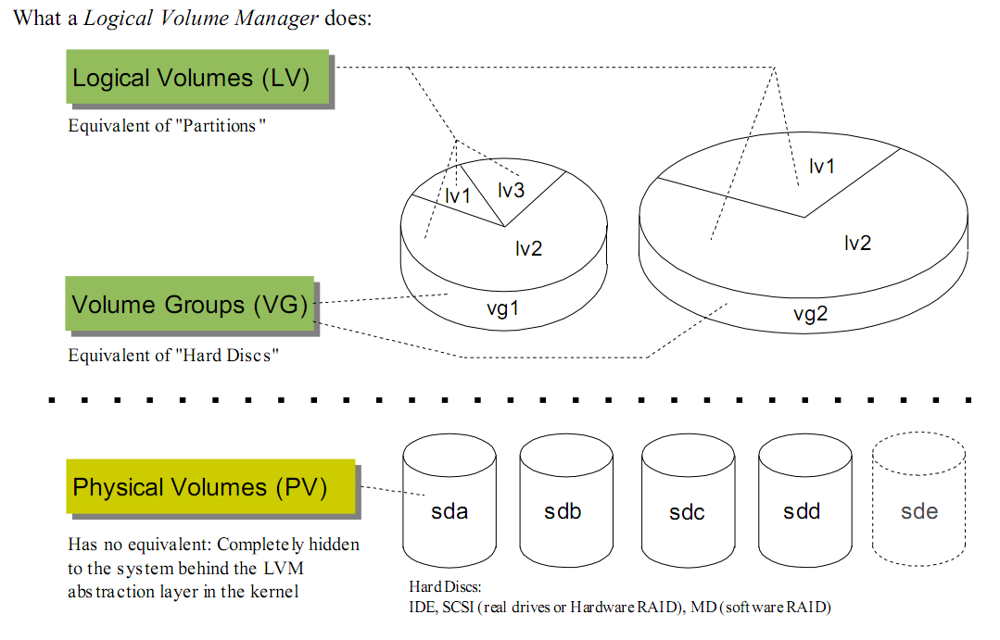
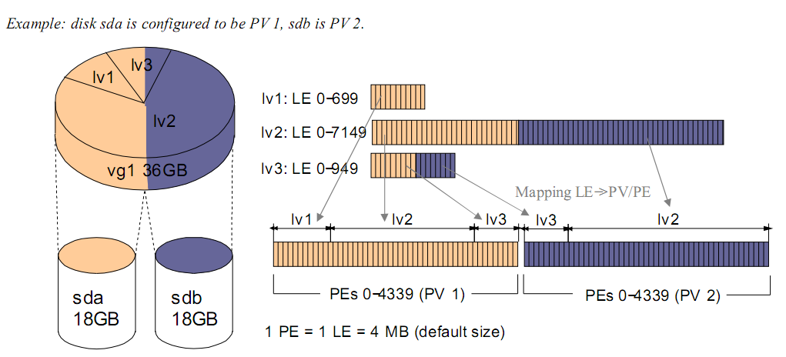
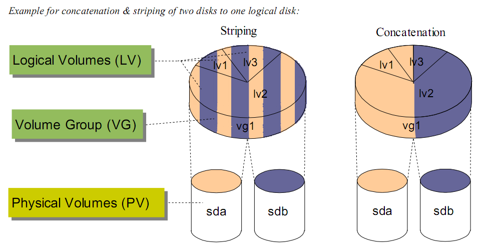
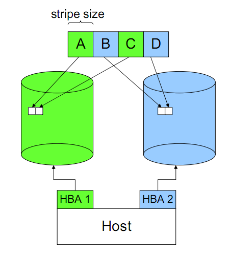
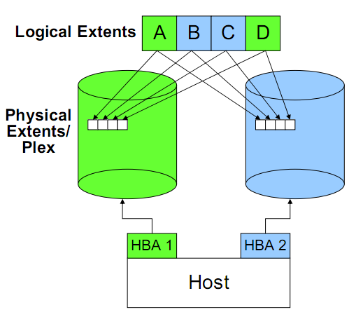
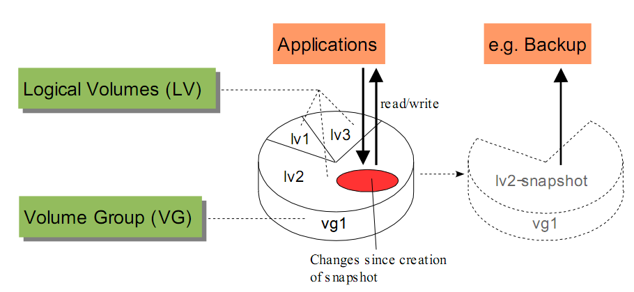

LVM(逻辑卷管理), 位于操作系统和硬盘之间, LVM 屏蔽了底层硬盘带来的复杂性.
最简单的, LVM 使得 N 块硬盘在 OS 看来成为一块硬盘, 大大提高了系统可用性.

LVM的引入, 使得文件系统和底层磁盘之间的关系变得更为灵活, 而且更方便关系.

LVM 有以下特点:

* 统一进行磁盘管理. 按需分配空间, 提供动态扩展.
* 条带化(Striped)
* 镜像(mirrored)
* 快照(snapshot)

LVM 可以做动态磁盘扩展, 想想看, 当系统管理员发现应用空间不足时, 敲两个命
令就完成空间扩展, 估计做梦都要笑醒:)

##LVM 的磁盘管理方式

LVM 中有几个很重要的概念:

###PV(physical volume)

物理卷. 在 LVM 中, 一个 PV 对应就是操作系统能看见的一块物理磁盘, 或者由存
储设备分配操作系统的 lun. 一块磁盘唯一对应一个PV, PV 创建以后, 说明这块空
间可以纳入到 LVM 的管理. 创建 PV 时, 可以指定 PV 大小, 即可以把整个磁盘的
部分纳入 PV, 而不是全部磁盘. 这点在表面上看没有什么意义, 但是如果主机后面
接的是存储设备的话就很有意义了, 因为存储设备分配的 lun 是可以动态扩展的,只
有当 PV 可以动态扩展, 这种扩展性才能向上延伸.

###VG(volume group)

卷组. 一个 VG 是多个 PV 的集合, 简单说就是一个 VG 就是一个磁盘资源池. VG
对上屏蔽了多个物理磁盘, 上层是使用时只需考虑空间大小的问题, 而 VG 解决的
空间的如何在多个 PV 上连续的问题.

###LV(logical volume)

逻辑卷. LV 是最终可供使用卷, LV 在 VG 中创建, 有了 VG, LV 创建是只需考虑
空间大小等问题, 对 LV 而言, 它看到的是一直连续的地址空间, 不用考虑多块硬
盘的问题。

有了上面三个, LVM 把单个的磁盘抽象成了一组连续的, 可随意分配的地址空间.
除上面三个概念外, 还有一些其他概念:

###PE(physical extend)

物理扩展块. LVM 在创建 PV, 不会按字节方式去进行空间管理. 而是按 PE 为单位.
PE 为空间管理的最小单位. 即: 如果一个 1024M 的物理盘, LVM 的 PE 为 4M, 那么
分配 LVM 管理空间时, 会按照 256 个 PE 去管理. 分配时, 也是按照分配了多少 PE.
剩余多少 PE 考虑.

###LE(logical extend)

逻辑扩展块. 类似 PV, LE 是创建 LV 考虑, 当 LV 需要动态扩展时, 每次最小的扩展单位。

如图, 为两块 18G 的磁盘组成了一个 36G 的 VG. 此 VG 上划分了 3 个 LV. 其 PE
和 LE 都为 4M. 其中 LV1 只用到了 sda 的空间, 而 LV2 和 LV3 使用到了两块磁盘.

##串联(Concatenation)

串联(Concatenation): 按顺序使用磁盘, 一个磁盘使用完以后使用后续的磁盘.

##条带化(Striping)

交替使用不同磁盘的空间. 条带化使得 IO 操作可以并行, 因此是提高 IO 性能的关键.
另外, Striping 也是 RAID 的基础. 如: VG 有 2 个 PV, LV 做了条带数量为 2 的条带化,
条带大小为 8K, 那么当 OS 发起一个 16K 的写操作时, 那么刚好这 2 个 PV 对应的磁盘
可以对整个写入操作进行并行写入。

优点: 并发进行数据处理。读写操作可以同时发送在多个磁盘上，大大提高了性能。

缺点: 数据完整性的风险. Striping 导致一份完整的数据被分布到多个磁盘上, 任何一个磁
盘上的数据都是不完整, 也无法进行还原. 一个条带的损坏会导致所有数据的失效. 因此这个
问题只能通过存储设备来弥补(这个应该不算缺点).

条带大小的设定很大程度决定了 Striping 带来的好处. 如果条带设置过大, 一个 IO 操作最终
还是发生在一个磁盘上, 无法带来并行的好处; 当条带设置过小, 本来一次并行 IO 可以完成的
事情会最终导致了多次并行 IO.

##镜像(mirror)

LVM 提供 LV 镜像的功能. 即当一个 LV 进行 IO 操作时, 相同的操作发生在另外一个 LV 上.
这样的功能为数据的安全性提供了支持. 如图, 一份数据被同时写入两个不同的 PV.

优点: 读取操作可以从两个磁盘上获取, 因此读效率会更好些. 数据完整复制了一份, 安全性更高.

缺点: 所有的写操作都会同时发送在两个磁盘上, 因此实际发送的 IO 是请求 IO 的 2 倍; 由于
写操作在两个磁盘上发生, 因此一些完整的写操作需要两边都完成了才算完成, 带来了额外负担
(这不能算缺点, 本身就是 trade-off); 在处理串行 IO 时, 有些 IO 走一个磁盘, 另外一些 IO
走另外的磁盘, 一个完整的 IO 请求会被打乱, LVM 需要进行 IO 数据的合并, 才能提供给上层.
像一些如预读的功能, 由于有了多个数据获取同道, 也会存在额外的负担(这本身是使用问题).

##快照(Snapshot)

快照如其名, 他保存了某一时间点磁盘的状态, 而后续数据的变化不会影响快照, 因此, 快照是
一种备份很好手段.

但是快照由于保存了某一时间点数据的状态, 因此在数据变化时, 这部分数据需要写到其他地方.
随着而来回带来一些问题. 关于这块, 后续存储也涉及到类似的问题, 后面再说.

##参考

http://pengjiaheng.iteye.com/blog/911361
