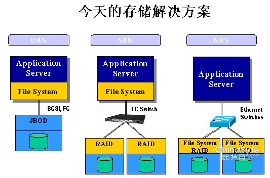
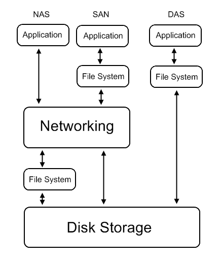
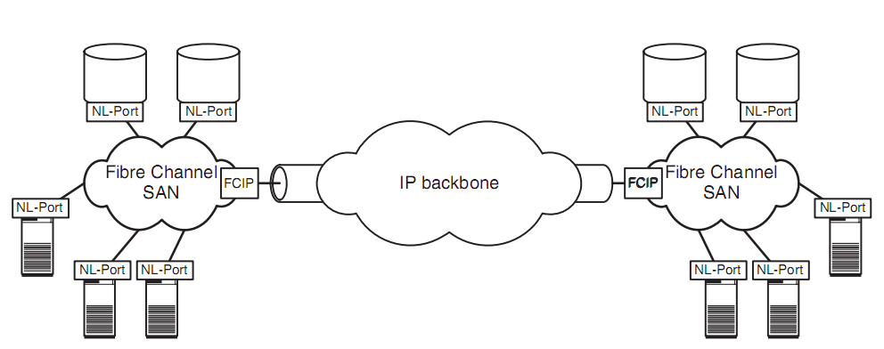
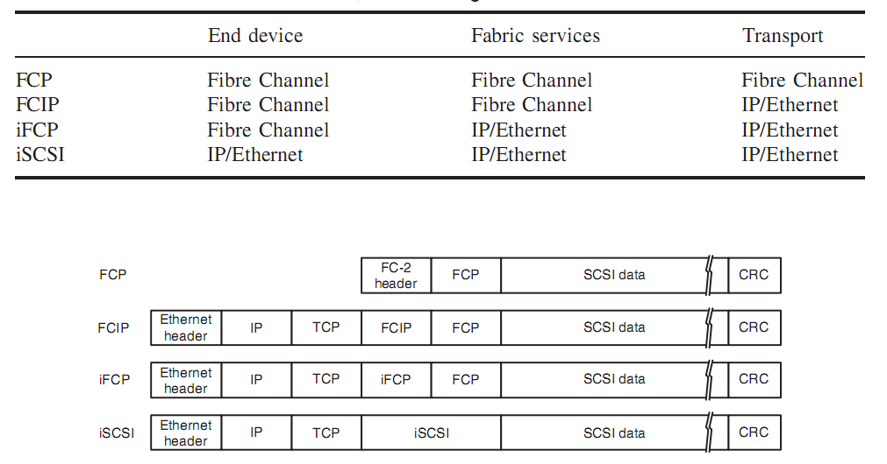
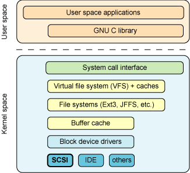
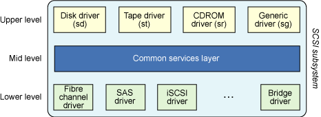
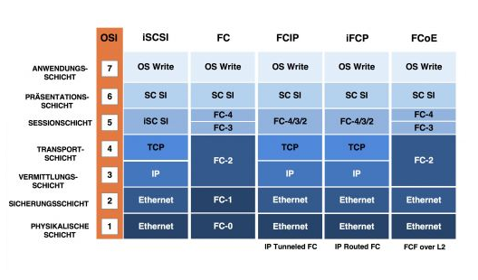
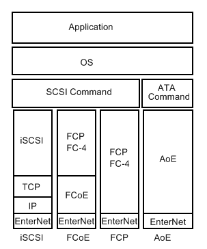

为了满足人们不断扩大的需求，存储方案也是在发展的。而 DAS, SAN, NAS 直接反映这种反映了这种趋势。

###单台主机

在这种情况下, 存储作为主机的一个或多个磁盘存在, 由于受限于主机空间, 一个主机只能装一块到几块硬盘,
而硬盘空间时受限的, 当磁盘满了以后, 你不得不为主机更换更大空间的硬盘.

###独立存储空间--DAS

为了解决空间的问题, 于是考虑把磁盘独立出来, 于是有了 DAS(Direct Attached Storage), 即: 直连存储.
DAS 就是一组磁盘的集合体, 数据读取和写入等也都是由主机来控制. 但是, 随之而来, DAS又面临了一个他
无法解决的问题--存储空间的共享. 接某个主机的 JBOD（Just a Bunch Of Disks，磁盘组）, 只能这个主机
使用, 其他主机无法用. 因此, 如果 DAS 解决空间了, 那么他无法解决的就是如果让空间能够在多个机器共享.
因为 DAS 可以理解为与磁盘交互, DAS 处理问题的层面相对更低. 使用协议都是跟磁盘交互的协议, 如
Hard Disk(IDE/SATA/SCSI/SAS/SSD), Tape, CD/DVD/Blue Ray Disk.

###独立的存储网络--SAN

为了解决共享的问题, 借鉴以太网的思想, 于是有了 SAN(Storage Area Network), 即: 存储网络. 对于 SAN
网络, 你能看到两个特点: 一个就是光纤网络, 另一个是光纤交换机.

SAN 网络由于不会之间跟磁盘交互, 他考虑的更多是数据存取的问题, 因此使用的协议相对 DAS 层面更高一些。

光纤网络: 对于存储来说, 与以太网很大的一个不同就是他对带宽的要求非常高, 因此 SAN 网络下, 光纤成为
了其连接的基础. 而其上的光纤协议相比以太网协议而言, 也被设计的更为简洁, 性能也更高.

光纤交换机: 这个类似以太网, 如果想要做到真正的"网络", 交换机是基础.

###网络文件系统--NAS

存储空间可以共享, 那文件也是可以共享的. NAS(Network attached storage) 相对上面两个, 看待问题的层面
更高, NAS是在文件系统级别看待问题. 因此他面的不再是存储空间, 而是单个的文件. 因此, 当 NAS,SAN 和
DAS 放在一起时, 很容易引起混淆. NAS 从文件的层面考虑共享, 因此 NAS
相关协议都是文件控制协议, 比如 我们常熟知的 NFS, SMB.

###DAS VS SAN VS NAS

NAS 解决的是文件共享的问题; SAN 和 DAS 解决的是存储空间的问题.

NAS要处理的对象是文件; SAN(DAS)要处理的是磁盘.

为 NAS 服务的主机必须是一个完整的主机(有 OS, 有文件系统, 而存储则不一定有, 因为可以他后面又接了一
个 SAN 网络), 他考虑的是如何在各个主机直接高效的共享文件; 为SAN提供服务的是存储设备(可以是个完整的
主机,也可以是部分), 它考虑的是数据怎么分布到不同磁盘.

NAS 使用的协议是控制文件的(即:对文件的读写等); SAN 使用的协议是控制存储空间的(即:把多长的一串二进
制写到某个地址)

##SAN

从最初的全部通过光纤到全部通过网卡,  SAN 的发展伴随着网卡带宽不断地增长而增长的.

广义可以分为 Fiber SAN 和 IP-SAN, 其中 IP-SAN, 可以分为 iSCSI, FCoE, FCP, AoE

###FCIP

如图两个 FC 的 SAN 网络, 通过 FCIP 实现了两个 SAN 网络数据在 IP 网络上的传输. 这个时候 SAN 网络还是
以 FC 协议为基础, 还是使用光纤.

###iFCP

通过 iFCP 方式, SAN 网络由 FC 的 SAN 网络演变为 IP SAN 网络, 整个 SAN 网络都基于了 IP 方式. 但是主机
和存储直接使用的还是 FC 协议. 只是在接入 SAN 网络的时候通过 iFCP 进行了转换.

###iSCSI

iSCSI 是比较主流的IP SAN 的提供方式, 而且其效率也得到了认可.

对于 iSCSI, 最重要的一点就是 SCSI 协议. SCSI(Small Computer Systems Interface)协议是计算机内部的一个
通用协议. 是一组标准集, 它定义了与大量设备(主要是与存储相关的设备)通信所需的接口和协议. 如图, SCSI 为
block device drivers 之下.

从 SCIS 的分层来看, 共分三层:

* 高层: 提供了与 OS 各种设备之间的接口, 实现把 OS 如: Linux 的 VFS 请求转换为 SCSI 请求
* 中间层: 实现高层和底层之间的转换, 类似一个协议网关。
* 底层: 完成于具体物理设备之间的交互，实现真正的数据处理。

